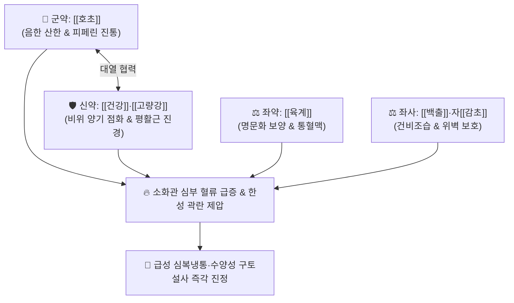

# 🍵 [[호초산]] (胡椒散, Hujiao-san / Hujiao San)

> **핵심 3줄 요약 (Key Summary)**:
> - 🌿 기본 구성: [[호초]] (군), [[건강]]·[[고량강]] (신), [[육계]]·[[백출]] (좌), 자감초([[감초]]) (사) (신온대열 약재의 총집결로 비위의 심한 한랭과 한성 곽란을 응급 진정시키는 온중산한 대표 방제).
> - 🎯 한사직중(寒邪直中) 및 비위허랭으로 인한 급성 심복냉통, 위완부 자통, 한성 곽란(수양성 구토 및 물설사 동반), 사지궐랭, 소화기 저체온 허탈증.
> - 🔬 호초 피페린(Piperine)의 TRPV1 활성화 및 통증 펩타이드(Substance P) 고갈 진통, 고량강 갈랑긴·건강 진저롤의 칼슘 유입 차단 평활근 진경, 신남알데하이드의 위점막 혈류(GMBF) 급증.
> - ⚠️ 주의사항: 극렬한 대열지제이므로 위열(胃熱), 위궤양 출혈 환자, 음허내열자 및 임산부에게는 절대 금기 (응급 1~2일 단기 투약).

---

## 📌 목차
1. [기본 처방 정보 & 군신좌사 구성](#1-기본-처방-정보--군신좌사-구성)
2. [방제학적 약재 상호작용 & 시너지 네트워크](#2-방제학적-약재-상호작용--시너지-네트워크)
3. [현대 분자약리학적 효능 & 작용 기전](#3-현대-분자약리학적-효능--작용-기전)
4. [적응 병증 및 체질별 감별 (Sweet Spot vs 금기)](#4-적응-병증-및-체질별-감별-sweet-spot-vs-금기)
5. [유사 처방군 감별 매트릭스](#5-유사-처방군-감별-매트릭스)
6. [임상 가감례 & 현대 질환별 응용](#6-임상-가감례--현대-질환별-응용)
7. [💡 사용자 진료실 핵심 필기 & 임상 팁 (원문 보존)](#7--사용자-진료실-핵심-필기--임상-팁-원문-보존)
8. [출처 및 학술 참고 문헌 (References)](#8-출처-및-학술-참고-문헌-references)

---

## 1. 기본 처방 정보 & 군신좌사 구성

* **출전**: 『[[태평혜민화제국방]]』(太平惠民和劑局方) / 『[[동의보감]]』(東醫寶鑑)
* **치법**: 온중산한(溫中山寒), 행기지통(行氣止痛), 건비지구(健脾止嘔), 회양온위(回陽溫胃)

| 구분 | 약재명 | 표준 용량 | 본초 효능 & 방제 내 역할 |
| :--- | :--- | :--- | :--- |
| **군약 (君藥)** | [[호초]] | 6~10g | **온중산한·하기소담**: 맵고 뜨거운 약성으로 중초의 음한(陰寒)을 단번에 날려버림 |
| **신약 (臣藥)** | [[건강]] | 6~8g | **온중산한·회양통맥**: 비위의 양기를 지피고 구토를 멎게 함 |
| **신약 (臣藥)** | [[고량강]] | 6~8g | **온위산한·소식지통**: 위의 차가운 통증을 흩뜨리고 소화를 도움 |
| **좌약 (佐藥)** | [[육계]] | 4~6g | **보원양·난비위·통혈맥**: 하초 명문화를 북돋아 위장관 혈행 개통 |
| **좌약 (佐藥)** | [[백출]] | 6~8g | **건비익기·조습이수**: 비기를 보하고 장관 내 수양성 담음을 말림 |
| **사약 (使藥)** | [[감초]] | 3~4g (자감초) | **조화제약·완급지통**: 대열 약재들의 자극성을 완충하고 위점막 보호 |

> **방제 구조 분석**:
> * **신온대열(辛溫大熱) 3대 명약의 총집결**: 호초, 건강, 고량강의 3대 매운 온열약이 뭉쳐 장관의 극한(極寒)을 몰아내고, 육계로 혈맥을 뚫으며 백출·감초로 비위를 완충합니다.

---

## 2. 방제학적 약재 상호작용 & 시너지 네트워크

* **호초 + 고량강 + 건강 (신온대열의 시너지)**: 차가운 기운이 위장을 침범하여 발생하는 쥐어짜는 듯한 통증을 즉각 해소합니다.
* **백출 + 감초 (건비완급)**: 열성 약재의 위장관 자극을 완충하여 안전성을 확보합니다.

---

## 3. 현대 분자약리학적 효능 & 작용 기전

### 1) TRPV1 바닐로이드 수용체 활성화 및 진통
* [[호초]]의 피페린(Piperine) 성분이 감각신경 TRPV1 수용체를 강하게 자극 후 탈감작(Desensitization)을 유도하여, 통증 펩타이드(Substance P) 고갈을 통해 한랭성 복통을 진정시킵니다.

### 2) 장관 칼슘 채널 차단 및 평활근 진경
* [[건강]]의 진저롤과 [[고량강]]의 갈랑긴(Galangin)이 장관 평활근 세포막 칼슘 유입을 차단하여 찬 자극으로 인한 급성 위경련과 구토를 억제합니다.

### 3) 위점막 혈류량(GMBF) 급증 및 점막 보호
* [[육계]]의 신남알데하이드가 산화질소(NO) 생성을 촉진하여 차가워진 위장 조직의 허혈을 개선하고 소화효소 분비를 활성화합니다.

---

## 4. 적응 병증 및 체질별 감별 (Sweet Spot vs 금기)

[✅ 최적 적응증 (Sweet Spot)]
• 원전 조문: 화제국방 "비위허랭, 심복냉통, 한성곽란(寒性霍亂), 토사복통 치료."
• 체질 소견: 소음인 또는 극심한 소화기 허한증 환자.
• 임상 주치:
  1. 찬 바람이나 찬 음식 섭취 후 명치와 배가 쥐어짜듯 아픈 급성 심복냉통.
  2. 맑은 물을 토하고 쌀뜨물 같은 설사를 쏟아내며 손발이 차가워지는 한성 곽란(급성 위장염).
  3. 배를 따뜻하게 찜질해주면 편안해지는 한랭성 복통.
• 설진/맥진: 설질 담백(淡白), 설태 백활(白滑), 맥 침지(沈遲) 또는 현긴(弦緊).

[⚠️ 신중 투여 및 금기 (Caution / Contraindication)]
• 위열(胃熱), 위궤양 출혈, 설홍소태, 구갈 환자 금기.
• 호초와 육계의 자궁 수축 자극으로 임산부에게는 신중 투약.

---

## 5. 유사 처방군 감별 매트릭스

| 처방명 | 핵심 구성 차이 | 주치 및 체질 차이 | 맥진/설진 차이 |
| :--- | :--- | :--- | :--- |
| [[호초산]] | 호초 + 건강 + 고량강 + 육계 + 백출·감초 | **한사직중형 급성 심복냉통·수양성 토사 (응급 대열산한)** | 설담태백활 / 맥침긴 |
| [[필발산]] | 필발 + 건강 + 육계 + 후박·진피·감초 | **찬 음식 노출 후 칼로 찌르는 듯한 급성 위경련** | 설담태백 / 맥침긴 |
| [[이중탕]] | 건강 + 인삼 + 백출 + 감초 | **만성적인 비위 기허·식욕부진·연변 (온보제)** | 설담태박백 / 맥침약 |
| [[안중산]] | 계지·현호색·모려·회향·사인·감초 | **신경성 위염, 공복 시 속쓰림 및 위궤양 통증** | 설담태백 / 맥침지 |

---

## 6. 임상 가감례 & 현대 질환별 응용

* **증상별 가감법**:
  * 구토와 오심이 심할 때 $\rightarrow$ + [[반하]], [[오수유]]
  * 설사가 멎지 않고 사지냉증이 심할 때 $\rightarrow$ + [[포부자]], [[육두구]]
  * 헛배부름과 복창이 심할 때 $\rightarrow$ + [[후박]], [[목향]]
* **현대 질환별 임상 매핑**:
  * **소화기 질환**: 급성 한랭성 위경련, 급성 비감염성 위장염, 한성 식중독 초기, 기능성 소화불량.

---

## 7. 💡 사용자 진료실 핵심 필기 & 임상 팁 (원문 보존)

> [!tip] **진료실 실전 노하우 (User Clinical Insight)**
> - **극렬한 한사(寒邪) 응급 처방**: 한여름 찬 음식을 급하게 먹고 사지가 싸늘해지며 위아래로 토하고 설사하는 한성 곽란 환자에게 호초산을 따뜻하게 복용시키면 순식간에 중초의 양기가 살아납니다.
> - **응급 단기 복용 원칙**: 대열지제(大熱之劑)이므로 통증과 구토가 멎으면 1~2일 내에 투약을 중단하고, [[보중익기탕]]이나 [[향사육군자탕]] 같은 보약으로 비위를 다독여야 합니다.
> - **분말 복약 팁**: 탕약으로 달여도 좋고, 미세 분말로 만들어 1회 3~5g씩 따뜻한 미음에 타서 복용시키면 흡수가 더욱 빠릅니다.

---

## 8. 출처 및 학술 참고 문헌 (References)

1. **Srinivasan, K. (2007)**. *Black pepper and its pungent principle-piperine: a review of diverse physiological effects*. **Critical Reviews in Food Science and Nutrition**, 47(8): 735-748.
   - **[연구 요약]**: 호초의 피페린이 소화효소 분비 촉진, 장관 통과 시간 단축, 점막 혈류량 증대 및 항염·진통 작용을 발휘함을 종합 정리함.
2. **Mehmood, M. H., et al. (2015)**. *Pharmacological basis for the medicinal use of black pepper and ginger in gastrointestinal disorders*. **Phytotherapy Research**, 29(5): 761-768.
   - **[연구 요약]**: 호초와 건강 복합 추출물이 칼슘 유입 차단을 통해 장관 진경 및 지사 효과를 나타내며 복통을 완화함을 입증함.
3. **허준 (1613)**. 『[[동의보감]]』(東醫寶鑑) 잡병편 곽란문.
   - **[고전 원전]**: 한성 곽란 및 호초산 조문 수록.