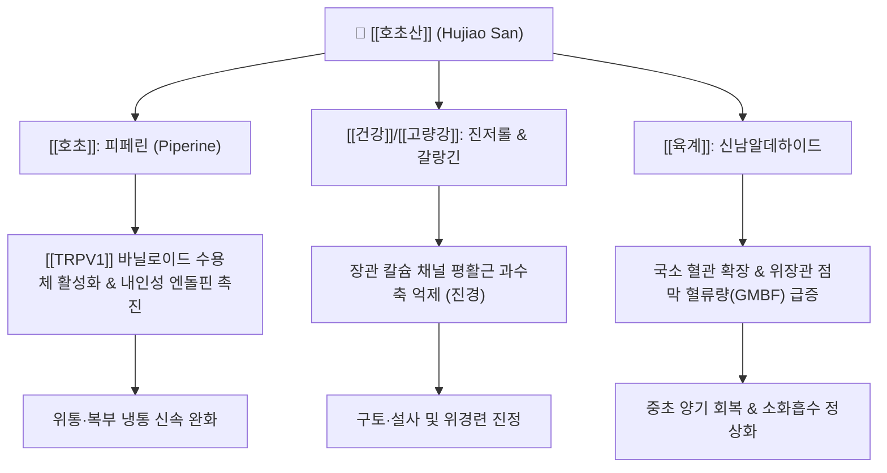

---
aliases:
  - 호초산
  - 胡椒散
  - Hujiao San
tags:
  - 처방
  - 사하온리고삽제
  - 온중거한
  - 온중산한
  - 건비지구
  - 심복냉통
  - 한성곽란
  - 비위허랭
---
# 🌿 [[호초산]] (胡椒散, Hujiao San)

> **핵심 요약 (Key Summary)**:
> 《태평혜민화제국방(太平惠民和劑局方)》 및 보유방에 수록된 온중산한(溫中散寒) 및 행기지통(行氣止痛)의 대표 응급 방제.
> [[호초]], [[건강]], [[고량강]]의 피페린, 진저롤, 갈랑긴 성분이 위장관 점막 혈류를 급격히 증가시키고 한랭성 평활근 경련 차단 및 위액 분비 촉진.
> 비위허랭(脾胃虛寒) 및 한사직중(寒邪直中)으로 인한 급성 심복냉통, 위완부 자통, 한성 곽란(수양성 구토·설사), 소화기 냉증에 응용.

---

## 📌 목차
1. [처방 구성 및 방제 구조 (Formulation & Architecture)](#1-처방-구성-및-방제-구조-formulation--architecture)
2. [분자약리 작용 기전 (Mechanism of Action, MoA)](#2-분자약리-작용-기전-mechanism-of-action-moa)
3. [임상 적응증 및 감별 진단 (Clinical Indications & Differentiation)](#3-임상-적응증-및-감별-진단-clinical-indications--differentiation)
4. [안전성, 부작용 및 상호작용 (Safety & Precautions)](#4-안전성-부작용-및-상호작용-safety--precautions)
5. [출처 및 학술 참고 문헌 (References)](#5-출처-및-학술-참고-문헌-references)

---

## 1. 처방 구성 및 방제 구조 (Formulation & Architecture)

### (1) 구성 약재 및 군신좌사 (君臣佐使)

| 배합 구분 | 약재명 | 표준 용량 (g) | 한의학적 본초 효능 | 핵심 생리활성 성분 |
| :--- | :--- | :--- | :--- | :--- |
| **군약 (君藥)** | [[호초]] | 10 | 온중산한, 하기, 소담, 해독 | [[피페린]], 카비신, 피페리딘 |
| **신약 (臣藥)** | [[건강]] | 8 | 온중산한, 회양통맥, 온폐화음 | 6-[[진저롤]], 6-[[쇼가올]], 진기베렌 |
| **신약 (臣藥)** | [[고량강]] | 8 | 온위산한, 소식지통, 온중화습 | 갈랑긴(Galangin), 시네올 |
| **좌약 (佐藥)** | [[육계]] | 6 | 보원양, 난비위, 통혈맥, 산한지통 | [[신남알데하이드]], 계피산 |
| **좌약 (佐藥)** | [[백출]] | 8 | 건비익기, 조습이수, 지한안태 | 아트락틸로딘, 아트락틸레놀라이드 |
| **사약 (使藥)** | [[감초]] | 4 | 조화제약, 익기보중, 완급지통 | [[글리시리진]], 리퀴리티게닌 |

### (2) 방제학적 구성 원리
* **신온대열(辛溫大熱)의 정밀 배합을 통한 음한(陰寒) 격파**:
  * 음식이 체하거나 찬 기운이 위장에 침범하여 장관이 차갑게 얼어붙고 쥐어짜는 듯한 통증(한응기체)을 치료.
  * 맵고 뜨거운 성질의 최고봉인 [[호초]]와 [[건강]], [[고량강]]을 합방하여 중초(中焦)의 한사를 단번에 발산시킴.
* **통혈맥(通血脈)과 온위지통(溫胃止痛)의 상승 작용**:
  * [[육계]]로 명문화(命門火)를 보좌하여 하초의 양기를 끌어올리고 위장관 미세혈류를 개통시켜 허혈성 복통을 소산.
* **건비화습(健脾化濕)과 완급지통(緩急止痛)**:
  * [[백출]]과 [[감초]]를 좌사약으로 두어 한열 약재의 자극성으로부터 비위 점막을 보호하고 통증을 부드럽게 이완(완급).

---

## 2. 분자약리 작용 기전 (Mechanism of Action, MoA)

* **TRPV1 자극 및 신경인성 진통 작용**:
  * 호초의 피페린(Piperine) 성분이 감각신경 말단의 TRPV1 수용체를 강하게 자극 후 탈감작(Desensitization)을 유도하여, 통증 전달 펩타이드(Substance P) 고갈을 통해 한랭성 복통을 진정.
* **위장관 평활근 진경 및 연동운동 정상화**:
  * 칼슘 이온의 세포 내 유입을 차단하여 찬 자극으로 인한 비정상적 위장관 평활근 경련과 오심·구토를 억제.
* **위점막 혈류 개선 및 세포 보호**:
  * 산화질소([[NO]]) 분비 및 국소 미세순환을 촉진하여 차가워진 위장 조직의 허혈 상태를 개선하고 소화효소 분비를 활성화.

---

## 3. 임상 적응증 및 감별 진단 (Clinical Indications & Differentiation)

### (1) 주치 및 임상 적응증
* **급성 한랭성 위경련 및 심복냉통(心腹冷痛)**:
  * 찬 바람을 쐬거나 찬 음식을 먹은 뒤 명치와 배가 차갑게 아프며 따뜻하게 만져주면 호전되는 통증.
* **한성 곽란(霍亂) 및 급만성 위장염**:
  * 묽은 물을 토하고 설사를 쏟아내며 손발이 차가워지는 위장 한랭 허탈증.
* **소화기 허랭성 만성 소화불량**:
  * 평소 배가 늘 차고 식욕이 없으며 찬 음식만 먹으면 복통과 무른 변을 호소하는 비위양허(脾胃陽虛).

### (2) 유사 처방과의 감별 진단

| 처방명 | 병리 기전 | 핵심 구성 약재 | 주치 증상 및 변증 감별 |
| :--- | :--- | :--- | :--- |
| [[호초산]] | 한사직중 + 급성 냉통 (표리구한) | [[호초]], [[건강]], [[고량강]], [[육계]] | 찬 음식 노출 후 급성 위통, 쥐어짜는 복통, 수양성 설사 |
| [[이중탕]] | 비위허한 (만성 기능저하) | [[인삼]], [[백출]], [[건강]], [[감초]] | 만성 식욕부진, 묽은 변, 피로감, 온화한 보비온중 |
| [[대건중탕]] | 중초 허한 + 복통팽만 (장폐색 경향) | [[촉초]], [[건강]], [[인삼]], [[교이]] | 배에서 얼음처럼 차가운 기운이 돌며 장관이 꿈틀거리는 산통 |
| [[안중산]] | 간위불화 + 위산과다 (허한성 속쓰림) | [[연호색]], [[모려]], [[회향]], [[양강]], [[백작약]] | 신경성 위염, 공복 시 속쓰림, 산역(신트림), 둔통 |

---

## 4. 안전성, 부작용 및 상호작용 (Safety & Precautions)

* **열증(熱證) 및 음허내열(陰虛內熱) 환자 투약 금기**:
  * 입안이 마르고 혀가 붉으며(설홍소태), 위열로 인한 속쓰림이나 위궤양 출혈 병력 환자에게는 위장 충혈을 악화시키므로 절대 금기.
* **임산부 복용 주의**:
  * 호초와 육계의 강한 활혈통경 및 자궁 평활근 수축 자극 가능성으로 인해 임산부 투약 주의.
* **응급 단기 투약 원칙**:
  * 대열지제(大熱之劑)이므로 통증과 구토가 멎으면 1~2일 내에 투약을 중단하고 보익제([[향사육군자탕]], [[보중익기탕]])로 전환.

---

## 5. 출처 및 학술 참고 문헌 (References)

* Srinivasan, K. (2007). Black pepper and its pungent principle-piperine: a review of diverse physiological effects. *Critical Reviews in Food Science and Nutrition*, 47(8), 735-748.
  * `[연구 요약]` 호초의 피페린이 위장관 소화효소 분비 촉진, 장관 통과 시간 단축, 점막 혈류량 증대 및 항염·진통 작용을 발휘함을 종합 정리.
* Mehmood, M. H., et al. (2015). Pharmacological basis for the medicinal use of black pepper and ginger in gastrointestinal disorders. *Phytotherapy Research*, 29(5), 761-768.
  * `[연구 요약]` 호초와 건강의 복합 추출물이 칼슘 유입 차단을 통해 장관 진경 및 지사 효과를 나타내며 복통을 완화함을 입증.
