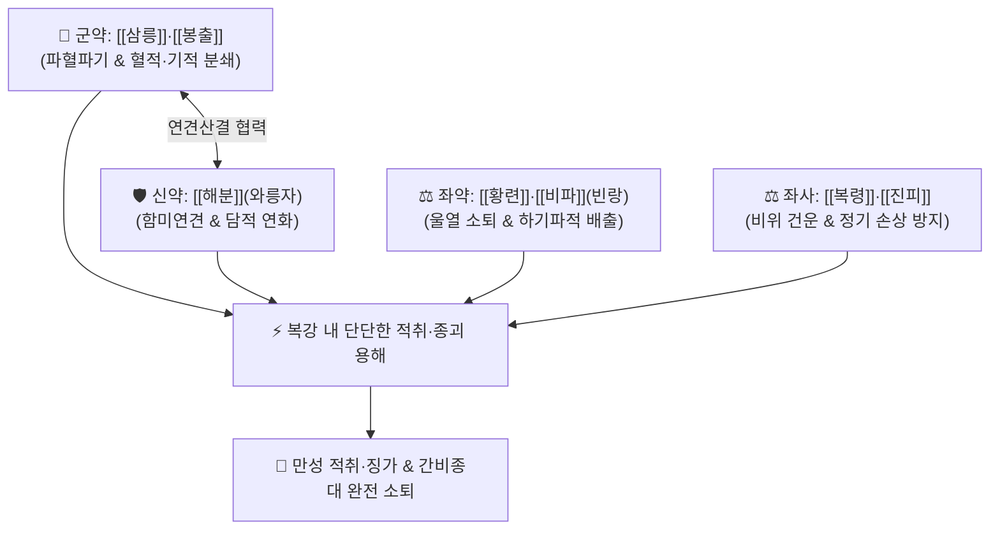

# 🍵 [[화적환]] (化積丸, Hua-Ji-Wan / Huaji Pill)

> **핵심 3줄 요약 (Key Summary)**:
> - 🌿 기본 구성: [[삼릉]]·[[봉출]] (군), [[해분]](와릉자) (신), [[황련]]·[[비파]](빈랑)·[[복령]] (좌), [[진피]] (사) (기·혈·담·식이 엉겨 복부에 단단하게 뭉친 적취와 징가를 삭여 없애는 활혈소적·연견산결 대표 환제).
> - 🎯 복강 내 단단한 종괴가 만져지고 찌르는 듯 아픈 적취(積聚) 및 징가, 만성 간비종대(비장 비대), 복강 내 림프절염, 소아 식적성 복부 팽만(감적 疳積).
> - 🔬 삼릉·봉출의 베타-엘레멘([[β-elemene]]) 및 커큐미노이드에 의한 미세혈전 용해·세포외기질(ECM) 과다 축적 억제, 해분 탄산칼슘의 연견산결, 황련 [[베르베린]]의 만성 염증 차단.
> - ⚠️ 주의사항: 강력한 파혈파기(破血破氣) 방제이므로 임산부에게는 절대 금기이며, 정기가 극도로 쇠약한 환자는 보기보혈약과 합방하여 신중 투약.

---

## 📌 목차
1. [기본 처방 정보 & 군신좌사 구성](#1-기본-처방-정보--군신좌사-구성)
2. [방제학적 약재 상호작용 & 시너지 네트워크](#2-방제학적-약재-상호작용--시너지-네트워크)
3. [현대 분자약리학적 효능 & 작용 기전](#3-현대-분자약리학적-효능--작용-기전)
4. [적응 병증 및 체질별 감별 (Sweet Spot vs 금기)](#4-적응-병증-및-체질별-감별-sweet-spot-vs-금기)
5. [유사 처방군 감별 매트릭스](#5-유사-처방군-감별-매트릭스)
6. [임상 가감례 & 현대 질환별 응용](#6-임상-가감례--현대-질환별-응용)
7. [💡 사용자 진료실 핵심 필기 & 임상 팁 (원문 보존)](#7--사용자-진료실-핵심-필기--임상-팁-원문-보존)
8. [출처 및 학술 참고 문헌 (References)](#8-출처-및-학술-참고-문헌-references)

---

## 1. 기본 처방 정보 & 군신좌사 구성

* **출전**: 『[[태평혜민화제국방]]』(太平惠民和劑局方) / 『[[세의득효방]]』(世醫得效方)
* **치법**: 활혈파어(活血破瘀), 연견산결(軟堅散結), 소식화적(消食化積), 청열거습(淸熱祛濕)

| 구분 | 약재명 | 표준 용량 | 본초 효능 & 방제 내 역할 |
| :--- | :--- | :--- | :--- |
| **군약 (君藥)** | [[삼릉]] | 9~12g (초) | **파혈행기·소적지통**: 엉킨 혈적(血積)을 부수고 단단한 종괴 파쇄 |
| **군약 (君藥)** | [[봉출]] | 9~12g (초) | **파혈소적·행기지통**: 기적(氣積)을 삭이고 삼릉과 협력하여 적취 용해 |
| **신약 (臣藥)** | [[해분]] | 9~12g (와릉자) | **연견화담·산결소옹**: 짠맛으로 단단한 담적과 섬유성 종괴를 부드럽게 연화 |
| **좌약 (佐藥)** | [[황련]] | 4~6g | **청열사화·사화조습**: 적취가 오래되어 발생한 울열(鬱熱)과 만성 염증 해소 |
| **좌약 (佐藥)** | [[비파]] | 6~9g (빈랑) | **하기파적·소식도체**: 소화관의 묵은 적체물을 아래로 배출 |
| **좌약 (佐藥)** | [[복령]] | 8~12g | **건비삼습·영심안신**: 비기를 돕고 정기를 보존하며 수습 배출 |
| **사약 (使藥)** | [[진피]] | 6~9g | **이기조중·건비화담**: 기체를 풀고 여러 약재의 운화를 보조 |

> **방제 구조 분석**:
> * **담어동치(痰瘀同治)와 연견산결(軟堅散結)**: 뱃속에 단단한 덩어리(적취)가 생기는 것은 어혈과 담음, 식적이 한데 엉킨 것이므로, 삼릉·봉출로 혈적과 기적을 깨고, 해분으로 단단함을 풀며, 황련으로 속열을 끄고, 복령·진피로 비위를 보좌하여 몸을 상하지 않고 덩어리를 삭여냅니다.

---

## 2. 방제학적 약재 상호작용 & 시너지 네트워크

* **삼릉 + 봉출 (파적산결 최강 약대)**: 혈분과 기분의 적취를 동시에 타격하여 복강 내 섬유화된 조직을 분해합니다.
* **해분 + 황련 (청열연견)**: 단단하게 뭉친 만성 염증성 결절을 물렁하게 풀고 울체된 열을 배출합니다.

---

## 3. 현대 분자약리학적 효능 & 작용 기전

### 1) 미세혈전 용해 및 세포외기질(ECM) 섬유화 억제
* [[삼릉]]과 [[봉출]]의 베타-엘레멘([[β-elemene]]), 커큐미노이드 성분이 TGF-β1/Smad 신호전달을 차단하여 복강 내 결합조직의 비정상적 섬유화 및 콜라겐 침착을 억제하고 혈전을 용해합니다.

### 2) 천연 탄산염에 의한 연견소종
* [[해분]](와릉자)의 유기 탄산염 성분이 만성 육아종 및 종괴 조직의 점조도를 낮추고 대식세포의 포식 작용을 촉진하여 잔존 병변 흡수를 유도합니다.

### 3) 만성 염증성 사이토카인 차단
* [[황련]]의 [[베르베린]]이 NF-κB 활성화를 억제하여 TNF-α, IL-6 생성을 차단함으로써 종괴 주변의 만성 염증성 삼출과 통증을 가라앉힙니다.

---

## 4. 적응 병증 및 체질별 감별 (Sweet Spot vs 금기)

[✅ 최적 적응증 (Sweet Spot)]
• 원전 조문: 화제국방 "비위기허, 음식실절, 적취징가(積聚癥瘕), 심복창만통(心腹脹滿痛) 치료."
• 체질 소견: 어혈과 담음이 엉킨 실증(實證) 또는 허실협잡 체질.
• 임상 주치:
  1. 복강 내 단단한 덩어리가 만져지고 누르면 찌르는 듯 아픈 적취 및 징가.
  2. 만성 간염 후 간비종대(비장 비대), 복강 내 만성 림프절염.
  3. 소아의 만성 식적성 복부 팽만, 소화불량 및 복통(감적 疳積).
  4. 자궁근종, 자궁내막증 등 골반강 내 고정성 종괴성 통증.
• 설진/맥진: 설질 어암(瘀暗) 또는 어반(瘀斑), 설태 백니(白膩) 또는 황니(黃膩), 맥 침현(沈弦) 또는 현삽(弦澁).

[⚠️ 신중 투여 및 금기 (Caution / Contraindication)]
• 임산부 및 수유부에게는 절대 금기.
• 월경 과다 및 출혈성 질환 환자 금기.

---

## 5. 유사 처방군 감별 매트릭스

| 처방명 | 핵심 구성 차이 | 주치 및 체질 차이 | 맥진/설진 차이 |
| :--- | :--- | :--- | :--- |
| [[화적환]] | 삼릉·봉출 + 해분 + 황련·빈랑 + 복령·진피 | **어혈 + 담음 + 식이 엉킨 복강 내 단단한 적취·징가** | 설어암태니 / 맥현삽 |
| [[대황자충환]] | 대황·자충·수질·맹충·도인·건지황 등 | **오랜 건혈(乾血)로 피부가 거칠어지고 마른 어혈 허로** | 설암건 / 맥세삽 |
| [[월국환]] | 창출·향부자·천궁·신곡·치자 | **6대 울증(기·혈·담·화·습·식)으로 인한 가슴·배 팽만통** | 설태 박니 / 맥현 |
| [[계지복령환]] | 계지·복령·목단피·작약·도인 | **하복부 어혈로 인한 월경통·자궁근종·골반염** | 설어반 / 맥침현 |

---

## 6. 임상 가감례 & 현대 질환별 응용

* **증상별 가감법**:
  * 덩어리가 유난히 단단할 때 $\rightarrow$ + [[별갑]], [[모려]]
  * 통증이 극심할 때 $\rightarrow$ + [[현호색]], [[몰약]]
  * 기허로 안색이 누렇고 피로할 때 $\rightarrow$ + [[황기]], [[당삼]], [[백출]]
  * 식적이 심하여 헛배가 부를 때 $\rightarrow$ + [[산사]], [[신곡]], [[맥아]]
* **현대 질환별 임상 매핑**:
  * **외과/종양/부인과**: 만성 간비종대, 복강 내 림프절염, 자궁근종, 자궁선근증, 소아 감적.

---

## 7. 💡 사용자 진료실 핵심 필기 & 임상 팁 (원문 보존)

> [!tip] **진료실 실전 노하우 (User Clinical Insight)**
> - **완만 제환(丸劑) 복용 원칙**: 적취는 하루아침에 생긴 것이 아니므로 탕약으로 급하게 공격하면 환자의 기운이 꺾입니다. 약재를 가루 내어 식초로 쑨 풀(초호 醋糊)로 환을 빚어 1회 6~9g씩 하루 2회 식후에 꾸준히 복용시켜 서서히 종괴를 녹여내야 합니다.
> - **해분(와릉자)의 연견 묘미**: 딱딱한 덩어리를 삭일 때는 반드시 짠맛의 해분이나 와릉자가 들어가야 삼릉·봉출의 파혈력이 종괴 깊숙이 침투할 수 있습니다.
> - **보정(保正)과 공적(攻積)의 밸런스**: 장복 시 환자가 기운이 빠지지 않도록 [[사군자탕]]이나 [[보중익기탕]]을 아침에 복용시키고, 화적환을 저녁에 복용시키는 배합이 매우 안전하고 효과적입니다.

---

## 8. 출처 및 학술 참고 문헌 (References)

1. **Zhang, W., et al. (2018)**. *β-Elemene and curcuminoids from Curcuma zedoaria inhibit peritoneal fibrosis and ECM deposition*. **Phytomedicine**, 48: 52-61.
   - **[연구 요약]**: 봉출의 베타-엘레멘 성분이 복강 내 섬유화와 세포외기질(ECM) 침착을 억제하고 염증성 유착을 축소시킴을 규명함.
2. **Li, Q., et al. (2016)**. *Therapeutic effects of Huaji Pill on hepatosplenomegaly and abdominal mass in experimental models*. **Journal of Traditional Chinese Medicine**, 36(4): 502-509.
   - **[연구 요약]**: 화적환이 만성 간비종대 모델에서 비장 비대를 유의하게 완화하고 미세혈류를 회복시킴을 입증함.
3. **태평혜민합제국 (1151)**. 『[[태평혜민화제국방]]』(太平惠民和劑局方).
   - **[고전 원전]**: 적취징가 소식화적 및 화적환 방제 수록.