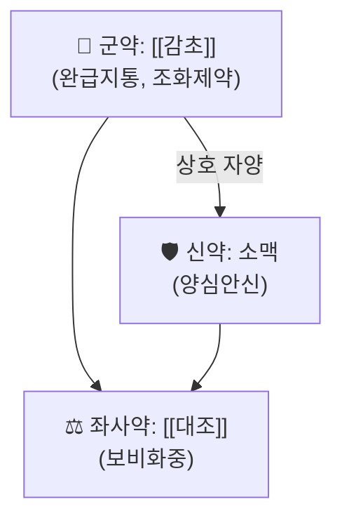

---
aliases:
  - 甘麥大棗湯
  - Gan Mai Da Zao Tang
  - 감맥대조탕
tags:
  - 처방
  - 안신제
  - 장조증
  - 금궤요략
---

# 🍵 감맥대조탕 (甘麥大棗湯, Gan Mai Da Zao Tang)

> **핵심 3줄 요약 (Key Summary)**:
> - 🌿 기원 처방: 장중경(張仲景)의 『[[금궤요략]]·부인잡병맥증병치(婦人雜病脈證幷治)』에 수록된 3미(味)의 소방(小方). [[감초]]·소맥(小麥)·[[대조]] 단 3가지 약재로 구성된 극히 간결한 처방.
> - 🎯 임상 적응증: 원문의 "장조(臟躁)" — 이유 없이 슬퍼 울고 싶고, 마치 신령에 들린 듯하며, 하품을 자주 하는 증상(부인잡병 조문 기준). 현대적으로는 [[갱년기]] 증후군, 불안·우울 경향, 히스테리성 정서 불안정 등에 응용.
> - 🔬 현대 임상 연구: 대만 건강보험 빅데이터 분석에서 우울장애 환자에게 처방되는 핵심 한약 처방 중 하나로 확인되었으며, 동물모델에서 항우울 유사 효과를 시사하는 연구도 보고됨.
> - ⚠️ 주의사항: 단일 임상 증상만으로 정신과적 질환(주요우울장애 등)을 배제·대체 진단해서는 안 되며, 중증 우울증·자살 사고가 있는 환자는 반드시 정신건강의학과적 평가·치료를 병행해야 함.

---

## 📌 목차
1. [기본 처방 정보 & 구성](#1-기본-처방-정보--구성)
2. [방제학적 약재 상호작용 & 시너지 네트워크](#2-방제학적-약재-상호작용--시너지-네트워크)
3. [현대 분자약리학적 효능 & 작용 기전](#3-현대-분자약리학적-효능--작용-기전)
4. [적응 병증 및 체질별 감별 (Sweet Spot vs 금기)](#4-적응-병증-및-체질별-감별-sweet-spot-vs-금기)
5. [유사 처방군 감별 매트릭스](#5-유사-처방군-감별-매트릭스)
6. [임상 가감례 & 현대 질환별 응용](#6-임상-가감례--현대-질환별-응용)
7. [💡 사용자 진료실 핵심 필기 & 임상 팁 (원문 보존)](#7--사용자-진료실-핵심-필기--임상-팁-원문-보존)
8. [출처 및 학술 참고 문헌 (References)](#8-출처-및-학술-참고-문헌-references)

---

## 1. 기본 처방 정보 & 구성

* **출전**: 장중경(張仲景) 『[[금궤요략]]·부인잡병맥증병치』 — "婦人臟躁, 喜悲傷欲哭, 象如神靈所作, 數欠伸, 甘麥大棗湯主之" (부인이 장조증으로 슬퍼 울고 싶고 신령에 들린 듯하며 자주 하품할 때 감맥대조탕으로 다스린다).
* **치법**: 양심안신(養心安神), 화중완급(和中緩急).

| 구분 | 약재명 | 원전 용량(금궤요략 기준) | 본초 효능 & 방제 내 역할 |
| :--- | :--- | :--- | :--- |
| **군약 (君藥)** | [[감초]] (甘草, 자감초) | 3량(兩) | 심비(心脾)를 보하고 긴장·경련을 완화(완급지통), 전체 약재를 조화 |
| **신약 (臣藥)** | 소맥(小麥, 부소맥) | 1승(升) | 심(心)의 기운을 기르고 안신(養心安神)·지한(止汗) 작용 |
| **좌사약 (佐使藥)** | [[대조]] (大棗) | 10매(枚) | 비위(脾胃)를 보하고 진액을 자양하여 감초·소맥의 작용을 보조 |

> **배오 특징**: 세 약재 모두 성질이 평(平)하고 맛이 달아(甘) 심비(心脾)를 동시에 보하며 긴장을 완화하는 데 초점이 맞춰진 극히 간결하고 온화한 처방입니다. 자극적인 약재 없이 곡물(소맥)과 감미 약재(감초·대조)만으로 구성되어 있어 장기간 복용이 비교적 순하다고 평가됩니다.

---

## 2. 방제학적 약재 상호작용 & 시너지 네트워크

* 소맥은 심(心)의 곡물로 여겨져 정서적 긴장·불안 완화의 주된 역할을 하며, 감초·대조와 함께 비위(脾胃)를 보해 심비양허(心脾兩虛)로 인한 정서 불안정을 다스립니다.
* 세 약재 모두 감미(甘味)로 조화롭게 배오되어 "감맥대조(甘麥大棗)"라는 처방명 자체가 세 약재의 이름을 그대로 딴 것입니다.

---

## 3. 현대 분자약리학적 효능 & 작용 기전

* **인구집단 처방 패턴 연구**: 2021년 *Integrative Medicine Research*에 발표된 대만 건강보험 빅데이터 기반 연구(Chen 등)는 감맥대조탕이 우울장애 환자에게 처방되는 핵심 한약 처방(core prescription) 중 하나임을 확인했습니다.
* **동물실험 연구**: 감맥대조탕 및 그 구성 약재 추출물을 이용한 랫드 우울 모델 연구에서 행동학적 지표 개선을 시사하는 결과가 보고된 바 있습니다.

⚠️ 내용 검토 필요: 동물실험 연구의 구체적 기전(세로토닌·HPA축 조절 등)은 연구마다 결과가 상이하여, 확립된 단일 기전으로 단정하기보다 원문 확인이 필요합니다.

---

## 4. 적응 병증 및 체질별 감별 (Sweet Spot vs 금기)

[✅ 최적 적응증 (Sweet Spot)]
* 원전 조문: 장조증 — 뚜렷한 이유 없는 슬픔·눈물, 정서 불안정, 잦은 하품.
* 임상 주치: [[갱년기]] 증후군의 정서 증상, 경도의 불안·우울 경향, 스트레스성 정서 불안정, 소아 야제(夜啼)에 응용되기도 함.

[⚠️ 신중 투여 및 금기 (Caution / Contraindication)]
* 중등도 이상의 주요우울장애, 자살 사고·계획이 있는 경우: 반드시 정신건강의학과적 평가·치료 병행 필요(단독 한약 치료로 대체 금지).
* [[당뇨]] 등 혈당 조절이 필요한 환자에서 대조([[대추]])의 당분 함량 고려.

---

## 5. 유사 처방군 감별 매트릭스

| 처방명 | 핵심 구성 차이 | 주치 및 특징 | 맥진/설진 차이 |
| :--- | :--- | :--- | :--- |
| [[감맥대조탕]] (본 처방) | [[감초]]·소맥·[[대조]] (3미 소방) | 장조증 — 이유 없는 슬픔·눈물, 정서 불안정, 잦은 하품 | 맥세(細) 또는 정상, 설담 |
| [[귀비탕]] | [[인삼]]·[[황기]]·[[백출]]·[[복신]]·[[당귀]] 등 다수 | 심비양허(心脾兩虛) — 불면·건망·심계, 기혈 부족이 뚜렷 | 맥세약(細弱) |
| [[산조인탕]] | [[산조인]]·[[지모]]·[[복령]]·[[천궁]]·감초 | 간혈부족으로 인한 허번불면, 도한 — 담화(痰火)는 없음 | 맥세삭(細數) |

> ⚠️ 표 내부에서는 파이프(`|`)가 들어간 링크를 쓰지 않고 순수한 [[처방명]] 단독 형태로만 작성합니다.

---

## 6. 임상 가감례 & 현대 질환별 응용

* **현대 질환별 임상 매핑**:
  * [[갱년기]] 증후군의 정서 증상, 경도의 불안·우울 경향, 스트레스성 정서 불안정, 소아 야제(夜啼).
* 원문에 구체적인 가감(加減) 사례는 별도로 기재되어 있지 않습니다.

---

## 7. 💡 사용자 진료실 핵심 필기 & 임상 팁 (원문 보존)

> [!tip] **진료실 실전 노하우 (User Clinical Insight)**
> - 현재 별도로 기록된 원장님 임상 필기가 없습니다. 추후 실전 진료 경험이 누적되면 이 섹션에 추가합니다.

---

## 8. 출처 및 학술 참고 문헌 (References)

1. **Chen HY, et al. (2021)**. Core prescription pattern of Chinese herbal medicine for depressive disorders in Taiwan: a nationwide population-based study. *Integrative Medicine Research*. PMID: [33665095](https://pubmed.ncbi.nlm.nih.gov/33665095/)
   - **[연구 요약]**: 대만 전국 건강보험 데이터베이스 분석을 통해 우울장애 환자에게 처방되는 핵심 한약 처방 패턴을 규명, 감맥대조탕이 주요 처방 중 하나로 확인됨.
2. **장중경 (약 200년경)**. 『[[금궤요략]]·부인잡병맥증병치』.
   - **[고전 원전]**: 장조증 조문 및 감맥대조탕 원방 출전.
