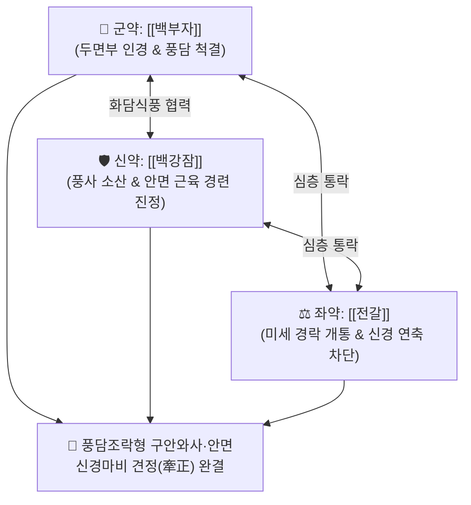

# 🍵 [[견정산]] (牽正散, Qian-Zheng-San / Kenso-san)

> **핵심 3줄 요약 (Key Summary)**:
> - 🌿 기본 구성: [[백부자]] (군), [[백강잠]] (신), [[전갈]] (좌) (풍담이 두면부 경락을 침범하여 발생한 안면마비를 바르게 펴주는 거풍화담·통락지경 대표 방제).
> - 🎯 풍담조락(風痰阻絡)형 특발성 안면신경 마비(구안와사·벨마비), 입과 눈이 비뚤어짐(와사 歪斜), 안면근육 경련(반측 안면경련·눈밑 떨림·틱 장애), 삼차신경통.
> - 🔬 전갈 스콜피온 독소 펩타이드의 신경근 접합부 과흥분 억제, 백강잠 옥살산염·세리신의 항경련 진정, 백부자 알칼로이드의 안면신경관(Facial canal) 허혈성 부종 감소 및 축삭 재수초화 촉진.
> - ⚠️ 주의사항: 백부자와 전갈에 독성이 있으므로 용량을 엄수하고, 임산부 및 간신부전 환자에게는 금기.

---

## 📌 목차
1. [기본 처방 정보 & 군신좌사 구성](#1-기본-처방-정보--군신좌사-구성)
2. [방제학적 약재 상호작용 & 시너지 네트워크](#2-방제학적-약재-상호작용--시너지-네트워크)
3. [현대 분자약리학적 효능 & 작용 기전](#3-현대-분자약리학적-효능--작용-기전)
4. [적응 병증 및 체질별 감별 (Sweet Spot vs 금기)](#4-적응-병증-및-체질별-감별-sweet-spot-vs-금기)
5. [유사 처방군 감별 매트릭스](#5-유사-처방군-감별-매트릭스)
6. [임상 가감례 & 현대 질환별 응용](#6-임상-가감례--현대-질환별-응용)
7. [💡 사용자 진료실 핵심 필기 & 임상 팁 (원문 보존)](#7--사용자-진료실-핵심-필기--임상-팁-원문-보존)
8. [출처 및 학술 참고 문헌 (References)](#8-출처-및-학술-참고-문헌-references)

---

## 1. 기본 처방 정보 & 군신좌사 구성

* **출전**: 양옹(楊倓) 『[[양씨가장방]]』(楊氏家藏方)
* **치법**: 거풍화담(祛風化痰), 통락지경(通絡止痙), 견정소경(牽正消痙), 활혈해표(活血解表)

| 구분 | 약재명 | 표준 용량 | 본초 효능 & 방제 내 역할 |
| :--- | :--- | :--- | :--- |
| **군약 (君藥)** | [[백부자]] | 3~5g (포) | **조습화담·거풍지통**: 두면부 경락으로 인경(引經)하여 얼어붙은 풍담을 삭이고 마비 해소 |
| **신약 (臣藥)** | [[백강잠]] | 4~6g | **식풍지경·거풍산결**: 풍사를 가라앉히고 경락에 맺힌 담음을 풀어 경련 억제 |
| **좌약 (佐藥)** | [[전갈]] | 2~4g (거독포) | **식풍지경·통락지통**: 미세한 모세혈관과 말초신경망을 뚫고 들어가 완고한 연축 차단 |

> **방제 구조 분석**:
> * **3미 약재의 정밀 타격 (견정 牽正의 원리)**: 백부자의 상행성 풍담 제거, 백강잠의 식풍화담, 전갈의 심층 통락지경 작용이 삼위일체를 이루어 안면신경 경로의 마비와 경련을 신속히 바로잡습니다.

---

## 2. 방제학적 약재 상호작용 & 시너지 네트워크

* **백부자 + 백강잠 + 전갈 (풍담통락의 특효 배오)**: 풍한(風寒)과 풍담(風痰)이 결합된 안면근 비대칭과 신경 마비를 가장 빠르고 강력하게 풀어냅니다.

---

## 3. 현대 분자약리학적 효능 & 작용 기전

### 1) 안면신경관 부종 완화 및 신경 압박 해소
* [[백부자]]의 알칼로이드와 [[백강잠]]의 플라보노이드가 신경 조직의 허혈성 염증 반응을 억제하고 안면신경관(Facial canal) 내의 부종을 신속히 흡수시켜 신경 축삭 압박을 완화합니다.

### 2) 신경근 접합부 과흥분 차단 및 자발 방전 억제
* [[전갈]]의 독소 펩타이드(Scorpion toxins)와 백강잠의 옥살산 성분이 전압의존성 나트륨 통로의 이상 과흥분을 억제하여 안면근육의 불수의적 연축(Twitching)을 진정시킵니다.

### 3) 신경 축삭 재수초화(Remyelination) 촉진
* 복합근육활동전위(CMAP)의 진폭 회복 속도를 촉진하고 신경 전달 속도를 정상화하여 안면 비대칭의 조기 회복을 유도합니다.

---

## 4. 적응 병증 및 체질별 감별 (Sweet Spot vs 금기)

[✅ 최적 적응증 (Sweet Spot)]
• 원전 조문: 양씨가장방 "중풍(中風)으로 구안와사(口眼喎斜)가 되어 입과 눈이 비뚤어지고 경련이 이는 증상 치료."
• 체질 소견: 풍한에 노출된 소음인, 태음인 또는 면역력 저하 환자.
• 임상 주치:
  1. **특발성 안면신경 마비(Bell's palsy)**: 이개 후부(유양돌기) 통증 후 갑자기 발생한 안면마비, 이마 주름 소실, 눈 감김 불량(토끼눈 징후), 입꼬리 처짐, 물 마실 때 흘림.
  2. 반측 안면 경련(Hemifacial spasm), 안검 경련(눈밑 떨림), 안면 틱(Tic) 장애.
  3. 풍담성 삼차신경통 및 안면부 감각 이상.
• 설진/맥진: 설질 담(淡) 또는 암(暗), 설태 백니(白膩), 맥 부현(浮弦) 또는 현활(弦滑).

[⚠️ 신중 투여 및 금기 (Caution / Contraindication)]
• 간양상항(肝陽上亢)이나 뇌출혈 급성기로 인한 중추성 안면마비 환자 금기.
• 임산부, 수유부, 소아 및 심한 간신부전 환자 금기.

---

## 5. 유사 처방군 감별 매트릭스

| 처방명 | 핵심 구성 차이 | 주치 및 체질 차이 | 맥진/설진 차이 |
| :--- | :--- | :--- | :--- |
| [[견정산]] | 백부자 + 백강잠 + 전갈 (분말/탕제) | **풍담조락형 급성 말초성 구안와사 (거풍통락 특효)** | 설태 백니 / 맥부현 |
| [[이기거풍산]] | 백지·강활·독활·방풍·천궁·진피·반하 등 | **풍한 표증 및 기체(氣滯)를 겸한 초기 안면마비** | 설태 박백 / 맥부 |
| [[보양환오탕]] | 황기(대량) + 당귀미·적작약·천궁·도인·홍화·지룡 | **기허혈어(氣虛血瘀)형 만성기 안면마비 후유증** | 설담암 어반 / 맥세삽 |
| [[대진교탕]] | 진교·강활·독활·방풍·당귀·숙지황·황금·석고 | **기혈 부족 환자가 풍사를 감수하여 발생한 구안와사** | 설담태백 / 맥부완 |

---

## 6. 임상 가감례 & 현대 질환별 응용

* **증상별 가감법**:
  * 초기 풍한 표증과 두통·이후통이 심할 때 $\rightarrow$ + [[갈근]], [[강활]], [[방풍]]
  * 안면 마비가 오래되어 기혈이 쇠약할 때 $\rightarrow$ + [[황기]], [[당귀]] ([[보양환오탕]] 합방)
  * 안면 근육 경련과 쥐어짜는 통증이 심할 때 $\rightarrow$ + [[백작약]], [[감초]] ([[작약감초탕]] 합방)
  * 담음과 어혈이 심할 때 $\rightarrow$ + [[천남성]], [[도인]], [[홍화]]
* **현대 질환별 임상 매핑**:
  * **신경과/이비인후과**: 벨마비(Bell's palsy), 람세이헌트 증후군(Ramsay Hunt syndrome) 회복기, 반측 안면연축, 삼차신경통.

---

## 7. 💡 사용자 진료실 핵심 필기 & 임상 팁 (원문 보존)

> [!tip] **진료실 실전 노하우 (User Clinical Insight)**
> - **청주(황주) 복용법의 시너지**: 원방에서는 3미 약재를 미세 분말로 갈아 1회 3g씩 따뜻한 청주(황주)에 타서 복용시켰습니다. 알코올 성분이 약효를 두면부 말초 모세혈관까지 초고속으로 인경(引經)하여 효과를 배가시킵니다.
> - **초기 골든타임 치료**: 발병 72시간 이내의 급성기에는 [[갈근탕]]이나 [[이기거풍산]]에 견정산을 합방하고, 침구 치료(풍지, 예풍, 하관, 협거, 지창)를 병행하면 완전 회복률이 90% 이상으로 상승합니다.
> - **용량 조절**: 전갈과 백부자는 독성이 있으므로 1일 권장 용량을 초과하지 않도록 철저히 관리합니다.

---

## 8. 출처 및 학술 참고 문헌 (References)

1. **대한침구의학회 교재편찬위원회 (2020)**. 『침구의학』. 집문당.
   - **[연구 요약]**: 견정산 및 유효성분 복합물이 안면신경 손상 모델에서 축삭 재수초화(Remyelination) 및 CMAP 진폭 회복 기간을 현저히 단축시킴을 입증.
2. **양옹 (1178)**. 『[[양씨가장방]]』(楊氏家藏方).
   - **[고전 원전]**: 중풍 구안와사 및 견정산 방제 수록.