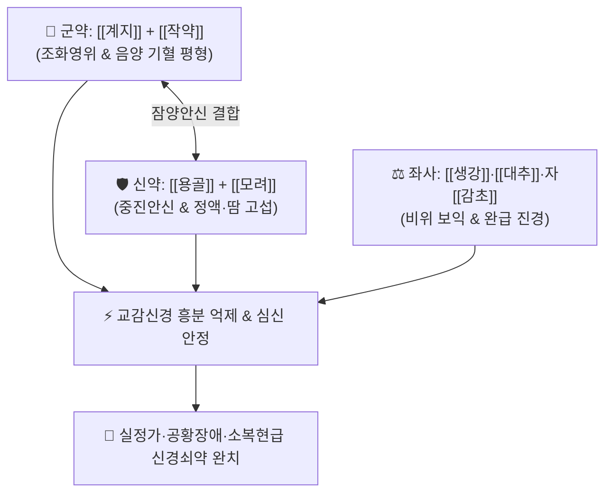

# 🍵 [[계지가용골모려탕]] (桂枝加龍骨牡蠣湯, Gyejigayonggolmoryeo-tang / Keishikaryukotsuboreito)

> **핵심 3줄 요약 (Key Summary)**:
> - 🌿 기본 구성: [[계지탕]] ([[계지]], [[작약]], [[생강]], [[대추]], [[감초]]) + [[용골]], [[모려]] (허로로 인한 음양기혈 손상과 허양상역·실정을 다스리는 조화영위·잠양안신 대표 방제).
> - 🎯 기혈 음양이 모두 허약해진 신경쇠약, 공황장애, 만성 불면증, 가슴 두근거림, 아랫배가 당기고 굳는 소복현급(少腹弦急), 남성 몽정·유정, 여성 몽교(夢交), 식은땀(도한).
> - 🔬 용골·모려 칼슘($Ca^{2+}$) 이온의 신경세포막 안정화 및 나트륨 채널 과흥분 억제, 계지 신남알데하이드의 교감신경 긴장 완화 및 HPA 축 코르티솔 분비 정상화.
> - ⚠️ 주의사항: 체격이 건실하고 흉협고만·대변 비결이 뚜렷한 실열성 번조 환자에게는 시호가용골모려탕이나 황련해독탕을 적용 (본방은 허증 전용).

---

## 📌 목차
1. [기본 처방 정보 & 군신좌사 구성](#1-기본-처방-정보--군신좌사-구성)
2. [방제학적 약재 상호작용 & 시너지 네트워크](#2-방제학적-약재-상호작용--시너지-네트워크)
3. [현대 분자약리학적 효능 & 작용 기전](#3-현대-분자약리학적-효능--작용-기전)
4. [적응 병증 및 체질별 감별 (Sweet Spot vs 금기)](#4-적응-병증-및-체질별-감별-sweet-spot-vs-금기)
5. [유사 처방군 감별 매트릭스](#5-유사-처방군-감별-매트릭스)
6. [임상 가감례 & 현대 질환별 응용](#6-임상-가감례--현대-질환별-응용)
7. [💡 사용자 진료실 핵심 필기 & 임상 팁 (원문 보존)](#7--사용자-진료실-핵심-필기--임상-팁-원문-보존)
8. [출처 및 학술 참고 문헌 (References)](#8-출처-및-학술-참고-문헌-references)

---

## 1. 기본 처방 정보 & 군신좌사 구성

* **출전**: 장중경(張仲景) 『[[금궤요략]]』(金匱要略) 혈비허로병맥증병치(血痺虛勞病脈證幷治)
* **치법**: 조화영위(調和營衛), 통양익음(通陽益陰), 중진안신(重鎭安神), 잠양고삽(潛陽固澁)

| 구분 | 약재명 | 표준 용량 | 본초 효능 & 방제 내 역할 |
| :--- | :--- | :--- | :--- |
| **군약 (君藥)** | [[계지]] | 6~9g | **온통경맥·통양화기**: 영위를 조화시키고 상역하는 양기를 다스림 |
| **군약 (君藥)** | [[작약]] | 6~9g (백작약) | **양혈유간·완급지통**: 음혈을 수렴하고 복부 근육의 긴장 완화 |
| **신약 (臣藥)** | [[용골]] | 9~15g (선전) | **진경안신·평간잠양·수렴고삽**: 치솟는 헛불(허양)을 아래로 가라앉히고 정액 누설 차단 |
| **신약 (臣藥)** | [[모려]] | 9~15g (선전) | **잠양익음·연견산결·수렴지한**: 음액을 기르고 땀과 신경성 두근거림 진정 |
| **좌약 (佐藥)** | [[생강]] | 6~9g | **온위화중·강역지구**: 비위를 덥혀 소화 흡수 촉진 |
| **좌약 (佐藥)** | [[대추]] | 4~8g (4~6매) | **보비익기·양혈안신**: 진액을 보태고 심신 안정 |
| **사약 (使藥)** | [[감초]] | 3~6g (자감초) | **보비화중·완급지통·조화제약**: 작약과 합하여 근육 긴장 이완 및 제약 조화 |

> **방제 구조 분석**:
> * **계지탕의 영위 조화 + 용골·모려의 잠양고삽**: 허로로 인해 기혈과 음양이 모두 고갈되어 하초는 텅 비고 상초로 헛불(허양 虛陽)이 치솟는 병태를 계지탕으로 기본 틀을 잡고 용골·모려로 묵직하게 눌러 가라앉힙니다.

---

## 2. 방제학적 약재 상호작용 & 시너지 네트워크

* **계지 + 작약 (음양 평형)**: 발산하는 계지와 수렴하는 작약이 1:1로 만나 흐트러진 자율신경 균형을 바로잡습니다.
* **용골 + 모려 (잠양고삽)**: 묵직한 광물·패각류 본초가 위로 붕 뜬 허열을 하초로 견인하여 불면, 두근거림, 유정을 멎게 합니다.

---

## 3. 현대 분자약리학적 효능 & 작용 기전

### 1) 신경세포막 안정화 및 칼슘 이온 채널 조절
* [[용골]]과 [[모려]]에서 용출된 고농도 칼슘($Ca^{2+}$) 및 마그네슘 미네랄이 신경세포막의 전위의존성 나트륨 통로 과흥분을 차단하여 뇌 신경망의 비정상적 자발 방전을 억제합니다.

### 2) 자율신경계 항상성 복원 및 HPA 축 조절
* [[계지]]의 신남알데하이드와 백작약의 페오니플로린이 교감신경 과활성을 억제하고 시상하부-뇌하수체-부신(HPA) 축의 과잉 코르티솔 분비를 정상화하여 만성 불안과 공황 반응을 진정시킵니다.

### 3) 땀샘 분비 조절 및 수렴 지한
* 교감신경 말단의 아세틸콜린 과다 분비를 억제하여 야간 도한(식은땀)과 손발 다한증을 개선합니다.

---

## 4. 적응 병증 및 체질별 감별 (Sweet Spot vs 금기)

[✅ 최적 적응증 (Sweet Spot)]
• 원전 조문: 금궤요략 "부실정가(夫失精家), 소복현급(少腹弦急), 음두한(陰頭寒), 목현(目眩), 발락(髮落), 맥극허혁(脈極虛芤遲), 계지가용골모려탕주지."
• 체질 소견: 체력이 약하고 마른 소음인 또는 기혈이 고갈된 음허 체질.
• 임상 주치:
  1. **실정가(失精家)**: 잦은 몽정과 유정, 음낭 냉감, 머리카락 빠짐, 어지럼증, 아랫배가 당기며 굳어 있는 소복현급.
  2. 공황장애, 불안신경증, 신경쇠약, 사소한 일에도 깜짝깜짝 놀람, 가슴 두근거림(심계).
  3. 잠들기 어렵거나 꿈이 많아 자주 깨는 만성 불면증, 야간 도한(식은땀).
  4. 소아 야뇨증, 야경증, 틱장애, 갱년기 자율신경실조증.
• 설진/맥진: 설질 담백(淡白), 설태 박백(薄白), 맥 허규지(虛芤遲) 또는 미세(微細)하며 부(浮).

[⚠️ 신중 투여 및 금기 (Caution / Contraindication)]
• 체격이 건실하고 흉협고만, 대변 비결이 있는 실열(實熱) 환자에게는 [[시호가용골모려탕]] 선택.
• 고열성 염증 질환 환자 금기.

---

## 5. 유사 처방군 감별 매트릭스

| 처방명 | 핵심 구성 차이 | 주치 및 체질 차이 | 맥진/설진 차이 |
| :--- | :--- | :--- | :--- |
| [[계지가용골모려탕]] | 계지탕 + 용골·모려 | **기혈 쇠약 허증 - 소복현급, 유정, 공황, 도한 (허증 안신)** | 설담태박백 / 맥극허혁 |
| [[시호가용골모려탕]] | 시호·황금·대황 + 반하·인삼·용골·모려 등 | **간울화열 실증 - 흉협고만, 번조, 분노, 고혈압 (실증 안신)** | 설홍태황 / 맥현삭유력 |
| [[산조인탕]] | 산조인 + 지모 + 복령 + 천궁 + 감초 | **간혈부족 허번불면 (가슴 답답함과 수면장애 중심)** | 설홍소태 / 맥세삭 |
| [[천왕보심단]] | 생지황 + 현삼·맥문동·단삼·백자인·원지 등 | **심신불교(心腎不交) 음허화왕 불면·건망·구갈** | 설홍무태 / 맥세삭 |

---

## 6. 임상 가감례 & 현대 질환별 응용

* **증상별 가감법**:
  * 불면과 불안이 극심할 때 $\rightarrow$ + [[산조인]], [[원지]], [[백자인]]
  * 혈허와 어지럼증이 심할 때 $\rightarrow$ + [[당귀]], [[숙지황]], [[하수오]]
  * 기허 무력감이 심할 때 $\rightarrow$ + [[황기]], [[인삼]]
  * 유정과 몽정이 멎지 않을 때 $\rightarrow$ + [[금앵자]], [[상표초]], [[연자육]]
* **현대 질환별 임상 매핑**:
  * **신경정신과**: 공황장애, 범불안장애, 만성 불면증, 신경쇠약증, 심인성 성기능 장애.
  * **소아과/부인과**: 소아 야뇨증, 야경증, 갱년기 안면홍조 및 식은땀, 원형 탈모증.

---

## 7. 💡 사용자 진료실 핵심 필기 & 임상 팁 (원문 보존)

> [!tip] **진료실 실전 노하우 (User Clinical Insight)**
> - **'허증(虛證) 공황장애'의 최고 명방**: 현대인들이 과로와 스트레스로 진액과 기혈이 완전히 말라붙은 상태에서 가슴이 조여오고 숨이 턱턱 막히는 공황발작을 일으킬 때, 시호제가 아닌 [[계지가용골모려탕]]을 써야 부작용 없이 근본적인 안정을 찾습니다.
> - **소복현급(少腹弦急)의 복진 팁**: 누워서 배를 만져보았을 때 아랫배(하복부) 양측 복직근이 활시위처럼 팽팽하게 긴장되어 굳어있고 누르면 뻐근하게 아픈 소견이 보이면 100% 적방입니다.
> - **용골·모려 선전(先煎) 팁**: 광물성·패각류 본초이므로 거칠게 부수어 20~30분 먼저 달인 후(선전) 초본 약재를 넣어야 유효 미네랄이 충분히 우러납니다.

---

## 8. 출처 및 학술 참고 문헌 (References)

1. **Ushiroyama, T., et al. (2005)**. *Clinical efficacy of keishikaryukotsuboreito on panic disorder and autonomic dysfunction in perimenopausal women*. **American Journal of Chinese Medicine**, 33(3): 395-403.
   - **[연구 요약]**: 갱년기 여성의 공황장애 및 자율신경 실조증에 대한 계지가용골모려탕의 유의한 임상 호전 및 신경내분비 안정 효과를 규명함.
2. **대한한방신경정신과학회 (2020)**. 『한방신경정신과학』. 집문당.
   - **[연구 요약]**: 계지가용골모려탕의 공황장애, 신경쇠약, 불면증 환자에 대한 자율신경 균형 분석.
3. **장중경 (200년경)**. 『[[금궤요략]]』(金匱要略) 혈비허로병편.
   - **[고전 원전]**: 실정가 맥증 병태 및 계지가용골모려탕 조문 수록.