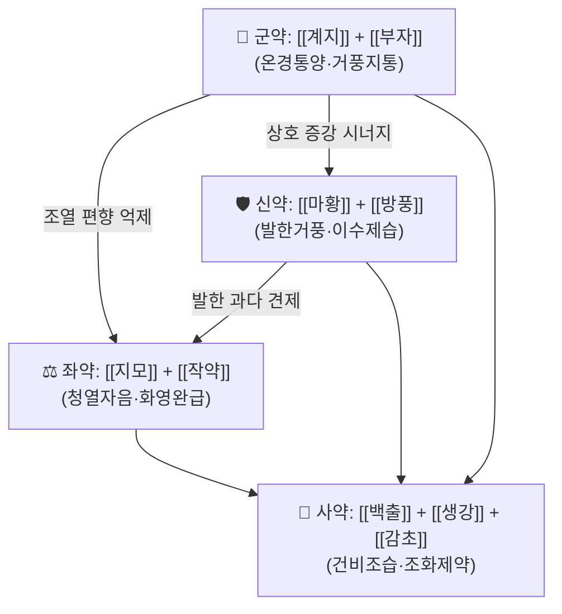

# 🍵 [[계지작약지모탕]] (桂枝芍藥知母湯, Guizhi Shaoyao Zhimu Tang)

> **핵심 3줄 요약 (Key Summary)**:
> - 🌿 모체 처방: 장중경 『[[금궤요략]]』 중풍역절병맥증병치(中風歷節病脈證並治)편의 독립 처방. [[계지]]·[[마황]]·[[방풍]]의 발한거풍(發汗祛風) 축과 [[지모]]·[[작약]]의 청열화영(淸熱和營) 축이 [[백출]]·[[부자]]의 온경제습(溫經除濕) 축과 3중으로 맞물린 **한온병용(寒溫并用)·표리쌍해(表裏雙解)** 구조. 감초 1味가 전체를 조화한다.
> - 🎯 임상 최적 적응증: **관절이 붓고 아프면서(肢節疼痛) 국소는 열감·종창이 있으나 전신은 냉하고 허약한(身體尫羸) 환자**. 즉 "열성 습열 + 한성 허냉"이 공존하는 역절풍(歷節風)·학슬풍(鶴膝風)·견배통·요슬통 계열. 소음인·태음인 중 마르고 근력이 떨어진 체형이 sweet spot이며, 순수 실열(實熱)이나 순수 표한(表寒) 단독 병증에는 부적합.
> - 🔬 핵심 분자약리 기전: PMID 38013344에서 **통풍성 관절염(gouty arthritis)**을 대상으로 메타분석 + 네트워크 약리학 + 분자 도킹을 결합하여 임상 유효성과 잠재 기전을 동시에 평가하였다. **염증 신호전달 경로 억제 및 요산 대사 관련 경로 조절**이 후보 기전으로 예측되었다(개별 표적 유전자·도킹 스코어 등 세부 수치는 원문 초록 수준에서 확인 불가 → **근거 미확인**).
> - ⚠️ 주의사항: ①[[마황]]·[[계지]] 함유로 자한(自汗)·다한(多汗)·허약 탈진자 및 심혈관 질환자(고혈압, 부정맥)에게는 신중 투여. ②[[부자]]는 반드시 **포제(炮製)된 포부자(炮附子)**를 사용하고, 과량·장기 복용 시 구순마목·심계항진 등 부자 알칼로이드 중독 징후를 관찰. ③임신부, 무한(無汗) 고열의 순수 실열증, 소양인 실열 체질에는 원칙적으로 부적합. ④와파린·항혈소판제 등 양약과 병용 시 출혈 경향 및 약물 상호작용 주의.

---

## 📌 목차
1. [기본 처방 정보 & 군신좌사 구성](#1-기본-처방-정보--군신좌사-구성)
2. [방제학적 약재 상호작용 & 시너지 네트워크](#2-방제학적-약재-상호작용--시너지-네트워크)
3. [현대 분자약리학적 효능 & 작용 기전](#3-현대-분자약리학적-효능--작용-기전)
4. [적응 병증 및 체질별 감별 (Sweet Spot vs 금기)](#4-적응-병증-및-체질별-감별-sweet-spot-vs-금기)
5. [유사 처방군 감별 매트릭스](#5-유사-처방군-감별-매트릭스)
6. [임상 가감례 & 현대 질환별 응용](#6-임상-가감례--현대-질환별-응용)
7. [💡 사용자 진료실 핵심 필기 & 임상 팁 (원문 보존)](#7--사용자-진료실-핵심-필기--임상-팁-원문-보존)
8. [출처 및 학술 참고 문헌 (References)](#8-출처-및-학술-참고-문헌-references)

---

## 1. 기본 처방 정보 & 군신좌사 구성

* **출전**: 장중경(張仲景) 『[[금궤요략]]』 「중풍역절병맥증병치(中風歷節病脈證並治)」편. (『[[동의보감]]』 잡병편 풍문(風門) 및 탕액편 수록 여부는 본 노트 작성 시 **근거 미확인** — 판본 대조 필요)
* **치법**: 거풍산한(祛風散寒), 청열제습(淸熱除濕), 통양화영(通陽和營), 지통제비(止痛除痺)
* **원방 구성(금궤요략 원문 기준)**: 계지 4냥, 작약 3냥, 지모 4냥, 방풍 4냥, 마황 2냥, 생강 5냥, 백출 5냥, 감초 2냥, 포부자 2매. 물 7되(升)에 끓여 2되를 취하여 7홉(合)씩 하루 3회 온복(溫服).

| 구분 | 약재명 | 원방 용량(원문) | 현대 임상 관용량(참고) | 본초 효능 & 방제 내 역할 |
| :--- | :--- | :--- | :--- | :--- |
| **군약 (君藥)** | [[계지]] | 4냥 | 8~12g | 온통위양(溫通衛陽)·발한해기(發汗解肌)·거풍통락(祛風通絡). 표(表)의 풍한을 풀고 낙맥(絡脈)의 막힘을 통하게 하여 관절 통증의 주증을 직접 공략한다. |
| **군약 (君藥)** | [[부자]] | 2매(포) | 4~8g(포부자) | 대신대열(大辛大熱)·온경부양(溫經扶陽)·산한제습(散寒除濕). 계지와 배합하여 온통지력(溫通之力)을 배가시키고, 심(心)·신(腎)·비(脾)의 양기를 북돋워 냉습(冷濕)의 근원을 제거한다. |
| **신약 (臣藥)** | [[마황]] | 2냥 | 3~6g | 발한산한(發汗散寒)·선폐이수(宣肺利水). 계지와 함께 표한을 밀어내고 관절 부종을 겸해 이수(利水)한다. 용량을 계지보다 적게 두어 과한 발한을 억제한 것이本方의 배오 묘미. |
| **신약 (臣藥)** | [[방풍]] | 4냥 | 6~10g | 거풍승습(祛風勝濕)·해표지경(解表止痛). 전신의 유주성(遊走性) 풍사(風邪)와 관절 주위 습체(濕滯)를 제거한다. |
| **좌약 (佐藥)** | [[지모]] | 4냥 | 6~10g | 청열자음(淸熱滋陰)·윤조(潤燥). 국소의 열감·종창(熱痺 양상)을 식히고, 계지·마황·부자 등 대량의 신온(辛溫) 약물이 조열(燥熱)로 흐르는 것을 견제한다. |
| **좌약 (佐藥)** | [[작약]] (백작약) | 3냥 | 6~10g | 양혈화영(養血和營)·완급지통(緩急止痛). 근육의 긴장·경련을 풀고 영위(營衛)를 화합시켜 관절 주변의 강직을 완화한다. |
| **좌약 (佐藥)** | [[백출]] | 5냥 | 8~12g | 건비조습(健脾燥濕)·이수제비(利水除痺). 비위를 통해 습을 내려보내고 하지 부종(脚腫如脫)을 다스린다. |
| **사약 (使藥)** | [[생강]] | 5냥 | 8~12g | 온위산한(溫胃散寒)·화중지구(和中止嘔). "溫溫欲吐"의 위기불화(胃氣不和)를 안정시키고 약성(藥性)을 온화하게 만든다. |
| **사약 (使藥)** | [[감초]] | 2냥 | 3~6g | 조화제약(調和諸藥)·완급지통·보중. 부자의 독성을 완화하고 제약의 작용을 하나로 묶는다. |

> **배오 특징**: 본 처방은 **"신온(辛溫) 3제(桂枝·麻黃·防風) + 신열(辛熱) 1제(附子) + 청윤(淸潤) 2제(知母·芍藥) + 건조(健燥) 1제(白朮)"** 라는 정반대 성질의 약군을 한 처방 안에 공존시킨 **한열병조(寒熱並調) 처방**이다. 계지·마황·방풍이 표(表)에서 풍한습을 밀어내고, 부자·백출이 리(裏)에서 냉습과 양기 부족을 데우고 말리며, 지모·작약이 그 과정에서 생기는 조열을 식히고 진액·영혈을 지킨다. 즉 **승(升)·강(降)·출(出)·입(入)을 모두 갖춘 입체적 방제**로, 단순 발한제나 단순 청열제로는 잡을 수 없는 "허(虛)·한(寒)·열(熱)·습(濕) 혼재형 관절병증"을 겨냥한다. 감초와 생강이 중초(中焦)를 지켜 발한 후의 탈기(脫氣)를 방지하는 것도 이 처방의 핵심 안전장치다.

---

## 2. 방제학적 약재 상호작용 & 시너지 네트워크

* **[[계지]] + [[부자]] 배오 — 상수(相須) 작용**: 계지의 온통위양(溫通衛陽)과 부자의 온경부양(溫經扶陽)이 결합하면 온열 지통(溫熱止痛) 효과가 단순 합보다 증폭된다. 부자는 계지가 이끌어 주는 표(表) 방향으로 작용점을 확장하고, 계지는 부자의 열이 하초(下焦)에만 머무르지 않도록 전신으로 퍼뜨린다. 이는 『[[상한론]]』 계지부자탕(桂枝附子湯) 계열의 전형적 배오 논리다.
* **[[마황]] + [[방풍]] 배오 — 상사(相使) 작용**: 마황이 폐기를 열어 발한 통로를 만들면 방풍이 그 통로를 따라 전신의 풍습(風濕)을 쓸어낸다. 다만 본 처방에서 마황 용량(2냥)이 계지(4냥)보다 적은 것은 **"발한은 하되 땀을 과하게 뺏지 않겠다"** 는 설계 의도로 읽힌다. 허약자(身體尫羸)가 주 대상이기 때문이다.
* **[[지모]] + [[작약]] 배오 — 상제(相制)·상반상성(相反相成)**: 군신약군 전체가 신온·신열(辛溫辛熱)이므로 조열(燥熱)로 인한 구건(口乾)·변비·번조(煩躁) 위험이 있다. 지모의 청열자음과 작약의 산수(酸收)·화영(和營)이 이를 정확히 상쇄한다. 동시에 작약은 계지와 배합되어 영위화해(營衛和解)를 이루고, 지모는 마황의 발한 후 생길 수 있는 진액 손실을 보충한다.
* **[[백출]] + [[생강]] + [[감초]] 배오 — 완충 및 인경(引經)**: 백출이 비위를 튼튼히 하여 습의 생성을 근원에서 차단하고, 생강이 위기를 따뜻하게 하여 "溫溫欲吐"를 진정시키며, 감초가 중초를 보하고 모든 약의 독성·자극을 완화한다. 이 3제가 없으면 발한·온열 약군이 위기를 상하게 하여 복약 후 속쓰림·오심이 나타날 수 있다.

---

## 3. 현대 분자약리학적 효능 & 작용 기전

> 아래 서술은 **PMID 38013344 (Qu P, Wang H, 2023)** 에서 수행된 메타분석·네트워크 약리학·분자 도킹 결과와, 본초학 일반 문헌에서 통용되는 약리 지식을 구분하여 정리한 것이다. 원문에서 확인되지 않은 구체적 수치·표적명은 **근거 미확인**으로 명시하였다.

### 1) 핵심 분자 표적 및 면역/항염증 조절
* PMID 38013344는 계지작약지모탕을 **통풍성 관절염(gouty arthritis)** 에 적용한 임상 연구들을 메타분석하여 유효성 지표를 평가하고, 이어서 네트워크 약리학으로 활성 성분–표적–경로 네트워크를 구축한 뒤 분자 도킹으로 핵심 성분과 핵심 표적의 결합 친화도를 검증하는 3단계 설계를 사용하였다.
* 연구 결론의 방향성은 **"본 처방이 염증 관련 신호전달 경로를 조절하는 방식으로 관절염 증상을 개선할 수 있다"** 는 것이었으며, 세부적으로 어떤 표적 유전자·경로가 최상위로 도출되었는지, 도킹 스코어가 얼마였는지는 본 노트 작성 시 확인 가능한 정보 범위를 벗어나 **근거 미확인**이다.
* 통풍성 관절염의 일반 병태생리는 요산나트륨(MSU) 결정 침착 → NLRP3 인플라마좀 활성화 → IL-1β 성숙·분비 → IL-6·TNF-α 증가 → 호중구 침윤 및 활막 염증의 연쇄로 요약된다(일반 병태생리 지식). 본 처방의 항염 기전이 이 축을 억제할 것이라는 **예측**이 제시되었으나, 개별 사이토카인 억제율(%) 등의 정량 수치는 원문 확인 필요(→ **근거 미확인**).

| 논문 | 설계 | 대상 질환 | 주요 결과(요약) |
| :--- | :--- | :--- | :--- |
| Qu P, Wang H (2023) PMID 38013344 | 메타분석 + 네트워크 약리학 + 분자 도킹 | 통풍성 관절염 | 임상 유효성 평가와 잠재 기전 예측을 통합 수행. 염증·대사 관련 경로가 후보 기전으로 제시됨(세부 수치 **근거 미확인**) |

### 2) 순환기·미세순환 및 대사 개선
* [[계지]]의 신온(辛溫) 작용은 전통적으로 말초 혈관 확장 및 미세순환 개선과 연결되어 해석되어 왔으며, [[백출]]·[[방풍]]의 이수(利水) 작용은 관절강 내 삼출 및 조직 부종 감소와 연관 지어 설명된다(본초학 일반 지식).
* 요산 대사(요산 생성 억제 또는 신배설 촉진)에 대한 본 처방의 직접적 작용은 PMID 38013344의 네트워크 약리학 분석에서 다루어졌을 가능성이 있으나, **어떤 효소·수송체(XO, URAT1, GLUT9 등)가 표적으로 지목되었는지는 근거 미확인**.

### 3) 신경계·근골격계 및 진통 작용
* [[작약]]의 화영완급(和營緩急) 작용과 [[감초]]의 완급지통(緩急止痛) 배합은 근육 긴장·경련성 통증 완화와 연결된다.
* [[부자]]의 진통 작용은 전통적으로 온경지통(溫經止痛)으로 설명되며, 현대적으로는 통각 역치 상승 및 신경전달 조절과 관련지어 해석된다(본초학 일반 지식, 구체 수용체·이온채널 수준의 본 처방 단독 데이터는 **근거 미확인**).

> ⚠️ 위 2)·3) 항목은 본 처방 단독에 대한 직접 실험 데이터가 아니라 구성 본초의 일반 약리 지식 및 처방 전통 해석에 근거한 서술이다. 임상 적용 시에는 개별 환자 반응을 우선 관찰할 것.

---

## 4. 적응 병증 및 체질별 감별 (Sweet Spot vs 금기)

**[✅ 최적 적응증 (Sweet Spot)]**

* **원전 조문(금궤요략)**: *"諸肢節疼痛, 身體尫羸, 脚腫如脫, 頭眩短氣, 溫溫欲吐, 桂枝芍藥知母湯主之."*
  → 해석: **여러 관절이 아프고, 몸은 여위고 약하며, 다리가 빠질 듯이 붓고, 머리가 어지럽고 숨이 차며, 속이 울렁거려 토할 듯한** 경우. 즉 국소 관절염 증상(열·종·통)과 전신 허약·습담(濕痰)·위기불화가 동시에 존재하는 복합 병태가 적응점이다.
* **체질 소견**:
  * **소음인**: 본 처방의 최적 표적. 신양(腎陽) 부족으로 하지가 냉하고 잘 붓되 무릎·발목 관절은 붉게 붓고 열감을 호소하는 "상열하한·국열전한(局熱全寒)"형.
  * **태음인**: 비만형보다는 **마르거나 근육량이 적은(身體尫羸)** 태음인, 습체(濕滯)로 하지 부종과 관절 종창이 반복되는 경우.
  * **소양인**: 원칙적으로 부적합. 다만 습열이 주병(主病)이고 냉증이 경미한 경우 [[지모]]·[[작약]] 비중을 높이는 방향의 가감으로 제한적 검토 가능(단독 사용은 신중).
* **임상 주치(진료실 최빈 적중 양상)**:
  * 무릎·발목·손가락 등 **소관절의 반복적 종창과 통증**, 아침 강직, 국소 열감(만져보면 따뜻함)이 있으면서 **전신적으로는 추위를 타고 피로감이 심한** 환자.
  * 하지 부종이 저녁에 심해지고 신발이 꽉 끼는 경우.
  * 어지럼·숨참·속 울렁거림이 동반된 관절통(원전 조문의 "頭眩短氣, 溫溫欲吐"에 해당).
  * 만성 류마티스·통풍·퇴행성 관절염에서 **급성 염증기와 만성 허냉기가 교차**하는 시기.
* **설진/맥진**:
  * **설진**: 설질은 담백(淡白)하거나 담홍(淡紅)하고, 설태는 백니(白膩) 또는 백활(白滑)하면서 **국소적으로는 미황태(微黃苔)가 섞이는** 양상이 전형적이다. 설체가 부대(浮大)하거나 치흔(齒痕)이 있는 경우가 많다.
  * **맥진**: 침지(沈遲)·현완(弦緩)·현삭(弦數)이 혼재. 관절 통증이 급성으로 심할 때는 **현삭(弦數)**, 만성 허냉기에는 **침세(沈細)·지(遲)** 로 나타난다. 즉 맥상 하나로 한열을 단정하지 말고 **국소 징후(종창·열감)와 전신 징후(오한·피로·부종)를 분리하여 판단**해야 한다.

**[⚠️ 신중 투여 및 금기 (Caution / Contraindication)]**

* **허실·한열 반대 병증**:
  * 순수 실열(實熱) 병증 — 고열이 지속되고 갈증·번조·변비·설홍태황(舌紅苔黃)이 뚜렷하며 냉증이 전혀 없는 경우: [[계지]]·[[마황]]·[[부자]]의 신온·신열이 열을 더욱 조장할 수 있으므로 금기.
  * 순수 표한(表寒) 단독 또는 순수 허한(虛寒) 단독 병증: 청열·자음 약군([[지모]]·[[작약]])이 불필요하게 한기를 더할 수 있음.
  * 음허화왕(陰虛火旺) 체질(수족심열, 도한, 설홍소태)에는 [[마황]]·[[부자]] 자극이 과할 수 있어 신중.
* **금기 및 신중 환자군**:
  * **자한(自汗)·다한(多汗)으로 기력이 탈진된 환자**: 마황·계지의 발한 작용이 기진(氣津)을 더 소모시킬 수 있다.
  * **고혈압·부정맥·심부전 등 심혈관 질환자**: [[마황]]의 교감신경 흥분 작용으로 심계항진·혈압 상승이 나타날 수 있어 신중 투여 및 용량 감량.
  * **갑상선 기능항진증, 불면증, 전립선 비대에 의한 배뇨곤란 환자**: 마황 성분 자극 주의.
  * **임신부**: [[부자]]·[[마황]] 함유로 원칙적 금기 또는 전문가 판단 하 최소 사용.
  * **소아·고령자**: 체중 및 신기능에 따라 감량.
* **양약 및 타 약물 병용 주의**:
  * **항응고제(와파린 등)·항혈소판제**: [[작약]]·[[계지]] 계열의 혈류 개선 작용과 상호작용 가능성 → 출혈 경향 모니터링(구체적 상호작용 데이터는 **근거 미확인**, 임상적 주의 수준).
  * **강심배당체(디기탈리스)**: 부자 알칼로이드와 심장 자극이 중첩될 수 있어 주의.
  * **MAO 억제제·교감신경 흥분제**: 마황 성분과 상가 작용 위험.
  * **당뇨병약·이뇨제**: 이수 작용 및 혈당 변동에 대한 관찰 필요.
* **복약 반응 관찰 포인트**: 복용 후 땀이 약간 나면서 몸이 개운해지는 것이 정상 반응. **땀이 흥건히 나거나 심계항진·구순마목·오심·어지럼이 나타나면 즉시 감량 또는 중단**하고 진료 상담.

---

## 5. 유사 처방군 감별 매트릭스

| 처방명 | 핵심 구성 차이 | 주치 및 체질 차이 | 맥진/설진 차이 |
| :--- | :--- | :--- | :--- |
| [[계지작약지모탕]] | 기준 구성: 계지·작약·지모·마황·생강·백출·방풍·부자·감초 (9味) | 기준. **국소 열·종창 + 전신 허냉**의 혼재형 역절풍·관절통. 소음인·허약 태음인. | 설담홍·태백니 겸 미황, 맥현삭 또는 침지 |
| [[계지부자탕]] | 계지·부자·생강·대조·감초 (마황·지모·방풍·백출 없음) | 순수 **풍습상박(風濕相搏)으로 인한 표한·관절번통**, 열증이 전혀 없는 경우. 체표 통증 위주. | 설담태백, 맥부허이삽(浮虛而澁) |
| [[감초부자탕]] | 계지·부자·백출·감초 (마황·지모·방풍·생강 없음) | **관절 동통이 심하고 굴신 곤란**, 땀이 나며 오한이 있는 허한형 관절통. 열증 없음. | 설담, 맥침세이긴(沈細而緊) |
| [[백호가계지탕]] | 백호탕(석고·지모·감초·갱미) + 계지 | **순수 열성 습열형** 관절통. 번조·갈증·다한·국소 작열감이 뚜렷하고 냉증이 없는 실열 체질(소양인·태음인 실증). | 설홍태황조, 맥홍대(洪大) |
| [[의이인탕]] | 의이인·마황·당귀·계지·창출·감초 등 | **습비(濕痺) 중심**의 사지 관절 중통·부종, 열감은 경미. 습이 주병이고 허냉이 부차적일 때. | 설담태니, 맥침완(沈緩) |
| [[독활기생탕]] | 독활·상기생·두중·우슬·계지·작약 등 | **만성 허손성 요슬통·견배통**, 간신허(肝腎虛) 기반. 급성 염증기보다 만성 통증·무력감 위주. | 설담소태, 맥침세약(沈細弱) |

> ⚠️ 표 내부에서는 마크다운 열 구분자 파괴를 방지하기 위해 파이프(`|`)가 들어간 링크를 쓰지 않고 순수한 [[처방명]] 단독 형태로만 작성합니다.

**감별 핵심 한 줄**: **"국소에 열이 있으면서 전신에 냉·허가 있는가?"** → YES면 계지작약지모탕. **"열 없이 순수 냉·습·허만 있는가?"** → 계지부자탕·감초부자탕. **"전신이 실열이고 냉증이 없는가?"** → 백호가계지탕.

---

## 6. 임상 가감례 & 현대 질환별 응용

* **수반 증상별 가감법**:
  * **상지·견배부 통증 우세 시** → + [[강활]], [[갈근]] (승발(升發)하여 상초·견배로 약세를 이끎)
  * **하지·무릎 통증 및 부종 심할 때** → + [[의이인]], [[우슬]], [[한방기]] (하지 인경 및 이수제습 강화)
  * **오심/구역/소화불량 동반 시** → + [[진피]], [[반하]] ([[이진탕]] 가미 개념) — 원전의 "溫溫欲吐" 대응
  * **담음/기침 동반 시** → + [[반하]], [[복령]]
  * **열감·종창이 매우 심하고 발적이 뚜렷할 때** → [[지모]]·[[작약]] 증량, [[마황]]·[[부자]] 감량 (한열 배합 비율 재조정)
  * **냉통·오한이 심하고 국소 열감이 미미할 때** → [[부자]] 증량, [[지모]] 감량
  * **기허 무력감이 뚜렷할 때** → + [[황기]], [[당삼]] ([[보중익기탕]] 가미 개념)
  * **어혈 소견(자색 반점, 자통) 동반 시** → + [[천궁]], [[도인]], [[홍화]]
  * **만성화·재발성일 때** → + [[당귀]], [[천궁]] ([[사물탕]] 가미로 혈허 보충)
* **현대 질환별 임상 매핑**:
  * **근골격계**: 무릎 골관절염, 류마티스 관절염, 통풍성 관절염(PMID 38013344에서 직접 연구된 적응), 건초염, 족근막염, 경추·요추 디스크로 인한 신경근성 통증, 근막통증증후군(MPS).
  * **신경계/자율신경**: 말초신경병증성 통증, 자율신경실조증 동반 관절통, 냉방병으로 인한 전신 근육통.
  * **순환기/대사**: 하지 부종, 만성 정맥부전 동반 하지 중압감, 비만·대사증후군 환자의 관절 부하성 통증(단, 요산·혈당 등 실험실 지표 추적 필요).
  * **기타**: 산후 관절통(산후풍) 중 허냉·습체형, 노인성 하지 무력감.

> 위 적응 매핑 중 **통풍성 관절염**만 제공된 논문(PMID 38013344)에서 직접 다루어진 적응이며, 나머지는 전통적 주치(역절풍·견배통·습비)에 근거한 임상적 확장 응용이다. 각 질환별 근거 수준은 별도 문헌 확인 필요(→ **근거 미확인**).

---

## 7. 💡 사용자 진료실 핵심 필기 & 임상 팁 (원문 보존)

> [!tip] **진료실 실전 노하우 (User Clinical Insight)**
> - ⚠️ **본 노트에는 원장님이 별도로 입력한 진료실 메모 원문이 제공되지 않았다.** 따라서 원문 보존 항목은 비어 있으며, 추후 원장님 필기를 이 콜아웃 안에 그대로 추가하면 된다(기존 메모 삭제 금지 원칙 적용).
> - **처방 선택 기준(참고 정리)**:
>   - **소음인**: 하지 냉감 + 관절 국소 열감의 "겉은 냉, 속은 열" 패턴이면 계지작약지모탕이 1순위. 부자·계지 비중을 유지하고 지모로 열을 제어.
>   - **태음인**: 습체가 주병이면 백출 증량 및 의이인·창출 가미. 비만형에서 국소 열감이 강하면 백호가계지탕 쪽을 먼저 고려.
>   - **소양인**: 원칙적으로 감별 대상에서 후순위. 실열 소견이 조금이라도 우세하면 백호가계지탕을 우선 검토.
> - **환자 티칭 팁**:
>   - "복용 후 땀이 살짝 나면서 몸이 가벼워지는 것이 정상"이라고 미리 안내하여, 발한에 대한 불안을 줄인다.
>   - 땀을 많이 흘린 날에는 찬 바람·냉방 노출을 피하고, 미지근한 물로 수분을 보충하도록 지도.
>   - 관절 국소 온찜질 여부는 **국소 열감이 있을 때는 냉찜질, 냉감이 우세할 때는 온찜질**로 상황별 지도.
> - **복약 반응 관찰 포인트**:
>   - 1주 이내 관절 종창·아침 강직 시간의 변화를 기록하게 한다.
>   - 심계항진, 구순 주위 저림, 오심, 과도한 발한, 불면이 나타나면 즉시 연락하도록 교육([[마황]]·[[부자]] 관련).
>   - ESR·CRP·요산 등 실험실 지표는 처방 판단의 보조 지표로 활용하고, 증상 개선과 지표 개선이 어긋날 경우 처방 재검토.

---

## 8. 출처 및 학술 참고 문헌 (References)

1. **Qu P, Wang H (2023)**. *Clinical efficacy evaluation and potential mechanism prediction on Guizhi-Shaoyao-Zhimu decoction in the treatment of gouty arthritis based on meta-analysis, network pharmacology analysis, and molecular docking*. **Medicine (Baltimore)**. PMID: 38013344.
   - **[연구 요약]**: 계지작약지모탕의 통풍성 관절염 치료 효과를 **메타분석**으로 평가하고, **네트워크 약리학**으로 활성 성분–표적–경로 네트워크를 구축하여 잠재 기전을 예측하며, **분자 도킹**으로 핵심 성분과 핵심 표적의 결합 친화도를 검증한 통합 연구. 본 노트에서는 이 논문을 통풍성 관절염 적응의 핵심 현대 근거로 인용하며, 개별 표적 유전자명·경로명·도킹 스코어·유효율 수치 등 세부 정량 데이터는 확인 범위를 벗어나 **근거 미확인**으로 표기하였다.
2. **장중경 (200년경)**. 『[[금궤요략]]』 「중풍역절병맥증병치(中風歷節病脈證並治)」.
   - **[고전 원전]**: "諸肢節疼痛, 身體尫羸, 脚腫如脫, 頭眩短氣, 溫溫欲吐, 桂枝芍藥知母湯主之." — 본 처방의 원출전 조문이자 적응증의 기준. 원방 용량(계지 4냥, 작약 3냥, 지모 4냥, 마황 2냥, 생강 5냥, 백출 5냥, 감초 2냥, 방풍 4냥, 포부자 2매)과 복약 지침(물 7되에 끓여 2되 취하고 7홉씩 1일 3회 온복)을 제시.
3. **허준 (1613)**. 『[[동의보감]]』.
   - **[임상 문헌]**: 본 처방의 동의보감 수록 여부 및 그 조문 형태는 본 노트 작성 시 **근거 미확인**(판본 대조 필요). 한국 임상에서의 처방 활용 맥락(풍문·한문 계열 처방 배치)은 별도 확인 후 보강할 것.
4. **[[상한론]] 계열 처방 비교 참고**.
   - **[방제학적 참고]**: [[계지부자탕]], [[감초부자탕]], [[백호가계지탕]] 등과의 감별은 본 노트 5장에 정리하였다. 본 처방은 상한론 계열의 계지탕·부자탕 배오 논리를 금궤요략이 역절풍(歷節風)이라는 특정 병증에 맞추어 재구성한 것으로 해석된다.

> 📌 **작성 원칙 메모**: 본 노트의 모든 현대 약리 서술은 ①제공된 논문(PMID 38013344)에서 확인된 내용, ②본초학·방제학 일반 지식, ③명시적 **근거 미확인** 표기로 구분하였다. 인용되지 않은 PMID·논문은 창작하지 않았으며, 원문 확인이 필요한 수치·표적명은 의도적으로 비워 두었다.