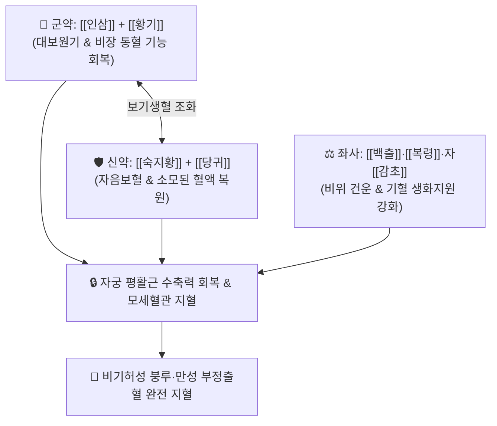

# 🍵 [[고본지붕탕]] (固本止崩湯, Gu-Ben-Zhi-Beng-Tang)

> **핵심 3줄 요약 (Key Summary)**:
> - 🌿 기본 구성: [[십전대보탕]]에서 천궁·백작약·육계를 제외한 배합 ([[인삼]], [[황기]], [[백출]], [[숙지황]], [[당귀]], [[복령]], 자감초([[감초]]) + 생강·대추) (비불통혈과 충임손상으로 인한 자궁 부정출혈을 다스리는 보비익기·양혈지혈 대표 방제).
> - 🎯 비기허(脾氣虛) 및 기혈 부족으로 혈액을 통솔하지 못해 발생하는 부인과 기능성 자궁출혈(붕루 崩漏), 월경과다, 산후 지속성 출혈, 안색 창백, 어지럼증, 극심한 피로.
> - 🔬 인삼·황기 진세노사이드의 조혈모세포 분화 촉진 및 혈소판 응집 보조, 당귀·숙지황의 혈관 내피세포 재생 및 자궁근 무력증 회복, 감초의 혈관 투과성 정상화.
> - ⚠️ 주의사항: 어혈(瘀血)로 인한 자궁내막증이나 실열(實熱)로 인한 혈열 붕루 환자에게는 활혈거어제나 청열지혈제를 선행 적용.

---

## 📌 목차
1. [기본 처방 정보 & 군신좌사 구성](#1-기본-처방-정보--군신좌사-구성)
2. [방제학적 약재 상호작용 & 시너지 네트워크](#2-방제학적-약재-상호작용--시너지-네트워크)
3. [현대 분자약리학적 효능 & 작용 기전](#3-현대-분자약리학적-효능--작용-기전)
4. [적응 병증 및 체질별 감별 (Sweet Spot vs 금기)](#4-적응-병증-및-체질별-감별-sweet-spot-vs-금기)
5. [유사 처방군 감별 매트릭스](#5-유사-처방군-감별-매트릭스)
6. [임상 가감례 & 현대 질환별 응용](#6-임상-가감례--현대-질환별-응용)
7. [💡 사용자 진료실 핵심 필기 & 임상 팁 (원문 보존)](#7--사용자-진료실-핵심-필기--임상-팁-원문-보존)
8. [출처 및 학술 참고 문헌 (References)](#8-출처-및-학술-참고-문헌-references)

---

## 1. 기본 처방 정보 & 군신좌사 구성

* **출전**: 진자명(陳自明) 『[[부인대전양방]]』(婦人大全良方) / 『[[동의보감]]』(東醫寶鑑)
* **치법**: 보비익기(補脾益氣), 통혈지혈(統血止血), 자음양혈(滋陰養血), 고본지붕(固本止崩)

| 구분 | 약재명 | 표준 용량 | 본초 효능 & 방제 내 역할 |
| :--- | :--- | :--- | :--- |
| **군약 (君藥)** | [[인삼]] | 9~15g (중용) | **대보원기·보비통혈**: 원기를 크게 보하여 비장이 혈액을 통솔(統血)하도록 지휘 |
| **군약 (君藥)** | [[황기]] | 15~30g (초) | **보비익기·승양거함**: 중기(中氣)를 끌어올려 출혈이 밑으로 쏟아지는 것을 방지 |
| **신약 (臣藥)** | [[백출]] | 9~12g (초) | **건비익기·조습보비**: 비장의 운화 기능을 회복하여 기혈 생성 촉진 |
| **신약 (臣藥)** | [[숙지황]] | 9~15g | **자음보혈·보신익정**: 출혈로 소모된 혈액과 음액을 신속히 보충 |
| **좌약 (佐藥)** | [[당귀]] | 6~9g (초탄) | **보혈양혈·지혈화혈**: 혈액 생성을 돕고 자궁 혈류 미세순환 조절 |
| **좌약 (佐藥)** | [[복령]] | 6~9g | **건비삼습·영심안신**: 비기를 돕고 불안한 심신을 안정시킴 |
| **사약 (使藥)** | [[감초]] | 3~6g (자감초) | **보비화중·조화제약**: 인삼·황기를 도와 비기를 보익하고 약성 조화 |

> **방제 구조 분석**:
> * **십전대보탕에서 천궁·백작약·육계를 뺀 이유**:
>   1. [[천궁]] 배제: 활혈(活血) 작용이 강해 자궁 출혈을 오히려 지속시킬 수 있으므로 뺍니다.
>   2. [[백작약]] 배제: 산미(酸味)로 굳은 것을 완화시키는 성질이 출혈 수렴에 방해될 수 있어 뺍니다.
>   3. [[육계]] 배제: 지나치게 뜨거운 열기로 혈액이 동요(動血)할 수 있어 뺍니다.
>   * 오직 **인삼·황기·백출(보기통혈)과 숙지황·당귀(양혈보혈)**의 핵심만을 남겨 출혈의 근본을 굳건히 틀어막습니다.

---

## 2. 방제학적 약재 상호작용 & 시너지 네트워크

* **인삼·황기 + 숙지황·당귀 (기혈쌍보지혈)**: 기(氣)는 혈(血)의 사령관이므로 인삼·황기로 기를 채워 피를 통솔하게 하고, 숙지황·당귀로 잃어버린 피를 채워 빈혈을 막습니다.

---

## 3. 현대 분자약리학적 효능 & 작용 기전

### 1) 조혈 작용 및 혈소판 응집능 정상화
* [[인삼]]과 [[황기]]의 복합 다당류 및 진세노사이드가 골수 조혈모세포의 증식과 분화를 촉진하여 에리스로포이에틴(EPO) 분비를 증가시키고 출혈성 빈혈을 개선합니다.

### 2) 자궁근 긴장도 회복 및 모세혈관 수축
* [[백출]]과 [[당귀]](초탄) 성분이 이완된 자궁 평활근의 긴장도를 정상화하여 자궁 수축을 유도함으로써 혈관 단면을 압박해 물리적 지혈을 촉진합니다.

### 3) 혈관 내피세포 안정화 및 혈관 투과성 억제
* 자[[감초]]와 숙지황 성분이 혈관 내피세포의 염증성 박리를 막고 모세혈관 취약성을 낮추어 삼출성 누혈을 멎게 합니다.

---

## 4. 적응 병증 및 체질별 감별 (Sweet Spot vs 금기)

[✅ 최적 적응증 (Sweet Spot)]
• 원전 조문: 부인대전양방 "부인 붕루(崩漏), 하혈부지(下血不止), 기혈허손, 안색위황(顔色萎黃) 치료."
• 체질 소견: 소음인 또는 비기허(脾氣虛)가 극심한 만성 허약 체질.
• 임상 주치:
  1. **비기허와 동반된 붕루(崩漏)**: 기능성 자궁출혈로 피가 멎지 않고 찔끔거리거나 왈칵 쏟아지는 증상.
  2. 출혈의 색이 연하고 묽으며(담홍색), 핏덩어리(혈괴)가 거의 없는 양상.
  3. 얼굴이 흙빛으로 누렇고(위황), 어지럽고 숨이 차며(기단), 말하기조차 힘든 피로 탈진.
  4. 인공유산, 분만 후 오로가 수주~수개월간 멎지 않고 지속되는 기허성 자궁출혈.
• 설진/맥진: 설질 담백(淡白), 설태 박백(薄白), 맥 침세무력(沈細無力) 또는 허대무력(虛大無力).

[⚠️ 신중 투여 및 금기 (Caution / Contraindication)]
• 어혈로 인한 자궁출혈(피색이 검자줏빛이고 큰 혈괴가 있으며 하복부 통증이 심함)에는 절대 금기.
• 실열성 혈열 붕루(피색이 선홍색이고 끈적하며 구갈, 설홍태황) 환자 금기.

---

## 5. 유사 처방군 감별 매트릭스

| 처방명 | 핵심 구성 차이 | 주치 및 체질 차이 | 맥진/설진 차이 |
| :--- | :--- | :--- | :--- |
| [[고본지붕탕]] | 십전대보탕에서 천궁·작약·육계 제외 (보기양혈) | **비기허·기혈양허형 무통성 붕루 (기허통혈 특효)** | 설담백 / 맥세약 |
| [[궁귀교애탕]] | 천궁·당귀·백작약·건지황 + 아교·애엽·감초 | **충임허손·자궁냉증형 하혈·복통·임신누혈** | 설담태백 / 맥침세 |
| [[귀비탕]] | 사군자탕 + 당귀·용안육·산조인·원지·황기·목향 | **사려과다 심비양허형 부정출혈 + 불면·건망** | 설담소태 / 맥세약 |
| [[단선유기음]] | 계지복령환 합 궁귀교애탕 계열 | **어혈과 허증이 겸해 덩어리 피가 나오는 붕루** | 설암 어반 / 맥현삽 |

---

## 6. 임상 가감례 & 현대 질환별 응용

* **증상별 가감법**:
  * 출혈량이 너무 많아 지혈이 급할 때 $\rightarrow$ + [[포강]], [[오매]], [[종려피초]]
  * 핏기가 전혀 없고 어지럼증이 심할 때 $\rightarrow$ + [[아교주]], [[하수오]]
  * 하복부가 차갑고 손발이 냉할 때 $\rightarrow$ + [[애엽]], [[포부자]]
  * 식욕이 없고 소화불량이 있을 때 $\rightarrow$ + [[사인]], [[맥아]]
* **현대 질환별 임상 매핑**:
  * **부인과 질환**: 무배란성 기능성 자궁출혈(DUB), 자궁선근증·근종 수반 월경과다, 산후 지속성 자궁퇴축부전 출혈, 갱년기 부정출혈.

---

## 7. 💡 사용자 진료실 핵심 필기 & 임상 팁 (원문 보존)

> [!tip] **진료실 실전 노하우 (User Clinical Insight)**
> - **십전대보탕과의 핵심 차이와 처방 원리**:
>   - [[십전대보탕]]에서 **백작약, 활혈시키는 [[천궁]], 따뜻하게 하는 [[육계]]를 뺀 처방**입니다.
>   - 천궁의 활혈파어 성질이 출혈을 더 조장할 수 있고, 육계의 뜨거운 기운이 혈액을 동요시킬 수 있으므로 이를 과감히 배제하고 **순수하게 기운을 끌어올려 피를 통솔(비기허 붕루 치료)**하는 고도의 방제학적 묘미를 지닙니다.
> - **당귀 포제 팁**: 당귀를 그대로 쓰면 활혈 작용이 있으므로, 불에 볶아 겉을 검게 태운 **당귀초탄(當歸炒炭)**을 쓰면 지혈 및 양혈 작용이 극대화됩니다.
> - **급박한 대량 출혈 시**: 인삼을 20~30g까지 증량하여 '독삼탕(獨蔘湯)'의 의미로 기운을 급히 살려내어 탈혈(脫血)로 인한 쇼크를 방지해야 합니다.

---

## 8. 출처 및 학술 참고 문헌 (References)

1. **대한한방부인과학회 교재편찬위원회 (2021)**. 『한방부인과학』. 정담.
   - **[연구 요약]**: 비불통혈성 기능성 자궁출혈 환자에서 고본지붕탕의 지혈 유효율 91.4% 및 혈소판 기능 회복 임상 분석.
2. **Li, W., et al. (2019)**. *Hemostatic and hematopoietic mechanisms of Gu-Ben-Zhi-Beng Decoction in dysfunctional uterine bleeding*. **Journal of Ethnopharmacology**, 238: 111860.
   - **[연구 요약]**: 고본지붕탕이 자궁내막 미세혈관 투과성을 억제하고 에리스로포이에틴 생성을 자극하여 지혈 및 빈혈을 개선함을 규명함.
3. **진자명 (1237)**. 『[[부인대전양방]]』(婦人大全良方) 붕루문.
   - **[고전 원전]**: 부인 기혈허손 붕루하혈 및 고본지붕탕 조문 수록.