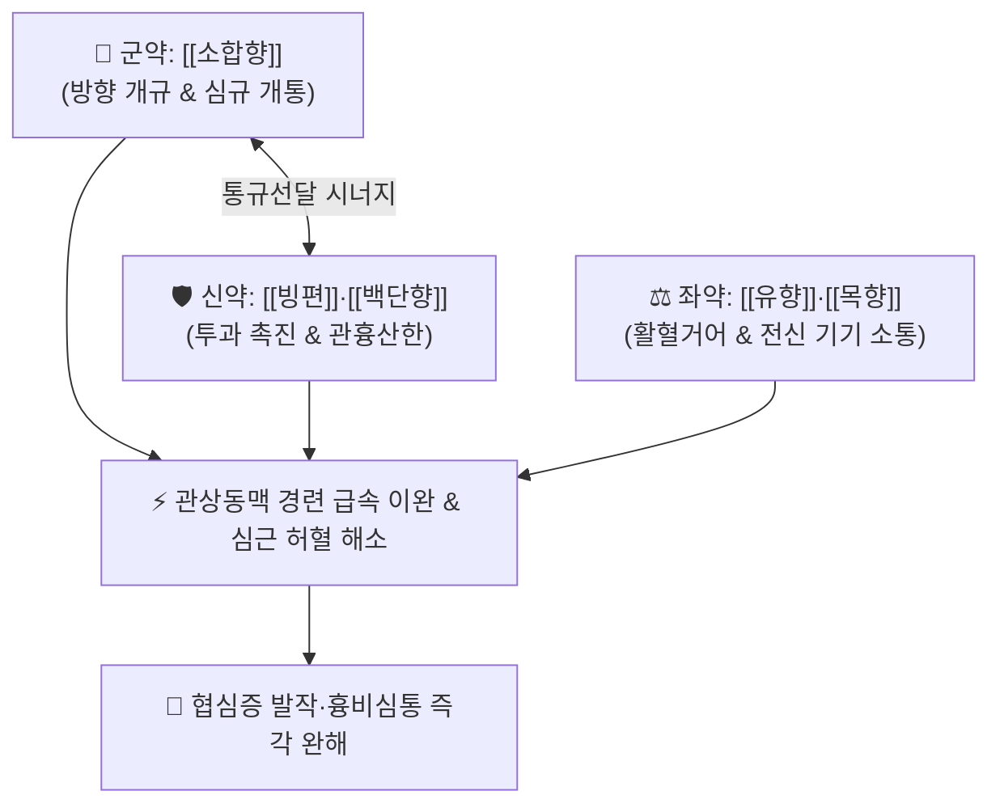

# 🍵 [[관심소합환]] (冠心蘇合丸, Guan-Xin-Su-He-Wan / Gwansimsohaphwan)

> **핵심 3줄 요약 (Key Summary)**:
> - 🌿 기본 구성: [[소합향]] (군), [[빙편]]·[[백단향]] (신), [[유향]]·[[목향]] (좌), 연밀 (사) (심기울체와 한응기체로 인한 급성 흉비 및 관상동맥 협심통을 응급 개통하는 온통개규·이기지통 대표 방제).
> - 🎯 관상동맥 경화성 심장질환(협심증), 심근허혈성 흉골 후면 압박통, 좌측 어깨·팔 방사통, 한랭 자극 또는 스트레스로 유발된 흉민(가슴 답답함) 및 급성 심통 발작.
> - 🔬 소합향 신남산의 혈소판 응집(TXA2) 억제, 빙편 보르네올(Borneol)의 혈관 내피 투과성 조절 및 급속 관상동맥 확장, 유향 보스웰릭산의 5-LOX 억제 및 혈관벽 항염증.
> - ⚠️ 주의사항: 강력한 방향개규 및 활혈제이므로 임산부, 뇌출혈 급성기 환자, 혈소판 감소증 환자에게는 절대 금기.

---

## 📌 목차
1. [기본 처방 정보 & 군신좌사 구성](#1-기본-처방-정보--군신좌사-구성)
2. [방제학적 약재 상호작용 & 시너지 네트워크](#2-방제학적-약재-상호작용--시너지-네트워크)
3. [현대 분자약리학적 효능 & 작용 기전](#3-현대-분자약리학적-효능--작용-기전)
4. [적응 병증 및 체질별 감별 (Sweet Spot vs 금기)](#4-적응-병증-및-체질별-감별-sweet-spot-vs-금기)
5. [유사 처방군 감별 매트릭스](#5-유사-처방군-감별-매트릭스)
6. [임상 가감례 & 현대 질환별 응용](#6-임상-가감례--현대-질환별-응용)
7. [💡 사용자 진료실 핵심 필기 & 임상 팁 (원문 보존)](#7--사용자-진료실-핵심-필기--임상-팁-원문-보존)
8. [출처 및 학술 참고 문헌 (References)](#8-출처-및-학술-참고-문헌-references)

---

## 1. 기본 처방 정보 & 군신좌사 구성

* **출전**: 『[[중국약전]]』(中國藥典) / 『[[태평혜민화제국방]]』(太平惠民和劑局方) 소합향원 현대화
* **치법**: 온통개규(溫通開竅), 이기지통(理氣止痛), 활혈산어(活血散瘀), 관흉벽예(寬胸闢穢)

| 구분 | 약재명 | 표준 용량 | 본초 효능 & 방제 내 역할 |
| :--- | :--- | :--- | :--- |
| **군약 (君藥)** | [[소합향]] | 1~2g (환제 50g 분량) | **방향개규·온통지통**: 심장 깊숙이 침투하여 닫힌 심규(心竅)를 열고 관상동맥 혈류 개통 |
| **신약 (臣藥)** | [[빙편]] | 1~2g (환제 50g 분량) | **통규산결·선통기혈**: 투과력이 뛰어나 막힌 혈맥을 즉시 소통시키고 통증 차단 |
| **신약 (臣藥)** | [[백단향]] | 2~4g (환제 100g 분량) | **온중이기·관흉산한**: 가슴과 명치의 차가운 응체 기운을 덥혀 풀어줌 |
| **좌약 (佐藥)** | [[유향]] | 2~4g (초, 환제 100g 분량) | **활혈거어·소종생근·지통**: 심혈관 미세혈류의 어혈을 풀고 혈관벽 염증 완화 |
| **좌약 (佐藥)** | [[목향]] | 2~4g (환제 100g 분량) | **행기지통·순기화위**: 흉복부의 전신 기기를 하향 순행시켜 횡격막 압박 해소 |
| **사약 (使藥)** | 연밀 (꿀) | 적량 | **조화제약·완화약성**: 고운 분말 약재를 뭉쳐 환을 짓고 약력을 완만히 지속시킴 |

> **본초 안전성 특수 메모**: 원방의 청목향(마두령과)은 아리스톨로크산 신독성 이슈로 인해 현대에는 국화과 정품 [[목향]](*Aucklandia lappa*)으로 전량 대체하여 제조합니다.

---

## 2. 방제학적 약재 상호작용 & 시너지 네트워크

* **소합향 + 빙편 (방향개규 최강 조합)**: 은은하고 묵직한 소합향과 날카롭고 빠른 빙편이 만나 닫힌 심장 혈맥을 수초~수분 내로 개통합니다.
* **유향 + 목향 (기혈동치)**: 기가 통하면 피가 돌고, 어혈이 풀리면 통증이 멎는(통즉불통 通則不痛) 원리로 심혈관 혈전을 예방합니다.

---

## 3. 현대 분자약리학적 효능 & 작용 기전

### 1) 관상동맥 확장 및 심근 관류압 증대
* [[소합향]]의 신남산(Cinnamic acid)과 [[빙편]]의 보르네올(Borneol)이 혈관 평활근 L-type 칼슘 통로를 차단하여 수축된 관상동맥을 즉시 확장시키고 허혈성 심근으로의 산소 공급을 재개합니다.

### 2) 혈소판 응집 억제 및 항혈전 작용
* 트롬복산 A2(TXA2) 생성을 억제하고 혈소판 막 당단백질 IIb/IIIa 복합체 활성화를 차단하여 관상동맥 내 미세혈전 폐색을 방지합니다.

### 3) 혈관벽 항염증 및 죽상경화반 안정화
* [[유향]]의 보스웰릭산(Boswellic acids)이 5-LOX 효소를 억제하여 류코트리엔 생성을 차단함으로써 죽상경화반의 염증성 파열 위험을 감소시킵니다.

---

## 4. 적응 병증 및 체질별 감별 (Sweet Spot vs 금기)

[✅ 최적 적응증 (Sweet Spot)]
• 원전 조문: 중국약전 "이기지통(理氣止痛), 온통개규(溫通開竅). 한응기체(寒凝氣滯), 심기울결로 인한 흉민심통, 관상동맥질환 협심증 치료."
• 체질 소견: 평소 혈관 질환이나 스트레스가 많은 태음인, 소음인.
• 임상 주치:
  1. **관상동맥 협심증 급성 발작**: 흉골 후면에 쥐어짜는 듯한 압박통, 좌측 어깨·팔·턱으로 방사되는 심통.
  2. 한랭 노출이나 찬바람을 맞은 뒤 갑자기 가슴이 조여오며 숨이 차는 증상(변이형 협심증).
  3. 극심한 스트레스 후 발생하는 흉민(가슴 답답함), 심계항진, 호흡 곤란.
• 설진/맥진: 설질 자암(紫暗) 또는 어반(瘀斑), 설태 박백(薄白), 맥 침현(沈弦) 또는 결대(結代).

[⚠️ 신중 투여 및 금기 (Caution / Contraindication)]
• 뇌출혈, 위장관 궤양 출혈 등 출혈성 질환자 및 임산부에게는 절대 금기.
• 심근경색(ST절 상승 등) 초응급 상황에서는 지체 없이 응급실 후송 조치.

---

## 5. 유사 처방군 감별 매트릭스

| 처방명 | 핵심 구성 차이 | 주치 및 체질 차이 | 맥진/설진 차이 |
| :--- | :--- | :--- | :--- |
| [[관심소합환]] | 소합향·빙편·백단향·유향·목향 (환제) | **급성 협심증 흉비심통·관상동맥 경련 (온통개규 응급)** | 설자암 / 맥침현결대 |
| [[소합향원]] | 소합향·빙편·사향·안식향·침향 등 15미 | **중풍 혼미, 한사로 인한 의식 혼탁 (중추신경 개규)** | 설태 백니 / 맥침복 |
| [[단삼음]] | 단삼 + 사인 + 백단향 | **만성적인 심비혈어형 흉통·위완통 (온화한 활혈이기)** | 설암 / 맥현 |
| [[지실해백계지탕]] | 지실·해백·계지·후박·과루실 | **흉양부전(胸陽不振)형 만성 흉비·배통 (통양산결)** | 설태 백니 / 맥침지 |

---

## 6. 임상 가감례 & 현대 질환별 응용

* **증상별 가감법**:
  * 심혈관 어혈이 극심하여 통증 부위가 칼로 찌르듯 고정될 때 $\rightarrow$ + [[삼칠근]] 분말 합방
  * 기허로 숨이 차고 땀이 날 때 $\rightarrow$ + [[인삼]], [[황기]]
  * 가슴 답답함과 담음이 심할 때 $\rightarrow$ + [[과루인]], [[해백]]
* **현대 질환별 임상 매핑**:
  * **순환기내과**: 안정형·불안정형 협심증, 변이형 협심증(관상동맥 연축), 심장 신경증.

---

## 7. 💡 사용자 진료실 핵심 필기 & 임상 팁 (원문 보존)

> [!tip] **진료실 실전 노하우 (User Clinical Insight)**
> - **설하(舌下) 복용법 (초고속 흡수)**: 급성 흉통 발작 시 환제를 씹어서 삼키기보다 혀 밑에 물고 녹이거나(설하 투여) 미온수 소량과 함께 씹어서 복용하면 구강 점막 혈관을 통해 1~3분 내에 관상동맥이 확장됩니다 (양방 니트로글리세린 유사 효과).
> - **청목향 대체 필수**: 과거 원방의 청목향은 신독성(아리스톨로크산) 문제가 있으므로, 반드시 정품 [[목향]]으로 조제된 제제를 사용해야 안전합니다.
> - **휴대용 비상 상비약**: 협심증 기저 질환자에게 항상 소지하게 하여 찬바람을 쐬거나 가슴이 조여올 때 즉시 1환(1회 1환, 1일 1~2회) 복용하도록 티칭합니다.

---

## 8. 출처 및 학술 참고 문헌 (References)

1. * **Wang M et al. (2021)**. Identification of Potential Bioactive Ingredients and Mechanisms of the Guanxin Suhe Pill on Angina Pectoris by Integrating Network Pharmacology and Molecular Docking. *Evidence-based complementary and alternative medicine : eCAM*, 2021: 4280482. [PMID: 34422068](https://pubmed.ncbi.nlm.nih.gov/34422068/)
2. * **Han Z et al. (2026)**. Promoting Effect of (+)-Borneol on Alzheimer's Disease Treatment in APP Transgenic Zebrafish and Its Blood-Brain Barrier Permeation Mechanism. *Molecular neurobiology*, 63: . [PMID: 42668348](https://pubmed.ncbi.nlm.nih.gov/42668348/)
3. **국가약전위원회 (2020)**. 『[[중국약전]]』(中國藥典).
   - **[임상 문헌]**: 관심소합환 제법, 품질 규격 및 협심증 주치 수록.
