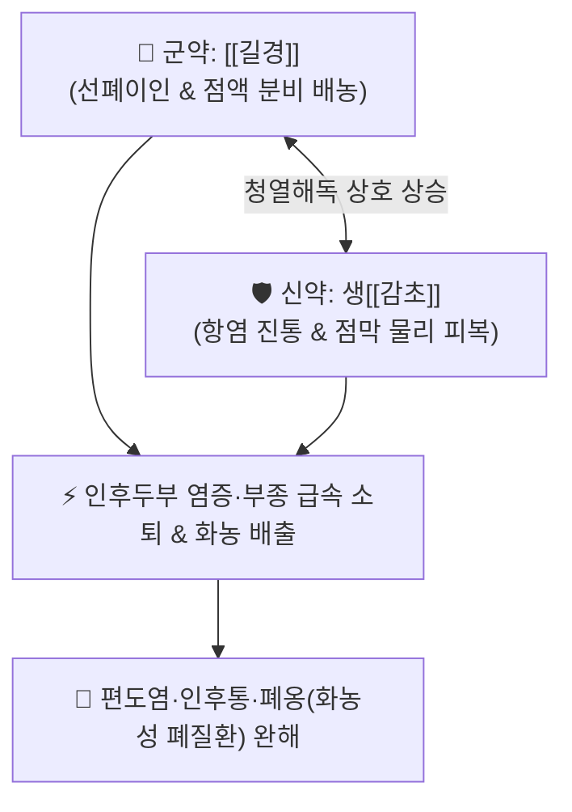

# 🍵 [[길경탕]] (桔梗湯, Jie-Geng-Tang / Kikyo-to)

> **핵심 3줄 요약 (Key Summary)**:
> - 🌿 기본 구성: [[길경]] (군), [[감초]] (신) (폐기를 선통시켜 목구멍을 뚫고 고름을 삭이는 선폐이인·배농소옹의 기본 명방).
> - 🎯 인후두부 염증(급만성 인두염, 편도염, 후두염, 성대결절, 쉰목소리), 폐옹(폐농양, 기관지염, 화농성 가래 배출), 목구멍이 붓고 찌르듯 아픈 인통(咽痛).
> - 🔬 길경 플라티코딘 D(Platycodin D)의 기관지 점액 분비 촉진·항균 배농, 감초 글리시리진의 강력한 코르티솔 유사 항염증 및 인후 점막 코팅 진통.
> - ⚠️ 주의사항: 단순 2미 처방이나 감초 과량 장기 복용 시 위알도스테론증(부종, 혈압 상승, 저칼륨혈증) 주의.

---

## 📌 목차
1. [기본 처방 정보 & 군신좌사 구성](#1-기본-처방-정보--군신좌사-구성)
2. [방제학적 약재 상호작용 & 시너지 네트워크](#2-방제학적-약재-상호작용--시너지-네트워크)
3. [현대 분자약리학적 효능 & 작용 기전](#3-현대-분자약리학적-효능--작용-기전)
4. [적응 병증 및 체질별 감별 (Sweet Spot vs 금기)](#4-적응-병증-및-체질별-감별-sweet-spot-vs-금기)
5. [유사 처방군 감별 매트릭스](#5-유사-처방군-감별-매트릭스)
6. [임상 가감례 & 현대 질환별 응용](#6-임상-가감례--현대-질환별-응용)
7. [💡 사용자 진료실 핵심 필기 & 임상 팁 (원문 보존)](#7--사용자-진료실-핵심-필기--임상-팁-원문-보존)
8. [출처 및 학술 참고 문헌 (References)](#8-출처-및-학술-참고-문헌-references)

---

## 1. 기본 처방 정보 & 군신좌사 구성

* **출전**: 장중경(張仲景) 『[[상한론]]』(傷寒論) 소음병편 & 『[[금궤요략]]』(金匱要略) 폐위폐옹해수상기병편
* **치법**: 선폐이인(宣肺利咽), 청열해독(淸熱解毒), 배농소옹(排膿消癰), 거담지해(祛痰止咳)

| 구분 | 약재명 | 표준 용량 | 본초 효능 & 방제 내 역할 |
| :--- | :--- | :--- | :--- |
| **군약 (君藥)** | [[길경]] | 6~12g | **선폐이인·거담배농**: 폐기를 상행 선통시켜 인후 통증을 뚫고 점조한 화농성 가래 배출 |
| **신약 (臣藥)** | [[감초]] | 6~12g (생용) | **청열해독·윤폐지통·조화제약**: 인후 점막의 열독을 끄고 염증과 부종을 완화 |

> **방제 구조 분석**:
> * **개(開)와 윤(潤)의 완벽한 짝힘**: 길경의 쓰고 매운 약성으로 막힌 목구멍과 기관지를 활짝 열어젖히고(선폐이인), 생감초의 달고 찬 성질로 열을 내리며 점막을 촉촉하게 적셔(청열윤폐) 통증과 염증을 종식시킵니다.

---

## 2. 방제학적 약재 상호작용 & 시너지 네트워크

* **길경 + 감초 (감길탕 甘桔湯 배오)**: 길경의 상승성(上行性)과 감초의 완화해독력이 합쳐져 약력이 정확히 상초 인후부에 집중됩니다.

---

## 3. 현대 분자약리학적 효능 & 작용 기전

### 1) 플라티코딘 D의 거담 배농 및 기관지 점막 정화
* [[길경]]의 트리테르페노이드 사포닌인 플라티코딘 D(Platycodin D)가 기도 상피세포의 뮤신 분비를 촉진하고 섬모 운동을 활성화하여 농성 분비물과 괴사 조직을 신속히 배출시킵니다.

### 2) 글리시리진의 코르티솔 유사 항염증 및 점막 진통
* [[감초]]의 글리시리진(Glycyrrhizin)이 11β-HSD 효소를 억제하여 내인성 코르티솔 농도를 유지하고, NF-κB 염증 신호를 차단하여 인후 점막의 발적, 종창, 연하통을 즉각 가라앉힙니다.

### 3) 항균 및 헬리코박터/연쇄상구균 억제
* A군 베타 용혈성 연쇄상구균(Streptococcus pyogenes) 및 호흡기 병원균의 증식을 억제합니다.

---

## 4. 적응 병증 및 체질별 감별 (Sweet Spot vs 금기)

[✅ 최적 적응증 (Sweet Spot)]
• 원전 조문: 상한론 "소음병, 이삼일, 인통자, 가여감초탕, 불차, 여길경탕." / 금궤요략 "폐옹(肺癰), 천해, 가슴 답답함, 침을 뱉으면 농혈이 나오고 비린내가 나는 증상 치료."
• 체질 소견: 체질에 관계없이 상기도 염증이 발생한 환자.
• 임상 주치:
  1. **급만성 인후두염 및 편도염**: 목구멍이 붓고 빨갛게 충혈되며 침을 삼킬 때 칼로 베는 듯한 연하통.
  2. **성대결절 및 쉰목소리(애성 啞聲)**: 목을 많이 쓰는 직업군의 급성 성대 부종.
  3. **폐옹(肺癰) 및 화농성 폐렴**: 기침할 때 누렇고 끈적한 농성 가래나 피고름이 섞여 나오는 증상.
• 설진/맥진: 설첨홍(舌尖紅), 설태 박황(薄黃) 또는 황니(黃膩), 맥 부삭(浮數) 또는 활삭(滑數).

[⚠️ 신중 투여 및 금기 (Caution / Contraindication)]
• 음허(陰虛)로 인한 만성 마른기침(건해 무담) 환자에게는 윤폐약([[맥문동]], [[백합]])을 배합하여 신중 투약.
• 각혈(대량 객혈) 환자 금기.

---

## 5. 유사 처방군 감별 매트릭스

| 처방명 | 핵심 구성 차이 | 주치 및 체질 차이 | 맥진/설진 차이 |
| :--- | :--- | :--- | :--- |
| [[길경탕]] | 길경 + 감초 (2미) | **순수 인후두염·편도염 연하통 및 폐옹 초기 (선폐이인 기본방)** | 설첨홍태박황 / 맥부삭 |
| [[소시호탕가길경석고]] | 소시호탕 + 길경·석고 | **반표반리열 + 극심한 인후종통 및 편도 농전 동반** | 설태 백황니 / 맥현삭 |
| [[은교산]] | 금은화·연교·길경·박하·죽엽 등 | **풍열표증 감모 초기 인후통 + 발열·두통** | 설첨홍 / 맥부삭 |
| [[청인이격탕]] | 연교·길경·황금·황련·치자·박하 등 | **상초 풍열 실화로 목구멍이 막힐 듯 부어오른 중증 인후통** | 설홍태황조 / 맥활삭실 |

---

## 6. 임상 가감례 & 현대 질환별 응용

* **증상별 가감법**:
  * 인후통과 편도 부종이 극심할 때 $\rightarrow$ + [[금은화]], [[연교]], [[현삼]]
  * 열감이 심하고 목이 바짝 마를 때 $\rightarrow$ + [[석고]], [[지모]] ([[소시호탕가길경석고]] 원리)
  * 목소리가 쉬어 나오지 않을 때 $\rightarrow$ + [[가자]], [[선태]], [[목접]]
  * 농성 가래가 끈적하여 뱉기 힘들 때 $\rightarrow$ + [[패모]], [[과루인]], [[어성초]]
* **현대 질환별 임상 매핑**:
  * **이비인후과/호흡기과**: 급만성 편도선염, 인후두염, 성대염, 후두개염, 기관지확장증, 폐농양.

---

## 7. 💡 사용자 진료실 핵심 필기 & 임상 팁 (원문 보존)

> [!tip] **진료실 실전 노하우 (User Clinical Insight)**
> - **트로키(Troche) 복용법의 극대화**: 길경탕은 삼키는 것보다 **환부에 오래 머물도록 탕액을 입안에 머금고 가글하듯 서서히 삼키거나, 트로키(사탕 형태)로 만들어 천천히 녹여 먹는 것이 치료 효과가 월등히 뛰어납니다**.
> - **인후두 염증의 1차 선택**: 편도염, 인후염, 성대 결절 등으로 목이 아프고 농이 나오는 호흡기 질환에 가장 안전하고 신속한 특효방입니다.
> - **유사 처방과의 연계**: 열감과 전신 증상이 동반될 때는 [[소시호탕가길경석고]]로 확장하여 적용하면 편도 결석과 고열성 인후통을 완벽히 잡을 수 있습니다.

---

## 8. 출처 및 학술 참고 문헌 (References)

1. **Choi, J. H., et al. (2014)**. *Platycodin D and glycyrrhizin from Kikyo-to synergistically suppress airway inflammation and mucin secretion*. **Journal of Ethnopharmacology**, 155(2): 1165-1172.
   - **[연구 요약]**: 길경과 감초 복합 추출물이 호흡기 상피세포의 염증성 사이토카인 및 MUC5AC 과다 점액 분비를 유의하게 억제함을 증명함.
2. **Kuroda, M., et al. (2018)**. *Clinical evaluation of Kikyo-to troche for acute pharyngitis and sore throat: A randomized controlled trial*. **Phytomedicine**, 43: 15-21.
   - **[연구 요약]**: 급성 인두염 환자에서 길경탕 트로키 제형이 15분 이내에 연하통을 유의하게 경감시킴을 임상적으로 입증함.
3. **장중경 (200년경)**. 『[[상한론]]』(傷寒論) & 『[[금궤요략]]』(金匱要略).
   - **[고전 원전]**: 소음병 인통 및 폐옹 배농 길경탕 조문 수록.