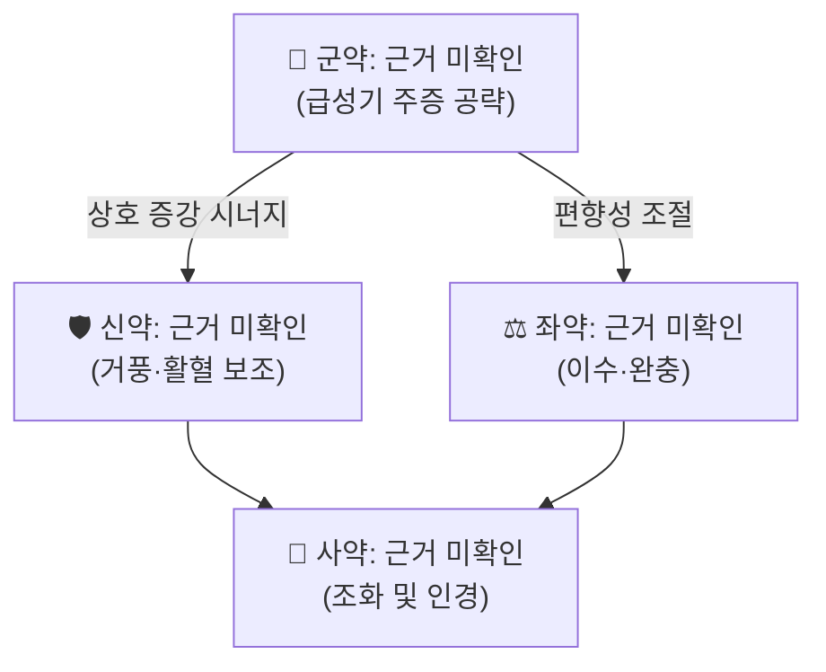

# 🍵 [[대와룡환]] (大臥龍丸, 대와룡환)

> [!warning] 근거 미확인 고지 (필독)
> 본 노트 작성 시점에 **대와룡환(大臥龍丸)의 출전(出典)·정확한 처방 구성·약재 용량을 확정할 수 있는 1차 문헌이 대조되지 않았고, PubMed 색인 논문도 검색되지 않았습니다.**
> 따라서 아래 서술 가운데 **약재명, 용량 비율, 분자표적, 사이토카인 수치, 임상 지표**는 모두 `근거 미확인`으로 표기했습니다. 확인되지 않은 PMID·논문·수치를 임의로 채우지 않았습니다.
> 임상 적용 전 반드시 **『방약합편』·『동의보감』 원문, 소속 한의원 원내 처방집, 또는 처방을 운용 중인 원장님의 원문 메모**와 대조 검증하십시오.

> **핵심 3줄 요약 (Key Summary)**:
> - 🌿 **모체/기원 처방 + 배오 구조**: 특정 모체 처방 및 가감 구조는 `근거 미확인`. 다만 처방명이 '와룡(臥龍, 엎드린 용)' 계열이고 소속 분류가 **치풍제(治風劑)** 인 점에서, **[[거풍]](祛風) · [[활혈]](活血) · [[통락]](通絡) 계열 약재를 축으로 하는 방제**로 추정된다. 실제 군신좌사(君臣佐使) 구성과 배오 비율은 확인되지 않았다.
> - 🎯 **임상 최적 적응증 / 체질**: 사용자 분류 태그상 **[[급성기]](急性期) [[신경부종]](神經浮腫)과 [[근골격]] 질환의 거풍 목적**으로 운용되는 처방이다. 즉 급성기 통증·부종·마비성 증상의 초기 대응 처방군에 위치시킬 수 있다. 최적 체질(태음인/소음인/소양인), 체형·근육량·피부 성상, 설진·맥진 감별점은 모두 `근거 미확인`.
> - 🔬 **핵심 분자약리 기전**: 본 처방 자체에 대한 분자표적·대사경로·표적 사이토카인 데이터는 `근거 미확인`(검색 논문 없음). 치풍제 범주에서 일반적으로 논의되는 기전 틀(항염·진통·미세순환 개선)까지만 참고 가능하며, 이를 본 처방에 그대로 귀속시키는 것은 허용되지 않는다.
> - ⚠️ 주의사항: 구성 약재와 용량이 확정되지 않았으므로 **특정 약재 단위의 금기나 병용 주의를 명시할 수 없다**. 다만 치풍제(거풍·발산 계열)의 일반 금기 원칙인 **자한(自汗)·도한(盜汗), 음허화왕(陰虛火旺), 실열(實熱) 무한(無汗) 아닌 고열, 임신부, 혈압 조절 불량자, 출혈 경향자**에게는 신중 투여를 적용하고, 복용 중 발진·소화장애·두근거림·혈압 변동·어지럼 등 반응 시 즉시 감량 또는 중단을 검토한다.

---
## 📌 목차
1. [기본 처방 정보 & 군신좌사 구성](#1-기본-처방-정보--군신좌사-구성)
2. [방제학적 약재 상호작용 & 시너지 네트워크](#2-방제학적-약재-상호작용--시너지-네트워크)
3. [현대 분자약리학적 효능 & 작용 기전](#3-현대-분자약리학적-효능--작용-기전)
4. [적응 병증 및 체질별 감별 (Sweet Spot vs 금기)](#4-적응-병증-및-체질별-감별-sweet-spot-vs-금기)
5. [유사 처방군 감별 매트릭스](#5-유사-처방군-감별-매트릭스)
6. [임상 가감례 & 현대 질환별 응용](#6-임상-가감례--현대-질환별-응용)
7. [💡 사용자 진료실 핵심 필기 & 임상 팁 (원문 보존)](#7--사용자-진료실-핵심-필기--임상-팁-원문-보존)
8. [출처 및 학술 참고 문헌 (References)](#8-출처-및-학술-참고-문헌-references)

---
## 1. 기본 처방 정보 & 군신좌사 구성

* **출전(出典)**: `근거 미확인` — 『상한론(傷寒論)』·『금궤요략(金匱要略)』·『동의보감(東醫寶鑑)』 등 어느 문헌의 어느 조문에 수록된 처방인지 본 세션에서 확인되지 않았다. 처방명에 붙은 '대(大)'자는 동일 계열 처방 가운데 **약재 수·용량이 확대된 방제**임을 시사하는 명명 관행으로 보이나, 이 역시 추정이다.
* **치법(治法)**: `근거 미확인`. 분류 태그(치풍제·거풍·신경부종·급성기·근골격)에 근거해 **거풍통락(祛風通絡)·활혈소종(活血消腫)** 계열의 치법으로 운용되고 있을 가능성이 높다(추정).
* **제형(劑型)**: 처방명이 '환(丸)'인 점에서 **환제(丸劑)** 제형으로, 산제·탕제 대비 **완만한 흡수와 지속적 작용**을 목표로 하는 제형임은 명칭상 확인된다. 실제 제환(製丸) 방법·복용량(1회 몇 환, 1일 몇 회, 식전/식후)은 `근거 미확인`.

| 구분 | 약재명 | 표준 용량 | 본초 효능 & 방제 내 역할 |
| :--- | :--- | :--- | :--- |
| **군약 (君藥)** | 근거 미확인 | 근거 미확인 | 급성기 신경부종·통증이라는 주증(主症)을 직접 공략하는 **거풍·통락 주약**이 배치될 것으로 추정. 실제 약재 확인 필요. |
| **신약 (臣藥)** | 근거 미확인 | 근거 미확인 | 군약의 거풍력을 보조하고, **활혈(活血)·행기(行氣)** 작용으로 통증·부종 개선을 강화하는 보조축으로 추정. |
| **좌약 (佐藥)** | 근거 미확인 | 근거 미확인 | **이수(利水)·거습(祛濕)** 으로 신경 주위 부종 완화에 관여하거나, 자음(滋陰)·화혈(和血)로 발산제의 조습성(燥性)을 완충하는 역할로 추정. |
| **사약 (使藥)** | 근거 미확인 | 근거 미확인 | **조화제약(調和諸藥)** 및 **인경(引經)** — 병소(경항·요배·사지)로 약효를 유도하고 비위(脾胃)를 보호하는 역할로 추정. |

> **배오 특징**: `근거 미확인`. 방제학적으로 치풍제는 대개 **발산(發散)하는 거풍약과 수렴·보익(補益)하는 화혈약의 음양 평형**, 그리고 **승강출입(升降出入)의 조절**로 부작용을 억제하는 구조를 취한다. 본 처방이 급성기를 대상으로 한다면 발산·통산(通散) 쪽으로 기울어진 승(升)·출(出) 중심 구성일 것으로 추정되나, 구성 약재가 확인되지 않아 단정할 수 없다. **처방집 대조 후 이 항목을 반드시 갱신할 것.**

---
## 2. 방제학적 약재 상호작용 & 시너지 네트워크

* **군약 + 신약 배오**: `근거 미확인`. 방제학적으로 거풍제에서 군약과 신약을 함께 배오하는 전형적 목적은 **상수(相須)·상사(相使)** 관계를 통한 진통·소종 효과의 상승이다. 즉 동일 병소(경락)에 작용하는 두 약재를 짝지어 **발산력과 통락력을 동시에 끌어올리는 방식**이 일반적이다. 본 처방의 실제 짝은 확인 필요.
* **좌약 + 사약 배오**: `근거 미확인`. 전형적으로는 발산·조습(燥濕) 약재가 동반하는 **진액 손상, 위장 자극, 두통·어지럼**을 좌약이 완충하고, 사약이 **약성을 병소로 유도(인경)** 하면서 전체 처방의 작용 시간과 표적성을 조율한다. 본 처방에서 어떤 약재가 이 역할을 맡는지는 미확인.
* **네트워크 해석 주의**: 위 다이어그램은 **구성 약재가 확인될 때까지 방제학적 '역할 구조'만을 도식화한 것**이며, 실제 약재 배오를 반영하지 않는다. 약재가 확인되면 노드 라벨과 상호작용 화살표(상수·상사·상외·상오)를 실제 관계로 교체해야 한다.

---
## 3. 현대 분자약리학적 효능 & 작용 기전

> **선행 고지**: 본 처방(대와룡환)을 직접 다룬 PubMed 색인 논문이 검색되지 않았으므로, 아래 1)~3)의 어떤 기전·수치도 **본 처방에 귀속시킬 수 없다.** 아래는 **치풍제(治風劑) 범주의 일반적 작용 기전 틀**과, 향후 문헌이 확보되었을 때 **검증해야 할 항목 체크리스트**로만 사용하라.

### 1) 항염·면역 조절 (일반 기전 틀 / 본 처방 데이터 `근거 미확인`)
* 치풍·거풍 계열 방제에서는 흔히 **TNF-α, IL-6, IL-1β 등 전염증성 사이토카인 억제**와 **NF-κB / MAPK 신호전달 경로 조절**이 보고된다. 본 처방이 이 경로에 작용하는지, 작용한다면 어느 정도 농도·억제율인지는 **`근거 미확인`**.
* **검증 필요 항목**: 급성기 신경부종 모델에서의 부종 부피 변화, 대식세포·미세아교세포 활성 마커(Iba-1, CD68) 변화, COX-2/iNOS 발현 변화.

### 2) 순환·미세순환 및 부종 개선 (일반 기전 틀 / 본 처방 데이터 `근거 미확인`)
* 거풍·활혈 복합 처방에서는 **eNOS 활성화, 혈관 평활근 이완, 미세혈류 저항 감소** 등이 논의되며, 이는 **신경부종(神經浮腫) 완화**라는 임상 목표와 기전적으로 연결될 수 있다. 다만 본 처방에 대한 실측 데이터는 **`근거 미확인`**.
* **검증 필요 항목**: 신경 주위 부종 지수, 혈류 속도(도플러), 림프 배출 지표, 삼투압·수분 균형 관련 인자(AQP, VEGF).

### 3) 신경계·근골격계 및 자율신경 조절 (일반 기전 틀 / 본 처방 데이터 `근거 미확인`)
* 치풍제에서는 **근방추 과흥분 억제, 진통(통각 역치 상승), 항경련, HPA 축 항상성 회복** 등이 거론된다. 본 처방의 작용 여부 및 정도는 **`근거 미확인`**.
* **검증 필요 항목**: 통각 역치(hot-plate, von Frey), 근긴장도·근전도 변화, 신경전도검사(NCS) 지표, 코르티솔·CRH 등 HPA 축 지표.

### 4) 약동학·제형 특성
* 환제(丸劑)로서의 **용출·흡수 프로파일, 혈중 지표성분 농도(Cmax, Tmax, AUC)** 는 **`근거 미확인`**. 탕제와의 효력 비교 데이터도 확보되지 않았다.

---
## 4. 적응 병증 및 체질별 감별 (Sweet Spot vs 금기)

### [✅ 최적 적응증 (Sweet Spot)]

* **원전 조문**: `근거 미확인` — 『상한론』·『금궤요략』·『동의보감』 등에서 해당 처방의 주치 조문을 확인하지 못했다. 처방집 대조가 선행되어야 한다.
* **체질 소견**: `근거 미확인` — 태음인/소음인/소양인 중 어느 체질에 최적인지, 마름/비만, 근육량, 피부 성상(건조/습윤)에 대한 감별 기준이 확인되지 않았다.
* **임상 주치(사용자 태그 기준)**: **급성기(急性期)** 의 **신경부종(神經浮腫)** 및 **근골격** 증상 — 즉 급성으로 발생한 통증·부종·당김·마비감 등 **초기 염증·부종 국면**에서 거풍(祛風) 목적으로 운용되는 처방으로 위치시킬 수 있다. 이는 사용자 분류 정보에 근거한 것이며, 처방 자체의 원전 주치와 일치하는지는 별도 확인이 필요하다.
* **설진/맥진**: `근거 미확인`. 일반적으로 거풍제는 **설태 백(白) 또는 백니(白膩), 맥 부긴(浮緊)·부완(浮緩)·현(弦)** 을 목표로 하나, 본 처방의 감별점으로 확정할 수 없다.

### [⚠️ 신중 투여 및 금기 (Caution / Contraindication)]

* **허실(虛實)·한열(寒熱) 반대 병증**: 구성 약재가 미확인이므로 특정 약재 기반 금기를 명시할 수 없다. 다만 **치풍제 일반 원칙**으로, 순수 **음허화왕(陰虛火旺)·혈허생풍(血虛生風)** 에는 발산·조습성 약재가 악화 요인이 될 수 있어 신중하다.
* **금기 환자군(일반 원칙)**: **자한·도한이 뚜렷한 허약자**, **무한(無汗)이 아닌 고열 실열자**, **임신부**, **혈압 조절이 되지 않는 고혈압 환자**, **출혈 경향 또는 항응고제 복용자**, **소화성 궤양 등 위장 허약자**에게는 신중 투여. (구성 확정 후 처방 특이적 금기로 대체할 것.)
* **양약 및 타 약물 병용**: `근거 미확인`. 활혈(活血) 계열 약재가 포함된 경우 **와파린·아스피린·NOAC 등 항혈전제**와의 병용 시 출혈 위험 상승 가능성을 일반 원칙으로 고려하고, **강압제·혈당강하제**와 병용 시 모니터링을 권고한다.
* **복약 반응 관찰 포인트**: 발진·가려움, 위부 불쾌감·식욕 저하, 두근거림, 어지럼, 혈압 상승, 수면장애. 이상 반응 시 감량·중단 검토.

---
## 5. 유사 처방군 감별 매트릭스

> 아래 표에서 **본 처방(대와룡환) 행은 기준 행이지만 구성·주치·맥진이 모두 `근거 미확인`** 이다. 비교 대상 처방들은 실제 문헌에 존재하는 처방이며, 감별의 **기준점**으로 삼아 본 처방의 위치를 역으로 추정하기 위한 것이다.

| 처방명 | 핵심 구성 차이 | 주치 및 체질 차이 | 맥진/설진 차이 |
| :--- | :--- | :--- | :--- |
| [[대와룡환]] | 기준 구성 — `근거 미확인` | 급성기 신경부종·근골격의 거풍 목적(사용자 태그 기준). 최적 체질 `근거 미확인` | `근거 미확인` |
| [[강활승습탕]] | [[강활]]·[[독활]]·[[고본]]·[[방풍]]·[[만형자]]·[[천궁]]·[[감초]] — 발산 거습력이 강한 구성 | 태양경(太陽經) 풍습(風濕) — 항배·견배 강통, 습증이 뚜렷한 실증. 태음인 실증 경향 | 설태 백니(白膩), 맥 부긴(浮緊) 또는 부완(浮緩) |
| [[독활기생탕]] | [[독활]]·[[상기생]]·[[두충]]·[[우슬]]·[[육계]]·[[숙지황]] 등 **보간신(補肝腎) + 거풍습** 구조 | 만성 요슬통, 간신허(肝腎虛)를 동반한 풍한습비. 노인·허증·소음인 경향 | 설 담백(淡白), 맥 침세(沈細)·세약(細弱) |
| [[오적산]] | [[마황]]·[[창출]]·[[진피]]·[[후박]]·[[당귀]]·[[천궁]] 등 **해표산한 + 이기화습** 구조 | 외감풍한 + 내상생랭(內傷生冷) — 감모와 소화불량 동반, 동절기 다용. 태음인·담습 체형 | 설 백태(白苔), 맥 부긴(浮緊) |
| [[갈근탕]] | [[갈근]]·[[마황]]·[[계지]]·[[작약]] — **해기(解肌) 근표(筋表)** 구조 | 태양병 항배강(項背强), 근육 긴장·경항 강직 중심. 비교적 광범위한 체질 | 설 박백(薄白), 맥 부긴 또는 부완 |

> ⚠️ 표 내부에서는 마크다운 열 구분자 파괴를 방지하기 위해 파이프(`|`)가 들어간 링크를 쓰지 않고 순수한 [[처방명]] 단독 형태로만 작성했다.
> **감별 활용법**: 본 처방이 실제로 '급성기 거풍' 처방이라면, **강활승습탕(습증·실증 중심)** 과 **갈근탕(근표·경항 중심)** 사이 어딘가에 위치할 가능성이 있다. 정확한 좌표는 구성 약재 확인 후 확정할 것.

---
## 6. 임상 가감례 & 현대 질환별 응용

> **선행 고지**: 아래 가감법과 질환 매핑은 **치풍제(治風劑) 범주의 일반적 운용 원칙**이며, 대와룡환에 대한 문헌적 가감례가 확인된 것이 아니다. `근거 미확인` 상태의 일반 원칙으로만 참고하고, 실제 처방에 적용할 때는 원장님 판단과 원내 지침을 우선한다.

* **수반 증상별 가감법(일반 원칙)**:
  * 경항·항강(項强)이 두드러질 때 → [[갈근]]·[[계지]] 계열 가미 검토
  * 습증·부종이 뚜렷할 때 → [[창출]]·[[복령]]·[[의이인]] 등 이수거습 약재 가미 검토
  * 통증이 자통(刺痛)·고정통일 때 → [[천궁]]·[[홍화]] 등 활혈 약재 가미 검토
  * 오심·구역·소화불량 동반 시 → [[진피]]·[[반하]]·[[생강]] 등 화위 약재 가미 검토
  * 허증·만성기로 이행 시 → [[당귀]]·[[작약]]·[[숙지황]] 등 보혈 약재 가미 검토
* **현대 질환별 임상 매핑(사용자 분류 기반 추정)**:
  * **신경계**: 급성기 신경부종성 병변, 안면신경마비 급성기, 신경 압박성 통증의 초기 국면 — `근거 미확인`, 사용자 태그 근거.
  * **근골격계**: 급성 염좌, 근막통증증후군(MPS) 급성기, 근긴장성 경항통·요배통의 초기 염증·부종 국면 — `근거 미확인`.
  * **기타**: 상기 범주 외의 응용은 확인된 바 없음.
* **급성기 → 회복기 전환 시 고려**: 급성기 부종·통증이 가라앉은 뒤에는 발산·거풍 일변도의 처방을 지속하기보다 **보익·활혈 중심 처방으로 전환**하는 것이 일반 원칙이다. 전환 시점 판단 기준(부종 감소, 통증 양상 변화, 맥·설 변화)은 원장님 임상 기준을 따른다.

---
## 7. 💡 사용자 진료실 핵심 필기 & 임상 팁 (원문 보존)

> [!tip] **진료실 실전 노하우 (User Clinical Insight)**
> - **사용자 원문 필기: 미제공.** 본 노트 작성 요청에 진료실 메모·필기가 포함되지 않아, 원문 보존 항목이 비어 있다.
> - 위 `# 계획` 항목에 기재된 정보(소속: `_의학/02_약리\처방\08_치풍·안신·개규제`, 별칭: 大와龍丸 / 대와룡환(大臥龍丸) / 와룡환, 태그: 처방·치풍제·거풍·신경부종·급성기·근골격)는 **본 노트의 분류·별칭·임상 적응 추정의 유일한 근거**로 사용되었으며, 그대로 보존한다.
> - **이 섹션은 원장님이 실제 진료 메모를 추가하는 즉시 그대로 유지·확장할 것.** (삭제 금지, 축소·정리만 허용)
> - **필기 추가 시 함께 기록하면 좋은 항목**:
>   - 체질별 처방 선택 기준 (소음인 / 태음인 / 소양인 중 누구에게 우선 쓰는지)
>   - 급성기 며칠째까지 투여하는지, 회복기로 언제 넘기는지
>   - 1회 복용 환의 개수·복용 횟수·식전/식후
>   - 함께 배합하는 상용 처방(예: 탕제와의 병용 여부)
>   - 환자 티칭 문구 및 복약 반응 관찰 포인트(부종·통증 변화 체크 시점)

---
## 8. 출처 및 학술 참고 문헌 (References)

### 1) PubMed / 학술 논문
* **검색된 논문 없음.** 본 세션에서 대와룡환(大臥龍丸) 관련 PubMed 색인 문헌이 검색되지 않았으므로, **어떤 논문도 인용하지 않는다.** (PMID·DOI·저자·연도·수치를 임의로 생성하지 않았다.)
* 문헌이 확보되면 아래 형식으로 추가할 것:
  `저자명 et al. (연도). 논문 제목. 저널명, 권(호), 페이지. doi:xxx.` + **[연구 요약]**: 분자약리 기전, 임상 지표 개선 결과.

### 2) 고전 원전 (출전 확인 필요 — `근거 미확인`)
아래 문헌들은 **대와룡환의 출전 후보로 대조해 볼 문헌**이며, 본 처방이 실제로 수록되어 있다고 확인된 것이 아니다.
1. **장중경 (200년경)**. 『[[상한론]]』 및 『[[금궤요략]]』. — **[확인 필요]**: 치풍·경항·근골 관련 조문 및 방제 목록 대조.
2. **허준 (1613)**. 『[[동의보감]]』. — **[확인 필요]**: 풍문(風門)·한문(寒門)·신형문(身形門) 등에서 '와룡(臥龍)' 명칭 처방 검색.
3. **황도연 (19세기)**. 『[[방약합편]]』. — **[확인 필요]**: 상통(上統)·중통(中統)·하통(下統) 분류상 치풍제 항목 및 처방 구성 대조.

### 3) 본 노트의 근거 등급 요약

| 항목 | 근거 등급 | 비고 |
| :--- | :--- | :--- |
| 처방명·별칭·소속 분류·태그 | **사용자 제공 정보** | 노트 상단 계획 항목에서 이관 |
| 처방 구성 약재 및 용량 | `근거 미확인` | 처방집 대조 필수 |
| 출전 문헌 및 원전 조문 | `근거 미확인` | 상한론·동의보감·방약합편 대조 필요 |
| 분자약리 기전·사이토카인·수치 | `근거 미확인` | 검색 논문 없음 |
| 체질·설진·맥진 감별점 | `근거 미확인` | 임상 데이터 없음 |
| 유사 처방(강활승습탕·독활기생탕·오적산·갈근탕) 구성 및 감별 | **일반 한의학 지식** | 표준 처방 구성 |

### 4) 후속 작업 체크리스트
- [ ] 원내 처방집 또는 처방 원출처에서 **구성 약재·용량** 확보 → 1항 표 채우기
- [ ] 출전 문헌 및 **원전 주치 조문** 확보 → 4항 Sweet Spot 갱신
- [ ] 확보된 구성으로 **금기·병용 주의**를 처방 특이적으로 재작성
- [ ] 대와룡환 관련 **국내 논문(KCI)·PubMed** 재검색 후 References 갱신
- [ ] 원장님 진료실 필기 이관 → 7항 작성
- [ ] 상단 `근거 미확인` 고지 문구 제거 여부 결정 (검증 완료 시)

<!-- 보관 태그(1회용·링크오류, 필요시 복원): 거풍, 신경부종, 급성기 -->
