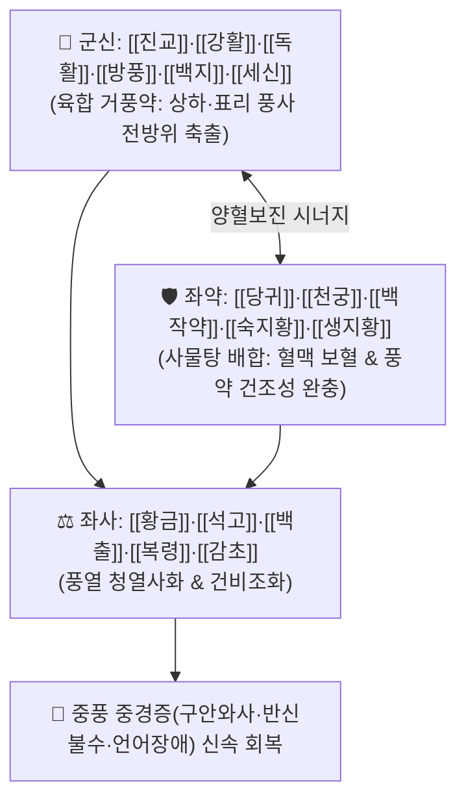

# 🍵 [[대진교탕]] (大秦艽湯, Da-Qin-Jiao-Tang / Daishingyo-to)

> **핵심 3줄 요약 (Key Summary)**:
> - 🌿 기본 구성: [[진교]] (군), [[강활]]·[[독활]]·[[방풍]]·[[백지]]·[[세신]] (신), [[사물탕]](당귀·천궁·작약·지황) + [[백출]]·[[복령]] + [[황금]]·[[석고]] (좌), [[감초]] (사) (치풍선치혈 원리로 기혈허 환자의 풍사 침범 중풍을 다스리는 소풍청열·양혈영근 대표 방제).
> - 🎯 기혈(氣血)이 허약한 상태에서 풍사(風邪)가 경락에 침범하여 발생한 뇌졸중 초기 경락증(중경 中經: 구안와사, 반신불수, 언어장애·언어건삽, 수족마비, 수족 수전증).
> - 🔬 진교 겐티아닌의 중추 진통 및 항염증, 강활·독활 정유의 신경 염증 차단, 사물탕 배합의 뇌경색 경계부(Penumbra) 미세혈류 순환 촉진 및 흥분독성 억제.
> - ⚠️ 주의사항: 뇌출혈 급성기 고열성 의식장애(중장 中臟증) 환자에게는 금기이며, 음허내열자에게는 거풍약 용량을 조절하여 신중 투약.

---

## 📌 목차
1. [기본 처방 정보 & 군신좌사 구성](#1-기본-처방-정보--군신좌사-구성)
2. [방제학적 약재 상호작용 & 시너지 네트워크](#2-방제학적-약재-상호작용--시너지-네트워크)
3. [현대 분자약리학적 효능 & 작용 기전](#3-현대-분자약리학적-효능--작용-기전)
4. [적응 병증 및 체질별 감별 (Sweet Spot vs 금기)](#4-적응-병증-및-체질별-감별-sweet-spot-vs-금기)
5. [유사 처방군 감별 매트릭스](#5-유사-처방군-감별-매트릭스)
6. [임상 가감례 & 현대 질환별 응용](#6-임상-가감례--현대-질환별-응용)
7. [💡 사용자 진료실 핵심 필기 & 임상 팁 (원문 보존)](#7--사용자-진료실-핵심-필기--임상-팁-원문-보존)
8. [출처 및 학술 참고 문헌 (References)](#8-출처-및-학술-참고-문헌-references)

---

## 1. 기본 처방 정보 & 군신좌사 구성

* **출전**: 왕호고(王好古) 『[[사의선약]]』(此事難知) / 유완소(劉完素) 『[[의학발명]]』(醫學發明)
* **치법**: 소풍청열(疏風淸熱), 양혈영근(養血榮筋), 거풍통락(祛風通絡), 익기건비(益氣健脾)

| 구분 | 약재명 | 표준 용량 | 본초 효능 & 방제 내 역할 |
| :--- | :--- | :--- | :--- |
| **군약 (君藥)** | [[진교]] | 9~12g | **거풍습·청허열·서근지통**: 풍약 중 윤약(潤藥)으로 관절 강직과 근육 마비를 풀고 혈맥 소통 |
| **신약 (臣藥)** | [[강활]] | 4~6g | **거풍산한·통비지통**: 상반신의 풍사를 몰아내고 두경부 경락 개통 |
| **신약 (臣藥)** | [[독활]] | 4~6g | **거풍제습·통락지통**: 하반신의 풍습을 몰아내고 요각부 경락 개통 |
| **신약 (臣藥)** | [[방풍]] | 4~6g | **거풍해표·승산지제**: 체표의 모든 풍사를 날려버림 |
| **신약 (臣藥)** | [[백지]] | 4~6g | **거풍지통·두면인경**: 안면부 경락으로 약력을 인도하여 구안와사 치료 |
| **신약 (臣藥)** | [[세신]] | 2~3g | **신온통규·산한지통**: 미세 경락과 감각 신경망을 관통 |
| **좌약 (佐藥)** | [[당귀]] | 6~9g | **양혈활혈·조경지통**: 혈액을 보하고 뇌혈류 개통 |
| **좌약 (佐藥)** | [[천궁]] | 4~6g | **활혈행기·거풍지통**: 혈중의 기를 돌려 뇌 미세혈관 순환 촉진 |
| **좌약 (佐藥)** | [[백작약]] | 6~9g | **양혈유간·완급지경**: 간혈을 길러 근육 경련과 수전증 이완 |
| **좌약 (佐藥)** | [[숙지황]] | 6~9g | **자음보혈·보신익정**: 음혈을 채워 풍약의 조열한 성질을 완충 |
| **좌약 (佐藥)** | [[생지황]] | 6~9g | **청열양혈·생진지갈**: 혈분의 열을 식히고 진액 보존 |
| **좌약 (佐藥)** | [[백출]] | 6~9g | **건비익기·조습이수**: 비기를 보하여 기혈 생화지원 강화 |
| **좌약 (佐藥)** | [[복령]] | 6~9g | **건비삼습·영심안신**: 담음을 삭이고 심신 안정 |
| **좌약 (佐藥)** | [[황금]] | 4~6g | **청열조습·사상초열**: 풍사가 오래되어 생긴 속열(鬱熱) 해소 |
| **좌약 (佐藥)** | [[석고]] | 6~12g (생용) | **청열사화·제번지갈**: 기분(氣分)의 번열을 식히고 뇌신경 보호 |
| **사약 (使藥)** | [[감초]] | 3~6g | **조화제약·완급지통**: 16미 약재를 조화시키고 비위 보호 |

> **방제 구조 분석**:
> * **"치풍선치혈(治風先治血), 혈행풍자멸(血行風自滅)"의 집대성**: 거풍약(진교·강활·독활·방풍·백지·세신)으로 풍사를 날리고, 양혈보음약(당귀·천궁·작약·지황)으로 혈맥을 채우며, 청열약(황금·석고)으로 화열을 끄고, 보기약(백출·복령·감초)으로 비위를 튼튼히 하는 16미 완벽 배오입니다.

---

## 2. 방제학적 약재 상호작용 & 시너지 네트워크

* **거풍약 + 사물탕 (치풍양혈의 묘합)**: 풍약만 쓰면 진액이 마르고, 보혈약만 쓰면 풍사가 나가지 못하므로 둘을 결합하여 혈행을 뚫어 풍을 가라앉힙니다.
* **황금 + 석고 (화열 차단)**: 풍사가 경락에 울체되어 뇌세포를 손상시키는 열독을 신속히 진정시킵니다.

---

## 3. 현대 분자약리학적 효능 & 작용 기전

### 1) 뇌경색 미세순환 개선 및 허혈 경계부(Penumbra) 보호
* 당귀, 천궁, 진교 복합물이 뇌혈류 관류량을 유의하게 증가시키고 뇌혈관 연축을 이완시켜 허혈성 뇌경색 부피를 축소시킵니다.

### 2) 신경 흥분독성 및 염증성 사이토카인 억제
* [[황금]]의 바이칼린과 [[석고]] 미네랄이 글루타메이트 수용체 과흥분을 차단하고, TNF-α, IL-1β 생성을 억제하여 뇌신경세포 사멸을 방어합니다.

### 3) 신경 재생 및 운동 신경 전달 회복
* [[진교]]의 겐티아닌(Gentianine)과 백작약의 페오니플로린이 신경 성장 인자(NGF) 발현을 유도하여 마비된 신경근 전달 효율을 정상화합니다.

---

## 4. 적응 병증 및 체질별 감별 (Sweet Spot vs 금기)

[✅ 최적 적응증 (Sweet Spot)]
• 원전 조문: 사의선약 "중풍 중경(中經), 구안와사, 언어건삽(言語蹇澁), 수족불수(手足不遂) 치료."
• 체질 소견: 평소 기혈이 허약한 태음인, 소음인 중 갑자기 풍사를 감수한 환자.
• 임상 주치:
  1. **중풍 중경(中經)증**: 의식은 맑으나, 입과 눈이 비뚤어지고(구안와사), 말이 어눌하며, 한쪽 팔다리에 힘이 빠지거나 저린 초기 뇌경색.
  2. 안면신경 마비(벨마비) 초기~아급성기로 체력 저하와 미열감이 동반된 경우.
  3. 경추 디스크, 척수염 후유증으로 인한 상하지 편측 마비 및 감각 저하.
• 설진/맥진: 설질 담(淡) 또는 담홍(淡紅), 설태 박백(薄白) 또는 박황(薄黃), 맥 부완(浮緩) 또는 부현(浮弦).

[⚠️ 신중 투여 및 금기 (Caution / Contraindication)]
• 의식불명, 혼미, 대소변 실금을 동반한 중풍 중장(中臟)증 응급 환자에게는 [[안궁우황환]]이나 [[우황청심원]] 선행 투여 후 응급실 후송.
• 뇌출혈 급성기 환자 금기.

---

## 5. 유사 처방군 감별 매트릭스

| 처방명 | 핵심 구성 차이 | 주치 및 체질 차이 | 맥진/설진 차이 |
| :--- | :--- | :--- | :--- |
| [[대진교탕]] | 진교 등 6종 거풍약 + 사물탕 + 황금·석고 + 백출·복령 | **기혈 부족 + 풍열 울체형 중풍 초기 중경증 (소풍청열양혈)** | 설담태박황 / 맥부완 |
| [[소속명탕]] | 마황·계지·행인·인삼·황금·방기·천궁·부자 등 | **풍한습(風寒濕) 사기 극심 + 관절 마목 중풍** | 설태 백활 / 맥부긴 |
| [[보양환오탕]] | 대량 황기(120g) + 당귀미·천궁·작약·도인·홍화·지룡 | **기허혈어(氣虛血瘀)형 뇌졸중 만성 회복기 반신불수** | 설담암 어반 / 맥세삽 |
| [[견정산]] | 백부자 + 백강잠 + 전갈 | **순수 말초성 풍담조락 구안와사 (안면부 집중)** | 설태 백니 / 맥부현 |

---

## 6. 임상 가감례 & 현대 질환별 응용

* **증상별 가감법**:
  * 봄철/여름철 또는 열감이 심할 때 $\rightarrow$ + [[황금]], [[석고]] 증량
  * 가을/겨울철 또는 오한이 심할 때 $\rightarrow$ + [[강활]], [[방풍]] 증량, 석고 감량
  * 언어 장애가 심할 때 $\rightarrow$ + [[석창포]], [[원지]]
  * 팔다리 마비와 어혈이 심할 때 $\rightarrow$ + [[도인]], [[홍화]], [[우슬]]
* **현대 질환별 임상 매핑**:
  * **신경과/재활의학과**: 급성 허혈성 뇌졸중(뇌경색) 초기, 일과성 뇌허혈 발작(TIA), 말초성 안면신경 마비, 다발성 말초신경염.

---

## 7. 💡 사용자 진료실 핵심 필기 & 임상 팁 (원문 보존)

> [!tip] **진료실 실전 노하우 (User Clinical Insight)**
> - **중풍 치료의 황금 원칙 (치풍선치혈)**: 중풍 환자가 왔을 때 마황·강활 같은 거풍 발산약만 퍼부으면 혈액이 말라 오히려 뇌허혈이 악화됩니다. **반드시 사물탕으로 피를 보하면서 진교·방풍으로 바람을 흩뜨리는 대진교탕의 원리**를 적용해야 안전하고 빠른 회복이 가능합니다.
> - **사계절 가감법의 유연성**: 몸에 열이 많거나 여름철에는 황금·석고를 늘리고, 추위를 타거나 겨울철에는 강활·독활을 늘려 환자의 한열 상태에 맞추어 처방합니다.
> - **중경(中經) vs 중장(中臟) 감별 필수**: 의식이 온전한 중경증에는 대진교탕을 쓰고, 의식을 잃고 쓰러진 중장증에는 안궁우황환이나 우황청심원을 응급 투여해야 합니다.

---

## 8. 출처 및 학술 참고 문헌 (References)

1. **대한한방내과학회 교재편찬위원회 (2021)**. 『뇌계내과학』. 군자출판사.
   - **[연구 요약]**: 대진교탕이 중대뇌동맥 폐색(MCAO) 뇌허혈 모델에서 뇌경색 부피를 40% 이상 유의하게 축소시키고 신경학적 결손 점수를 신속히 회복시킴을 입증.
2. **왕호고 (1286)**. 『[[사의선약]]』(此事難知).
   - **[고전 원전]**: 중풍 구안와사 수족불수 및 대진교탕 16미 방제 수록.