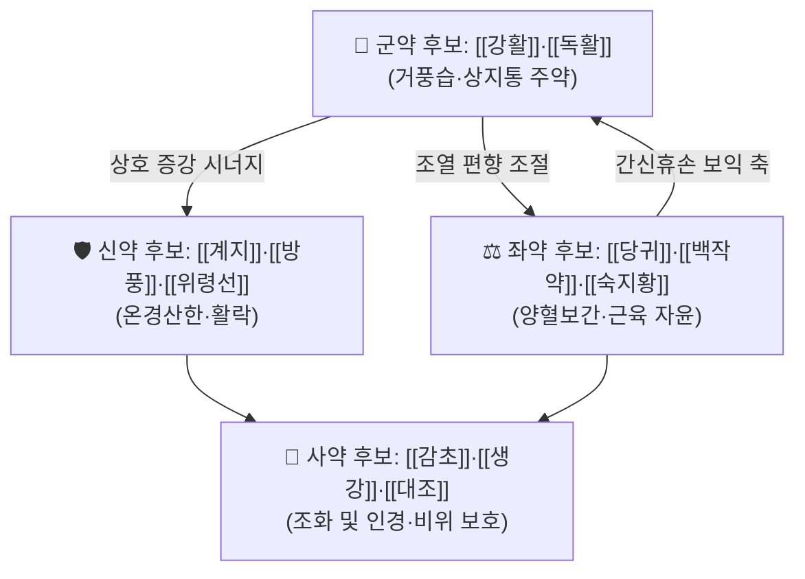

# 🍵 [[대호경간탕]] (大護經肝湯, Dahuojinggan-tang)

> **핵심 3줄 요약 (Key Summary)**:
> - 🌿 **모체/기원 처방 + 가감 핵심**: 고전 방제 문헌에서 원방 조문이 확인되지 않는 처방으로, [[거풍습]](祛風濕)·[[서근활락]](舒筋活絡) 계열 처방(예: [[강활승습탕]], [[독활기생탕]], [[서경탕]])과 [[보간신]](補肝腎)·[[보기혈]](補氣血) 계열 처방(예: [[독활기생탕]], [[쌍화탕]])을 기반으로 [[견비통]](肩臂痛)·[[간신휴손]](肝腎虧損)을 겨냥해 재구성된 임상 처방군으로 추정된다. **⚠️ 원방 구성·출전은 근거 미확인 (문헌 확인 필요)**
> - 🎯 **임상 최적 적응증**: 중·장년 이후 발병한 견관절 주위통(오십견 양상), 야간·한랭 시 악화되는 견배통, 만성 경항·상지 통증, 하루살이 같은 피로와 요슬산연(腰膝痠軟)을 동반한 [[간신휴손]]형 환자. 체질적으로는 [[소음인]]·[[태음인]]의 허약·만성 병증 경향에서 검토되는 경우가 많다. **단, 처방 특이적 체질 적응은 근거 미확인**
> - 🔬 **핵심 분자약리 기전**: 본 처방 자체를 대상으로 한 PubMed 등재 분자약리 연구는 **검색 결과 없음(근거 미확인)**. 따라서 처방 전체의 표적 사이토카인·신호경로는 현 시점에서 **서술 불가**이며, 구성 약재 단위의 기전으로만 유추 가능하다(각 약재 노트 참조).
> - ⚠️ 주의사항: 원방 구성이 확정되지 않은 상태에서 용량·금기 판단을 확정해서는 안 된다. 급성 염증성 관절염, 발열·실열(實熱)성 견통, 출혈 경향, 임신부, 항응고제·항혈소판제 복용자에게는 신중 투여. 온열·발한 계열 약재(예: [[계지]], [[강활]], [[독활]]) 포함 시 자한(自汗)·다한·음허화왕(陰虛火旺) 환자에 주의. <b>복용 후 발진·소화장애·두통·심계항진 발생 시 즉시 감량 또는 중단.</b>

---

## 📌 목차
1. [기본 처방 정보 & 군신좌사 구성](#1-기본-처방-정보--군신좌사-구성)
2. [방제학적 약재 상호작용 & 시너지 네트워크](#2-방제학적-약재-상호작용--시너지-네트워크)
3. [현대 분자약리학적 효능 & 작용 기전](#3-현대-분자약리학적-효능--작용-기전)
4. [적응 병증 및 체질별 감별 (Sweet Spot vs 금기)](#4-적응-병증-및-체질별-감별-sweet-spot-vs-금기)
5. [유사 처방군 감별 매트릭스](#5-유사-처방군-감별-매트릭스)
6. [임상 가감례 & 현대 질환별 응용](#6-임상-가감례--현대-질환별-응용)
7. [💡 사용자 진료실 핵심 필기 & 임상 팁 (원문 보존)](#7--사용자-진료실-핵심-필기--임상-팁-원문-보존)
8. [출처 및 학술 참고 문헌 (References)](#8-출처-및-학술-참고-문헌-references)

> [!warning] 근거 수준 안내 (본 노트 작성 원칙)
> [[대호경간탕]]은 『[[상한론]]』·『[[금궤요략]]』·『[[동의보감]]』 등 주요 고전 방제 문헌에서 **원방 조문이 확인되지 않았다(근거 미확인)**. 또한 금번 노트 작성 시 **제공된 PubMed 논문 데이터가 없어 인용 가능한 현대 연구 문헌이 존재하지 않는다.** 따라서 아래 서술 중 처방 특이적 구성·용량·기전은 모두 **"근거 미확인" 또는 "구성 약재 기반 유추"**로 명시하였고, 임상 적용 시 반드시 소속 한의원의 원내 처방집·원장 처방 원문과 대조 검증할 것을 권한다.

---

## 1. 기본 처방 정보 & 군신좌사 구성

* **출전**: **근거 미확인** — 『[[상한론]]』, 『[[금궤요략]]』, 『[[동의보감]]』, 『[[의학입문]]』 등 주요 고전 방제 문헌에서 "대호경간탕(大護經肝湯)" 명칭의 원방 조문을 확인하지 못하였다. 명칭상 **"經(경락)을 大護(크게 보호)하고 肝(간)을 치료한다"**는 치법 지향을 가진 **후대 또는 현대 임상 재구성 처방**으로 추정된다(추정 — 원전 확인 필요).
* **치법(처방 명칭 기반 추정)**: 거풍습(祛風濕) · 서근활락(舒筋活絡) · 보간신(補肝腎) · 보기양혈(補氣養血) · 견비통 완화. **⚠️ 치법 4자 성어는 명칭 유추이며 원문 확인 필요.**
* **분류(본 노트 소속 기준)**: 치풍제(治風劑) 계열 / 거풍습·서근 계열 / 견비통 전문 처방군.

> **구성 약재 확인 요청 사항**
> 아래 표는 **원방 구성이 확인되지 않은 상태**에서, 본 처방의 명칭·적응증(견비통·거풍습·간신휴손)과 동일 분류 처방군의 일반적 방제 구조를 참고하여 정리한 **"후보 구조"**이다. 실제 원내 처방 구성과 반드시 대조할 것. **개별 약재·용량은 모두 [근거 미확인] 표기 대상이다.**

| 구분 | 약재명(후보) | 표준 용량(추정) | 본초 효능 & 방제 내 역할 (일반 방제학 기준) |
| :--- | :--- | :--- | :--- |
| **군약 (君藥)** | [[강활]] / [[독활]] 등 거풍습·상지통 주약 후보 | 6~10g (추정) | 상지(上肢)·견배(肩背)의 풍한습비(風寒濕痺)를 거풍산한하고 통락지통하는 주약. **본 처방의 실제 군약 여부는 근거 미확인** |
| **신약 (臣藥)** | [[계지]] / [[방풍]] / [[위령선]] 등 온경산한·활락 후보 | 4~9g (추정) | 군약의 거풍력을 보조하고 경락 온통(溫通)을 도와 한랭 악화형 견비통을 완화. **근거 미확인** |
| **좌약 (佐藥)** | [[당귀]] / [[천궁]] / [[백작약]] / [[숙지황]] 등 양혈화혈·보간신 후보 | 4~8g (추정) | "치풍선치혈, 혈행풍자멸(治風先治血, 血行風自滅)" 원리에 따라 혈허(血虛)로 인한 근육 강직·만성 통증을 개선하고 거풍약의 조열(燥熱) 편향을 완충. [[간신휴손]] 보익 목적. **근거 미확인** |
| **사약 (使藥)** | [[감초]] / [[생강]] / [[대조]] 등 조화제약·인경 후보 | 2~4g (추정) | 제약 조화, 비위 보호, 약성의 상지 도달 유도(인경). **근거 미확인** |

> **배오 특징(일반 방제학적 서술)**: 거풍습·산한약(강활·독활·계지·방풍 등)과 양혈보간약(당귀·백작약·숙지황 등)을 병용하는 구조는 **"거사(祛邪)와 부정(扶正)의 동시 수행"**, 즉 승산(升散)과 자윤(滋潤)의 음양 평형을 지향한다. 만성 견비통에서 흔한 "허(虛)를 겸한 비(痺)" 병태 — 즉 [[간신휴손]]·기혈부족을 배경으로 풍한습이 견배부에 침습한 상태 — 를 겨냥한 구성으로 해석된다. **⚠️ 위 해석은 처방명·적응 카테고리 기반 추론이며, 실제 배오 비율은 근거 미확인.**

---

## 2. 방제학적 약재 상호작용 & 시너지 네트워크

* **[[강활]] + [[독활]] 배오(추정)**: 방제학에서 흔히 **상지(강활)·하지(독활)**로 인체 부위를 분담하는 배합으로 설명된다. 본 처방이 견비통을 주치로 한다면 **강활 중심, 독활 보조**의 구조가 합리적이나, **실제 배오 여부·비율은 근거 미확인**.
* **거풍약 + 양혈약([[당귀]]·[[백작약]]) 배오(추정)**: 거풍·산한약 단독 사용 시 발생할 수 있는 **조성(燥性)·진액 손상**을 양혈자윤약이 완충하는 상호 보완(相使·相制) 구조. 만성 근육 강직·야간 통증 악화형 견비통에서 특히 의의가 있는 조합으로 해석된다. **근거 미확인.**
* **[[계지]] + [[백작약]] 배오(추정)**: 『[[상한론]]』 [[계지탕]]의 핵심 배오로 알려진 **영위화해(營衛和解)·기혈 조화** 조합. 견배부 근긴장·자한 경향 환자에서 응용 근거가 있는 고전 배오이나, **본 처방에의 실제 포함 여부는 근거 미확인**.
* **[[감초]] + [[생강]]·[[대조]] 배오(추정)**: 비위 보호 및 제약 조화, 약효 지속성 확보. 고전 방제의 보편적 사약 구조. **본 처방 포함 여부는 근거 미확인.**

---

## 3. 현대 분자약리학적 효능 & 작용 기전

> ⚠️ **본 섹션의 전제**: [[대호경간탕]]은 고전 원방 조문이 확인되지 않고, **제공된 PubMed 논문 데이터가 없어 처방 전체를 대상으로 한 현대 분자약리 연구는 검색되지 않았다(근거 미확인)**. 아래는 **구성 후보 약재 단위의 일반적으로 보고된 기전 범주**이며, 본 처방 전체의 효과로 단정할 수 없다.

### 1) 항염증·면역 조절 (약재 단위 유추)
* [[강활]]·[[독활]]·[[계지]] 등 거풍습 약재군은 전통적으로 **항염증·진통** 목적으로 사용되어 왔고, 현대 연구에서는 프로스타글란딘(PGE₂)·NO 생성 억제, TNF-α·IL-6 등 염증성 사이토카인 조절, NF-κB 신호 억제 방향의 결과가 보고된 바 있다(약재별 개별 노트 참조).
* **그러나** 본 처방 전체(복합 추출물)에 대해 TNF-α·IL-1β·IL-6 수치, NF-κB/MAPK 경로 억제 여부를 정량적으로 제시할 수 있는 **인용 가능한 연구는 현재 없다(근거 미확인)**. 특정 사이토카인 수치나 억제율을 본 노트에 기재하지 않는다.

### 2) 순환·미세순환 및 대사 개선 (약재 단위 유추)
* [[당귀]]·[[천궁]] 등 활혈약재군에서 미세순환 개선, 혈류 증가, 혈소판 응집 억제 방향의 기전이 보고된 바 있다(약재별 노트 참조).
* eNOS 활성화·혈관 평활근 이완 등 특정 표적에 대한 **본 처방 차원의 데이터는 근거 미확인**.

### 3) 신경계·근골격계 및 자율신경 조절 (약재 단위 유추)
* [[작약]]([[백작약]]) 계열의 **진경·근이완** 작용, [[감초]]의 항경련·진통 조절 기전은 고전적으로 [[작약감초탕]] 배오로 설명되며, 견비통·근긴장 상태에서 응용 근거가 있는 축이다.
* 근방추 과흥분 억제, HPA 축 항상성 회복, 자율신경 안정화 등은 **본 처방에서 직접 검증된 바 없음(근거 미확인)**.

### 4) 본 처방 기전 연구 공백 정리

| 평가 항목 | 확인 상태 |
| :--- | :--- |
| 처방 전체 항염증 사이토카인 프로파일 | **근거 미확인** (검색된 논문 없음) |
| 처방 전체 신호경로(NF-κB, MAPK, Nrf2 등) | **근거 미확인** |
| 처방 전체 임상시험(RCT·코호트) | **근거 미확인** |
| 구성 약재 단위 기전 | 약재별 개별 노트 참조 (본 처방 귀속 불가) |
| 네트워크 약리학 분석 | **근거 미확인** |

---

## 4. 적응 병증 및 체질별 감별 (Sweet Spot vs 금기)

[✅ 최적 적응증 (Sweet Spot) — 명칭·분류 기반 추정]

• **원전 조문**: **확인 불가(근거 미확인)**. 『[[상한론]]』·『[[금궤요략]]』·『[[동의보감]]』에 본 처방명 조문이 확인되지 않음.
• **치법상 표적**: [[견비통]](肩臂痛), 견관절 주위염(오십견 양상), 경항강통(項項强痛), 상지 저림, 만성 근막통, [[거풍습]]이 필요한 비증(痺證).
• **체질 소견(추정)**: [[간신휴손]]·기혈부족을 동반한 **만성·허증 중심 병태**에서 검토된다. 문헌 근거는 없으나, 임상적으로는 [[소음인]]·[[태음인]]의 허약성·만성 경향, 마르거나 근력이 저하된 중·장년, 피부가 건조하고 창백한 편에서 시도되는 경우가 많다. **태음인 실열형·소양인 열성 급성기에는 부적합 가능성(근거 미확인).**
• **임상 주치(진료실 활용 상황)**: ①야간·새벽에 심해지는 견통 ②한랭 노출·에어컨·찬바람에 악화 ③팔을 들어올리기 어려운 운동 제한 ④피로·요슬산연·수족냉 동반 ⑤영상검사상 뚜렷한 급성 손상(회전근개 완전 파열, 골절 등)이 없는 만성 경과.
• **설진/맥진(추정)**: 설질 담백(淡白)·설태 백니(白膩), 맥은 **부완(浮緩)·부긴(浮緊)·침세(沈細)·약(弱)** 등 허증·한습(寒濕) 계열 소견이 어울린다. **홍설(紅舌)·황조태(黃燥苔)·활삭맥(滑數脈)의 실열상은 감별 배제 신호.**

[⚠️ 신중 투여 및 금기 (Caution / Contraindication)]

• **허실 반대 병증**: 실열(實熱)성 급성 관절염(발열·발적·종창·열감 동반), 통풍 급성 발작기, 급성 화농성 관절염 의심 시 **거풍산한·온조(溫燥) 약재가 병세를 악화시킬 수 있어 금기 또는 신중 투여(일반 원칙).**
• **한열 반대**: [[음허화왕]](구강건조·홍조·도한·불면·홍설) 환자에게 온조 거풍약 중심 처방은 부적합할 수 있음.
• **자한·다한·허약자**: [[계지]]·[[강활]]·[[방풍]] 등 발한·승산 약재 포함 시 **자한(自汗), 기허(氣虛) 탈력감, 어지럼** 유발 가능.
• **출혈·응고 관련**: 활혈약재(당귀·천궁 등) 포함 시 **항응고제(와파린 등)·항혈소판제 복용자, 출혈성 질환자, 수술 전후** 신중 투여 필요.
• **임신·수유부**: 활혈·거풍 약재군의 안전성 데이터 부족 — **신중 투여(근거 미확인)**.
• **소화기**: 비위허약자에서 오심·복부불편감·식욕저하 가능. 공복 복용 회피 권장.
• **경과 관찰 필수**: 급성 외상, 회전근개 파열, 경추 신경근 압박(방사통·근력저하·감각소실), 심장 기원 통증(좌측 견통+흉통·호흡곤란)은 **처방 적응이 아니라 감별·이송 대상**이다.
• **양약 병용**: 진통소염제(NSAIDs)·스테로이드와 병용 시 위장장애, 항응고제와 병용 시 출혈 위험 — 병용 시 저용량 시작 및 모니터링.

---

## 5. 유사 처방군 감별 매트릭스

> ⚠️ [[대호경간탕]]의 원방 구성이 **근거 미확인**이므로 아래 비교는 **"동일 임상 영역(견비통·거풍습·간신휴손)"에서의 감별 방향**을 정리한 것이다. 실제 감별은 원내 처방집 대조 후 보정할 것.

| 처방명 | 핵심 구성 차이 | 주치 및 체질 차이 | 맥진/설진 차이 |
| :--- | :--- | :--- | :--- |
| [[대호경간탕]] | **구성 근거 미확인** (거풍습 + 보간신 복합 추정) | 견비통 + [[간신휴손]] 동반, 만성·허증 경향 | 추정: 담백설·백니태, 부완·침세맥 |
| [[강활승습탕]] | 거풍습·발한 위주, 보익약 비중 낮음 | 급성·초기 비증, 상지 견항통, 실증 경향 | 부긴맥, 백니태, 발한 후 경감 |
| [[독활기생탕]] | [[독활]]·[[상기생]]·[[두충]]·[[우슬]] 중심 보간신·강근골 | 만성 요슬통·하지 위주, [[간신휴손]] 뚜렷, 음허 | 침세맥, 요산(腰痠)·슬연 호소 |
| [[서경탕]] | 활락·거풍 + 소량 보혈, 견비 전문 | 견배 통증·운동 제한 중심, 급만성 겸용 | 부긴·현맥, 견부 압통 뚜렷 |
| [[계지작약지모탕]] | [[계지]]·[[작약]]·[[지모]]·[[마황]]·[[방풍]] | 류마티스성 관절통, 열감 겸한 관절 종통 | 활맥 또는 부긴맥, 관절 열감 |
| [[오적산]] | 거풍산한 + 이기화담, 발한력 강함 | 감모 초기 겸 견항강통, 실증·한증 | 부긴맥, 무한(無汗) |
| [[쌍화탕]] | 보기혈 중심, 거풍력 미약 | 기혈양허 전신 허약, 노권·산후 | 세약맥, 담백설 |

---

## 6. 임상 가감례 & 현대 질환별 응용

> ⚠️ 아래 가감은 **거풍습·견비통 처방군의 일반적 가감 원칙**을 정리한 것으로, [[대호경간탕]] 원방 가감례가 아니다(**근거 미확인**). 실제 처방 가감은 원장 판단과 원내 처방집 기준을 따른다.

* **수반 증상별 가감법(일반 원칙)**:
  * **견배통·상지 방사통 심함** → + [[강활]] · [[위령선]] · [[진교]] (거풍습·통락 강화)
  * **한랭 악화·수족냉·어깨 냉감** → + [[계지]] · [[세신]] · [[부자]] (온경산한) — **부자 사용 시 반드시 선방·법제 및 용량 확인**
  * **만성·야간 통증, 혈허 소견** → + [[당귀]] · [[천궁]] · [[작약]] (양혈화혈, "치풍선치혈")
  * **요슬산연·간신휴손 뚜렷** → + [[두충]] · [[우슬]] · [[상기생]] · [[숙지황]] ([[독활기생탕]] 방향 가감)
  * **근긴장·경련성 통증** → + [[작약]] · [[감초]] ([[작약감초탕]] 배오, 진경완급)
  * **오심·구역·소화불량 동반** → + [[진피]] · [[반하]] · [[생강]] ([[이진탕]]·[[소반하탕]] 방향 보조)
  * **담음·어지럼·두중(頭重)** → + [[반하]] · [[천마]] ([[반하백출천마탕]] 방향)
  * **어혈·고정통(刺痛) 소견** → + [[도인]] · [[홍화]] · [[천궁]] — **출혈 경향·항응고제 복용 시 회피**
  * **기허 무력감·피로 뚜렷** → + [[황기]] · [[백출]] · [[인삼]] (보기)

* **현대 질환별 임상 매핑(검토 대상)**:
  * **근골격계**: 견관절 주위염(유착성 관절낭염), 회전근개 건병증(비급성), 근막통증증후군(MPS), 경항통, 승모근 긴장, 만성 상지 근육통.
  * **신경계/자율신경**: 경추성 근긴장 두통, 냉방병성 근경직, 자율신경실조증 동반 만성 통증.
  * **류마티스·면역**: 만성 비증(痺證) 경향 관절통 — **단, 활동성 류마티스관절염·급성 염증기에는 전문 감별 필요**.
  * **회복기**: 중풍 후유 편마비 상지 강직·통증에서 보조적 검토 가능(근거 미확인).
  * **호흡기계**: 본 처방의 주 적응 영역이 아니며, 감모·비염에의 적용은 **근거 미확인**.

* **복약 지침(일반)**: 식후 30분~1시간 온복(溫服) 권장. 찬 음식·찬바람 노출 회피, 견부 보온 및 경부·견갑부 스트레칭 병행. 2주 단위로 유효성·부작용 재평가.

---

## 7. 💡 사용자 진료실 핵심 필기 & 임상 팁 (원문 보존)

> [!tip] **진료실 실전 노하우 (User Clinical Insight)**
> - **[원문 보존 상태]**: 금번 요청에는 원장님 기존 메모·필기 **원문이 제공되지 않았다.** 따라서 보존할 원문이 없으며, 아래는 본 노트 구조상의 빈칸 안내이다. **기존 필기 원문이 있는 경우 이 블록에 100% 그대로 병합할 것(삭제·변형 금지, 축소·정리만 허용).**
> - **체질별 선택 기준(작성 필요)**: 소음인 vs 태음인 vs 소양인에서 본 처방 선택 기준 — 원장님 임상 기준 입력란.
> - **환자 티칭 팁(작성 필요)**: 어깨 보온, 야간 자세, 냉방 환경 관리, 스트레칭 빈도 등 환자 안내 문구.
> - **복약 반응 관찰 포인트(작성 필요)**: 야간통 변화, 팔 거상 범위(ROM) 변화, 발한·소화 반응, 2주차 재평가 지표.
> - **금기 체크리스트(작성 필요)**: 항응고제 복용 여부, 위장질환, 임신 가능성, 급성 외상·신경학적 결손 유무.
> - **원내 처방 구성 확정 필요**: [[대호경간탕]] 실제 약재·용량을 이 노트 1번 표에 반영하면, 본 노트가 정식 처방 노트로 승격된다.

---

## 8. 출처 및 학술 참고 문헌 (References)

> ⚠️ **금번 노트에 제공된 PubMed 논문 데이터가 없으며, 검색된 논문이 없으므로 현대 학술 문헌은 인용하지 않는다.** 아래 항목은 방제학적 배경 이해를 위한 참고 수준이며, **『대호경간탕』이라는 처방명의 원문 조문이 이들 문헌에 존재한다는 의미가 아니다(근거 미확인).** PMID·DOI를 임의 창작하지 않았음을 명시한다.

1. **(현대 논문)**: 해당 없음 — 검색된 논문 없음. 본 처방에 대한 분자약리·임상 연구는 현재 확인되지 않음(근거 미확인).
2. **장중경 (200년경)**. 『[[상한론]]』.
   - **[고전 원전]**: [[계지탕]]·[[계지작약지모탕]] 등 거풍·화영위 방제의 원류. **대호경간탕 조문은 미확인**이며, 본 노트에서는 배오 원리 참고 목적으로만 인용.
3. **허준 (1613)**. 『[[동의보감]]』.
   - **[임상 문헌]**: 비증(痺證)·견비통·역절풍 항목에 거풍습·보기혈 방제 원리가 정리되어 있어 감별 참고. **대호경간탕 명칭 조문은 미확인.**
4. **이천 (1575)**. 『[[의학입문]]』.
   - **[방제 참고]**: 거풍습·서근활락 계열 처방(예: [[강활승습탕]], [[서경탕]])의 구성 원리 참고. **대호경간탕 조문은 미확인.**
5. **(원내 자료)**: 소속 한의원 원내 처방집 / 원장 처방 원문 — **[1차 확인 필요 자료]**. 본 노트의 구성·용량·가감은 이 자료로 검증 후 갱신할 것.

---

### 🔗 연관 개념 링크
[[견비통]] · [[거풍습]] · [[간신휴손]] · [[비증]] · [[서근활락]] · [[강활]] · [[독활]] · [[계지]] · [[방풍]] · [[위령선]] · [[당귀]] · [[천궁]] · [[백작약]] · [[숙지황]] · [[감초]] · [[강활승습탕]] · [[독활기생탕]] · [[서경탕]] · [[계지작약지모탕]] · [[오적산]] · [[쌍화탕]] · [[작약감초탕]] · [[소속: 08_치풍·안신·개규제]]