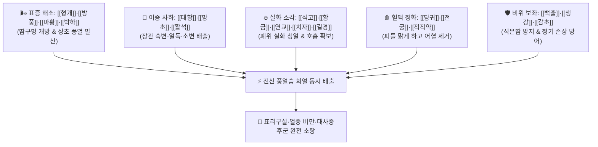

# 🍵 [[방풍통성산]] (防風通聖散, Fang-Feng-Tong-Sheng-San / Bofutsushosan)

> **핵심 3줄 요약 (Key Summary)**:
> - 🌿 기본 구성: [[형개]]·[[방풍]]·[[마황]]·[[박하]] (해표), [[대황]]·[[망초]]·[[활석]] (통부사하), [[석고]]·[[황금]]·[[연교]]·[[치자]]·[[길경]] (청열사화), [[천궁]]·[[당귀]]·[[적작약]] (양혈청혈), [[백출]]·[[생강]]·[[감초]] (사).
> - 🎯 표리구실(表裏俱實)·풍열옹성(風熱壅盛)형 비만 환자, 음식 과다 섭취로 살찌고 복압이 높으며 입냄새·땀냄새·피로·식은땀·눈충혈·뒷목당김·두통·현훈 및 변비·지질이상증·수면무호흡증을 동반한 태음인 열증 비만.
> - 🔬 지방세포 cAMP 증가 및 미토콘드리아 UCP-1 활성화를 통한 백색지방 분해·갈색지방 열생산 촉진, 혈장 중성지방 및 혈당 강하, 센노사이드·황산나트륨의 배변 촉진, 에페드린의 기초대사량 증가.
> - ⚠️ 주의사항: 공하·발한·청열의 파괴력이 강한 방제이므로 비위허한자·임산부는 금기이며, 임상에서 2주간 집중 복용 후 식이요법과 온화한 처방으로 전방.

---

## 📌 목차
1. [기본 처방 정보 & 군신좌사 구성](#1-기본-처방-정보--군신좌사-구성)
2. [방제학적 약재 상호작용 & 시너지 네트워크](#2-방제학적-약재-상호작용--시너지-네트워크)
3. [현대 분자약리학적 효능 & 작용 기전](#3-현대-분자약리학적-효능--작용-기전)
4. [적응 병증 및 체질별 감별 (Sweet Spot vs 금기)](#4-적응-병증-및-체질별-감별-sweet-spot-vs-금기)
5. [유사 처방군 감별 매트릭스](#5-유사-처방군-감별-매트릭스)
6. [임상 가감례 & 현대 질환별 응용](#6-임상-가감례--현대-질환별-응용)
7. [💡 사용자 진료실 핵심 필기 & 임상 팁 (원문 보존)](#7--사용자-진료실-핵심-필기--임상-팁-원문-보존)
8. [출처 및 학술 참고 문헌 (References)](#8-출처-및-학술-참고-문헌-references)

---

## 1. 기본 처방 정보 & 군신좌사 구성

* **출전**: 유완소(劉完素) 『[[선명론방]]』(宣明論方) / 『[[동의보감]]』(東醫寶鑑)
* **치법**: 한하청화(汗下淸和), 소풍해표(疏風解表), 사열통부(瀉熱通腑), 청열해독(淸熱解毒), 화혈양혈(和血養血)

| 구분 | 약재명 | 표준 용량 | 본초 효능 & 방제 내 역할 |
| :--- | :--- | :--- | :--- |
| **군약 (君藥)** | [[방풍]] | 4~6g | **소풍해표·두면거풍**: 체표의 풍열을 흩뜨리고 땀구멍을 뚫어 해표 |
| **군약 (君藥)** | [[형개]] | 4~6g | **거풍소종·청열이인**: 방풍과 합하여 피부와 상초의 풍열 발산 |
| **군약 (君藥)** | [[마황]] | 4~6g | **선폐발한·이수평천**: 폐기를 열어 땀과 소변으로 노폐물을 배출하고 지방 분해 촉진 |
| **군약 (君藥)** | [[박하]] | 3~4g (후하) | **소산풍열·청리두목**: 상초와 눈, 머리의 치솟는 열감을 청량하게 식힘 |
| **신약 (臣藥)** | [[대황]] | 4~6g (주세) | **청열사하·통부도체**: 장관의 열독과 굳은 대변을 쓸어내려 배출 (똥 빼줌) |
| **신약 (臣藥)** | [[망초]] | 3~6g (용화) | **사열연견·삼투통변**: 장내 삼투압을 높여 단단한 대변을 녹임 |
| **신약 (臣藥)** | [[활석]] | 9~15g | **청열이습·이뇨통림**: 삼초의 습열을 소변으로 시원하게 빼냄 |
| **좌약 (佐藥)** | [[석고]] | 9~15g | **청열사화·제번지갈**: 폐와 위의 맹렬한 실화를 끄고 갈증 해소 |
| **좌약 (佐藥)** | [[황금]] | 4~6g | **청열조습·사폐화**: 상초와 호흡기의 염증과 가래를 삭임 |
| **좌약 (佐藥)** | [[연교]] | 4~6g | **청열해독·소옹산결**: 혈분의 열독을 풀고 림프절·피부 염증 완화 |
| **좌약 (佐藥)** | [[치자]] | 4~6g | **사화제번·청열이습**: 삼초의 화열을 소변으로 유도 배출 |
| **좌약 (佐藥)** | [[길경]] | 4~6g | **선폐이인·거담배농**: 폐기를 상행시켜 숨을 트이게 하고 가래 배출 |
| **좌약 (佐藥)** | [[당귀]] | 4~6g | **양혈활혈·윤조**: 혈맥을 맑게 하고 대황·망초의 사하로 인한 혈액 손상 방어 |
| **좌약 (佐藥)** | [[천궁]] | 4~6g | **활혈행기·두통지통**: 혈액 순환을 촉진하고 혈관 내 미세혈전 해소 |
| **좌약 (佐藥)** | [[적작약]] | 4~6g | **양혈산어·청열양혈**: 울체된 어혈을 풀고 혈관벽 염증 진정 |
| **좌약 (佐藥)** | [[백출]] | 4~6g | **건비조습·익기**: 비위를 튼튼히 하여 과도한 발한과 설사로 기운 빠지는 것 방어 |
| **사약 (使藥)** | [[생강]] | 3~5g (3편) | **온중화위·조화영위**: 비위 손상을 막고 발한 해표 보조 |
| **사약 (使藥)** | [[감초]] | 3~4g | **조화제약·완급화중**: 18미 약재의 맹렬한 약성을 부드럽게 조화 |

> **방제 구조 5대 블록 분석 (방제학의 결정판)**:
> 1. **풍열 발산(땀으로 뺌)**: 형개·방풍·마황·박하 (해표)
> 2. **열독 사하(대소변으로 뺌)**: 대황·망초·활석 (공하 이수)
> 3. **삼초 화열 청열(염증 끔)**: 석고·황금·연교·치자·길경 (청열해독)
> 4. **혈맥 정화(피를 맑게 함)**: 천궁·당귀·적작약 (양혈활혈)
> 5. **비위 보호(기운 보존)**: 백출·생강·감초 (건비완충)

---

## 2. 방제학적 약재 상호작용 & 시너지 네트워크

* **한·하·청·화 4대 치법의 동시 구현**: 땀(한), 대변(하), 소변(이수), 청열(청), 활혈(화)의 5대 배출 경로를 한 번에 열어 인체 내 모든 독소와 잉여 열량을 배출합니다.

---

## 3. 현대 분자약리학적 효능 & 작용 기전

### 1) 지방세포 cAMP 증가 및 백색·갈색 지방 열생산 촉진
* [[마황]]의 [[에페드린]]과 생강·당귀 성분이 지방세포의 β3-아드레날린 수용체를 자극하여 세포 내 cAMP 농도를 높이고, 백색지방의 지방분해(Lipolysis) 및 갈색지방의 UCP-1 발현을 유도해 기초대사량을 급격히 증대시킵니다.

### 2) 인슐린 저항성 개선 및 혈당·중성지방 강하
* [[황금]]의 바이칼린과 [[치자]]의 제니포사이드가 간세포 내 AMPK 경로를 활성화하여 간 내 지방 축적을 억제하고 혈중 중성지방(TG)과 공복 혈당을 유의하게 감소시킵니다.

### 3) 장관 삼투성 사하 및 장내 독소(Endotoxin) 배출
* [[대황]](센노사이드)과 [[망초]](황산나트륨)가 장관 연동 운동을 촉진하고 수분을 흡인하여 숙변과 장내 세균 유래 지질다당류(LPS)를 배출시켜 만성 전신 염증을 진정시킵니다.

> 🧬 **현대 학술 근거 (2026-09-08 B-7 패치)** — PubChem 실측 분자 앵커: 에페드린(Ephedrine, 마황) CID **9294** · 분자식 C₁₀H₁₅NO · MW 165.2

🔬 **분자 구조** (Wikimedia Commons, Public Domain)

![[Ephedrine_구조.png|420]]
> [그림 1] 에페드린(Ephedrine, C₁₀H₁₅NO) 분자 구조 — 출처: Wikimedia Commons (기존 첨부 재사용)

> 🧬 **현대 학술 근거 (2026-09-08 B-7 패치)**
> - 항섬유화 확장 근거(연구 결과): 노화 동반 비만 마우스 모델에서 방풍통성산 투여가 조직 항섬유화 관련 성분을 통해 대사 개선에 기여함이 확인됨(PMID 42435526).
> - 장내미생물 확장 근거(연구 결과): 방풍통성산의 항비만 효과가 장내 유익균 Akkermansia muciniphila 증가와 연관됨이 확인되어, 본문의 지방분해·AMPK 기전에 장내미생물 매개 경로가 추가로 관여함을 시사(PMID 41071238).

---

## 4. 적응 병증 및 체질별 감별 (Sweet Spot vs 금기)

[✅ 최적 적응증 (Sweet Spot)]
• 원전 조문: 선명론방 "풍열옹성, 표리구실, 두목현훈, 목적종통, 인후불리, 대변비결, 소변적삽, 창양은진 치료."
• 체질 소견: **태음인 열증 비만(태음인 뚱뚱증)** 또는 소양인 실열 체질.
• 임상 주치:
  1. 평소 음식을 많이 먹고 음주·고량진미를 즐기며 복부 비만(복압 상승)이 심한 환자.
  2. 몸에 열이 많고 숨이 차며(수면무호흡증), 지독한 입냄새와 땀냄새가 나는 경우.
  3. 혈액이 끈적하여 혈전이 잘 생기고, 기운이 떨어지면 식은땀이 나며, 눈이 충혈되고 뒷목이 뻣뻣하게 당기며 두통·어지럼증이 있는 환자(고혈압, 당뇨, 심근경색, 뇌졸중 전조증).
  4. 만성 변비, 얼굴 여드름, 화농성 피부염, 두드러기가 잦은 체질.
• 설진/맥진: 설질 홍(紅) 또는 암홍(暗紅), 설태 황후니(黃厚膩) 또는 황조(黃燥), 맥 활삭유력(滑數有力) 또는 침실(沈實).

[⚠️ 신중 투여 및 금기 (Caution / Contraindication)]
• 마르고 기혈이 허약한 소음인, 평소 설사를 자주 하는 비위허한 환자에게는 절대 금기.
• 임산부, 수유부 및 심혈관 허약 노인 금기.

---

## 5. 유사 처방군 감별 매트릭스

| 처방명 | 핵심 구성 차이 | 주치 및 체질 차이 | 맥진/설진 차이 |
| :--- | :--- | :--- | :--- |
| [[방풍통성산]] | 18미 (해표+사하+청열+활혈 총집결) | **태음인 열증 실증 복부비만·입냄새·고혈압·변비 (표리동치)** | 설태 황후니 / 맥활삭유력 |
| [[대시호탕]] | 시호·황금·작약·반하·지실·대황·생강·대추 | **소양인 흉협고만 + 명치 밑 단단한 통증·변비** | 설태 황조 / 맥현삭실 |
| [[태음조위탕]] | 마황·맥문동·길경·의이인·건밤·오미자 등 | **태음인 위완한증 비만 (식욕과다·부종형 비만 완화 전환)** | 설태 박백 / 맥부완 |
| [[평진탕]] | 평위산 + 이진탕 | **비위 습담형 소화불량 및 복부 팽만 비만** | 설태 백니 / 맥현활 |

---

## 6. 임상 가감례 & 현대 질환별 응용

* **증상별 가감법**:
  * 혈압이 높고 뒷목 당김과 두통이 극심할 때 $\rightarrow$ + [[조등구]], [[국화]], [[천마]]
  * 피부 가려움증과 은진(두드러기)이 심할 때 $\rightarrow$ + [[선태]], [[지부자]], [[백선피]]
  * 변비가 없고 설사 경향을 보일 때 $\rightarrow$ [[대황]], [[망초]] 감량 또는 제외
  * 심한 갈증과 열감이 있을 때 $\rightarrow$ + [[지모]], [[천화분]]
* **현대 질환별 임상 매핑**:
  * **대사 질환**: 복부 내장지방형 비만, 대사증후군, 제2형 당뇨병, 이상지질혈증, 고혈압.
  * **피부/호흡기**: 심상성 여드름, 주사비, 폐쇄성 수면무호흡증(OSA), 비알코올성 지방간(NAFLD).

---

## 7. 💡 사용자 진료실 핵심 필기 & 임상 팁 (원문 보존)

> [!tip] **진료실 실전 노하우 (User Clinical Insight)**
> - **임상 타겟 환자군 (태음인 뚱뚱증 환자의 특효방)**:
>   - 평소 음식을 지나치게 많이 먹고, 살찐 체형에 지독한 입냄새와 땀냄새가 나며, 혈액순환이 안 되고 기운이 떨어지는 환자.
>   - 음주와 고량후미로 열이 많고, 복압이 높아 숨이 차며, 피가 끈적하여 혈전이 가득하고, 기운이 떨어지면 식은땀을 흘리며 눈 충혈, 뒷목 땡김, 두통, 현훈(심근경색, 중풍 전조)을 호소할 때 즉효를 냅니다.
> - **2주 복용 후 전방(轉方) 원칙 (CRITICAL)**:
>   - 방풍통성산은 몸의 풍열독과 숙변을 한꺼번에 쏟아내는 초강력 공하제이므로 **반드시 2주 정도만 집중 복용**시켜 급한 열독과 복압을 낮추고 변비를 해결합니다.
>   - 2주 후에는 식이요법으로 체중을 조절하게 하면서, 환자의 세부 체질에 따라 [[태음조위탕]], [[조위승청탕]], [[대시호탕]], [[시호가용골모려탕]], [[평진탕]] 위주로 처방을 전환(전방)해야 정기 손상 없이 안전하게 감량을 이어갈 수 있습니다.

---

## 8. 출처 및 학술 참고 문헌 (References)

1. * **Onishi A et al. (2026)**. Identification of anti-fibrotic components of Bofutsushosan under conditions of age-associated obesity in mice. *Phytomedicine : international journal of phytotherapy and phytopharmacology*, 159: 158522. [PMID: 42435526](https://pubmed.ncbi.nlm.nih.gov/42435526/)
3. **유완소 (1172)**. 『[[선명론방]]』(宣明論方).
   - **[고전 원전]**: 풍열옹성 표리구실 및 방풍통성산 18미 방제 수록.
