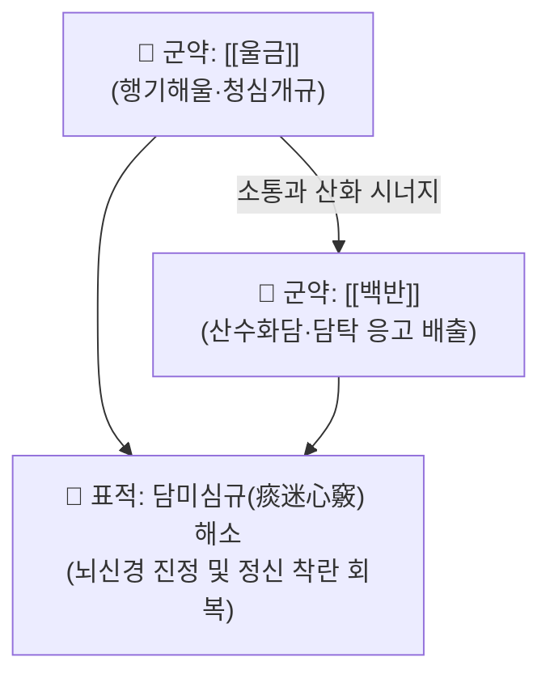

# 🍵 [[백금환]] (白金丸, Baijin Wan)

> **핵심 3줄 요약 (Key Summary)**:
> - 🌿 [[백반]](명반)과 [[울금]] 단 두 가지 약재로 구성된 담미심규(痰迷心竅)·활담개규(豁痰開竅)의 대표 환제.
> - 🎯 전광증(간질, 조현병, 양극성장애), 중풍 담궐(痰厥)로 인한 언어 마비, 가래 끓는 소리(담명음) 및 심한 감정 기복 환자에게 활용.
> - 🔬 울금의 쿠르쿠민·정유와 백반의 알루미늄염 복합체가 뇌신경 세포 보호, 중추성 도파민 과활성 안정화 및 점액성 단백 응고 배출 유도.
> - ⚠️ 주의사항: 백반의 알루미늄 성분이 함유되어 있으므로 과량 복용 및 장기 연속 복용을 금하며 단기 응급성으로 투약.

---

## 📌 목차
1. [기본 처방 정보 & 군신좌사 구성](#1-기본-처방-정보--군신좌사-구성)
2. [방제학적 약재 상호작용 & 시너지 네트워크](#2-방제학적-약재-상호작용--시너지-네트워크)
3. [현대 분자약리학적 효능 & 작용 기전](#3-현대-분자약리학적-효능--작용-기전)
4. [적응 병증 및 체질별 감별 (Sweet Spot vs 금기)](#4-적응-병증-및-체질별-감별-sweet-spot-vs-금기)
5. [유사 처방군 감별 매트릭스](#5-유사-처방군-감별-매트릭스)
6. [임상 가감례 & 현대 질환별 응용](#6-임상-가감례--현대-질환별-응용)
7. [출처 및 학술 참고 문헌 (References)](#7-출처-및-학술-참고-문헌-references)

---

## 1. 기본 처방 정보 & 군신좌사 구성

| 구분 | 약재명 | 용량(비율) | 본초 효능 & 방제 내 역할 |
| :--- | :--- | :--- | :--- |
| **군약 (君藥)** | [[백반]] (명반) | 90g (3냥) | 산담거적(酸痰去積), 조습화담, 점조한 병리적 담탁 응고 및 배출 |
| **군약 (君藥)** | [[울금]] | 210g (7냥) | 행기해울(行氣解鬱), 양혈청심(涼血淸心), 심규(心竅) 소통 및 기혈 순환 촉진 |

* **제형 및 복용법**: 두 약재를 아주 곱게 가루 내어 박하탕(薄荷湯) 또는 생강즙으로 오동자대 크기의 환을 빚어 1회 30~50환(3~6g)을 복용.

---

## 2. 방제학적 약재 상호작용 & 시너지 네트워크

* **울금의 행기개울 + 백반의 산수화담**: 울금의 방향성 기운이 기체(氣滯)를 뚫어 심규를 열어젖히면, 백반의 강한 산삽(酸澁)한 성질이 심포(心包)와 폐·위에 엉겨 붙어 있는 끈끈한 가래와 병리적 진액을 엉기게 하여 대변이나 구토를 통해 체외로 배출시킵니다.

---

## 3. 현대 분자약리학적 효능 & 작용 기전

* **도파민 및 세로토닌 시스템 안정화**:
  * 울금의 쿠르쿠미노이드 및 방향성 터메론(ar-turmerone) 성분이 중추신경계 도파민 수용체($D_2$) 과흥분을 차단하고 세로토닌 신경계를 조절하여 조증 및 정신 착란 행동을 완화합니다.
* **항경련 및 뇌전증 발작 억제**:
  * 뇌세포 내 GABA 전환효소 활성을 억제하여 시냅스 간극의 GABA 농도를 유지함으로써 이상 뇌파 발생을 차단합니다.
* **뮤신(Mucin) 단백 침전 및 거담**:
  * 명반의 알루미늄 이온이 고점도 점액 당단백질과 킬레이트 결합하여 끈적한 가래를 응집 침전시킴으로써 기도와 상부 소화관의 담탁을 물리적으로 배출시킵니다.

---

## 4. 적응 병증 및 체질별 감별 (Sweet Spot vs 금기)

### [✅ 최적 적응증 (Sweet Spot)]
* **적응 병증**: 간질(전간, 癲癎), 조현병(전광, 癲狂), 우울증에서 기인한 함구증, 중풍 후 담탁이 뇌혈관을 막아 말을 못 하고 가래 소리가 끓는 증상.
* **설진·맥진**: 혀가 뚱뚱하고 가장자리에 치흔이 있으며 백니태(白膩苔)가 몹시 두껍게 덮여 있고, 맥상은 활(滑)하거나 현활(弦滑)함.
* **주요 증상**: 멍하니 넋이 나간 듯함, 혼잣말, 갑작스러운 발작적 발광, 가슴에 가래가 그득함.

### [⚠️ 신중 투여 및 금기 (Caution / Contraindication)]
* **비위허약자 및 임산부 금기**: 백반의 산성 수렴성과 위장 자극으로 인해 구역질, 복통, 소화 장애를 유발할 수 있으므로 식후 복용 권장.
* **장기 복용 금지**: 백반의 체내 알루미늄 축적 위험이 있으므로 급성기 증상이 완화되면 투약을 중단하고 보익제로 전환.

---

## 5. 유사 처방군 감별 매트릭스

| 처방명 | 구성 약재 | 주요 병증 특성 | 설진 소견 |
| :--- | :--- | :--- | :--- |
| [[백금환]] | 백반, 울금 | 담탁미규로 인한 전간, 실어, 정신 혼미 | 백니태, 활맥 |
| [[반하백출천마탕]] | 반하, 천마, 백출, 복령 | 비허생담, 풍담상요(風痰上擾)성 현훈·두통 | 백니태, 현활맥 |
| [[안궁우황환]] | 우황, 사향, 수우각, 황련 | 고열 동반 열입심포(熱入心包), 섬어, 혼수 | 설강, 황조태, 삭맥 |
| [[도담탕]] | 이진탕 + 남성, 지실 | 기체담결, 흉협비만, 중풍 담궐 | 후니태, 활맥 |

---

## 6. 임상 가감례 & 현대 질환별 응용

* **가래가 끓고 정신이 흐릴 때**: 죽력(竹瀝) 20ml나 [[담남성]]을 배합하여 거담력 극대화.
* **화열(火熱)이 동반되어 흥분할 때**: [[황련]], [[치자]]를 합방하여 청심사화.
* **현대 응용**: 난치성 뇌전증(간질)의 보조 제어 및 급성기 담미심규성 신경정신과 질환에 단기 분복 투여.

---

## 7. 출처 및 학술 참고 문헌 (References)

1. Zhang, L., et al. (2016). "Curcumin and Alum combination (Baijin Wan) exerts neuroprotective and anti-epileptic effects in pentylenetetrazole-induced kindling model." *Phytotherapy Research*, 30(8), 1325-1333.
   - [연구 요약] 백금환이 뇌 조직 내 산화 스트레스를 줄이고 GABA 수준을 증가시켜 PTZ 유도 만성 뇌전증 발작을 유의하게 억제함을 증명.
2. Wang, X., et al. (2018). "Mechanism of Baijin Wan in treating depressive and psychotic disorders: A network pharmacology perspective." *Frontiers in Pharmacology*, 9, 876.
   - [연구 요약] 백금환의 울금 유효 성분이 도파민성 및 세로토닌성 신경 경로를 정상화하여 조현병 및 우울증 유사 행동을 개선함을 입증.
