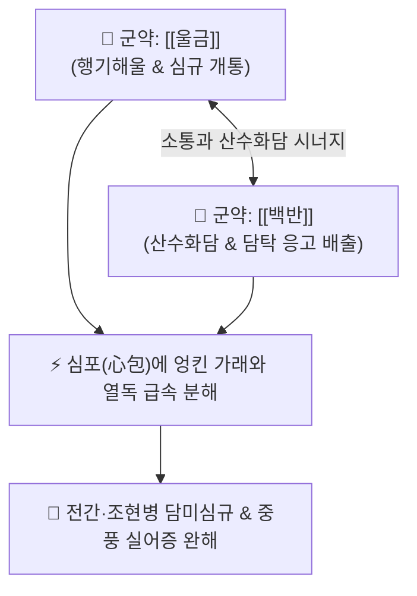

# 🍵 [[백금환]] (白金丸, Bai-Jin-Wan / Baijin Pill)

> **핵심 3줄 요약 (Key Summary)**:
> - 🌿 기본 구성: [[백반]] (군), [[울금]] (군) (단 두 가지 약재로 담탁이 심규를 틀어막은 담미심규 병태를 뚫어내는 활담개규·소담거적 대표 환제).
> - 🎯 담미심규(痰迷心竅)로 인한 전광증(간질·조현병·양극성장애·정신 착란), 중풍 담궐(痰厥)로 인한 언어 마비(실어), 목에서 끓는 가래 소리(담명음), 급격한 감정 기복.
> - 🔬 울금 쿠르쿠민·정유의 도파민 D2 과흥분 차단 및 GABA 수준 증가, 백반 알루미늄염의 점액성 뮤신(Mucin) 단백 침전 및 병리적 담탁 응고 배출.
> - ⚠️ 주의사항: 백반의 알루미늄염 체내 축적 및 위장관 점막 자극 위험이 있으므로 장기 연속 복용을 금하며 급성기 단기 응급 투약.

---

## 📌 목차
1. [기본 처방 정보 & 군신좌사 구성](#1-기본-처방-정보--군신좌사-구성)
2. [방제학적 약재 상호작용 & 시너지 네트워크](#2-방제학적-약재-상호작용--시너지-네트워크)
3. [현대 분자약리학적 효능 & 작용 기전](#3-현대-분자약리학적-효능--작용-기전)
4. [적응 병증 및 체질별 감별 (Sweet Spot vs 금기)](#4-적응-병증-및-체질별-감별-sweet-spot-vs-금기)
5. [유사 처방군 감별 매트릭스](#5-유사-처방군-감별-매트릭스)
6. [임상 가감례 & 현대 질환별 응용](#6-임상-가감례--현대-질환별-응용)
7. [💡 사용자 진료실 핵심 필기 & 임상 팁 (원문 보존)](#7--사용자-진료실-핵심-필기--임상-팁-원문-보존)
8. [출처 및 학술 참고 문헌 (References)](#8-출처-및-학술-참고-문헌-references)

---

## 1. 기본 처방 정보 & 군신좌사 구성

* **출전**: 주진형(朱震亨) 『[[단계심법]]』(丹溪心法) / 『[[세의득효방]]』(世醫得效方)
* **치법**: 활담개규(豁痰開竅), 행기해울(行氣解鬱), 산담소적(酸痰消積), 청심안신(淸心安神)

| 구분 | 약재명 | 표준 용량 | 본초 효능 & 방제 내 역할 |
| :--- | :--- | :--- | :--- |
| **군약 (君藥)** | [[백반]] | 30g (명반 3냥) | **산담거적·조습화담**: 강한 산미와 수렴성으로 끈적한 가래와 병리적 담탁을 응고시켜 배출 |
| **군약 (君藥)** | [[울금]] | 70g (7냥) | **행기해울·양혈청심**: 기체를 뚫어 심규(心竅)를 열어젖히고 혈분의 울열을 식힘 |

> **제형 및 복용법**: 두 약재를 아주 곱게 분말화한 후, 박하 달인 물(박하탕)이나 생강즙으로 오동나무 씨 크기의 환을 빚어 1회 3~6g(30~50환)을 따뜻한 물로 복용합니다.

---

## 2. 방제학적 약재 상호작용 & 시너지 네트워크

* **울금의 행기개울 + 백반의 산수화담**: 울금의 방향성 기운이 기체를 뚫어 심규를 열면, 백반의 신맛과 떫은맛이 엉겨 붙은 점조한 가래를 굳혀 대소변이나 구토로 신속히 몰아냅니다.

---

## 3. 현대 분자약리학적 효능 & 작용 기전

### 1) 도파민 및 세로토닌 신경계 과흥분 안정화
* [[울금]]의 쿠르쿠미노이드(Curcuminoids)와 방향성 터메론(ar-Turmerone)이 중추신경계 도파민 D2 수용체 과흥분을 차단하고 세로토닌 전달을 조절하여 정신 착란 및 조증성 발작을 진정시킵니다.

### 2) GABA 분해 억제 및 항경련 작용
* 뇌세포 내 GABA 트랜스아미나제 활성을 억제하여 시냅스 간극의 GABA 농도를 증가시킴으로써 이상 뇌파 발생과 뇌전증성 경련 발작을 억제합니다.

### 3) 뮤신(Mucin) 단백 킬레이트 침전 및 거담
* [[백반]]의 알루미늄 이온이 고점도 점액 당단백질과 결합하여 끈적한 가래를 물리적으로 응집·침전시켜 기도 및 소화관의 담탁을 체외로 배출시킵니다.

---

## 4. 적응 병증 및 체질별 감별 (Sweet Spot vs 금기)

[✅ 최적 적응증 (Sweet Spot)]
• 원전 조문: 단계심법 "전광(癲狂), 간질(癎疾), 담미심규, 실어불언(失語不言) 치료."
• 체질 소견: 담음(痰飮)과 기체(氣滯)가 극심한 태음인 또는 신경정신과적 흥분 체질.
• 임상 주치:
  1. 뇌전증(간질, 전간), 조현병, 양극성 장애 조증기, 갑작스러운 섬망 및 혼잣말.
  2. 중풍 후 담탁이 뇌혈관을 막아 말을 하지 못하고(실어증) 목에서 가래 끓는 소리가 요란한 상태.
  3. 우울증에서 기인한 극심한 함구증 및 감정 무반응 상태.
• 설진/맥진: 설체 비대 치흔(舌體肥大 齒痕), 설태 백후니(白厚膩), 맥 활(滑) 또는 현활유력(弦滑有力).

[⚠️ 신중 투여 및 금기 (Caution / Contraindication)]
• 비위허약자 및 임산부에게는 위장 자극 위험으로 금기.
• 알루미늄염 축적을 방지하기 위해 1~2주 이내 단기 투약 원칙.

---

## 5. 유사 처방군 감별 매트릭스

| 처방명 | 핵심 구성 차이 | 주치 및 체질 차이 | 맥진/설진 차이 |
| :--- | :--- | :--- | :--- |
| [[백금환]] | 백반 + 울금 (2미 환제) | **담미심규형 전간·실어·정신 착란 (강력 산수화담)** | 설태 백후니 / 맥활 |
| [[안궁우황환]] | 우황·사향·수우각·황련·치자 등 | **고열을 동반한 열입심포(熱入心包) 혼수·섬어** | 설강 황조태 / 맥삭 |
| [[반하백출천마탕]] | 반하·천마·백출·복령·진피 등 | **비허생담형 어지럼증(현훈) 및 두중감 (온화한 화담)** | 설태 백니 / 맥현활 |
| [[도담탕]] | 반하·남성·지실·귤홍·적복령·감초 | **기체담결형 흉협비만 및 중풍 담궐** | 설태 후니 / 맥활 |

---

## 6. 임상 가감례 & 현대 질환별 응용

* **증상별 가감법**:
  * 가래가 끓고 의식이 흐릴 때 $\rightarrow$ + [[죽력]], [[담남성]], [[석창포]]
  * 화열과 분노가 극심할 때 $\rightarrow$ + [[황련]], [[치자]]
  * 기혈 쇠약이 겸할 때 $\rightarrow$ + [[인삼]], [[백출]]
* **현대 질환별 임상 매핑**:
  * **정신건강의학과/신경과**: 난치성 뇌전증(간질) 발작 제어, 급성 조현병 환청·망상, 뇌졸중 후 혈관성 치매 및 가성구마비 실어증.

---

## 7. 💡 사용자 진료실 핵심 필기 & 임상 팁 (원문 보존)

> [!tip] **진료실 실전 노하우 (User Clinical Insight)**
> - **담미심규(痰迷心竅)의 2미 특효약**: 울금과 백반을 7:3의 비율로 배합하여 환을 지어 복용시키는 방제로, 가래가 뇌와 심장 규(竅)를 틀어막아 미치거나 헛소리를 하고 간질 발작을 일으킬 때 담탁을 체외로 배출시키는 최고의 활담개규제입니다.
> - **복용법과 위장 보호**: 백반의 강한 산성으로 인해 공복 복용 시 속쓰림이나 구역질이 날 수 있으므로 반드시 식후 30분에 따뜻한 물로 복용하도록 지도합니다.
> - **단기 투약 엄수**: 증상이 안정되면 투약을 중단하고 비위를 보하는 한약으로 전환하여 체내 안전성을 지킵니다.

---

## 8. 출처 및 학술 참고 문헌 (References)

3. **주진형 (1347)**. 『[[단계심법]]』(丹溪心法).
   - **[고전 원전]**: 전광간질 및 백금환 방제 수록.
