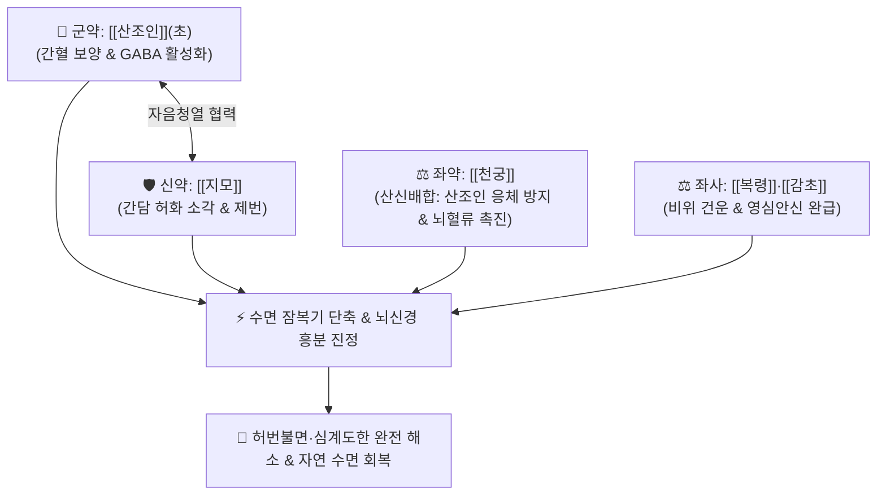

# 🍵 [[산조인탕]] (酸棗仁湯, Suan-Zao-Ren-Tang / Suanzaoren Tang / Sansonin-to)

> **핵심 3줄 요약 (Key Summary)**:
> - 🌿 기본 구성: [[산조인]] (군, 초용), [[지모]] (신), [[복령]]·[[천궁]] (좌), [[감초]] (사) (간혈부족과 허열내요로 인한 불면증을 다스리는 양혈안신·청열제번 대표 제1방).
> - 🎯 허번불면(虛煩不眠, 가슴이 답답하고 불안하여 밤새 뒤척임), 가슴 두근거림(심계), 식은땀(도한), 입마름(구건), 신경쇠약 및 갱년기 수면장애.
> - 🔬 초산조인 스피노신(Spinosin)·쥬쥬보사이드의 GABA-A 및 5-HT1A 수용체 알로스테릭 조절을 통한 서파수면(NREM 3단계) 유도, 지모 만기페린의 HPA 축 코르티솔 과활성 억제.
> - ⚠️ 주의사항: 산조인은 반드시 노랗게 볶은 초산조인(炒酸棗仁)을 사용해야 수면 유도 효과가 발휘되며 (생용 시 각성), 비위허한 설사 환자는 지모 감량.

---

## 📌 목차
1. [기본 처방 정보 & 군신좌사 구성](#1-기본-처방-정보--군신좌사-구성)
2. [방제학적 약재 상호작용 & 시너지 네트워크](#2-방제학적-약재-상호작용--시너지-네트워크)
3. [현대 분자약리학적 효능 & 작용 기전](#3-현대-분자약리학적-효능--작용-기전)
4. [적응 병증 및 체질별 감별 (Sweet Spot vs 금기)](#4-적응-병증-및-체질별-감별-sweet-spot-vs-금기)
5. [유사 처방군 감별 매트릭스](#5-유사-처방군-감별-매트릭스)
6. [임상 가감례 & 현대 질환별 응용](#6-임상-가감례--현대-질환별-응용)
7. [💡 사용자 진료실 핵심 필기 & 임상 팁 (원문 보존)](#7--사용자-진료실-핵심-필기--임상-팁-원문-보존)
8. [출처 및 학술 참고 문헌 (References)](#8-출처-및-학술-참고-문헌-references)

---

## 1. 기본 처방 정보 & 군신좌사 구성

* **출전**: 장중경(張仲景) 『[[금궤요략]]』(金匱要略) 혈비허로병편
* **치법**: 양혈안신(養血安神), 청열제번(淸熱除煩), 산신배합(酸辛配合), 녕심익지(寧心益智)

| 구분 | 약재명 | 표준 용량 | 본초 효능 & 방제 내 역할 |
| :--- | :--- | :--- | :--- |
| **군약 (君藥)** | [[산조인]] | 15~30g (초용 炒用) | **양심익간·안신염한**: 심음과 간혈을 보하고 흩어진 신(神)을 수렴하여 깊은 수면 유도 |
| **신약 (臣藥)** | [[지모]] | 6~12g | **자음청열·사화제번**: 음을 기르고 간담의 허화(虛火)를 꺼서 가슴 답답함 해소 |
| **좌약 (佐藥)** | [[복령]] | 9~15g | **녕심안신·건비삼습**: 비위를 안정시키고 담음을 삭여 수면 유도 보조 |
| **좌약 (佐藥)** | [[천궁]] | 3~6g | **활혈행기·거풍지통**: 혈맥을 뚫어 뇌혈류를 개선하고 산조인의 수렴 응체 방지 |
| **사약 (使藥)** | [[감초]] | 3~6g | **보비화중·완급지통·조화제약**: 제약을 조화시키고 급박한 신경 흥분 완화 |

> **방제 구조 분석**:
> * **산수렴(酸收斂)과 신발산(辛發散)의 절묘한 산신배합(酸辛配合)**: 산조인의 신맛으로 흩어지는 심신(心神)을 거두고, 천궁의 매운맛으로 기혈을 막힘없이 소통시키며, 지모의 찬맛으로 헛불을 꺼서 몸과 마음을 가장 자연스럽게 이완시킵니다.

---

## 2. 방제학적 약재 상호작용 & 시너지 네트워크

* **산조인 + 지모 (자음강화)**: 산조인의 산미 수렴과 지모의 고한 청열이 결합하여 허열로 들뜬 신경계를 차분하게 가라앉힙니다.
* **산조인 + 천궁 (산신배합)**: 산조인이 수렴하기만 하면 기운이 뭉치고, 천궁이 발산하기만 하면 혈이 흩어지므로 둘이 짝을 이루어 혈을 보하면서도 뇌혈류를 원활히 소통시킵니다.

---

## 3. 현대 분자약리학적 효능 & 작용 기전

### 1) GABA-A 수용체 알로스테릭 조절 (Spinosin & Jujuboside A)
* 초산조인의 지표 성분인 스피노신(Spinosin)과 쥬쥬보사이드 A가 벤조디아제핀(BZD) 유사 경로로 GABA-A 수용체를 활성화하여 염소이온($\text{Cl}^-$) 통로 개방을 유도하고 중추 흥분을 억제합니다 (내성 및 의존성 없음).

### 2) 세로토닌 5-HT1A 수용체 활성화 및 서파수면(NREM 3단계) 회복
* 5-HT1A 수용체를 자극하여 변연계의 과흥분을 차단하고, 깊은 잠인 서파수면(Slow-wave sleep) 비율을 증대시켜 수면의 질을 개선합니다.

### 3) HPA 축 과잉 반응 억제 및 항불안
* 혈중 코르티솔 및 부신피질자극호르몬(ACTH) 농도를 유의하게 감소시켜 야간 각성 빈도를 낮추고 도한(식은땀)을 멎게 합니다.

---

## 4. 적응 병증 및 체질별 감별 (Sweet Spot vs 금기)

[✅ 최적 적응증 (Sweet Spot)]
• 원전 조문: 금궤요략 "허로허번부득면(虛勞虛煩不得眠), 산조인탕주지."
• 체질 소견: 간혈(肝血)이 부족하고 음허 체질인 소음인, 태음인.
• 임상 주치:
  1. **허번불면(虛煩不眠)**: 가슴이 답답하고 불안하여 밤새 뒤척이며 잠들지 못하는 증상.
  2. 잠이 들어도 꿈이 많고(다몽 多夢), 작은 소리에도 깜짝 놀라 쉽게 깨는 증상.
  3. 밤에 식은땀(도한)이 나고, 입안과 목구멍이 마르며, 가슴이 두근거리는(심계) 신경쇠약.
  4. 갱년기 여성의 수면장애, 우울·불안 동반 불면.
• 설진/맥진: 설질 홍(紅), 설태 박(薄) 또는 소태(少苔), 맥 세삭(細數) 또는 현세(弦細).

[⚠️ 신중 투여 및 금기 (Caution / Contraindication)]
• 담음(痰飮)이나 음식 정체(식적)로 인한 실증 불면증 환자에게는 [[온담탕]] 계열 적용.
• 비위가 극도로 허약하여 설사를 자주 하는 환자는 지모를 감량하거나 포제하여 사용.

---

## 5. 유사 처방군 감별 매트릭스

| 처방명 | 핵심 구성 차이 | 주치 및 체질 차이 | 맥진/설진 차이 |
| :--- | :--- | :--- | :--- |
| [[산조인탕]] | 산조인 + 지모 + 복령 + 천궁 + 감초 | **간혈부족·음허내열형 허번불면·도한 (양혈안신 대표방)** | 설홍소태 / 맥세삭 |
| [[귀비탕]] | 사군자탕 + 당귀·용안육·산조인·원지·황기·목향 | **사려과다 심비양허형 불면·건망·피로·소화불량** | 설담소태 / 맥세약 |
| [[천왕보심단]] | 생지황 + 현삼·맥문동·단삼·백자인·원지 등 | **심신불교·음허화왕형 극심한 심계·구내염·불면** | 설홍무태 / 맥세삭 |
| [[온담탕]] | 반하·진피·복령·지실·죽여·생강·감초 | **담열요심(痰熱擾心)형 가슴 답답함·악몽·놀람 불면** | 설태 황니 / 맥활삭 |

---

## 6. 임상 가감례 & 현대 질환별 응용

* **증상별 가감법**:
  * 음허 열감이 심하고 입마름이 극심할 때 $\rightarrow$ + [[생지황]], [[맥문동]], [[백합]]
  * 가슴 두근거림과 공포감이 심할 때 $\rightarrow$ + [[용골]], [[모려]], [[백자인]]
  * 비위가 차고 소화가 안 될 때 $\rightarrow$ + [[백출]], [[사인]], [[건강]]
  * 우울감과 가슴 답답함이 심할 때 $\rightarrow$ + [[합환피]], [[야교등]]
* **현대 질환별 임상 매핑**:
  * **정신건강의학과**: 원발성 불면증, 수면유지장애, 신경쇠약증, 갱년기 증후군 불면, 범불안장애.

---

## 7. 💡 사용자 진료실 핵심 필기 & 임상 팁 (원문 보존)

> [!tip] **진료실 실전 노하우 (User Clinical Insight)**
> - **초산조인(炒酸棗仁) 포제 필수 (CRITICAL)**:
>   - 산조인은 **반드시 껍질째 노랗게 볶아서(초용 炒用)** 써야 합니다.
>   - 날것(생산조인 生酸棗仁)은 오히려 뇌를 각성시켜 잠을 깨우며, 볶아야 스피노신과 유효 사포닌이 용출되어 강력한 진정·수면 유도 작용이 발휘됩니다.
> - **불면증 3대 처방 감별 기준**:
>   1. 소화가 안 되고 기운이 없으면서 잠을 못 자면 $\rightarrow$ [[귀비탕]].
>   2. 혀가 새빨갛고 입이 바짝 마르며 가슴이 미친 듯이 뛰면 $\rightarrow$ [[천왕보심단]].
>   3. **가슴이 답답하고 열이 나며 뒤척이는 전형적인 허번불면** $\rightarrow$ [[산조인탕]].
> - **수면제 대체 천연 한약**: 졸피뎀이나 벤조디아제핀계 약물 중단 후 반동성 불면을 겪는 환자에게 안전한 탈출구 역할을 합니다.

---

## 8. 출처 및 학술 참고 문헌 (References)

1. * **Wang S et al. (2026)**. Effects of Spinosin on nonenzymatic glycation of β-lactoglobulin: A mechanism study based on multi-spectroscopy analysis and molecular docking. *Food chemistry*, 528: 150919. [PMID: 42697078](https://pubmed.ncbi.nlm.nih.gov/42697078/)
2. * **Tang Y et al. (2026)**. Recent Advances on the Chemical Compositions, Biological Activities, and Applications of Ziziphi Spinosae Semen: From Traditional Treasures to Modern Medical Stars. *Phytochemical analysis : PCA*, 37: 795-812. [PMID: 42381201](https://pubmed.ncbi.nlm.nih.gov/42381201/)
3. **장중경 (200년경)**. 『[[금궤요략]]』(金匱要略) 혈비허로병편.
   - **[고전 원전]**: 허로허번부득면 및 산조인탕 방제 수록.
