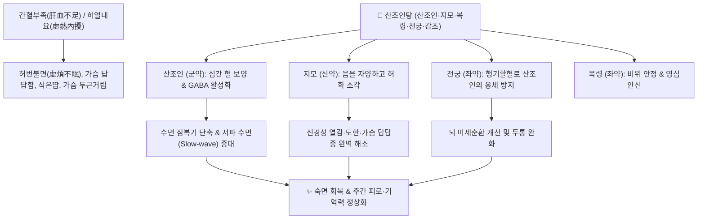

# 🍵 [[산조인탕]] (酸棗仁湯, Suanzaoren Tang)

> **핵심 요약 (Key Summary)**:
> 장중경의 금궤요략에 수록된 방제로 간혈부족과 허열내요로 인한 불면증을 다스리는 불후의 양혈안신 대표 제1방.
> 산조인의 스피노신과 쥬쥬보사이드가 GABA-A 및 5-HT1A 수용체를 활성화하여 중추 과흥분을 진정시키고 비렘수면을 유도.
> 허번불면(가슴이 답답하여 잠 못 듦), 심계도한, 신경쇠약 및 갱년기 수면장애를 치료하는 수면유도제 대체 천연 한약 처방.

---
## 📌 목차
1. [기본 처방 정보 & 군신좌사 구성](#1-기본-처방-정보--군신좌사-구성)
2. [방제학적 약재 상호작용 & 시너지 네트워크](#2-방제학적-약재-상호작용--시너지-네트워크)
3. [현대 분자약리학적 효능 & 수면 아키텍처 개선 기전](#3-현대-분자약리학적-효능--수면-아키텍처-개선-기전)
4. [적응증 및 불면증 아형 감별 (귀비탕 vs 천왕보심단 vs 산조인탕)](#4-적응증-및-불면증-아형-감별-귀비탕-vs-천왕보심단-vs-산조인탕)
5. [처방 부작용(사이드) 대처법 & 포제 임상 팁](#5-처방-부작용사이드-대처법--포제-임상-팁)
6. [출처 및 학술 참고 문헌 (References)](#6-출처-및-학술-참고-문헌-references)

---
## 1. 기본 처방 정보 & 군신좌사 구성

* **출전**: 후한(後漢) 장중경(張仲景) 『금궤요략(金匱要略)』 "허로허번부득면(虛勞虛煩不得眠), 산조인탕주지(酸棗仁湯主之)"
* **치법**: 양혈안신(養血安神), 청열제번(淸熱除煩)

| 구분 | 약재명 | 표준 용량 | 본초 효능 & 방제 내 역할 |
| :--- | :--- | :--- | :--- |
| **군약 (君藥)** | [[산조인]] (초용 炒用) | 15~30g | 심음과 간혈을 보하고 신(神)을 수렴하여 수면을 유도하는 핵심 안신약 |
| **신약 (臣藥)** | [[지모]] | 6~12g | 자음청열(滋陰淸熱)하여 간담의 허화(虛火)를 끄고 번조를 제거 |
| **좌약 (佐藥)** | [[복령]] | 9~15g | 녕심안신(寧心安神) 및 건비삼습으로 담음을 삭이고 수면 유도 보조 |
| **좌약 (佐藥)** | [[천궁]] | 3~6g | 활혈행기(活血行氣)하여 산조인의 수렴 니체성을 견제하고 뇌혈류 개통 |
| **사약 (使藥)** | [[감초]] | 3~6g | 제약 조화 및 건비익기(健脾益氣), 급박한 신경 흥분 완화 |

---
## 2. 방제학적 약재 상호작용 & 시너지 네트워크

* **산조인과 지모의 음양 조율 배오 (자음강화)**:
  * 산조인의 산미(酸味) 수렴성과 지모의 고한(苦寒) 청열성이 결합하여 허열(虛熱)로 들뜬 심신을 차분하게 가라앉힙니다.
* **산조인(산수렴)과 천궁(신산통)의 길항적 협동 (산신배합 酸辛配合)**:
  * 산조인이 수렴하기만 하면 기운이 뭉치고, 천궁이 발산하기만 하면 혈이 흩어지므로, 두 약재가 짝을 이루어 혈을 보하면서도 경락을 막힘없이 소통시키는 절묘한 짝힘을 완성합니다.

---
## 3. 현대 분자약리학적 효능 & 수면 아키텍처 개선 기전

* **GABA-A 수용체 알로스테릭 조절 (Spinosin & Jujuboside A)**:
  * 벤조디아제핀(BZD)계 수면제와 유사하게 GABA-A 수용체 복합체에 결합하여 염소이온($\text{Cl}^-$) 통로 유입을 증대시킵니다.
  * 그러나 BZD계와 달리 의존성, 내성, 기억상실 및 다음 날 멍함(Hangover) 부작용이 없습니다.
* **세로토닌 5-HT1A 수용체 활성화**:
  * 5-HT1A 수용체를 자극하여 시상하부-변연계의 스트레스성 과흥분을 차단하고 자연스러운 서파 수면(NREM 3단계) 비율을 복원합니다.
* **HPA축 과잉 반응 억제**:
  * 혈중 코르티솔 및 부신피질자극호르몬([[ACTH]]) 농도를 유의하게 감소시켜 야간 각성 빈도를 낮춥니다.

---
## 4. 적응증 및 불면증 아형 감별 (귀비탕 vs 천왕보심단 vs 산조인탕)

| 처방명 | 주 병태생리 | 핵심 임상 증상 | 감별 포인트 |
| :--- | :--- | :--- | :--- |
| [[산조인탕]] | 간혈부족, 음허내열 | **허번불면(가슴이 답답해 뒤척임), 도한, 입마름** | 허열이 동반된 가슴 답답한 불면의 1차 선택방 |
| [[귀비탕]] | 심비양허, 사려과다 | **불면, 건망, 피로, 식욕부진, 만성 소화불량** | 소화기 허약과 만성 피로가 뚜렷한 기혈허 불면 |
| [[천왕보심단]] | 심신불교, 음허화왕 | **극심한 가슴 두근거림, 구내염, 다몽, 조열** | 음허 화열이 극심하여 혀가 붉고 맥이 빠른 불면 |

---
## 5. 처방 부작용(사이드) 대처법 & 포제 임상 팁

* **생숙(生熟) 포제 원칙 (CRITICAL)**:
  * 산조인은 **반드시 볶아서(초산조인 炒酸棗仁) 사용**해야 합니다.
  * 생산조인(生酸棗仁)은 각성 작용을 유발하여 오히려 잠을 깨울 수 있으며, 노랗게 볶아야 유효 성분인 스피노신과 사포닌의 용출률이 극대화되고 진정·수면 효능이 발휘됩니다.
* **지모의 한량성에 따른 소화기 장애 대처**:
  * 지모의 차가운 성질로 인해 평소 위장이 약하고 변이 묽은 소음인이나 비위허한 환자는 복통이나 설사가 발생할 수 있습니다.
  * **대처법**: 지모를 염수초(鹽水炒)하여 한성을 완화하거나, [[백출]], [[사인]], [[건강]]을 3~4g 가미하여 복용합니다.

---
## 6. 출처 및 학술 참고 문헌 (References)

* Wang LE, Cui XY, Cui SY, et al. Potentiating effect of spinosin, a C-glycoside flavonoid of *Semen Ziziphi spinosae*, on pentobarbital-induced sleep may be related to postsynaptic 5-HT1A receptors. *Phytomedicine*. 2010;17(6):404-409.
  * `[연구 요약]` 산조인의 지표 성분인 스피노신이 5-HT1A 수용체를 통해 수면 시간을 유의하게 연장하고 수면 질을 개선함을 증명.
* Chen J, Liu X, Li Z, et al. A review of dietary Ziziphi Spinosae Semen: Pharmacological properties and sleep-improving mechanisms. *Front Pharmacol*. 2020;11:1015.
  * `[연구 요약]` 산조인탕의 중추신경계 GABAergic 전달 촉진 및 뇌신경 세포 보호 메커니즘 총괄.
* 윤용갑. *동의방제학*. 라움; 2020.
  * `[연구 요약]` 산조인탕의 군신좌사 배오 구조와 간혈부족 허번불면에 대한 방제학적 운용 분석.
