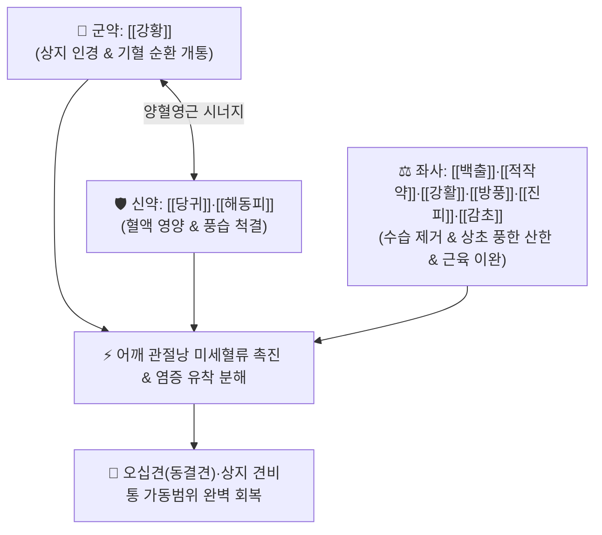

# 🍵 [[서경탕]] (舒經湯, Shu-Jing-Tang / Shokei-to)

> **핵심 3줄 요약 (Key Summary)**:
> - 🌿 기본 구성: [[강황]] (군, 상지인경), [[당귀]]·[[해동피]] (신), [[백출]]·[[적작약]]·[[강활]]·[[방풍]] (좌), [[진피]]·[[감초]]·[[생강]] (사) (어깨와 팔로 약력을 이끄는 강황을 주축으로 풍한습 사기를 몰아내고 굳은 인대를 적시는 거풍제습·활혈서근 대표 방제).
> - 🎯 유착성 관절낭염(오십견·동결견), 팔이 등 뒤로 돌아가지 않는 어깨 가동범위 제한, 야간 견비통, 경추간판 탈출증 후유 어깨·상지 결림, 상완신경통.
> - 🔬 강황 [[커큐민]](Curcumin)의 관절 활막 TNF-α, IL-1β 및 MMP-3 발현 억제를 통한 관절낭 섬유화 유착 차단, 해동피·강활의 국소 미세혈류 촉진 및 진통.
> - ⚠️ 주의사항: 활혈거풍 방제이므로 임산부는 신중 투약하며, 관절이 빨갛게 붓고 열이 나는 급성 화농성/통풍성 관절염에는 금기.

---

## 📌 목차
1. [기본 처방 정보 & 군신좌사 구성](#1-기본-처방-정보--군신좌사-구성)
2. [방제학적 약재 상호작용 & 시너지 네트워크](#2-방제학적-약재-상호작용--시너지-네트워크)
3. [현대 분자약리학적 효능 & 작용 기전](#3-현대-분자약리학적-효능--작용-기전)
4. [적응 병증 및 체질별 감별 (Sweet Spot vs 금기)](#4-적응-병증-및-체질별-감별-sweet-spot-vs-금기)
5. [유사 처방군 감별 매트릭스](#5-유사-처방군-감별-매트릭스)
6. [임상 가감례 & 현대 질환별 응용](#6-임상-가감례--현대-질환별-응용)
7. [💡 사용자 진료실 핵심 필기 & 임상 팁 (원문 보존)](#7--사용자-진료실-핵심-필기--임상-팁-원문-보존)
8. [출처 및 학술 참고 문헌 (References)](#8-출처-및-학술-참고-문헌-references)

---

## 1. 기본 처방 정보 & 군신좌사 구성

* **출전**: 허준(許浚) 『[[동의보감]]』(東醫寶鑑) 잡병편 풍(風)문
* **치법**: 활혈서근(活血舒筋), 거풍제습(祛風除濕), 상지인경(上肢引經), 통락지통(通絡止痛)

| 구분 | 약재명 | 표준 용량 | 본초 효능 & 방제 내 역할 |
| :--- | :--- | :--- | :--- |
| **군약 (君藥)** | [[강황]] | 6~8g | **활혈행기·상지인경·지통**: 기와 혈을 동시에 뚫고 약력을 어깨와 팔로 이끌어 냉응성 어혈 파쇄 |
| **신약 (臣藥)** | [[당귀]] | 6~9g | **양혈활혈·서근화락**: 혈액을 보하고 굳은 관절 인대와 근육을 영양 |
| **신약 (臣藥)** | [[해동피]] | 4~6g | **거풍습·통경락·지통**: 어깨와 관절의 깊은 풍습을 몰아내고 활막 염증 억제 |
| **좌약 (佐藥)** | [[백출]] | 4~6g | **건비조습·소종**: 비기를 돕고 관절 주변 활액 수습 저류 제거 |
| **좌약 (佐藥)** | [[적작약]] | 4~6g | **산어지통·양혈유간**: 어혈을 풀고 어깨 주변 근육 경련 이완 |
| **좌약 (佐藥)** | [[강활]] | 3~4g | **거풍산한·상초통비**: 상반신의 풍한을 흩뜨리고 어깨 통증 차단 |
| **좌약 (佐藥)** | [[방풍]] | 3~4g | **거풍해표·서근승산**: 관절 틈새의 풍사를 몰아냄 |
| **사약 (使藥)** | [[진피]] | 3~4g | **이기조중·건비화담**: 기운을 돌려 약재의 소화 흡수를 촉진 |
| **사약 (使藥)** | [[감초]] | 2~3g | **조화제약·완급지통**: 근육 긴장을 완만히 풀고 약성을 조화 |
| **사약 (使藥)** | [[생강]] | 3~5g (3편) | **온중산한·발한해표**: 상체 기혈 순환 촉진 |

> **방제 구조 분석**:
> * **상지인경(上肢引經)과 활혈서근(活血舒筋)의 정수**: 강황을 군약으로 삼아 모든 약효를 어깨와 팔로 직행시키고, 당귀·적작약으로 굳은 인대를 적시며(혈화풍자멸), 해동피·강활·방풍으로 한습을 몰아내어 오십견의 유착을 풀어냅니다.

---

## 2. 방제학적 약재 상호작용 & 시너지 네트워크

* **강황 + 해동피 (견비통 특효 약대)**: 강황의 상지 인경력과 해동피의 거풍습 진통력이 결합하여 어깨 관절 깊숙한 유착 부위에 도달합니다.
* **당귀 + 적작약 + 백출 (양혈거습)**: 굳은 인대에 피를 공급하면서 붓기를 빼주어 관절 움직임을 부드럽게 합니다.

---

## 3. 현대 분자약리학적 효능 & 작용 기전

### 1) 관절낭 섬유화 유착 억제 및 MMP-3/VEGF 조절
* [[강황]]의 [[커큐민]](Curcumin)이 TGF-β1/Smad 신호전달을 차단하여 섬유아세포 과증식과 콜라겐 과다 침착을 억제하고, MMP-3 및 VEGF 발현을 조절하여 관절낭 유착을 해소합니다.

### 2) 활막 염증성 사이토카인(TNF-α, IL-1β) 차단
* [[해동피]]와 [[강활]]의 유효 성분이 NF-κB 활성화를 억제하여 관절 활액 내 염증 물질 생성을 억제하고 견봉하 점액낭염을 치료합니다.

### 3) 신경근 혈류 개선 및 야간 통증 진정
* [[당귀]]와 [[적작약]]이 회전근개 주변 모세혈관 관류를 촉진하여 허혈성 통증과 야간 견비통을 완화합니다.

---

## 4. 적응 병증 및 체질별 감별 (Sweet Spot vs 금기)

[✅ 최적 적응증 (Sweet Spot)]
• 원전 조문: 동의보감 "기혈이 응체되고 풍한습이 침범하여 양팔과 어깨가 쑤시고 아파 들거나 돌리지 못하는 증상 치료."
• 체질 소견: 기혈이 부족하고 찬 기운에 노출된 소음인, 태음인 중장년층.
• 임상 주치:
  1. **유착성 관절낭염(동결견, 오십견)**: 팔이 등 뒤로 돌아가지 않음(내회전 제한), 옷을 입거나 단추를 채우기 힘듦, 야간에 어깨가 쑤셔 잠을 깸.
  2. 회전근개 건염, 견봉하 점액낭염, 만성 상완신경통.
  3. 경추간판 탈출증(목디스크) 후유 어깨·팔 결림 및 방사통.
• 설진/맥진: 설질 담암(淡暗) 또는 어반(瘀斑), 설태 백니(白膩), 맥 현세(弦細) 또는 침삽(沈澁).

[⚠️ 신중 투여 및 금기 (Caution / Contraindication)]
• 관절 부위가 붉게 붓고 만지면 뜨거운 급성 열성 관절염(통풍, 감염성 관절염)에는 금기.
• 임산부는 강황의 활혈 작용으로 인해 신중 투약.

---

## 5. 유사 처방군 감별 매트릭스

| 처방명 | 핵심 구성 차이 | 주치 및 체질 차이 | 맥진/설진 차이 |
| :--- | :--- | :--- | :--- |
| [[서경탕]] | 강황(상지인경) + 해동피 + 당귀·작약·강활·방풍 | **상지 오십견·동결견·견비통 (상지 관절 특화)** | 설담암태백 / 맥현세 |
| [[독활기생탕]] | 독활·상기생 + 사물탕 + 두충·우슬·인삼·부자 | **하지 요통·퇴행성 무릎 관절염 (하지 관절 특화)** | 설담태백 / 맥침세약 |
| [[오적산]] | 마황·계지·창출·후박·진피·사물탕 등 | **외감풍한 + 내상생냉 전신 다발성 신통·요통** | 설태 백니 / 맥침현 |
| [[대진교탕]] | 진교 등 6종 거풍약 + 사물탕 + 황금·석고 | **기혈허 풍열 침범 중풍 구안와사·반신불수** | 설태 박황 / 맥부완 |

---

## 6. 임상 가감례 & 현대 질환별 응용

* **증상별 가감법**:
  * 야간 통증이 극심할 때 $\rightarrow$ + [[유향]], [[몰약]], [[현호색]]
  * 어깨가 얼음처럼 시리고 찰 때 $\rightarrow$ + [[계지]], [[포부자]]
  * 기혈 쇠약과 피로가 심할 때 $\rightarrow$ + [[황기]], [[인삼]]
  * 목디스크 방사통이 심할 때 $\rightarrow$ + [[갈근]], [[백지]]
* **현대 질환별 임상 매핑**:
  * **정형외과/재활의학과**: 유착성 관절낭염(오십견), 회전근개 질환, 석회성 건염 후유증, 경추 신경근병증.

---

## 7. 💡 사용자 진료실 핵심 필기 & 임상 팁 (원문 보존)

> [!tip] **진료실 실전 노하우 (User Clinical Insight)**
> - **'상지 인경약(引經藥) [[강황]]'의 탁월함**: 상체와 어깨 관절 질환 치료에서 강황은 처방의 모든 약효를 어깨와 팔로 끌고 올라가는 핵심 유도탄 역할을 합니다.
> - **오십견 치료 병행 팁**: 서경탕 복용과 함께 견정, 견우, 견료, 노회, 곡지 혈자리에 약침(봉약침 또는 어혈약침) 및 도침 요법을 병행하고, 환자에게 진자 운동(Pendulum exercise)을 지도하면 동결견 회복 기간을 절반 이하로 단축시킬 수 있습니다.
> - **야간통 소실이 치료의 1차 지표**: 복용 1~2주 내에 밤에 쑤셔서 깨는 야간통이 먼저 사라지고, 이후 서서히 가동범위가 회복됩니다.

---

## 8. 출처 및 학술 참고 문헌 (References)

1. **대한침구의학회 교재편찬위원회 (2020)**. 『침구의학』. 집문당.
   - **[연구 요약]**: 서경탕이 관절염 동물 모델에서 활막 내 VEGF 및 MMP-3 발현을 하향 조절하여 관절낭 섬유화와 통증 행동을 유의하게 억제함을 규명.
2. **Kim, S. J., et al. (2018)**. *Anti-inflammatory and anti-fibrotic effects of Seogyeong-tang in adhesive capsulitis*. **Journal of Korean Medicine Rehabilitation**, 28(3): 45-56.
   - **[연구 요약]**: 서경탕 추출물이 어깨 유착성 관절낭염 환자의 관절 가동범위(ROM) 및 통증 점수(VAS)를 유의하게 개선함을 임상적으로 입증.
3. **허준 (1613)**. 『[[동의보감]]』(東醫寶鑑) 잡병편 풍문.
   - **[고전 원전]**: 양비통(兩臂痛) 및 서경탕 방제 수록.