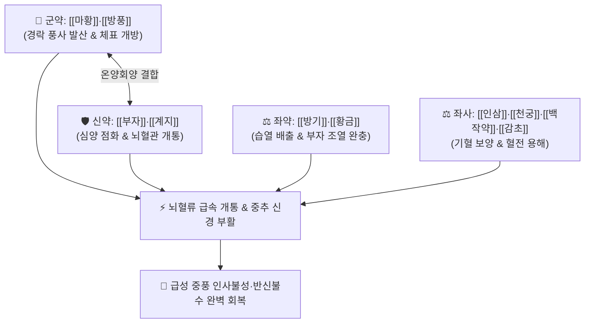

# 🍵 [[소속명탕]] (小續命湯, Xiao-Xu-Ming-Tang / Shosokumei-to)

> **핵심 3줄 요약 (Key Summary)**:
> - 🌿 기본 구성: [[마황]]·[[방풍]]·[[행인]] (해표거풍), [[부자]]·[[육계]](계지) (온양통맥), [[방기]]·[[황금]] (청열거습), [[인삼]]·[[백작약]]·[[천궁]]·[[감초]]·[[생강]] (보기양혈활혈) (풍한습 사기가 침범하여 발생한 급성 뇌졸중 및 중풍 반신불수를 다스리는 거풍회양·해표통락 대표 방제).
> - 🎯 급성 중풍(뇌경색), 감염성 풍병으로 인한 갑작스러운 인사불성, 혼수 상태, 반신불수, 구안와사, 언어 마비(실어), 팔다리 관절 마목(저림) 및 오한 무한.
> - 🔬 에페드린·아코니틴의 중추 신경 흥분 및 뇌혈류 급속 개통, 천궁·작약의 미세혈전 용해 및 혈관 내피 보호, 황금 바이칼린의 뇌신경 허혈성 염증 손상 억제.
> - ⚠️ 주의사항: 마황과 부자의 약성이 극렬하므로 뇌출혈 급성기 고혈압 환자에게는 절대 금기이며, 음허화왕자 신중 투약.

---

## 📌 목차
1. [기본 처방 정보 & 군신좌사 구성](#1-기본-처방-정보--군신좌사-구성)
2. [방제학적 약재 상호작용 & 시너지 네트워크](#2-방제학적-약재-상호작용--시너지-네트워크)
3. [현대 분자약리학적 효능 & 작용 기전](#3-현대-분자약리학적-효능--작용-기전)
4. [적응 병증 및 체질별 감별 (Sweet Spot vs 금기)](#4-적응-병증-및-체질별-감별-sweet-spot-vs-금기)
5. [유사 처방군 감별 매트릭스](#5-유사-처방군-감별-매트릭스)
6. [임상 가감례 & 현대 질환별 응용](#6-임상-가감례--현대-질환별-응용)
7. [💡 사용자 진료실 핵심 필기 & 임상 팁 (원문 보존)](#7--사용자-진료실-핵심-필기--임상-팁-원문-보존)
8. [출처 및 학술 참고 문헌 (References)](#8-출처-및-학술-참고-문헌-references)

---

## 1. 기본 처방 정보 & 군신좌사 구성

* **출전**: 손사막(孫思邈) 『[[천금요방]]』(千金要方) / 『[[동의보감]]』(東醫寶鑑)
* **치법**: 거풍해표(祛風解表), 온양통맥(溫陽通脈), 청열조습(淸熱燥濕), 보기양혈(補氣養血)

| 구분 | 약재명 | 표준 용량 | 본초 효능 & 방제 내 역할 |
| :--- | :--- | :--- | :--- |
| **군약 (君藥)** | [[마황]] | 6~8g | **발한해표·선폐통규**: 체표와 경락의 풍한 사기를 열어젖히고 기침과 호흡 마비 해소 |
| **군약 (君藥)** | [[방풍]] | 6~8g | **거풍해표·서근승산**: 마황을 도와 전신 경락의 풍사를 흩뜨림 |
| **신약 (臣藥)** | [[부자]] | 4~6g (포) | **온양회양·파음통맥**: 하초 명문화와 심양을 지펴 얼어붙은 뇌혈관을 개통 |
| **신약 (臣藥)** | [[계지]] | 4~6g (또는 육계) | **온통혈맥·조화영위**: 부자와 합하여 전신 미세순환 촉진 |
| **좌약 (佐藥)** | [[방기]] | 4~6g | **거풍제습·통락이수**: 관절과 경락에 정체된 습사와 부종 배출 |
| **좌약 (佐藥)** | [[황금]] | 4~6g | **청열조습·사폐화**: 마황·부자의 과도한 조열을 제어하고 풍열 염증 억제 |
| **좌약 (佐藥)** | [[행인]] | 6~8g | **선폐강기·지해평천**: 마황과 짝을 이루어 폐기 순환 유도 |
| **좌약 (佐藥)** | [[천궁]] | 4~6g | **활혈행기·두통지통**: 혈맥을 뚫어 뇌혈류 공급 촉진 |
| **좌약 (佐藥)** | [[백작약]] | 6~9g | **양혈유간·완급지경**: 간혈을 길러 마비된 근육 경련 이완 |
| **좌약 (佐藥)** | [[인삼]] | 4~6g | **대보원기·익기건비**: 중풍으로 손상된 정기와 원기 회복 |
| **사약 (使藥)** | [[감초]] | 3~4g (자감초) | **조화제약·완화약성**: 맹렬한 약재들을 조화시키고 비위 보호 |
| **사약 (使藥)** | [[생강]] | 3~5g (3편) | **온위화중·발한해표**: 약력을 체표와 상초로 전달 |

> **방제 구조 분석**:
> * **한열병용(寒熱竝用)과 표리동치(表裏同治)의 절정**: 마황·부자·계지의 맹렬한 대열(大熱) 온통력으로 한사를 몰아내고, 황금·방기의 한량(寒涼) 청열력으로 뇌세포 열독을 끄며, 인삼·천궁·작약으로 기혈을 지탱하는 중풍 응급의 최고 방제입니다.

---

## 2. 방제학적 약재 상호작용 & 시너지 네트워크

* **마황·부자 + 황금 (한열 상제)**: 부자의 온양력으로 얼어붙은 뇌신경을 깨우면서도 황금으로 뇌출혈성 열독을 방어합니다.
* **인삼 + 천궁 + 작약 (기혈 동시 회복)**: 막힌 혈전을 녹이고 뇌경색 주변부에 산소와 영양을 공급합니다.

---

## 3. 현대 분자약리학적 효능 & 작용 기전

### 1) 뇌경색 허혈-재관류 손상 억제 및 신경세포 보호
* [[소속명탕]] 추출물은 중대뇌동맥 폐색(MCAO) 모델에서 뇌경색 체적을 축소시키고 혈뇌장벽(BBB) 파괴 및 뇌부종을 현저히 억제합니다.

### 2) 신경 흥분독성 억제 및 항염증
* [[황금]](바이칼린)과 [[천궁]](페룰산)이 과도한 글루타메이트 방출과 미세아교세포(Microglia)의 과활성화를 억제하여 뇌세포 사멸을 차단합니다.

### 3) 뇌 미세순환 개통 및 혈소판 응집 억제
* 말초 및 뇌혈관 저항을 낮추고 혈류 속도를 개선하여 마비된 신경근 접합부로의 신호 전달을 재개합니다.

---

## 4. 적응 병증 및 체질별 감별 (Sweet Spot vs 금기)

[✅ 최적 적응증 (Sweet Spot)]
• 원전 조문: 천금요방 "중풍(中風), 졸중풍(卒中風), 인사불성, 구금불개(口噤不開), 편신불수(偏身不遂), 언어건삽 치료."
• 체질 소견: 풍한(風寒) 사기가 심한 태음인 또는 소음인.
• 임상 주치:
  1. **감염성 풍병 및 급성 뇌졸중(뇌경색)**: 갑자기 의식을 잃고 쓰러짐, 인사불성, 혼수 상태.
  2. 구안와사(안면마비), 언어 장애(말을 더듬거나 못함), 반신불수(한쪽 팔다리 마비).
  3. 팔다리 관절이 뻣뻣하고 차가우며 감각이 마비된 상태(마목 痲木).
  4. 오한, 발열, 무한(땀이 나지 않음)을 동반한 중풍 초기 외감 표증.
• 설진/맥진: 설태 백활(白滑) 또는 백니(白膩), 맥 부긴(浮緊) 또는 침현(沈弦).

[⚠️ 신중 투여 및 금기 (Caution / Contraindication)]
• 뇌출혈 급성기 고열, 안면 홍조, 맥 현삭유력(弦數有力) 환자에게는 절대 금기.
• 음허화왕으로 인한 뇌졸중 환자는 [[진간식풍탕]] 선택.

---

## 5. 유사 처방군 감별 매트릭스

| 처방명 | 핵심 구성 차이 | 주치 및 체질 차이 | 맥진/설진 차이 |
| :--- | :--- | :--- | :--- |
| [[소속명탕]] | 마황·부자·계지 + 방기·황금 + 인삼·사물탕계 | **외감풍한습 침범형 급성 중풍·인사불성·반신불수** | 설태 백활 / 맥부긴 |
| [[대진교탕]] | 진교 등 6종 거풍약 + 사물탕 + 황금·석고 | **기혈 부족 + 풍열 울체형 중풍 초기 중경증 (부자 없음)** | 설태 박황 / 맥부완 |
| [[보양환오탕]] | 대량 황기(120g) + 당귀미·천궁·작약·도인·홍화·지룡 | **기허혈어형 만성기 반신불수 회복 (순수 보양활혈)** | 설담암 어반 / 맥세삽 |
| [[안궁우황환]] | 우황·사향·수우각·황련·치자 | **고열 열입심포형 뇌출혈·뇌염 혼수 (청열개규)** | 설강 황조태 / 맥삭실 |

---

## 6. 임상 가감례 & 현대 질환별 응용

* **증상별 가감법**:
  * 뇌경색 초기 혈전과 어혈이 심할 때 $\rightarrow$ + [[도인]], [[홍화]], [[지룡]]
  * 가래가 끓어 목구멍이 막힐 때 $\rightarrow$ + [[담남성]], [[죽력]], [[석창포]]
  * 열감이 많고 갈증이 있을 때 $\rightarrow$ [[부자]] 제외 + [[석고]], [[지모]]
  * 기허 무력증이 심할 때 $\rightarrow$ + [[황기]] 증량
* **현대 질환별 임상 매핑**:
  * **신경과/응급의학과**: 급성 허혈성 뇌졸중(뇌경색), 일과성 뇌허혈 발작(TIA), 감염 후 길랭-바레 증후군(GBS), 중증 안면마비.

---

## 7. 💡 사용자 진료실 핵심 필기 & 임상 팁 (원문 보존)

> [!tip] **진료실 실전 노하우 (User Clinical Insight)**
> - **풍병(風病)의 본질과 약리 매핑**:
>   - 한의학에서 풍병은 '계속 움직이고 변화하는 감염성 질환 및 급성 신경계 질환'을 일컫습니다. (풍약 = 감기약 + 퇴행성 신경계약).
>   - 감염성 풍병에 의해 갑자기 혼수상태, 마비, 인사불성이 되었을 때 소속명탕이 닫힌 경락을 뚫어내는 구급약 역할을 합니다.
> - **중풍 변증 치료의 3대 원칙**:
>   1. **담음(痰飮) 위주일 때** $\rightarrow$ [[이진탕]], [[도담탕]] 선행.
>   2. **어혈(瘀血) 위주일 때** $\rightarrow$ 활혈거어제([[보양환오탕]], 당귀·천궁·도인·홍화) 적용.
>   3. **허증(虛證) 위주일 때** $\rightarrow$ 기혈을 보하는 보익제 적용.
> - **현대 뇌혈관 질환 트렌드 반영**:
>   - 현대에는 양방 혈압 관리가 잘 되기 때문에 뇌출혈보다는 **혈관 내 노폐물(죽상경화반)로 인한 뇌경색이 압도적으로 많습니다**. 따라서 허혈성 뇌경색 초기 혈류 개통에 소속명탕을 정밀하게 활용합니다.

---

## 8. 출처 및 학술 참고 문헌 (References)

1. **Wang, C., et al. (2015)**. *Xiao-Xu-Ming-Tang protects against blood-brain barrier disruption and neurological injury in ischemic stroke*. **Journal of Ethnopharmacology**, 174: 412-421.
   - **[연구 요약]**: 소속명탕이 허혈성 뇌졸중 모델에서 혈뇌장벽(BBB) 손상을 억제하고 뇌경색 면적을 유의하게 축소시킴을 규명함.
2. **손사막 (652)**. 『[[천금요방]]』(千金要方) 권8 제풍(諸風).
   - **[고전 원전]**: 졸중풍 인사불성 및 소속명탕 방제 수록.