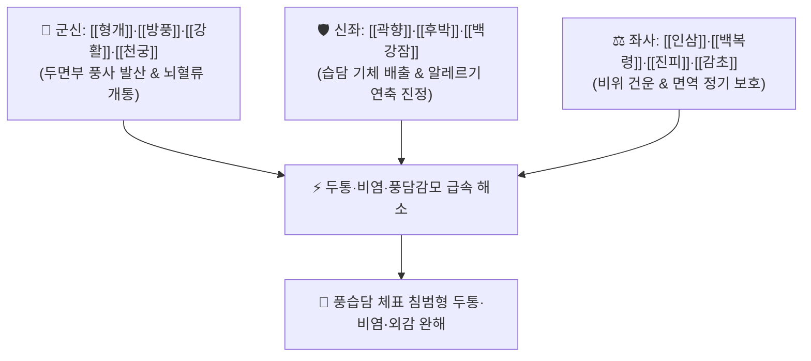

# 🍵 [[소풍산(피부외)]] (消風散-局方, Xiao-Feng-San / 국방 소풍산)

> **핵심 3줄 요약 (Key Summary)**:
> - 🌿 기본 구성: [[형개]]·[[방풍]]·[[강활]]·[[천궁]] (거풍지통), [[백강잠]]·[[곽향]]·[[후박]] (화습산결), [[인삼]]·[[백복령]]·[[진피]]·[[감초]] (보기건비이기) (외감 풍사와 습담으로 인한 두통·비염·상기도 감모를 다스리는 거풍화습·보기통락 대표 방제).
> - 🎯 풍사(風邪)가 상초 두면부와 호흡기에 침범하여 발생한 심한 편두통·정두통, 어지럼증, 코막힘·맑은 콧물(비연·비색), 피부 소양증, 풍담(風痰)성 감모.
> - 🔬 형개·방풍 모노테르펜의 비만세포 히스타민 분비 차단 및 진통, 백강잠 단백질의 신경근 과흥분 진정, 인삼·복령 다당류의 호흡기 면역 증강.
> - ⚠️ 주의사항: 거풍 발산약이 다수 포함되어 있으므로 음허내열(陰虛內熱)로 인한 만성 두통이나 혈허 건조증 환자에게는 신중 투약.

---

## 📌 목차
1. [기본 처방 정보 & 군신좌사 구성](#1-기본-처방-정보--군신좌사-구성)
2. [방제학적 약재 상호작용 & 시너지 네트워크](#2-방제학적-약재-상호작용--시너지-네트워크)
3. [현대 분자약리학적 효능 & 작용 기전](#3-현대-분자약리학적-효능--작용-기전)
4. [적응 병증 및 체질별 감별 (Sweet Spot vs 금기)](#4-적응-병증-및-체질별-감별-sweet-spot-vs-금기)
5. [유사 처방군 감별 매트릭스](#5-유사-처방군-감별-매트릭스)
6. [임상 가감례 & 현대 질환별 응용](#6-임상-가감례--현대-질환별-응용)
7. [💡 사용자 진료실 핵심 필기 & 임상 팁 (원문 보존)](#7--사용자-진료실-핵심-필기--임상-팁-원문-보존)
8. [출처 및 학술 참고 문헌 (References)](#8-출처-및-학술-참고-문헌-references)

---

## 1. 기본 처방 정보 & 군신좌사 구성

* **출전**: 『[[태평혜민화제국방]]』(太平惠民和劑局方) / 『[[동의보감]]』(東醫寶鑑)
* **치법**: 소풍해표(疏風解表), 화습통락(化濕通絡), 보기건비(補氣健脾), 산결지통(散結止痛)

| 구분 | 약재명 | 표준 용량 | 본초 효능 & 방제 내 역할 |
| :--- | :--- | :--- | :--- |
| **군약 (君藥)** | [[형개]] | 4~6g | **거풍해표·청리두목**: 두면부의 풍열을 흩뜨리고 인후·안면 소통 |
| **군약 (君藥)** | [[방풍]] | 4~6g | **소풍승산·지통**: 체표의 모든 풍사를 발산시키고 진통 |
| **신약 (臣藥)** | [[강활]] | 3~4g | **거풍산한·통비지통**: 상반신과 후두부 경락의 한사를 몰아냄 |
| **신약 (臣藥)** | [[천궁]] | 3~4g | **활혈행기·두통지통**: 혈액순환을 촉진하고 편두통 완화 |
| **좌약 (佐藥)** | [[백강잠]] | 3~4g | **식풍지경·화담산결**: 풍담을 삭이고 신경성 가려움증과 연축 진정 |
| **좌약 (佐藥)** | [[곽향]] | 3~4g | **방향화습·화위지구**: 상·중초의 탁한 습사를 날려 보내고 비위 조화 |
| **좌약 (佐藥)** | [[후박]] | 3~4g | **조습행기·온중제만**: 흉격의 가스와 습담 정체 배출 |
| **좌약 (佐藥)** | [[인삼]] | 3~4g | **대보원기·익기건비**: 정기를 도와 풍사 배출을 뒷받침 |
| **좌약 (佐藥)** | [[백복령]] | 4~6g | **건비삼습·영심안신**: 잉여 수습을 소변으로 빼내고 심신 안정 |
| **사약 (使藥)** | [[진피]] | 3~4g | **이기조중·건비화담**: 기를 돌려 소화기 체기 예방 |
| **사약 (使藥)** | [[감초]] | 2~3g | **조화제약·완화약성**: 약성을 부드럽게 조화 |

> **방제 구조 3대 그룹 분석**:
> 1. **거풍해표군**: 형개, 방풍, 강활, 천궁 (두면부 풍사 축출 및 두통 완화)
> 2. **건비보원군**: 인삼, 진피, 백복령, 감초 (사군자탕 계열로 정기 지탱)
> 3. **화습산결군**: 곽향, 후박, 백강잠 (습담 삭임 및 알레르기 연축 억제)

---

## 2. 방제학적 약재 상호작용 & 시너지 네트워크

* **거풍약 + 사군자탕 (부정거사 扶正祛邪)**: 인삼·복령으로 정기를 채우면서 형개·방풍으로 풍사를 날려 보내 허약자의 풍담 감모를 안전하게 치료합니다.

---

## 3. 현대 분자약리학적 효능 & 작용 기전

### 1) 비만세포 탈과립 억제 및 항히스타민
* [[형개]]의 멘톤과 [[방풍]]의 크로몬 성분이 비만세포막을 안정화하여 히스타민 및 류코트리엔 유리를 억제함으로써 알레르기성 비염과 피부 소양증을 완화합니다.

### 2) 뇌혈관 연축 완화 및 진통
* [[천궁]](페룰산)과 [[강활]] 정유 성분이 삼차신경-혈관 반사를 안정화하고 뇌혈관 경련을 풀어 편두통을 진정시킵니다.

### 3) 상기도 점막 면역 증강
* [[인삼]] 사포닌과 복령 베타글루칸이 점막 분비형 면역글로불린 A(sIgA) 분비를 촉진하여 바이러스 및 세균성 상기도 감염을 방어합니다.

---

## 4. 적응 병증 및 체질별 감별 (Sweet Spot vs 금기)

[✅ 최적 적응증 (Sweet Spot)]
• 원전 조문: 화제국방 "제풍(諸風) 상공(上攻), 두목혼현(頭目昏眩), 편정두통, 비색성중(鼻塞聲重), 피부소양 치료."
• 체질 소견: 기허(氣虛)가 겸해 찬바람만 쐬면 증상이 나타나는 소음인, 태음인.
• 임상 주치:
  1. 감기 후 발생한 만성 두통, 편두통, 어지럼증, 목덜미 뻣뻣함.
  2. 알레르기 비염, 코막힘, 맑은 콧물, 재채기, 맹맹한 콧소리.
  3. 풍사로 인한 전신 유주성(돌아다니는) 피부 가려움증, 두드러기.
• 설진/맥진: 설질 담(淡), 설태 백니(白膩), 맥 부완(浮緩) 또는 부현(浮弦).

[⚠️ 신중 투여 및 금기 (Caution / Contraindication)]
• 외과정종 피부과 소풍산(삼출물이 넘쳐흐르고 열감이 심한 습진)과는 완전히 다른 처방이므로 감별 필수.
• 고열성 실열 두통 환자 금기.

---

## 5. 유사 처방군 감별 매트릭스

| 처방명 | 핵심 구성 차이 | 주치 및 체질 차이 | 맥진/설진 차이 |
| :--- | :--- | :--- | :--- |
| [[소풍산(피부외)]] | 형개·방풍·강활·천궁 + 인삼·복령 + 곽향·후박 | **풍담(風痰) 상공형 두통·비염·풍담감모 (국방 소풍산)** | 설담태백니 / 맥부완 |
| [[소풍산]] | 석고·지황·당귀·우방자·창출·고삼·선태 등 | **풍습열(風濕熱) 피부과 질환 - 아토피·진물 습진 (외과정종)** | 설홍태황니 / 맥활삭 |
| [[천궁다조산]] | 천궁·백지·강활·형개·박하·세신·방풍 | **순수 외감 풍한 두통 (외감성 급성 두통 제1방)** | 설태 박백 / 맥부 |
| [[보중익기탕]] | 황기·인삼·백출·당귀·시호·승마 등 | **비기하함(脾氣下陷)형 피로·만성 무력증** | 설담태박 / 맥허대 |

---

## 6. 임상 가감례 & 현대 질환별 응용

* **증상별 가감법**:
  * 코막힘과 콧물이 극심할 때 $\rightarrow$ + [[신이화]], [[백지]]
  * 가래가 많고 기침이 동반될 때 $\rightarrow$ + [[반하]], [[행인]]
  * 두통이 극심할 때 $\rightarrow$ + [[세신]], [[고본]]
* **현대 질환별 임상 매핑**:
  * **이비인후과/신경과**: 알레르기성 비염, 혈관운동성 비염, 긴장성 두통, 편두통, 감기 후 만성 피로.

---

## 7. 💡 사용자 진료실 핵심 필기 & 임상 팁 (원문 보존)

> [!tip] **진료실 실전 노하우 (User Clinical Insight)**
> - **'국방 소풍산'과 '외과 소풍산'의 혼동 주의 (CRITICAL)**:
>   - 피부과에서 진물 나는 아토피/습진에 쓰는 처방은 『외과정종』의 [[소풍산]](석고·고삼·생지황 등 배합)입니다.
>   - 본 처방인 **국방 [[소풍산(피부외)]]은 인삼·복령·곽향·후박이 배합되어 두통, 비염, 풍담 감모, 가벼운 가려움증을 다스리는 내과/이비인후과 처방**이므로 처방 선택 시 절대 혼동하지 않아야 합니다.
> - **약재 구성의 3대 블록**:
>   - [[형개]], [[방풍]], [[강활]], [[천궁]] $\rightarrow$ 두면부 거풍지통.
>   - [[인삼]], [[진피]], [[백복령]], [[감초]] $\rightarrow$ 보기건비이기.
>   - [[곽향]], [[후박]], [[백강잠]] $\rightarrow$ 화습산결진경.

---

## 8. 출처 및 학술 참고 문헌 (References)

1. **태평혜민합제국 (1151)**. 『[[태평혜민화제국방]]』(太平惠民和劑局方).
   - **[고전 원전]**: 제풍 상공 두목혼현 및 소풍산 방제 수록.
2. **윤용갑 (2020)**. 『동의방제학』. 라움.
   - **[연구 요약]**: 국방 소풍산의 군신좌사 배오 및 외과정종 소풍산과의 변증 감별 분석.