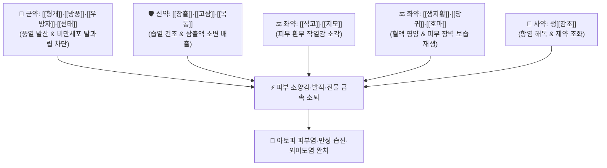

# 🍵 [[소풍산]] (消風散, Xiao-Feng-San / Shofusan)

> **핵심 3줄 요약 (Key Summary)**:
> - 🌿 기본 구성: [[형개]]·[[방풍]]·[[우방자]]·[[선태]] (소풍지양), [[창출]]·[[고삼]]·[[목통]] (청열조습), [[석고]]·[[지모]] (청열사화), [[생지황]]·[[당귀]]·[[호마]] (양혈윤조), [[감초]] (사) (풍열습 사기가 피부에 울체되어 발생하는 가려움증과 진물을 다스리는 피부과 제1명방).
> - 🎯 만성 피부 질환의 환부에 열감이 있고 소양감(가려움증)이 극심하며 삼출물(진물)이 많은 경우, [[아토피 피부염]], 급만성 피부 [[습진]], 외이도 습진, 두드러기, 접촉성 피부염.
> - 🔬 비만세포 탈과립 억제 및 항히스타민·항알레르기 작용, 고삼 마트린·황금 바이칼린의 Th2 사이토카인(IL-4, IL-13) 및 IgE 생성 억제, 피부 장벽 보습 회복.
> - ⚠️ 주의사항: 고삼·석고·목통 등 차가운 약재가 다수 포함되어 있으므로 비위허한(脾胃虛寒) 설사 환자는 신중 투약하며 임산부는 목통 용량 주의.

---

## 📌 목차
1. [기본 처방 정보 & 군신좌사 구성](#1-기본-처방-정보--군신좌사-구성)
2. [방제학적 약재 상호작용 & 시너지 네트워크](#2-방제학적-약재-상호작용--시너지-네트워크)
3. [현대 분자약리학적 효능 & 작용 기전](#3-현대-분자약리학적-효능--작용-기전)
4. [적응 병증 및 체질별 감별 (Sweet Spot vs 금기)](#4-적응-병증-및-체질별-감별-sweet-spot-vs-금기)
5. [유사 처방군 감별 매트릭스](#5-유사-처방군-감별-매트릭스)
6. [임상 가감례 & 현대 질환별 응용](#6-임상-가감례--현대-질환별-응용)
7. [💡 사용자 진료실 핵심 필기 & 임상 팁 (원문 보존)](#7--사용자-진료실-핵심-필기--임상-팁-원문-보존)
8. [출처 및 학술 참고 문헌 (References)](#8-출처-및-학술-참고-문헌-references)

---

## 1. 기본 처방 정보 & 군신좌사 구성

* **출전**: 진실공(陳實功) 『[[외과정종]]』(外科正宗) / 『[[동의보감]]』(東醫寶鑑)
* **치법**: 소풍지양(疏風止痒), 청열조습(淸熱燥濕), 양혈생진(養血生津), 양혈윤조(養血潤燥)

| 구분 | 약재명 | 표준 용량 | 본초 효능 & 방제 내 역할 |
| :--- | :--- | :--- | :--- |
| **군약 (君藥)** | [[형개]] | 4~6g | **거풍해표·투진지양**: 피부 표면의 풍열을 흩뜨리고 가려움증 억제 |
| **군약 (君藥)** | [[방풍]] | 4~6g | **소풍승산·거풍제습**: 체표 풍사를 날려 보내고 소양감 진정 |
| **군약 (君藥)** | [[우방자]] | 4~6g | **소산풍열·해독투진**: 상초와 피부의 풍열독을 배출 |
| **군약 (君藥)** | [[선태]] | 3~5g (매미허물) | **소풍청열·투진지양**: 항알레르기 특효로 피부 소양감 신속 차단 |
| **신약 (臣藥)** | [[창출]] | 4~6g | **조습건비·거풍산한**: 피부 표면의 끈적한 진물(습사 濕邪)을 말림 |
| **신약 (臣藥)** | [[고삼]] | 4~6g | **청열조습·살충지양**: 피부의 심한 습열과 가려움증을 강력 제어 |
| **신약 (臣藥)** | [[목통]] | 3~4g | **청열이수·도습하행**: 혈분의 습열을 소변으로 이끌어 배출 |
| **좌약 (佐藥)** | [[석고]] | 9~15g (생용) | **청열사화·제번**: 피부 환부의 화끈거리는 열감(작열감) 소각 |
| **좌약 (佐藥)** | [[지모]] | 4~6g | **자음청열·사화**: 석고를 도와 폐·위의 실열을 끄고 진액 보존 |
| **좌약 (佐藥)** | [[생지황]] | 6~9g | **청열양혈·생진윤조**: 혈열(血熱)을 식히고 긁어서 손상된 피부 재생 |
| **좌약 (佐藥)** | [[당귀]] | 4~6g | **양혈활혈·윤부**: 피부 미세혈류를 개선하고 가려움증 진정 |
| **좌약 (佐藥)** | [[호마]] | 4~6g (검은깨) | **자음윤조·양혈활장**: 건조해진 피부 각질층을 부드럽게 윤활 |
| **사약 (使藥)** | [[감초]] | 2~4g (생감초) | **청열해독·조화제약**: 여러 약재를 조화시키고 독성 완충 |

> **방제 구조 5대 약대 분석**:
> 1. **소풍투진**: [[형개]] + [[방풍]] + [[우방자]] + [[선태]] (피부 가려움 차단)
> 2. **청열조습**: [[창출]] + [[고삼]] + [[목통]] (진물 삭임 및 습열 배출)
> 3. **청열사화**: [[석고]] + [[지모]] (환부 작열감 및 붉은 발적 소각)
> 4. **양혈윤조**: [[생지황]] + [[당귀]] + [[호마]] (건조한 피부 보습 및 재생)
> 5. **해독조화**: 생[[감초]]

---

## 2. 방제학적 약재 상호작용 & 시너지 네트워크

* **거풍·청열·조습·양혈의 4중 복합 타격**: 풍(風)을 날리고, 열(熱)을 끄며, 습(濕)을 말리고, 혈(血)을 길러 피부 질환의 4대 병인(풍·열·습·혈조)을 동시에 종식시킵니다.

---

## 3. 현대 분자약리학적 효능 & 작용 기전

### 1) 비만세포 탈과립 억제 및 항히스타민
* [[선태]]와 [[방풍]]의 크로몬 성분, 형개의 멘톤이 IgE 매개 비만세포 탈과립을 억제하여 히스타민 유리량을 감소시키고 신경 말단 가려움 신호를 즉각 차단합니다.

### 2) Th2 사이토카인 및 IgE 생성 억제
* [[고삼]]의 마트린(Matrine)과 지황 카탈폴이 인터루킨-4(IL-4), 인터루킨-13(IL-13) 생성을 억제하여 아토피 피부염의 면역 과민 반응을 정상화합니다.

### 3) 항균 및 피부 점막 장벽 복구
* [[고삼]]과 [[생지황]]이 황색포도상구균(Staphylococcus aureus) 증식을 억제하고 피부 각질층의 필라그린(Filaggrin) 발현을 유도하여 2차 감염과 태선화를 예방합니다.

---

## 4. 적응 병증 및 체질별 감별 (Sweet Spot vs 금기)

[✅ 최적 적응증 (Sweet Spot)]
• 원전 조문: 외과정종 "풍열습독(風熱濕毒)이 피부에 맺혀 창양이 생기고 붉은 반점과 진물이 흐르며 가려움이 극심한 증상 치료."
• 체질 소견: 열과 습이 많은 태음인, 소양인 환자.
• 임상 주치:
  1. **환부에 열감이 있고 소양감이 극심하며 삼출물(진물)이 많은 피부 질환**.
  2. [[아토피 피부염]]: 긁어서 피와 진물이 나고 붉게 발적된 급성 악화기.
  3. **외이도 습진**: 귓구멍이 붓고 진물이 나며 가려워 견디기 힘든 상태.
  4. 급만성 화폐상 습진, 접촉성 피부염, 두드러기(담마진), 가려움 발진.
• 설진/맥진: 설질 홍(紅), 설태 황니(黃膩) 또는 박황(薄黃), 맥 활삭(滑數) 또는 현삭(弦數).

[⚠️ 신중 투여 및 금기 (Caution / Contraindication)]
• 피부가 몹시 건조하고 각질만 있으며 진물이 전혀 없는 순수 혈허 풍조 환자는 [[당귀음자]] 선택.
• 비위허한(脾胃虛寒)으로 설사하는 환자 신중 투약.

---

## 5. 유사 처방군 감별 매트릭스

| 처방명 | 핵심 구성 차이 | 주치 및 체질 차이 | 맥진/설진 차이 |
| :--- | :--- | :--- | :--- |
| [[소풍산]] | 형개·방풍 + 고삼·창출 + 석고·지황·호마 등 | **풍습열형 가려움 + 열감 + 진물 많은 피부염 (피부과 제1방)** | 설홍태황니 / 맥활삭 |
| [[당귀음자]] | 사물탕 + 황기·하수오·백질려·형개·방풍 등 | **혈허풍조형 건조·각질·노인성 가려움증 (진물 없음)** | 설담소태 / 맥세약 |
| [[황련해독탕]] | 황련 + 황금 + 황백 + 치자 | **화농·감염이 극심한 실열성 피부 종기·여드름 (순수 청열사화)** | 설홍태황조 / 맥활삭실 |
| [[소풍산(피부외)]] | 형개·방풍·강활·천궁 + 인삼·복령 + 곽향·후박 | **풍담(風痰) 상공형 두통·비염·외감 감모 (국방 소풍산)** | 설담태백니 / 맥부완 |

---

## 6. 임상 가감례 & 현대 질환별 응용

* **증상별 가감법**:
  * 진물이 줄줄 흐를 때 $\rightarrow$ + [[의이인]], [[지유]], [[황백]]
  * 열감이 극심하고 붉은 발적이 번질 때 $\rightarrow$ + [[금은화]], [[연교]], [[치자]]
  * 가려움증이 극심하여 피가 날 때까지 긁을 때 $\rightarrow$ + [[백선피]], [[지부자]], [[사상자]]
  * 피부가 점차 건조해질 때 $\rightarrow$ [[창출]], [[고삼]] 감량 + [[당귀]], [[하수오]] 증량
* **현대 질환별 임상 매핑**:
  * **피부과/이비인후과**: 아토피 피부염, 급만성 습진, 외이도염, 화폐상 습진, 지루성 피부염, 알레르기성 두드러기.

---

## 7. 💡 사용자 진료실 핵심 필기 & 임상 팁 (원문 보존)

> [!tip] **진료실 실전 노하우 (User Clinical Insight)**
> - **피부과 실전 처방 기준**:
>   - **만성 피부 질환의 환부에 열감이 있고, 소양감이 심하며 삼출물(진물)이 많은 경우**에 단연 최고의 적방입니다.
>   - 특히 귓속이 가렵고 진물이 고이는 **외이도 습진**, 접히는 부위가 짓무르는 [[아토피 피부염]], 긁어서 2차 감염이 우려되는 피부 [[습진]]에 탁월한 임상 효과를 냅니다.
> - **약리 작용의 3대 핵심**:
>   - 강력한 **항히스타민 및 항알레르기 작용**으로 가려움증을 초기에 차단합니다.
>   - 진물이 멎고 환부가 건조해지는 만성기로 넘어가면 [[당귀음자]]나 [[생혈윤부음]]으로 처방을 전환해야 피부 재생이 완성됩니다.

---

## 8. 출처 및 학술 참고 문헌 (References)

1. * **Long Y et al. (2026)**. Efficacy of Xiao-Feng Powder-loaded thermosensitive composite hydrogel alleviates allergic contact dermatitis by targeting complement factor B. *Phytomedicine : international journal of phytotherapy and phytopharmacology*, 156: 158258. [PMID: 42097001](https://pubmed.ncbi.nlm.nih.gov/42097001/)
3. **진실공 (1617)**. 『[[외과정종]]』(外科正宗).
   - **[고전 원전]**: 풍열습독 피부 창양 및 소풍산 13미 방제 수록.
