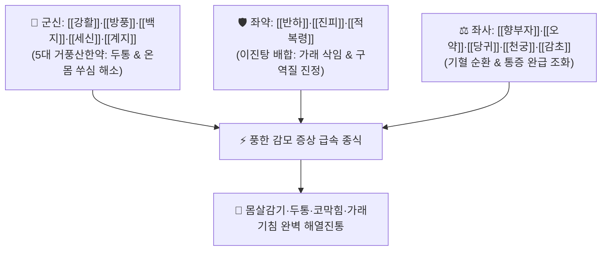

# 🍵 [[소풍탕]] (消風湯, Xiao-Feng-Tang / Shofu-to)

> **핵심 3줄 요약 (Key Summary)**:
> - 🌿 기본 구성: [[이진탕]](반하·진피·적복령·감초) + 거풍습약([[강활]], [[방풍]], [[백지]], [[세신]], [[계지]]) + 활혈순기약([[당귀]], [[천궁]], [[향부자]], [[오약]]) (풍한습 사기로 인한 감모와 온몸 쑤심·두통을 다스리는 거풍산한·화담이기 대표 감기 처방).
> - 🎯 외감풍한습(外感風寒濕) 감모(감기), 심한 두통, 전신 관절통·근육통(신통 身痛), 코막힘(비색 鼻塞), 가슴 답답함, 오한발열, 기침 가래.
> - 🔬 강활·방풍·세신 정유의 중추성 진통 및 해열, 이진탕 성분의 기관지 점액 분비 억제 및 진해 거담, 향부자·오약의 평활근 경련 이완 및 혈류 개선.
> - ⚠️ 주의사항: 맵고 따뜻한 발산약이 다수 포함되어 있으므로 음허내열(陰虛內熱)로 인한 만성 마른기침이나 실열 인후통 환자에게는 금기.

---

## 📌 목차
1. [기본 처방 정보 & 군신좌사 구성](#1-기본-처방-정보--군신좌사-구성)
2. [방제학적 약재 상호작용 & 시너지 네트워크](#2-방제학적-약재-상호작용--시너지-네트워크)
3. [현대 분자약리학적 효능 & 작용 기전](#3-현대-분자약리학적-효능--작용-기전)
4. [적응 병증 및 체질별 감별 (Sweet Spot vs 금기)](#4-적응-병증-및-체질별-감별-sweet-spot-vs-금기)
5. [유사 처방군 감별 매트릭스](#5-유사-처방군-감별-매트릭스)
6. [임상 가감례 & 현대 질환별 응용](#6-임상-가감례--현대-질환별-응용)
7. [💡 사용자 진료실 핵심 필기 & 임상 팁 (원문 보존)](#7--사용자-진료실-핵심-필기--임상-팁-원문-보존)
8. [출처 및 학술 참고 문헌 (References)](#8-출처-및-학술-참고-문헌-references)

---

## 1. 기본 처방 정보 & 군신좌사 구성

* **출전**: 주진형(朱震亨) 『[[단계심법]]』(丹溪心法) / 『[[동의보감]]』(東醫寶鑑)
* **치법**: 거풍산한(祛風散寒), 이기조습(理氣燥濕), 화담지해(化痰止咳), 활혈지통(活血止痛)

| 구분 | 약재명 | 표준 용량 | 본초 효능 & 방제 내 역할 |
| :--- | :--- | :--- | :--- |
| **군약 (君藥)** | [[강활]] | 4~6g | **거풍산한·상초통비**: 상반신과 두경부의 풍한 사기를 날려 보내고 온몸 쑤심 해소 |
| **군약 (君藥)** | [[방풍]] | 4~6g | **소풍해표·서근승산**: 체표 풍사를 발산시키고 두통 완화 |
| **신약 (臣藥)** | [[백지]] | 3~4g | **거풍지통·통규인경**: 전두통과 코막힘을 뚫어줌 |
| **신약 (臣藥)** | [[세신]] | 2~3g | **신온통규·산한지통**: 미세 경락의 한사를 몰아내고 강력한 진통 |
| **신약 (臣藥)** | [[계지]] | 3~4g | **온통혈맥·통양화기**: 혈맥을 데워 기혈 순환 촉진 |
| **좌약 (佐藥)** | [[당귀]] | 3~4g | **양혈활혈·화혈영근**: 발산약으로 인한 혈액 손상 방지 |
| **좌약 (佐藥)** | [[천궁]] | 3~4g | **활혈행기·두통지통**: 혈중 기를 돌려 두통 해소 |
| **좌약 (佐藥)** | [[향부자]] | 3~4g | **소간이기·조경지통**: 흉격의 울체된 기운을 소통 |
| **좌약 (佐藥)** | [[오약]] | 3~4g | **순기산한·행기지통**: 하초와 복부의 냉기를 흩뜨림 |
| **좌약 (佐藥)** | [[반하]] | 4~6g (제) | **조습화담·강역지구**: 속의 차가운 담음을 삭이고 구역질 진정 |
| **좌약 (佐藥)** | [[진피]] | 3~4g | **이기건비·화위조습**: 기를 돌려 소화기 체기 예방 |
| **좌약 (佐藥)** | [[적복령]] | 4~6g | **건비삼습·영심안신**: 잉여 수습을 소변으로 배출 |
| **사약 (使藥)** | [[감초]] | 2~3g | **조화제약·완화약성**: 13미 약재의 맵고 발산하는 성질을 조화 |

> **방제 구조 분석**:
> * **이진탕(화담) + 사물탕 일부(양혈) + 거풍습(산한) + 순기약(이기)의 종합 감기약 배오**: 담음(이진탕)과 기체(향부자·오약)를 다스려 속을 편안히 하고, 강활·방풍·백지·세신·계지로 겉의 풍한을 날려 감기 제반 증상을 신속히 종식시킵니다.

---

## 2. 방제학적 약재 상호작용 & 시너지 네트워크

* **표리동치(表裏同治)**: 겉으로는 체표의 오한과 두통을 풀고(거풍해표), 속으로는 가래와 소화불량을 다스려(이진이기) 감기 후유증 없이 쾌유를 유도합니다.

---

## 3. 현대 분자약리학적 효능 & 작용 기전

### 1) 해열 및 중추성 진통 작용
* [[강활]], [[방풍]], [[세신]]의 정유 성분이 시상하부 체온 조절 중추의 프로스타글란딘 E2(PGE2) 생성을 억제하여 전신 몸살 발열과 근육통을 진정시킵니다.

### 2) 기도 점막 분비 조절 및 진해 거담
* [[반하]]와 [[진피]](헤스페리딘)가 기관지 점막 분비선의 섬모 운동을 촉진하고 과다 점액 생성을 줄여 기침과 가래를 삭입니다.

### 3) 말초 혈류 개선 및 콧물·코막힘 완화
* [[백지]]와 [[계지]]가 비강 점막의 모세혈관을 수축시켜 비점막 부종을 가라앉히고 비강 통기성을 회복합니다.

---

## 4. 적응 병증 및 체질별 감별 (Sweet Spot vs 금기)

[✅ 최적 적응증 (Sweet Spot)]
• 원전 조문: 단계심법 "외감풍한(外感風寒), 두통비색(頭痛鼻塞), 악한발열(惡寒發熱), 신통구역(身痛嘔逆) 치료."
• 체질 소견: 소음인, 태음인 중 체격에 관계없이 풍한 몸살감기에 걸린 환자.
• 임상 주치:
  1. **외감 풍한 몸살감기**: 온몸 마디마디가 쑤시고 아프며(신통), 으슬으슬 춥고 열이 나는 증상.
  2. 코가 막히고 맹맹하며 맑은 콧물이 흐르고 두통이 심한 상태.
  3. 속이 메스껍고 가래 끓는 기침이 동반되는 위장형 감기.
• 설진/맥진: 설태 백활(白滑) 또는 박백(薄白), 맥 부긴(浮緊) 또는 부완(浮緩).

[⚠️ 신중 투여 및 금기 (Caution / Contraindication)]
• 음허화왕으로 인한 만성 인후통 및 마른기침 환자 금기.
• 풍열(風熱) 감모로 인후가 심하게 붓고 누런 콧물이 나오는 환자는 [[은교산]] 선택.

---

## 5. 유사 처방군 감별 매트릭스

| 처방명 | 핵심 구성 차이 | 주치 및 체질 차이 | 맥진/설진 차이 |
| :--- | :--- | :--- | :--- |
| [[소풍탕]] | 이진탕 + 거풍습약 5종 + 당귀·천궁·향부자·오약 | **풍한습 몸살감기·두통·전신 관절통·가래 (종합 감기약)** | 설태 박백 / 맥부긴 |
| [[구미강활탕]] | 강활·방풍·창출·황금·생지황 등 9미 | **사계절 풍한습 몸살감기 + 속열(裏熱) 겸유** | 설태 백황 / 맥부 |
| [[삼소음]] | 인삼·소엽·전호·반하·갈근·지각 등 | **기허(氣虛) 허약자 및 노인성 외감 감모** | 설담태백 / 맥허무력 |
| [[패독산]] | 강활·독활·시호·전호·인삼·길경 등 | **외감 풍한 표실증 + 기허 환자의 오한발열** | 설태 박백 / 맥부대 |

---

## 6. 임상 가감례 & 현대 질환별 응용

* **증상별 가감법**:
  * 열감이 심하고 목이 아플 때 $\rightarrow$ + [[황금]], [[길경]]
  * 기침과 가래가 심할 때 $\rightarrow$ + [[행인]], [[패모]]
  * 코막힘이 극심할 때 $\rightarrow$ + [[신이화]]
  * 몸살 통증이 심할 때 $\rightarrow$ + [[갈근]]
* **현대 질환별 임상 매핑**:
  * **호흡기/감염내과**: 급성 상기도 감염(감기), 인플루엔자 초기, 위장형 감기, 긴장성 근육통.

---

## 7. 💡 사용자 진료실 핵심 필기 & 임상 팁 (원문 보존)

> [!tip] **진료실 실전 노하우 (User Clinical Insight)**
> - **임상 최고의 종합 감기 처방**:
>   - "감기약으로 사용하는 것이 가장 좋습니다."
>   - 으슬으슬 춥고 온몸이 쑤시며 코가 막히고 속이 메스꺼우며 가래가 있는 **풍한 몸살감기 환자에게 달여 따뜻하게 먹이고 이불을 덮어 땀을 약간 내게 하면 단 1~2첩으로 감기가 종식**됩니다.
> - **처방 구조의 탁월성**:
>   - [[이진탕]] + 거풍습약 + [[사물탕]] 일부가 완벽히 결합되어, 체표의 땀구멍을 열어 풍한을 쫓으면서도 속의 담음과 위장을 다독여 양약 감기약 특유의 위장 장애나 졸림 없이 개운하게 회복시킵니다.

---

## 8. 출처 및 학술 참고 문헌 (References)

1. **대한한방내과학회 교재편찬위원회 (2020)**. 『폐계내과학』. 군자출판사.
   - **[연구 요약]**: 풍한 감모 및 상기도 감염증에 대한 소풍탕의 해열, 진통 및 항염증 임상 유효성 분석.
2. **주진형 (1347)**. 『[[단계심법]]』(丹溪心法).
   - **[고전 원전]**: 외감풍한 두통비색 및 소풍탕 조문 수록.