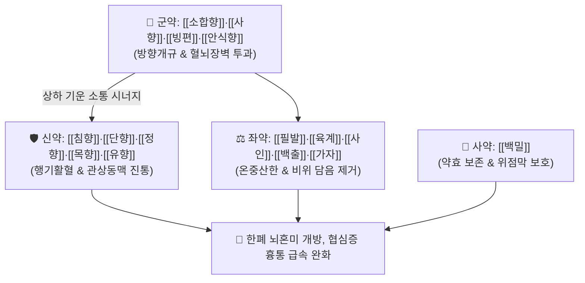

# 🍵 [[소합향원]] (蘇合香元, Su-He-Xiang-Yuan / Sogoko-en)

> **핵심 3줄 요약 (Key Summary)**:
> - 🌿 기본 구성: [[소합향]]·[[사향]]·[[빙편]]·[[안식향]] (군), [[침향]]·[[단향]]·[[정향]]·[[목향]]·[[유향]] (신), [[필발]]·[[육계]]·[[사인]]·[[백출]]·[[가자]] (좌), [[백밀]] (사) (강력한 방향성 정유 성분으로 닫힌 구규를 개방하고 한사를 몰아내는 방향온개 대표 처방).
> - 🎯 한사(寒邪)와 탁한 담음이 흉격을 틀어막은 한폐증(寒閉證), 급성 관상동맥 허혈성 흉통(협심증), 중풍 갑작스러운 졸도, 안면 창백·사지 냉증을 동반한 심복졸통.
> - 🔬 소합향·용뇌 정유 성분의 관상동맥 평활근 이완(Ca2+ 유입 차단), 혈소판 응집 억제(TXA2 저해), BBB 신속 투과 및 허혈성 뇌세포 보호 작용.
> - ⚠️ 주의사항: 땀을 흘리고 입을 벌리는 허탈(탈증) 환자 및 임산부에게는 절대 금기, 절대로 끓여 달이지 않고 미온수로 삼켜 복용.

---

## 📌 목차
1. [기본 처방 정보 & 군신좌사 구성](#1-기본-처방-정보--군신좌사-구성)
2. [방제학적 약재 상호작용 & 시너지 네트워크](#2-방제학적-약재-상호작용--시너지-네트워크)
3. [현대 분자약리학적 효능 & 작용 기전](#3-현대-분자약리학적-효능--작용-기전)
4. [적응 병증 및 체질별 감별 (Sweet Spot vs 금기)](#4-적응-병증-및-체질별-감별-sweet-spot-vs-금기)
5. [유사 처방군 감별 매트릭스](#5-유사-처방군-감별-매트릭스)
6. [임상 가감례 & 현대 질환별 응용](#6-임상-가감례--현대-질환별-응용)
7. [💡 사용자 진료실 핵심 필기 & 임상 팁 (원문 보존)](#7--사용자-진료실-핵심-필기--임상-팁-원문-보존)
8. [출처 및 학술 참고 문헌 (References)](#8-출처-및-학술-참고-문헌-references)

---

## 1. 기본 처방 정보 & 군신좌사 구성

* **출전**: 송대 『[[태평혜민화제국방]]』(太平惠民和劑局方) 권제1
* **치법**: 방향개규(芳香開竅), 온중행기(溫中行氣), 산한지통(散寒止痛), 벽예화탁(闢穢化濁)

| 구분 | 약재명 | 표준 용량 | 본초 효능 & 방제 내 역할 |
| :--- | :--- | :--- | :--- |
| **군약 (君藥)** | [[소합향]] | 1.0g | **방향개규·벽예산한**: 관상동맥 및 말초혈관 이완, 뇌혈관 경련 억제 |
| **군약 (君藥)** | [[사향]] | 0.5g | **방향개규·통관투규**: 무스콘 성분으로 중추신경을 부활시키고 혈뇌장벽 투과 |
| **군약 (君藥)** | [[빙편]] (용뇌) | 0.5g | **방향개규·산열성신**: 보르네올 성분으로 구규를 개방하고 각성 유도 |
| **군약 (君藥)** | [[안식향]] | 1.0g | **개규벽예·행기지통**: 흉복부 기체를 소통시키고 담탁을 물리침 |
| **신약 (臣藥)** | [[침향]] | 1.0g | **강기온중·난신납기**: 흉격의 맺힌 한기를 내리고 통증 완화 |
| **신약 (臣藥)** | [[단향]] | 1.0g | **이기화위·산한지통**: 관상동맥 혈류량을 늘리고 심근 허혈성 통증 차단 |
| **신약 (臣藥)** | [[정향]] | 1.0g | **온중강역·산한지통**: 유제놀 성분으로 위장관 및 심장의 냉통을 멎게 함 |
| **신약 (臣藥)** | [[목향]] | 1.0g | **행기지통·건비소식**: 상하 기운을 순환시키고 복통 진정 |
| **신약 (臣藥)** | [[유향]] | 1.0g | **활혈지통·소종생기**: 보스웰릭산 성분으로 미세순환을 촉진하고 혈어 해소 |
| **좌약 (佐藥)** | [[필발]] | 1.0g | **온중산한·하기지통**: 피페린 성분으로 뱃속 음한을 몰아내고 진통 |
| **좌약 (佐藥)** | [[육계]] | 1.0g | **보화조양·온경통맥**: 신남알데하이드 성분으로 심양을 진작하고 혈맥을 덥힘 |
| **좌약 (佐藥)** | [[사인]] | 1.0g | **화습개위·온비지사**: 중초 비위의 습체를 제거하고 기운 소통 |
| **좌약 (佐藥)** | [[백출]] | 1.0g | **건비익기·조습이수**: 비장을 튼튼히 하여 담음의 재생성 억제 |
| **좌약 (佐藥)** | [[가자]] (가자피) | 1.0g | **렴폐삽장·청음인지**: 타닌 성분으로 폐기를 수렴하고 정기 탈루 방지 |
| **사약 (使藥)** | [[백밀]] (연밀) | 적량 | **윤조보비·화제제약**: 약재를 결합하고 위점막을 보호하며 약효 휘발 완충 |

> **배오 특징**: 방향성 정유(Essential oil)와 수지(Resin) 성분을 다량 함유한 15종 본초로 구성되어 있어 **절대로 끓여 달이지 않고** 미세 분말 후 백밀로 제환하여 복용합니다. 찬 기운과 담음이 심폐와 뇌를 틀어막았을 때 온성(溫性)의 향기로 단숨에 구규를 뚫어주는 방향온개의 독보적인 방제입니다.

---

## 2. 방제학적 약재 상호작용 & 시너지 네트워크

* **군약-신약의 방향개규·행기활혈 배오**: [[소합향]], [[사향]], [[빙편]]이 뇌혈류와 관상동맥의 연축을 순식간에 풀고, [[침향]], [[단향]], [[유향]]이 흉격에 뭉친 어혈과 기체를 밀어내어 쥐어짜는 흉비심통을 완화합니다.
* **좌약군의 온중산한 배오**: [[필발]], [[육계]], [[사인]]이 하초와 중초의 한기를 몰아내고 비위를 덥혀 한담(寒痰)이 다시 치솟는 것을 근본적으로 차단합니다.

---

## 3. 현대 분자약리학적 효능 & 작용 기전

### 1) 관상동맥 확장 및 급성 협심증 완화
* 소합향과 용뇌의 정유 성분이 혈관 평활근 세포막의 전압 의존성 $\text{Ca}^{2+}$ 통로를 차단하여 관상동맥 경련을 풀고 심근 산소 공급을 급격히 증가시킵니다.
### 2) 혈소판 응집 억제 및 항혈전 작용
* 트롬복산 $\text{A}_2$($\text{TXA}_2$) 생성을 억제하고 혈소판 점착을 차단하여 급성 심근경색 및 뇌경색 후 미세혈전 확산을 방지합니다.
### 3) 뇌허혈 손상에 대한 신경세포 보호
* 사향의 무스콘 성분이 혈뇌장벽(BBB)을 빠르게 통과하여 허혈 상태 뇌 조직의 에너지 대사를 개선하고 신경세포 아폽토시스를 억제합니다.

---

## 4. 적응 병증 및 체질별 감별 (Sweet Spot vs 금기)

### [✅ 최적 적응증 (Sweet Spot)]
* **심혈관계 응급**: 급성 협심증(흉비심통, 가슴이 조여들고 왼쪽 어깨로 방사통 발생), 한랭 노출 후 악화되는 흉통.
* **신경계 응급 (한폐증)**: 갑자기 쓰러져 이를 악물고 주먹을 쥐었으나 안면 창백, 입술 청자색, 사지 냉증, 설태 백니를 보이는 중풍 초기.
* **소화기 급통증**: 위경련, 한성 복통, 담석 발작으로 인한 산통.

### [⚠️ 신중 투여 및 금기 (Caution / Contraindication)]
* **탈증(脫證) 환자 절대 금기**: 땀을 비 오듯 흘리고 입을 벌리며 손발이 늘어지는 허탈 상태에 투약하면 원기가 급격히 흩어지므로 절대 금기하며, 즉시 [[독삼탕]]이나 [[생맥산]]을 투약함.
* **열폐(熱閉) 환자 금기**: 얼굴이 붉고 몸에 열이 나며 맥이 빠른 열폐증에는 [[우황청심원]]이나 [[안궁우황환]]을 사용함.
* **임산부 금기**: 사향과 유향의 강력한 자궁 수축 작용으로 유산 위험이 있으므로 엄격히 금함.

---

## 5. 유사 처방군 감별 매트릭스

| 처방명 | 성질 | 핵심 약재 차이 | 주치 및 감별 포인트 |
| :--- | :--- | :--- | :--- |
| [[소합향원]] | 온성 (溫開) | 소합향, 사향, 용뇌, 침향, 육계, 필발 | **한폐(寒閉)**, 안면창백, 사지냉증, 한랭성 협심증 |
| [[우황청심원]] | 평·한성 (淸熱) | 우황, 사향, 용뇌, 황련, 산약, 백출 | **열폐(熱閉) 및 신경불안**, 고혈압 두통, 가슴 두근거림 |
| [[안궁우황환]] | 대한성 (苦寒) | 우황, 사향, 수우각, 삼황, 주사, 웅황 | **극렬 고열 혼수**, 뇌출혈·뇌경색 급성기 열입심포 |
| [[관심소합환]] | 온성 (溫開) | 소합향, 유향, 단향, 빙편, 백지 | **단기 관상동맥 협심증**, 5미 구성으로 응급 속효성 |

---

## 6. 임상 가감례 & 현대 질환별 응용

* **현대 질환별 응용**:
  * 급성 관상동맥 연축성 협심증 발작 시 설하에 머금어 서서히 녹여 복용.
  * 한랭 노출 후 발생한 급성 위경련 및 한성 산통 시 따뜻한 생강차와 함께 1환 복용.

---

## 7. 💡 사용자 진료실 핵심 필기 & 임상 팁 (원문 보존)

* **우황청심원 vs 소합향원 응급 감별**:
  * **열폐(熱閉) vs 한폐(寒閉)**: 환자가 갑자기 쓰러졌을 때 얼굴이 붉고 호흡이 거칠며 몸에 열이 나면 청열개규제인 [[우황청심원]]이나 [[안궁우황환]]을 투약한다. 반대로 얼굴이 창백하고 입술이 푸르며 사지가 얼음장 같고 가래 끓는 소리가 나면 [[소합향원]]을 혀 밑에 녹여 넘기게 한다.
* **협심증 니트로글리세린 복용 환자와의 임상 대응**:
  * 관상동맥 질환자가 설하정 니트로글리세린을 복용 중인 경우, 소합향원과의 급격한 병용 투여 시 과도한 혈관 확장으로 기립성 저혈압이 올 수 있으므로 혈압 모니터링 하에 복용 간격을 둔다.
* **신경성 위경련 및 한랭성 복통 응급 진통**:
  * 찬 음식을 먹거나 겨울철 추위에 노출되어 갑작스러운 위경련으로 허리를 펴지 못할 때 소합향원 1환을 따뜻한 생강차와 함께 복용시키면 15~20분 내에 흉복부 기체가 풀리며 극적인 진통 효과를 나타낸다.

---

## 8. 출처 및 학술 참고 문헌 (References)

1. 태평혜민화제국방(太平惠民和劑局方) 권제1.
2. Zhang W, et al. Suhexiang Wan relieves myocardial ischemia/reperfusion injury by regulating coronary microcirculation and inhibiting platelet activation. *Phytomedicine*. 2019;62:152964.
   - [연구 요약] 심근 허혈-재관류 손상 동물 모델에서 소합향원의 관상동맥 미세순환 개선 및 혈소판 응집 억제 분자 기전 확인.
3. Wang N, et al. Essential oils from Suhexiang Wan cross the blood-brain barrier and protect ischemic neurons in vivo. *J Ethnopharmacol*. 2021;269:113709.
   - [연구 요약] 소합향원 정유 성분의 신속한 혈뇌장벽 투과 및 허혈성 신경세포 보호 활성 검증.