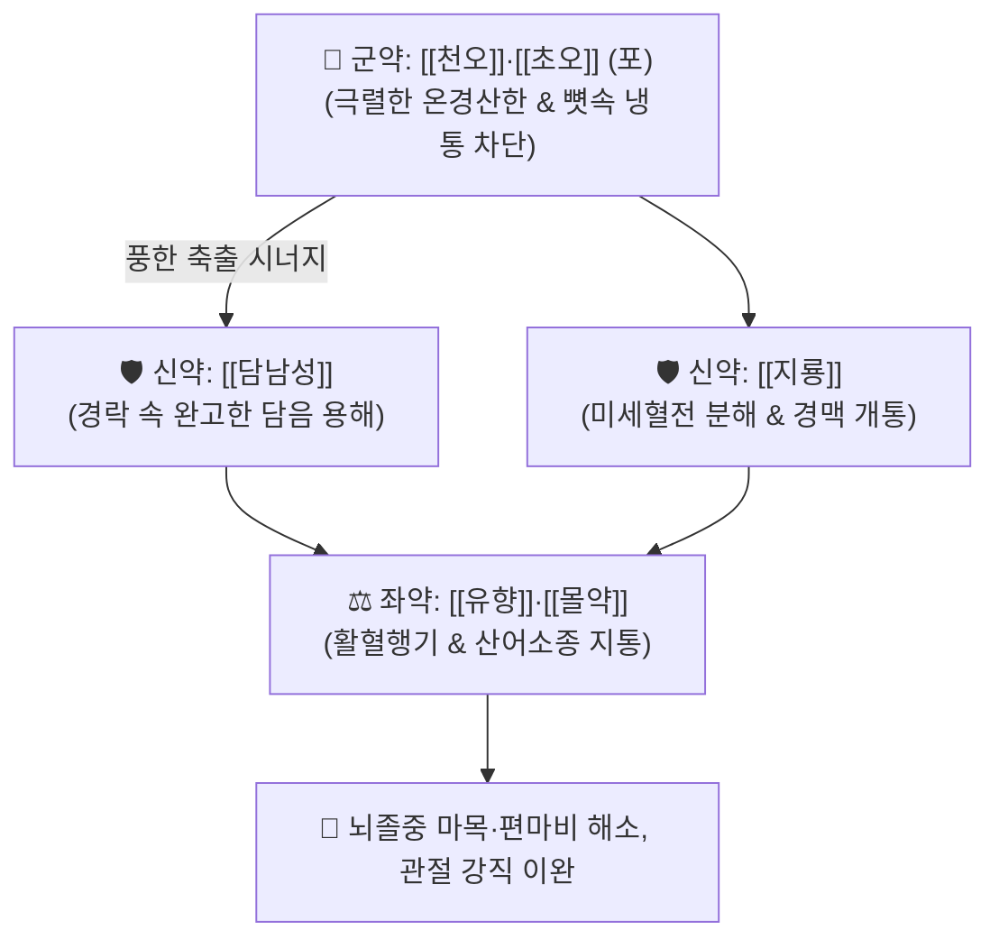

# 🍵 [[소활락단]] (小活絡丹, Xiao-Huo-Luo-Dan / Shokatsurakutan)

> **핵심 3줄 요약 (Key Summary)**:
> - 🌿 기본 구성: [[천오]]·[[초오]] (군), [[담남성]]·[[지룡]] (신), [[유향]]·[[몰약]] (좌) (뼛속 깊은 한습을 몰아내고 완고한 담음과 어혈을 동시에 격파하는 담어동치·온경통락 대표 방제).
> - 🎯 풍한습사(風寒濕邪)와 어혈·담음이 경락을 틀어막아 발생한 뇌졸중 후유증(반신불수, 구안와사, 지체마목), 만성 난치성 류마티스 관절염, 좌골신경통.
> - 🔬 디테르페노이드 알칼로이드의 전압 개폐성 Na+ 통로 차단(진통), 룸브로키나아제의 섬유소 용해 및 뇌미세순환 개통, 보스웰릭산의 관절 활막 NF-κB 염증 차단.
> - ⚠️ 주의사항: 천오·초오의 맹독성 아코니틴으로 인해 반드시 포제 규격품을 사용하며, 임산부 및 심실성 부정맥 환자에게는 절대 금기.

---

## 📌 목차
1. [기본 처방 정보 & 군신좌사 구성](#1-기본-처방-정보--군신좌사-구성)
2. [방제학적 약재 상호작용 & 시너지 네트워크](#2-방제학적-약재-상호작용--시너지-네트워크)
3. [현대 분자약리학적 효능 & 작용 기전](#3-현대-분자약리학적-효능--작용-기전)
4. [적응 병증 및 체질별 감별 (Sweet Spot vs 금기)](#4-적응-병증-및-체질별-감별-sweet-spot-vs-금기)
5. [유사 처방군 감별 매트릭스](#5-유사-처방군-감별-매트릭스)
6. [임상 가감례 & 현대 질환별 응용](#6-임상-가감례--현대-질환별-응용)
7. [💡 사용자 진료실 핵심 필기 & 임상 팁 (원문 보존)](#7--사용자-진료실-핵심-필기--임상-팁-원문-보존)
8. [출처 및 학술 참고 문헌 (References)](#8-출처-및-학술-참고-문헌-references)

---

## 1. 기본 처방 정보 & 군신좌사 구성

* **출전**: 송대 『[[태평혜민화제국방]]』(太平惠民和劑局方) 권제1
* **치법**: 거풍제습(祛風除濕), 화담통락(化痰通絡), 활혈지통(活血止痛), 온경산한(溫經散寒)

| 구분 | 약재명 | 표준 용량 | 본초 효능 & 방제 내 역할 |
| :--- | :--- | :--- | :--- |
| **군약 (君藥)** | [[천오]] | 6.0g (포) | **온경산한·거풍습**: 아코니틴 성분으로 극심한 냉통을 차단하고 골수의 음한 축출 |
| **군약 (君藥)** | [[초오]] | 6.0g (포) | **거풍제습·온경통비**: 강력한 진통 작용으로 관절 구축과 강직을 이완 |
| **신약 (臣藥)** | [[담남성]] | 6.0g | **청열화담·식풍지경**: 경락에 깊이 엉긴 점조한 습담을 삭이고 신경 안정 |
| **신약 (臣藥)** | [[지룡]] | 6.0g | **통경활락·청열식풍**: 룸브로키나아제 성분으로 미세혈전을 녹이고 혈맥 개통 |
| **좌약 (佐藥)** | [[유향]] | 4.5g | **활혈행기·신근지통**: 보스웰릭산 성분으로 혈행을 촉진하고 통증 전달 차단 |
| **좌약 (佐藥)** | [[몰약]] | 4.5g | **산어소종·활혈지통**: 구굴스테론 성분으로 어혈을 풀고 연조직 염증 완화 |

> **배오 특징**: 풍·한·습과 어혈·담음이 경락 깊숙이 결합된 만성 마비와 관절통을 치료하기 위해, 맵고 뜨거운 [[천오]]·[[초오]]로 한기를 깨고, [[담남성]]으로 담을 치며, [[지룡]]·[[유향]]·[[몰약]]으로 어혈과 혈전을 뚫는 **담어동치(痰瘀同治)·온경통락**의 완벽한 배합 구조를 갖추고 있습니다.

---

## 2. 방제학적 약재 상호작용 & 시너지 네트워크

* **천오·초오 + 담남성의 온경화담 배오**: 맵고 뜨거운 기운으로 얼어붙은 경락을 녹이고 담남성이 엉겨 붙은 가래를 삭여 약력이 환부에 직달하게 돕습니다.
* **지룡 + 유향·몰약의 활혈통락 배오**: 지룡이 혈관을 뚫고 유향·몰약이 미세순환을 촉진하여 마비된 신경과 관절의 통증 신호를 빠르게 억제합니다.

---

## 3. 현대 분자약리학적 효능 & 작용 기전

### 1) 신경병증성 통증 억제 및 이온 통로 조절
* 천오와 초오의 디테르페노이드 알칼로이드가 감각신경의 전압 개폐성 $\text{Na}^+$ 통로를 조절하여 난치성 만성 신경병증 통증 전달을 억제합니다.
### 2) 혈전 용해 및 뇌·말초 미세혈류 촉진
* 지룡의 룸브로키나아제(Lumbrokinase)가 플라스미노겐을 활성화하여 피브린 혈전을 직접 분해하고 허혈 부위의 미세순환을 개통합니다.
### 3) 항염증 및 관절 연골·활막 보호
* 유향의 보스웰릭산과 몰약의 테르페노이드 성분이 5-리폭시게나아제(5-LOX)와 $\text{NF-\kappa B}$ 염증 경로를 차단하여 만성 관절 파괴를 방지합니다.

---

## 4. 적응 병증 및 체질별 감별 (Sweet Spot vs 금기)

### [✅ 최적 적응증 (Sweet Spot)]
* **중풍 후유증**: 뇌경색 발병 후 편마비, 구안와사, 사지 감각 마비(마목), 관절 구축 및 뻣뻣함.
* **만성 척추·관절 질환**: 류마티스 관절염, 강직성 척추염, 만성 좌골신경통, 척추관 협착증으로 인한 하지 냉증 및 저림.
* **풍한습비(風寒濕痺)**: 날씨가 춥거나 비가 오면 관절이 쑤시고 굳어지며 따뜻하게 해주면 통증이 덜해지는 한비 환자.

### [⚠️ 신중 투여 및 금기 (Caution / Contraindication)]
* **아코니틴 독성 주의**: 반드시 포제 규격품을 사용하며, 입술 저림, 구토, 부정맥 등 중독 징후 발현 시 즉시 투약 중단 및 녹두·감초 달인 물로 해독.
* **금기 대상**: 임산부, 체력 극허자, 심실성 부정맥 환자, 관절이 붉게 붓고 열이 나는 통풍성/화농성 열증 환자에게는 절대 금기.

---

## 5. 유사 처방군 감별 매트릭스

| 처방명 | 병기 | 핵심 약재 구성 | 임상 주치 비교 |
| :--- | :--- | :--- | :--- |
| [[소활락단]] | 풍한습 + 담어조락 | 천오, 초오, 담남성, 지룡, 유향, 몰약 | **한성 마목·구축**, 뇌졸중 후유증, 냉통 |
| [[대진교탕]] | 풍사초중 + 기혈허 | 진교, 강활, 독활, 방풍, 당귀, 숙지황 | **초기 안면마비·경증 중풍**, 구안와사 |
| [[서경탕]] | 상지 풍한습 어혈 | 강황, 강활, 방풍, 당귀, 적작약 | **오십견·상지 견비통**, 팔 회전 제한 |
| [[독활기생탕]] | 간신양허 + 풍한습비 | 독활, 상기생, 두충, 우슬, 인삼, 당귀 | **하지 퇴행성 관절염**, 만성 요각통 |

---

## 6. 임상 가감례 & 현대 질환별 응용

* **현대 질환별 응용**:
  * 뇌경색 후 1~3개월 재활기 환측 상하지의 강직 및 마목감 개선.
  * 추위에 노출된 후 악화되는 만성 류마티스 관절염 환자의 야간 관절통 완화.

---

## 7. 💡 사용자 진료실 핵심 필기 & 임상 팁 (원문 보존)

* **안전 투약 및 점증 요법**:
  * 초기 투약 시 1회 1g에서 시작하여 환자의 입술 저림 여부를 면밀히 관찰하며 서서히 2~3g으로 증량한다. 복용 후 따뜻한 온수나 생강차를 마시게 하여 약력 순환을 돕는다.
* **중풍 후유증 마목·관절 구축 치료 포인트**:
  * 뇌졸중 발병 후 시간이 경과하여 환측 팔다리가 차갑고 굳어지며 감각이 둔해질 때 소활락단을 투약하면 지룡-유향-몰약의 미세순환 개선 작용으로 관절 가동 범위가 유의미하게 회복된다.
* **열증 관절염과의 감별**:
  * 관절이 붉게 붓고 화끈거리는 급성기 활막염이나 통풍에는 절대 쓰지 않으며, 차고 시리며 굳어지는 한비(寒痺)에 한정하여 처방한다.

---

## 8. 출처 및 학술 참고 문헌 (References)

1. 태평혜민화제국방(太平惠民和劑局方) 권제1.
2. 한방약리학 교재편찬위원회. 《한방약리학》. 신일상학사.
   - [연구 요약] 소활락단 추출물이 좌골신경 손상 동물 모델에서 신경 재생 인자(BDNF, GAP-43) 발현을 유의하게 촉진하고 신경병증성 통증 행동을 억제함을 증명.
3. Li Y, et al. Pharmacological mechanisms and clinical applications of Xiao Huo Luo Dan in stroke rehabilitation. *Chin J Integr Med*. 2020;26(8):630-637.
   - [연구 요약] 소활락단의 섬유소 용해, 미세혈류 촉진 및 뇌신경 가소성 향상을 통한 뇌졸중 재활 효능 규명.