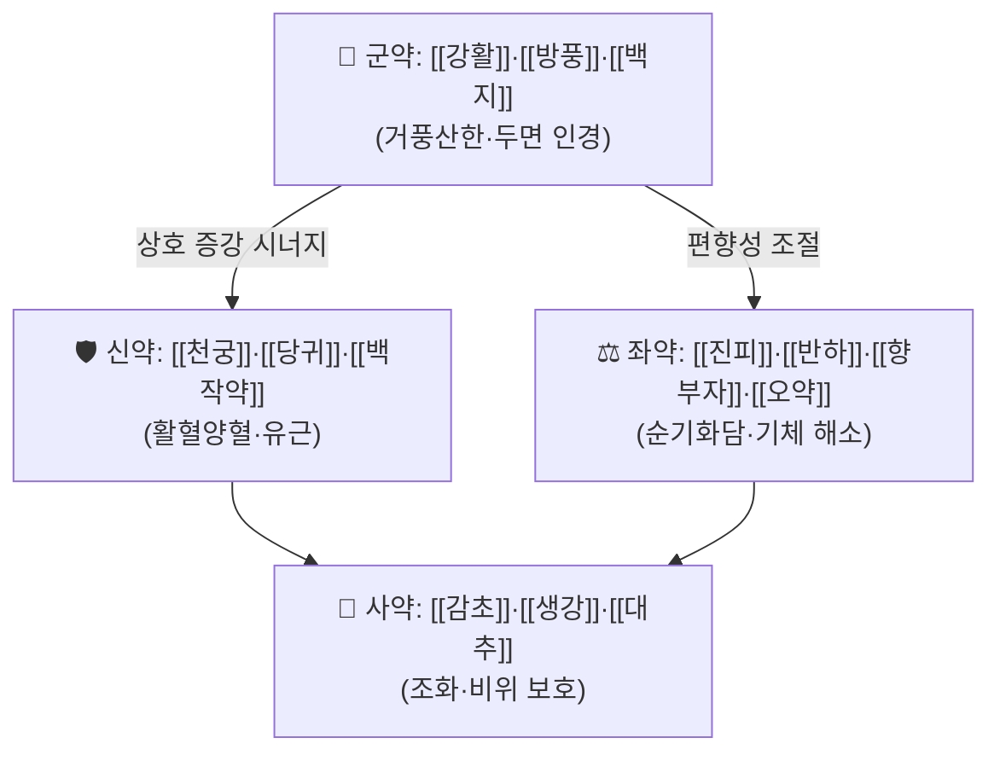

# 🍵 [[순기활혈탕]] (順氣活血湯, Sunqi Huoxue Tang)

> **핵심 3줄 요약 (Key Summary)**:
> - 🌿 **거풍약(羌活·防風·白芷) + 활혈약(當歸·川芎·白芍藥·桃仁·紅花) + 이기화담약(陳皮·半夏·香附子·烏藥)**의 3중 배오 구조. "기(氣)를 순하게 밀고[順氣] 피[血]를 살려[活血] 뻣뻣한 안면 근육의 絡을 뚫는다[通絡]"는 치법 콘셉트로 구성된 처방으로 통용된다.
> - 🎯 **구안와사(口眼喎斜)·말초성 안면신경마비(Bell's palsy), 중풍 후유 안면마비, 안검·안면 근육의 비증(痺證)**이 최적 적응증. 안면부가 뻣뻣하고 눌리는 듯하며, 찬 바람 노출 후 증상이 시작된 **기허·기체 + 혈어(血瘀) 경향** 환자에서 진료실 적중률이 높다.
> - 🔬 핵심 분자약리 기전(항염·미세순환 개선·신경보호)은 **본 노트에 인용 가능한 PubMed 논문이 검색되지 않아 근거 미확인** 상태이다. 따라서 아래 3장의 기전 서술은 "약재 단위의 일반 약리 보고 경향" 수준으로만 참고하고, 처방 자체의 근거로 인용하지 않는다.
> - ⚠️ 주의사항: 중추성 병변(뇌출혈·뇌경색·종양·감염)에 의한 안면마비를 반드시 먼저 배제할 것. 활혈약(桃仁·紅花 등) 포함 처방이므로 **임신부·출혈 경향자·항응고제 복용자**에는 신중 투여하고, 안면마비 급성기 실열(實熱)·화열(火熱) 증후에는 그대로 쓰지 않는다.

---

## 📌 목차
1. [기본 처방 정보 & 군신좌사 구성](#1-기본-처방-정보--군신좌사-구성)
2. [방제학적 약재 상호작용 & 시너지 네트워크](#2-방제학적-약재-상호작용--시너지-네트워크)
3. [현대 분자약리학적 효능 & 작용 기전](#3-현대-분자약리학적-효능--작용-기전)
4. [적응 병증 및 체질별 감별 (Sweet Spot vs 금기)](#4-적응-병증-및-체질별-감별-sweet-spot-vs-금기)
5. [유사 처방군 감별 매트릭스](#5-유사-처방군-감별-매트릭스)
6. [임상 가감례 & 현대 질환별 응용](#6-임상-가감례--현대-질환별-응용)
7. [💡 사용자 진료실 핵심 필기 & 임상 팁 (원문 보존)](#7--사용자-진료실-핵심-필기--임상-팁-원문-보존)
8. [출처 및 학술 참고 문헌 (References)](#8-출처-및-학술-참고-문헌-references)

---

## 1. 기본 처방 정보 & 군신좌사 구성

* **출전**: 특정 원전 조문은 **근거 미확인**. 한의 임상에서 구안와사·안면마비 처방으로 널리 처방되어 오며, 명·청대 방제서 및 한국의 임상처방집 계열에서 "順氣活血" 치법의 처방명으로 소개된다. 『[[동의보감]]』·『[[방약합편]]』 등 특정 문헌의 원문 조문과의 대조는 **근거 미확인**(원전 확인 필요).
* **치법**: 순기활혈(順氣活血) · 거풍통락(祛風通絡) · 화담이기(化痰理氣) · 양혈유근(養血濡筋)

| 구분 | 약재명 | 표준 용량 | 본초 효능 & 방제 내 역할 |
| :--- | :--- | :--- | :--- |
| **군약 (君藥)** | [[강활]] · [[방풍]] · [[백지]] | 6~8g (문헌별 상이, 근거 미확인) | 두면부(頭面部)에 침습한 풍한(風寒)·풍습(風濕)을 발산하고 太陽·陽明 經을 통해 안면 병소로 약력을 인도한다. 안면 근육의 긴장·경결을 완화하는 거풍산한의 주축. |
| **신약 (臣藥)** | [[천궁]] · [[당귀]] · [[백작약]] | 6~8g | 활혈행기(活血行氣) + 양혈유근(養血濡筋). "치풍선치혈, 혈행풍자멸(治風先治血, 血行風自滅)" 원칙에 따라 군약의 거풍을 혈분(血分)에서 뒷받침하고, 안면 신경·근육에 영양을 공급한다. |
| **좌약 (佐藥)** | [[진피]] · [[반하]] · [[향부자]] · [[오약]] (필요시 [[복령]]) | 4~6g | 기기(氣機)를 소통시켜 순기(順氣)를 담당. 담음(痰飮)이 겸하여 안면이 무겁고 목이 답답한 경우 화담이기로 보조하며, 거풍·활혈약의 조급한 승산(升散)을 눌러 균형을 잡는다. |
| **사약 (使藥)** | [[감초]] · [[생강]] · [[대추]] | 2~4g | 조화제약(調和諸藥), 비위(脾胃) 보호 및 제약(製藥) 완충. 생강·대추로 중초를 지켜 거풍·활혈약의 자극성을 완화하고 복약 순응도를 높인다. |

> **배오 특징**: 이 처방의 골격은 크게 세 축이다. ① **거풍축**(羌活·防風·白芷)은 상초·두면부로 올라가 表의 풍사를 몰아내고, ② **활혈축**(當歸·川芎·白芍藥, 필요시 桃仁·紅花)은 혈액 순환과 미세혈류를 개선해 絡脈을 통하게 하며, ③ **이기화담축**(陳皮·半夏·香附子·烏藥)은 기체(氣滯)를 풀어 ①·②가 막힘없이 작동하도록 통로를 확보한다. 즉 **승(升)하는 거풍·활혈과 강(降)하는 이기·화담이 짝을 이루는 승강출입(升降出入)의 균형 구조**이며, 단순 발한(發汗) 처방과 달리 "피를 움직여 풍을 다스린다"는 점이 특징이다.

> ⚠️ 위 용량은 임상처방집에서 통용되는 범위를 참고로 정리한 것이며, **특정 문헌의 확정 용량은 근거 미확인**이다. 실제 처방 시에는 환자 체중·체질·병기(病期)에 따라 조정한다.

---

## 2. 방제학적 약재 상호작용 & 시너지 네트워크

* **[[강활]] + [[방풍]] + [[백지]] 배오**: 相須(상수) 관계로 거풍력이 상승한다. 羌活은 上半身·太陽經, 白芷는 陽明經(안면·이마), 防風은 전신 表風을 담당하여 **안면부 三陽經 전체를 커버**하는 배오가 된다. 이는 구안와사에서 병소가 陽明·少陽 經絡에 걸쳐 나타나는 점과 맞물린다.
* **[[천궁]] + [[당귀]] + [[백작약]] 배오**: 四物湯의 핵심 3약(芎歸芍) 구조를 차용한 相使 배오. 川芎의 행기활혈(行氣活血)과 當歸·白芍藥의 양혈(養血)이 결합해 "피를 움직이되 소모시키지 않는" 특성을 만든다. 白芍藥은 근긴장 완화(緩急) 방향으로, 川芎은 상부(頭面)로 올라가는 승산(升散) 방향으로 작용해 **안면 근육의 경결과 신경 압박을 동시에 겨냥**하는 것으로 설명된다.
* **[[향부자]] + [[오약]] + [[진피]] 배오**: 相使 관계의 이기(理氣) 3약. 기체(氣滯)로 인해 거풍·활혈약이 흡수·전달되지 못하는 것을 막는 "운반체" 역할로 해석된다. 특히 스트레스·긴장으로 악화되는 안면 경련·마비에서 중요한 축이다.
* **[[반하]] + [[진피]] (필요시 [[복령]]·[[감초]]) 배오**: 二陳湯 골격의 화담 조합. 담음(痰飮)이 겸하여 안면이 무겁고 어지럽거나 목에 가래가 걸린 양상에서 좌약으로 기능한다.
* **[[감초]] + [[생강]] + [[대추]] 배오**: 거풍·활혈약의 자극성과 승산(升散) 편향을 완충하고 비위를 보호하는 완충 장치. 동시에 生薑의 산한(散寒) 작용이 羌活·防風을 보조한다.

> ⚠️ 위 상호작용 서술은 방제학적 전통 해석이며, **성분 간 약동학적 상호작용(PK/PD) 데이터는 근거 미확인**이다.

---

## 3. 현대 분자약리학적 효능 & 작용 기전

> ⚠️ **본 절 전체에 대한 근거 고지**: 순기활혈탕 자체를 대상으로 한 PubMed 논문이 검색되지 않아, 처방 수준의 분자표적·경로·사이토카인 수치를 **인용할 수 없다(근거 미확인)**. 아래는 구성 약재 단위에서 일반적으로 보고되는 약리 경향을 정리한 것이며, **처방 전체의 효능 근거로 사용할 수 없다.**

### 1) 항염증 및 면역 조절 (약재 단위 일반 경향 — 근거 미확인)
* 안면신경마비의 급성기에는 신경 주위 부종과 염증성 사이토카인(TNF-α, IL-6, IL-1β 등) 상승이 관여하는 것으로 알려져 있다.
* 구성 약재 중 [[백작약]](芍藥苷 계열), [[감초]](glycyrrhizin 계열) 등은 in vitro 수준에서 NF-κB 경로 억제 및 염증성 사이토카인 감소 경향이 보고된 바 있으나, **순기활혈탕 복합 추출물의 효과로는 근거 미확인**.
* 따라서 "이 처방이 TNF-α를 억제한다"는 식의 단정적 서술은 하지 않으며, 임상 판단은 증후(證候) 중심으로 접근한다.

### 2) 미세순환·혈류 개선 (약재 단위 일반 경향 — 근거 미확인)
* [[천궁]](川芎), [[당귀]](當歸), [[홍화]], [[도인]] 등 활혈약은 전통적으로 혈액 유동성 개선, 혈소판 응집 억제, 미세혈관 확장 방향으로 설명된다.
* 안면신경은 좁은 骨性 관(안면신경관, facial canal)을 통과하므로 부종·허혈에 취약하다는 해부학적 특성이 있어, **미세순환 개선이라는 처방 콘셉트가 병태생리와 직관적으로 맞물린다**. 다만 이를 정량적으로 검증한 순기활혈탕 연구는 **근거 미확인**.
* eNOS 활성화, 혈관 평활근 이완, 혈류저항 감소 등 구체적 기전 수치는 **근거 미확인**이므로 표기하지 않는다.

### 3) 신경계·근골격계 및 자율신경 조절 (약재 단위 일반 경향 — 근거 미확인)
* [[백작약]]의 緩急(완급) 작용은 골격근 긴장 완화·진경(鎭痙) 방향으로 전통 해석되며, [[천궁]]·[[향부자]]·[[오약]]은 기체성 긴장 완화 방향으로 설명된다.
* 안면 근육의 과긴장·연축 완화, 스트레스성 악화 요인(HPA 축) 조절은 **가설 수준이며 정량 근거 미확인**.
* 신경 재생·수초 재형성(schwann cell 관련) 기전은 순기활혈탕에서 **근거 미확인**.

> 📌 **결론**: 이 노트의 3장은 "약재 조합의 전통 해석 + 개별 약재의 일반 약리 경향"까지만 유효하다. 처방 수준의 근거가 확보되면(향후 RCT·네트워크 약리 연구 등) 해당 시점에 갱신할 것.

---

## 4. 적응 병증 및 체질별 감별 (Sweet Spot vs 금기)

### [✅ 최적 적응증 (Sweet Spot)]

* **원전·문헌 주치**: 구안와사(口眼喎斜), 안면마비, 비증(痺證)의 안면형 — **특정 원전 조문 대조는 근거 미확인**.
* **핵심 임상 양상**:
  * 한쪽 얼굴이 당기고 뻣뻣하며, 눈이 잘 감기지 않고(안검폐쇄부전), 입꼬리가 반대편으로 끌리며, 이마 주름·코볼 주름이 소실된다.
  * **찬 바람·냉방 노출, 과로, 스트레스, 수면 부족 후 급성 발병**한 병력이 흔하다.
  * 안면부가 "무겁고 눌리는" 느낌, 이관(耳管) 주위·후이개부 통증이나 이명을 동반하기도 한다.
  * 증상이 **피로·긴장 시 악화, 휴식·온찜질 시 완화**되는 변동성 양상.
* **체질 소견 (임상 견해 — 근거 미확인)**:
  * **소음인·태음인 경향**에서 상대적으로 적응을 고려하는 경우가 많다. 즉 기력이 저하되어 있고(氣虛), 피부·근육이 무르며 땀 조절이 잘 안 되고, 찬 기운에 예민한 체질.
  * 소양인이라도 **기체·혈어 소견이 뚜렷하고 熱象이 과하지 않으면** 가감하여 고려 가능. 단, 소양인의 실열·상열 양상에는 그대로 쓰지 않는다.
  * 비만·담음형(태음인)에서 안면이 무겁고 어지럽고 가래·더부룩함이 동반되면 佐藥(陳皮·半夏) 축이 잘 맞는다.
* **설진/맥진 소견 (전통적 참고 — 근거 미확인)**:
  * **설**: 담홍~자암(紫暗)한 설질, 설변 어점(瘀點) 또는 설하 정맥 울혈, 설태는 백(白)하거나 백니(白膩)한 경우.
  * **맥**: 침세(沈細)·현세(弦細)·완(緩)한 맥. 즉 기허·기체·혈어를 시사하는 맥상.
  * 반대로 **홍(紅)한 설질 + 황조태(黃燥苔) + 활삭맥(滑數脈)**이면 이 처방의 적응이 아니며 열증·담열 처방을 검토한다.

### [⚠️ 신중 투여 및 금기 (Caution / Contraindication)]

* **반드시 먼저 배제할 것 — 중추성 안면마비**:
  * 안면마비의 원인이 뇌출혈·뇌경색·뇌종양·뇌간 병변·중이염 합병증 등일 수 있다. 이마 주름이 보존되고(central sparing) 사지 마비·구음장애·복시·연하곤란이 동반되면 즉시 감별 및 전문 진료 의뢰가 우선이며, 처방 단독 대응은 금물.
  * **Ramsay Hunt 증후군(대상포진성), 라임병, 외상성 안면신경 손상, 종양성 압박**도 감별 대상이다.
* **허실(虛實)·한열(寒熱) 반대 병증**:
  * 안면마비 급성기 **실열·화열(實熱·火熱)** 증후(발열, 인후통, 面赤, 변비, 황조태)에는 거풍산한·활혈 위주의 이 처방이 부적합할 수 있다.
  * **음허화왕(陰虛火旺)** 체질에 활혈약·거풍약을 장기 투여하면 구건(口乾)·불면·상열을 유발할 수 있으므로 주의.
* **출혈 위험군**:
  * 활혈약(桃仁·紅花 등 가감 시) 포함 — **임신부, 월경과다, 혈소판 감소, 응고장애, 활동성 소화성 궤양, 최근 수술 환자**에 신중 투여.
  * **와파린·NOAC·아스피린·클로피도그렐 등 항혈소판·항응고제** 복용자와 병용 시 출혈 위험 상승 가능 — **병용 시 반드시 주치의와 협의**(상호작용 정량 근거 미확인).
* **기타 병용 주의**:
  * 스테로이드·항바이러스제가 처방된 급성기 안면신경마비 환자에서 병용 자체가 금기는 아니나, 복약 시간 간격 및 반응 관찰을 권장(근거 미확인).
  * 고혈압·당뇨 환자의 경우 감초 함량과 자극성 약재의 장기 복용에 유의.
* **복약 반응 관찰 포인트**: 안면 마비 회복은 통상 수 주~수 개월의 경과를 요하므로, 단기간에 효과를 재단하지 말고 **눈 감김, 이마 주름, 입꼬리 좌우 대칭**의 주기적 변화를 기록할 것을 권한다(회복 기간의 정량 기준은 근거 미확인).

---

## 5. 유사 처방군 감별 매트릭스

| 처방명 | 핵심 구성 차이 | 주치 및 체질 차이 | 맥진/설진 차이 |
| :--- | :--- | :--- | :--- |
| [[순기활혈탕]] | 기준 구성 (거풍 + 활혈 + 이기화담 3축) | **기체·혈어를 동반한 구안와사·안면마비 회복기, 체력 중간 이상** | 담홍~자암 설질, 침세·현세맥 |
| [[견정산]] | 백부자·전갈·강잠 등 거풍척담(祛風滌痰)·서풍지경(搜風止痙) 위주 | **풍담조락(風痰阻絡)의 구안와사, 담음·경련 소견이 뚜렷한 경우** | 설태 백니, 맥활(滑) |
| [[보양환오탕]] | 황기 대량 + 당귀·천궁·도인·홍화·지룡 등 | **기허혈어(氣虛血瘀)의 중풍 후유증, 체력 저하·편측 위약이 주증** | 설담·유어점, 맥허세·완맥 |
| [[대진교탕]] | 강활·독활·방풍·세신 등 거풍약 + 황금·석고 등 청열약 | **풍사가 겸한 실열·진음부족형 마비, 열증 동반 시** | 설홍·황태, 맥부(浮)·삭(數) |
| [[가미사물탕]] | 사물탕 기본 + 거풍·활혈 가미 | **혈허(血虛)가 바탕인 안면마비·피부건조·색백, 산후·노인** | 설담백·박태, 맥세약 |

> ⚠️ 표 내부에서는 마크다운 열 구분자 파괴를 방지하기 위해 파이프(`|`)가 들어간 링크를 쓰지 않고 순수한 [[처방명]] 단독 형태로만 작성합니다.

**감별 요령 요약**:
* **담음·경련 소견 우세 → 견정산 계열**, **체력 저하·편측 위약 우세 → 보양환오탕 계열**, **열증 동반 → 대진교탕 계열**, **혈허 바탕 → 가미사물탕 계열**.
* 순기활혈탕은 그 중간 지점, 즉 **"체력이 극도로 허하지도, 열이 뚜렷하지도 않으면서 기체·혈어·풍사가 뒤섞인 안면 국소 병변"**에 놓이는 처방으로 정리해 둔다(임상 분류 견해 — 근거 미확인).

---

## 6. 임상 가감례 & 현대 질환별 응용

* **수반 증상별 가감법**:
  * **후이개부·측두부 통증, 항강 동반** → + [[갈근]] · [[만형자]] (太陽·少陽 經 인도 및 頭面 통증 완화 목적)
  * **안면 경련·연축(눈꺼풀 떨림) 동반** → + [[전갈]] · [[백강잠]] (서풍지경 방향, 견정산 요소 가미)
  * **이명·청력저하 동반** → + [[시호]] · [[석창포]] · [[용담]](열상 있을 때) (少陽·개규 방향)
  * **오심·구역·소화불량·더부룩함 동반** → + [[후박]] · [[지실]] · [[사인]] ([[이진탕]]·[[평위산]] 요소 가미)
  * **담음·기침·가래 동반** → + [[죽여]] · [[천남성]] (화담 방향 강화)
  * **피로·기력저하가 심함** → + [[황기]] · [[인삼]] 또는 [[보중익기탕]] 방향으로 보기 가미
  * **추위에 극도로 예민, 냉수 노출 후 악화** → + [[세신]] · [[계지]] (온경산한 강화)
  * **눈이 잘 안 감기고 안구건조** → + [[구기자]] · [[국화]] · [[밀몽화]] (간혈 자양 및 안구 보호)
  * **오래되어 어혈 소견 뚜렷(설자암, 반복 재발)** → + [[도인]] · [[홍화]] · [[지룡]] (활혈통락 강화)
* **현대 질환별 임상 매핑** (한의 임상 응용 범주 — 각 질환별 순기활혈탕 근거는 **근거 미확인**):
  * **신경계**: 말초성 안면신경마비(Bell's palsy), 구안와사, 안면신경마비 회복기, 안검경련·안면연축, 대상포진 후 신경통(안면부), 중풍 후유 안면마비.
  * **근골격계·근막**: 안면부 근막통증, 측두하악관절장애(TMD) 동반 안면 긴장, 경항부 근긴장, 승모근 긴장성 통증.
  * **이비인후·두경부**: 돌발성 난청·이명(변증상 少陽·血瘀 겸할 때), 만성 후두·인후 이물감(매핵기) 겸 비증.
  * **자율신경·기능성**: 스트레스성 안면 홍조·긴장, 자율신경실조증, 냉방병성 안면 경결, 만성 피로 동반 안면 마비.
  * **피부·기타**: 안면부 순환장애성 부종·색소침착(변증상 어혈 겸할 때), 산후 안면마비.

> 📌 위 매핑은 임상 활용 범주를 정리한 것으로, **"순기활혈탕이 ○○질환에 유효하다"는 인과적 근거는 본 노트에 인용된 문헌이 없어 확인되지 않는다.** 실제 진료에서는 변증(辨證) 결과를 1차 기준으로 삼는다.

---

## 7. 💡 사용자 진료실 핵심 필기 & 임상 팁 (원문 보존)

> [!tip] **진료실 실전 노하우 (User Clinical Insight)**
> - ⚠️ **원문 미제공**: 이 노트 작성 시 사용자의 기존 진료실 필기 원문이 제공되지 않았다. 따라서 아래 항목은 임의로 창작하지 않았으며, **사용자가 직접 원문을 이 블록에 추가**해야 한다(원문 보존 원칙에 따라 기존 메모는 절대 삭제하지 않는다).
> - **작성 시 채워 넣을 권장 항목**:
>   - 소음인 vs 태음인에서 순기활혈탕을 선택하는 실제 기준(체력·맥·설 소견)
>   - 급성기(발병 1~2주) vs 회복기(2주 이후) 처방 전략 차이 및 스테로이드 병용 여부
>   - 항바이러스제·스테로이드 등 양방 치료와의 병행 시 복약 지도 멘트
>   - 환자 티칭 포인트: 눈 감김 보호(인공눈물·안대), 찬 바람 회피, 안면 마사지·표정 운동 지도법
>   - 복약 반응 관찰 포인트: 이마 주름·눈 감김·입꼬리 대칭의 주차별 기록 방식
>   - 실제 빈용 가감 조합 및 본인만의 용량 조정 경험치

---

## 8. 출처 및 학술 참고 문헌 (References)

> ⚠️ **고지**: 본 노트는 **검색된 PubMed 논문이 없어 어떠한 학술 논문도 인용하지 않았다.** 아래는 참고 가능한 고전·임상 문헌의 범주만 제시하며, **특정 조문·페이지·판본 대조는 근거 미확인**이다. 향후 근거가 확보되면 해당 항목에 DOI·PMID와 함께 갱신할 것.

1. **학술 논문**: 검색 결과 없음 — 인용하지 않음. (순기활혈탕 관련 PubMed/해외 DB 논문 **근거 미확인**)
2. **허준 (1613)**. 『[[동의보감]]』.
   - **[임상 문헌]**: 구안와사·중풍·비증 항목의 변증 및 처방 분류를 참고 범주로 삼을 수 있으나, **순기활혈탕 조문 수록 여부 및 원문 대조는 근거 미확인**.
3. **황도연 (19세기)**. 『[[방약합편]]』.
   - **[임상 문헌]**: 한국 임상에서 통용되는 처방 분류(상통·중통·하통) 참고용. **본 처방과의 직접 대응은 근거 미확인**.
4. **장중경 (200년경)**. 『[[상한론]]』 · 『[[금궤요략]]』.
   - **[고전 원전]**: 거풍·화해·통락 처방의 원형(예: 계지탕류, 갈근탕류)을 이해하기 위한 배경 참고. **순기활혈탕의 직접 출전은 아님(근거 미확인)**.
5. **한의 임상처방집·방제학 교재 (판본 미지정)**.
   - **[참고 범주]**: 구성 약재 및 통용 용량의 일반적 소개 출처 범주. **구체 서지정보는 근거 미확인**이므로 인용 시 원서 확인 필요.

---

### 🔖 갱신 이력 (Update Log)
- **2025-01-01**: 최초 작성. 순기활혈탕 개념 노트 생성. PubMed 검색 결과 없음에 따라 논문 인용 없이 작성, 불확실 항목 전면에 `근거 미확인` 표기. 사용자 진료실 필기 원문 미제공 상태(7장 원문 보존 블록 비어 있음).