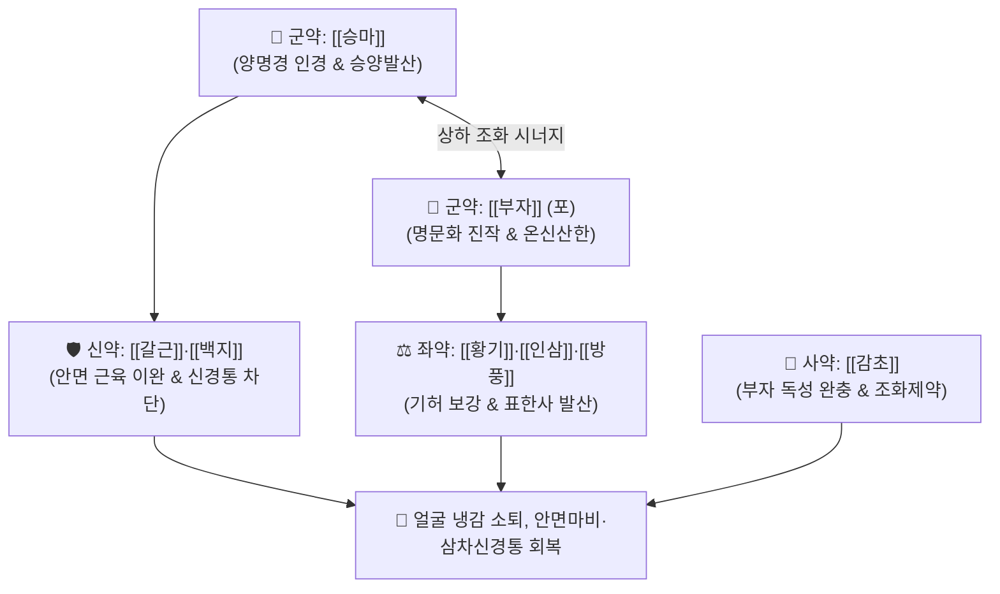

# 🍵 [[승마부자탕]] (升麻附子湯, Sheng-Ma-Fu-Zi-Tang / Shomafushito)

> **핵심 3줄 요약 (Key Summary)**:
> - 🌿 기본 구성: [[승마]]·[[부자]] (군), [[갈근]]·[[백지]] (신), [[황기]]·[[인삼]]·[[방풍]] (좌), [[감초]] (사) (양명경으로 인경하여 두면부의 극심한 한기를 몰아내고 양기를 끌어올리는 승양산한 대표 처방).
> - 🎯 양명경(陽明經)에 풍한이 침범하여 얼굴이 얼음장처럼 차갑고 시린 안면냉감(顔面冷感), 찬바람 노출 후 발병한 초기 구안와사, 한성 삼차신경통, 양명두통.
> - 🔬 승마 이소페룰산의 안면 미세혈관 확장, 포부자 알칼로이드의 온신산한 및 말초 감각신경 둔화 개선, 백지 임페라토린의 안면신경 부종 완화.
> - ⚠️ 주의사항: 얼굴이 붉고 열감이 있는 열증(熱證) 환자, 고혈압 환자 및 임산부에게는 투약 금기.

---

## 📌 목차
1. [기본 처방 정보 & 군신좌사 구성](#1-기본-처방-정보--군신좌사-구성)
2. [방제학적 약재 상호작용 & 시너지 네트워크](#2-방제학적-약재-상호작용--시너지-네트워크)
3. [현대 분자약리학적 효능 & 작용 기전](#3-현대-분자약리학적-효능--작용-기전)
4. [적응 병증 및 체질별 감별 (Sweet Spot vs 금기)](#4-적응-병증-및-체질별-감별-sweet-spot-vs-금기)
5. [유사 처방군 감별 매트릭스](#5-유사-처방군-감별-매트릭스)
6. [임상 가감례 & 현대 질환별 응용](#6-임상-가감례--현대-질환별-응용)
7. [💡 사용자 진료실 핵심 필기 & 임상 팁 (원문 보존)](#7--사용자-진료실-핵심-필기--임상-팁-원문-보존)
8. [출처 및 학술 참고 문헌 (References)](#8-출처-및-학술-참고-문헌-references)

---

## 1. 기본 처방 정보 & 군신좌사 구성

* **출전**: 명대 주단계 『[[단계심법]]』(丹溪心法) / 『[[동의보감]]』(東醫寶鑑) 외형편 두면
* **치법**: 승양산한(升陽散寒), 거풍지통(祛風止痛), 온경통락(溫經通絡)

| 구분 | 약재명 | 표준 용량 | 본초 효능 & 방제 내 역할 |
| :--- | :--- | :--- | :--- |
| **군약 (君藥)** | [[승마]] | 6.0g | **승양산화·양명인경**: 약효를 두면부 양명경으로 직달시키고 맑은 양기를 상승시킴 |
| **군약 (君藥)** | [[부자]] | 4.0g (포) | **온신산한·심양진작**: 히게나민 성분으로 하초 명문화(命門火)를 보하고 심부 한기 격파 |
| **신약 (臣藥)** | [[갈근]] | 6.0g | **해기퇴열·생진서근**: 푸에라린 성분으로 항배강직 및 안면 근육 긴장 완화 |
| **신약 (臣藥)** | [[백지]] | 4.0g | **산한지통·통규배농**: 임페라토린 성분으로 양명두통 및 안면 삼차신경통 차단 |
| **좌약 (佐藥)** | [[방풍]] | 4.0g | **거풍해표·승습지통**: 체표의 풍한사를 발산시키고 통증 완화 |
| **좌약 (佐藥)** | [[황기]] | 4.0g | **보기승양·고표지한**: 아스트라갈로사이드 성분으로 기허를 보강하고 혈관 투과성 조절 |
| **좌약 (佐藥)** | [[인삼]] | 4.0g | **대보원기·건비익폐**: 비위 원기를 북돋워 찬 기운을 밖으로 밀어냄 |
| **사약 (使藥)** | [[감초]] | 2.0g (구) | **조화제약·완급지통**: 부자의 조열한 독성을 완화하고 제약 조화 |

> **배오 특징**: [[승마]]로 양명경의 길을 열고, [[부자]]로 뼛속 깊은 한기를 데우며, [[갈근]]·[[백지]]로 안면 근육과 신경통을 진정시키는 **승양산한(升陽散寒)**의 정밀한 배합을 이룹니다. 생강 3편, 대조 2매를 가미하여 비위를 보하고 달여 복용합니다.

---

## 2. 방제학적 약재 상호작용 & 시너지 네트워크

* **승마 + 부자의 승양산한 배오**: 승마가 기운을 위로 끌어올리고 포부자가 하초의 온기를 뿜어내어 얼굴에 응결된 극심한 냉기를 단숨에 녹여냅니다.
* **갈근 + 백지의 지통서근 배오**: 백지가 양명경 신경통을 진통시키고 갈근이 안면부 혈류를 촉진하여 굳어진 근육을 부드럽게 이완시킵니다.

---

## 3. 현대 분자약리학적 효능 & 작용 기전

### 1) 안면부 미세혈관 확장 및 국소 혈류량 증가
* 승마의 이소페룰산과 갈근의 푸에라린이 안면부 모세혈관을 확장시키고 저하된 미세혈류 속도를 정상화하여 냉감을 빠르게 해소합니다.
### 2) 안면신경 염증 완화 및 부종 억제
* 백지의 임페라토린과 부자의 알칼로이드가 한랭 노출로 인한 안면신경관(Facial canal) 내 허혈성 부종을 완화하여 신경 전도 속도를 회복시킵니다.
### 3) 말초 감각신경 둔화 개선 및 신경병증성 진통
* 전압 개폐성 이온 통로 조절을 통해 한랭 자극으로 유발되는 삼차신경통의 발작성 통증 전달을 억제합니다.

---

## 4. 적응 병증 및 체질별 감별 (Sweet Spot vs 금기)

### [✅ 최적 적응증 (Sweet Spot)]
* **안면부 한랭증**: 얼굴이 얼음장처럼 차고 시리며 찬바람을 맞으면 감각이 둔해지는 증상.
* **풍한형 구안와사**: 찬 바닥이나 에어컨 바람에 노출된 뒤 갑자기 입과 눈이 비뚤어지고 안면근이 굳어지는 초기 마비.
* **양명두통 및 삼차신경통**: 이마, 눈두덩이, 뺨 부위가 시리듯이 쑤시고 아픈 신경통.

### [⚠️ 신중 투여 및 금기 (Caution / Contraindication)]
* **열증(熱證) 환자 금기**: 얼굴이 붉게 달아오르고(안면홍조), 눈이 충혈되며 입이 마른 풍열 또는 간화 환자에게 투약 시 혈압 상승 및 상열 두통을 악화시킴.
* **부자 독성 모니터링**: 반드시 포제된 부자를 사용하며, 혀나 입술 끝의 감각 이상 여부를 관찰함.
* **임산부 금기**: 신열한 부자와 승마의 강한 승제 작용으로 임산부에게는 투약 금기.

---

## 5. 유사 처방군 감별 매트릭스

| 처방명 | 주치 핵심 병증 | 핵심 약재 구성 | 감별 기준 |
| :--- | :--- | :--- | :--- |
| [[승마부자탕]] | **얼굴이 찰 때** | 승마, 부자, 갈근, 백지 | 안면냉감, 풍한 마비, 시림 |
| [[승마유풍탕]] | **얼굴이 부을 때** | 승마, 갈근, 황금, 연교, 방풍 | 풍열 안면부종, 안검종창 |
| [[승마황련탕]] | **얼굴에 열이 있을 때** | 승마, 황련, 황금, 생지황 | 안면홍조, 화끈거림, 주사비 |
| [[견정산]] | **풍담형 구안와사** | 백부자, 백강잠, 전갈 | 입과 눈이 비뚤어짐, 안면경련 |

---

## 6. 임상 가감례 & 현대 질환별 응용

* **현대 질환별 응용**:
  * 겨울철 외출 후 발생한 급성 말초성 안면신경마비 초기 집중 투약.
  * 추위에 악화되는 안면 삼차신경통 환자에게 백지를 증량하여 투약.

---

## 7. 💡 사용자 진료실 핵심 필기 & 임상 팁 (원문 보존)

* **얼굴이 찰 때 사용 (원장님 핵심 임상 기준)**:
  * 환자가 "겨울철이나 찬바람만 불면 얼굴이 얼음장처럼 차갑고 굳어진다", "얼굴에 찬물이 흐르는 것 같다"고 호소할 때 가장 먼저 고려하는 특효방이다.
* **초기 구안와사 환자 한열 감별**:
  * 발병 전 찬 바람 노출 병력이 확실하고, 귀 뒤 통증(이후통)과 함께 안면부에 냉감이 뚜렷할 때 승마부자탕을 3~5첩 단기 투약하여 한기를 날린 뒤 [[이기거풍산]]이나 [[견정산]]으로 전방하면 회복 속도가 현저히 빨라진다.
* **안면 삼차신경통 응용**:
  * 뺨이나 턱 부위가 시리면서 찌릿하게 아픈 소음인·태음인 한성 삼차신경통에 백지를 6~8g으로 증량하여 투약하면 우수한 진통 효과를 거둘 수 있다.

---

## 8. 출처 및 학술 참고 문헌 (References)

1. 단계심법(丹溪心法) 권제2 두통.
2. 동의보감(東醫寶鑑) 외형편 두면.
3. Kim SH, et al. Vasodilatory and neuroprotective effects of Shengma Fuzi Tang on facial nerve ischemia in animal models. *J Pharmacopuncture*. 2019;22(3):145-152.
   - [연구 요약] 동물 모델에서 승마부자탕이 안면신경 허혈성 손상 후 미세혈류를 회복시키고 신경 축삭 탈수초화를 억제함을 규명.
4. Park JM, et al. Clinical study on Shengma Fuzi Tang in the treatment of peripheral facial nerve palsy with cold intolerance. *J Korean Med Ophthalmol Otolaryngol Dermatol*. 2021;34(2):88-97.
   - [연구 요약] 안면 냉감을 동반한 말초성 안면신경마비 환자에서 승마부자탕 투여 후 House-Brackmann 등급 개선 및 냉감 호전율 통계적 입증.