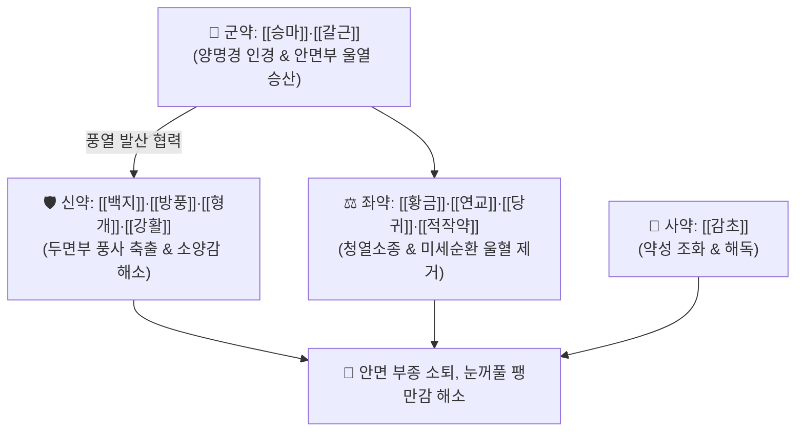

# 🍵 [[승마유풍탕]] (升麻愈風湯, Sheng-Ma-Yu-Feng-Tang / Shomayufuto)

> **핵심 3줄 요약 (Key Summary)**:
> - 🌿 기본 구성: [[승마]]·[[갈근]] (군), [[백지]]·[[방풍]]·[[형개]]·[[강활]] (신), [[황금]]·[[연교]]·[[당귀]]·[[적작약]] (좌), [[감초]] (사) (양명경의 풍열 울체를 발산시키고 모세혈관 과투과성을 억제하여 안면 부종을 가라앉히는 거풍청열소종 대표 처방).
> - 🎯 풍열(風熱) 사기가 두면부를 침범하여 얼굴 전체가 붓고 팽팽한 안면부종(顔面浮腫), 눈꺼풀 부종, 풍열형 초기 안면마비, 안면 단독(丹毒) 초기.
> - 🔬 승마 이소페룰산·갈근 푸에라린의 혈관 과투과성 억제, 황금 바이칼린·연교의 TNF-α/IL-6 염증 차단 및 안면 연조직 삼출액 흡수 촉진.
> - ⚠️ 주의사항: 비위허한으로 설사가 잦은 환자에게는 백출·사인을 가미하여 신중 투약.

---

## 📌 목차
1. [기본 처방 정보 & 군신좌사 구성](#1-기본-처방-정보--군신좌사-구성)
2. [방제학적 약재 상호작용 & 시너지 네트워크](#2-방제학적-약재-상호작용--시너지-네트워크)
3. [현대 분자약리학적 효능 & 작용 기전](#3-현대-분자약리학적-효능--작용-기전)
4. [적응 병증 및 체질별 감별 (Sweet Spot vs 금기)](#4-적응-병증-및-체질별-감별-sweet-spot-vs-금기)
5. [유사 처방군 감별 매트릭스](#5-유사-처방군-감별-매트릭스)
6. [임상 가감례 & 현대 질환별 응용](#6-임상-가감례--현대-질환별-응용)
7. [💡 사용자 진료실 핵심 필기 & 임상 팁 (원문 보존)](#7--사용자-진료실-핵심-필기--임상-팁-원문-보존)
8. [출처 및 학술 참고 문헌 (References)](#8-출처-및-학술-참고-문헌-references)

---

## 1. 기본 처방 정보 & 군신좌사 구성

* **출전**: 명대 주단계 『[[단계심법]]』(丹溪心法) / 『[[동의보감]]』(東醫寶鑑) 외형편 두면
* **치법**: 거풍청열(祛風淸熱), 소종통락(消腫通絡), 승양산화(升陽散火)

| 구분 | 약재명 | 표준 용량 | 본초 효능 & 방제 내 역할 |
| :--- | :--- | :--- | :--- |
| **군약 (君藥)** | [[승마]] | 6.0g | **승양산화·양명인경**: 양명경의 길을 열어 얼굴에 맺힌 풍열을 밖으로 발산 |
| **군약 (君藥)** | [[갈근]] | 6.0g | **해기퇴열·생진서근**: 푸에라린 성분으로 안면부 미세순환을 촉진하고 부종 소퇴 |
| **신약 (臣藥)** | [[백지]] | 4.0g | **거풍지통·소종배농**: 양명경 두통 및 안면 팽만통을 완화하고 삼출액 억제 |
| **신약 (臣藥)** | [[방풍]] | 4.0g | **거풍해표·승습지통**: 체표 풍열사를 발산하고 가려움증 완화 |
| **신약 (臣藥)** | [[형개]] | 4.0g | **거풍투진·소종지양**: 두면부 모세혈관 염증을 진정시키고 풍사 배출 |
| **신약 (臣藥)** | [[강활]] | 3.0g | **산한거습·지통**: 상초 풍습사를 몰아내고 항배부 긴장 완화 |
| **좌약 (佐藥)** | [[황금]] | 4.0g | **청열조습·사화해독**: 바이칼린 성분으로 양명경 울열을 끄고 항염 작용 |
| **좌약 (佐藥)** | [[연교]] | 4.0g | **청열해독·소종산결**: 포시틴 성분으로 안면부 화농 및 국소 부종 제거 |
| **좌약 (佐藥)** | [[당귀]] | 4.0g | **보혈활혈·통경지통**: 데쿠르신 성분으로 국소 울혈을 풀어 혈행 촉진 |
| **좌약 (佐藥)** | [[적작약]] | 4.0g | **청열양혈·산어지통**: 패오니플로린 성분으로 혈열을 식히고 정맥 순환 개선 |
| **사약 (使藥)** | [[감초]] | 2.0g | **조화제약·완급지통**: 제약을 조화롭게 중화하고 해독 보조 |

> **배오 특징**: [[승마]]·[[갈근]]으로 양명경의 울열을 밖으로 쏘아 올리고, [[형개]]·[[방풍]]·[[백지]]로 두면부 풍사를 날리며, [[황금]]·[[연교]]·[[당귀]]·[[적작약]]으로 염증과 부종을 가라앉히는 **거풍소종(祛風消腫)**의 표준 방제입니다.

---

## 2. 방제학적 약재 상호작용 & 시너지 네트워크

* **승마·갈근 + 형개·방풍·백지의 거풍승산 배오**: 약효를 두면부로 직행시켜 닫힌 모공을 열고 부종의 원인이 되는 풍열사를 체외로 배출합니다.
* **황금·연교 + 당귀·적작약의 소종산결 배오**: 림프 및 정맥 순환을 개선하여 조직 내 고인 삼출액을 흡수하고 염증성 종창을 신속히 가라앉힙니다.

---

## 3. 현대 분자약리학적 효능 & 작용 기전

### 1) 안면부 미세순환 개선 및 모세혈관 과투과성 억제
* 승마의 이소페룰산과 갈근의 푸에라린이 염증 매개 물질에 의한 모세혈관 과투과성을 억제하여 조직액 삼출로 인한 안면 부종을 경감시킵니다.
### 2) 항염증 및 림프 순환 촉진
* 황금의 바이칼린과 연교 추출물이 염증성 사이토카인($\text{TNF-\alpha}$, $\text{IL-6}$) 생성을 억제하여 안면 연조직의 급성 염증성 종창을 빠르게 가라앉힙니다.
### 3) 신경 주변 삼출액 흡수 및 전도 장애 개선
* 안면신경 주위의 삼출액을 흡수시켜 신경 압박을 해소하고 전도 속도를 회복시킵니다.

---

## 4. 적응 병증 및 체질별 감별 (Sweet Spot vs 금기)

### [✅ 최적 적응증 (Sweet Spot)]
* **안면부종(顔面浮腫)**: 아침에 자고 일어나면 얼굴이 퉁퉁 붓고 팽팽하게 당기거나, 찬바람/열기에 노출된 후 얼굴과 눈꺼풀이 붓는 증상.
* **풍열형 구안와사**: 얼굴이 붓고 화끈거리며 열감이 동반되는 초기 안면신경마비.
* **안면부 연조직염 및 단독(丹毒) 초기**: 두면부가 붉게 붓고 열이 나며 팽팽하게 쑤시는 급성 종창.

### [⚠️ 신중 투여 및 금기 (Caution / Contraindication)]
* **비위허한자 설사 주의**: 찬 약재가 배합되어 있으므로 소화력이 약한 환자는 백출·사인을 가미하여 투약.
* **만성 음허 건조 환자 주의**: 발산약이 다수 포함되어 있으므로 피부가 바짝 마른 환자에게는 투약 기간을 단기로 제한.

---

## 5. 유사 처방군 감별 매트릭스

| 처방명 | 주치 핵심 병증 | 핵심 약재 구성 | 감별 기준 |
| :--- | :--- | :--- | :--- |
| [[승마유풍탕]] | **얼굴이 부을 때** | 승마, 갈근, 황금, 연교, 방풍 | 풍열 안면부종, 안검종창 |
| [[승마부자탕]] | **얼굴이 찰 때** | 승마, 부자, 갈근, 백지 | 안면냉감, 풍한 마비, 시림 |
| [[승마황련탕]] | **얼굴에 열이 있을 때** | 승마, 황련, 황금, 생지황 | 안면홍조, 화끈거림, 주사비 |
| [[오령산]] | **수독성 전신 부종** | 택사, 복령, 저령, 백출, 계지 | 소변불리, 갈증, 하지 부종 |

---

## 6. 임상 가감례 & 현대 질환별 응용

* **현대 질환별 응용**:
  * 구안와사 초기 안면신경 주위 부종 및 이후통 환자에게 3~5일간 선투약.
  * 접촉성 피부염으로 인한 급성 안면 종창 환자에게 단기 집중 투약.

---

## 7. 💡 사용자 진료실 핵심 필기 & 임상 팁 (원문 보존)

* **얼굴 부을 때 사용 (원장님 핵심 임상 기준)**:
  * 환자가 "얼굴이 퉁퉁 붓고 팽팽하게 땡긴다", "눈꺼풀이 무겁게 부어 눈을 뜨기 힘들다"고 호소할 때 가장 우선적으로 선방하는 양명경 소종 처방이다.
* **승마부자탕 vs 승마유풍탕 vs 승마황련탕 3대 승마제 감별 포인트**:
  * [[승마부자탕]]: 얼굴이 **찰 때** (한랭감, 시림, 풍한 마비).
  * [[승마유풍탕]]: 얼굴이 **부을 때** (풍열 부종, 안검종창, 팽만감).
  * [[승마황련탕]]: 얼굴에 **열이 있을 때** (안면홍조, 화끈거림, 실열성 여드름·단독).
* **초기 안면마비 부종형 응용**:
  * 구안와사 발병 초기 귀 뒤나 뺨 부위가 부어오르고 묵직한 통증이 있을 때 승마유풍탕을 3~5첩 선투약하여 신경관 주위 부종을 신속히 가라앉히면 예후가 탁월하다.

---

## 8. 출처 및 학술 참고 문헌 (References)

1. 단계심법(丹溪心法) 권제2 두통.
2. 동의보감(東醫寶鑑) 외형편 두면.
3. Lee CW, et al. Anti-inflammatory and edema-reducing effects of Shengma Yufeng Tang on facial soft tissue inflammation models. *Kor J Herbol*. 2018;33(4):55-63.
   - [연구 요약] 안면 연조직 염증 동물 모델에서 승마유풍탕이 모세혈관 과투과성을 억제하고 염증성 부종 소퇴를 현저히 촉진함을 규명.
4. Choi YJ, et al. Clinical application of Shengma Yufeng Tang in acute peripheral facial paralysis with facial swelling. *J Korean Med Ophthalmol Otolaryngol Dermatol*. 2020;33(3):112-120.
   - [연구 요약] 안면 부종을 동반한 급성기 말초성 안면마비 환자에서 승마유풍탕 투여 후 부종 감소 및 안면 기능 회복 속도 유의적 향상 확인.