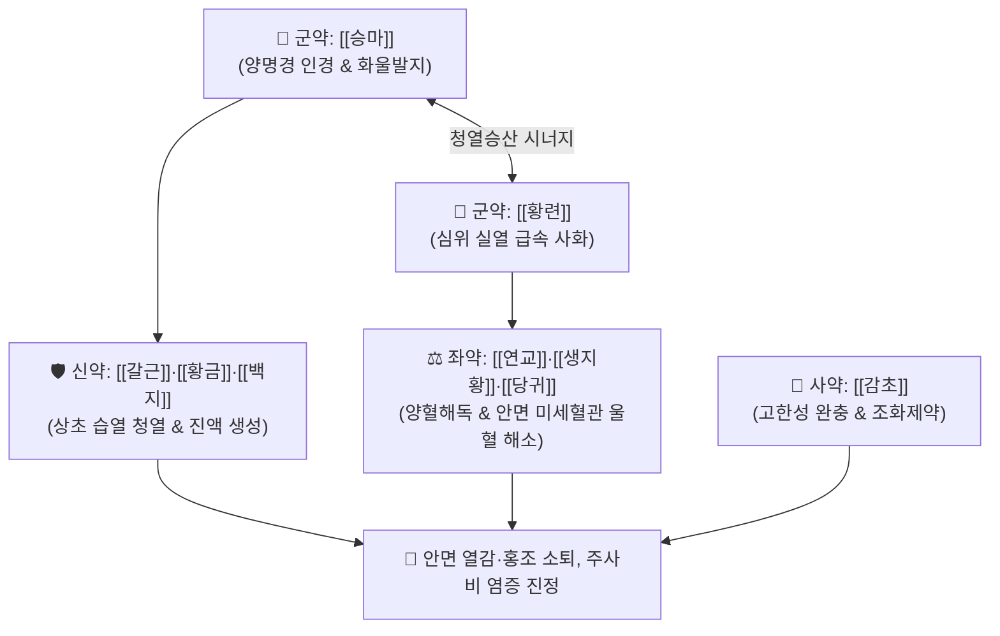

# 🍵 [[승마황련탕]] (升麻黃連湯, Sheng-Ma-Huang-Lian-Tang / Shomaoレンタん)

> **핵심 3줄 요약 (Key Summary)**:
> - 🌿 기본 구성: [[승마]]·[[황련]] (군), [[갈근]]·[[황금]]·[[백지]] (신), [[연교]]·[[생지황]]·[[당귀]] (좌), [[감초]] (사) (양명경의 울체된 열독을 끄고 화기를 밖으로 발산시키는 청열사화·승양산화 대표 처방).
> - 🎯 족양명위경의 화열이 치솟아 얼굴 전체가 붉게 달아오르고 화끈거리는 안면열감(顔面熱感), 안면홍조, 주사비(딸기코), 두면부 화농성 여드름·단독.
> - 🔬 황련 베르베린·황금 바이칼린의 NF-κB 차단 및 iNOS 억제를 통한 안면 모세혈관 과확장 진정, 아크네균 증식 억제 및 항염증 작용.
> - ⚠️ 주의사항: 비위허한으로 소화불량 및 설사가 있는 환자나 얼굴이 시린 안면냉감 환자에게는 투약 금기.

---

## 📌 목차
1. [기본 처방 정보 & 군신좌사 구성](#1-기본-처방-정보--군신좌사-구성)
2. [방제학적 약재 상호작용 & 시너지 네트워크](#2-방제학적-약재-상호작용--시너지-네트워크)
3. [현대 분자약리학적 효능 & 작용 기전](#3-현대-분자약리학적-효능--작용-기전)
4. [적응 병증 및 체질별 감별 (Sweet Spot vs 금기)](#4-적응-병증-및-체질별-감별-sweet-spot-vs-금기)
5. [유사 처방군 감별 매트릭스](#5-유사-처방군-감별-매트릭스)
6. [임상 가감례 & 현대 질환별 응용](#6-임상-가감례--현대-질환별-응용)
7. [💡 사용자 진료실 핵심 필기 & 임상 팁 (원문 보존)](#7--사용자-진료실-핵심-필기--임상-팁-원문-보존)
8. [출처 및 학술 참고 문헌 (References)](#8-출처-및-학술-참고-문헌-references)

---

## 1. 기본 처방 정보 & 군신좌사 구성

* **출전**: 원대 이동원 『[[난실비장]]』(蘭室秘藏) / 『[[동의보감]]』(東醫寶鑑) 외형편 두면
* **치법**: 청열사화(淸熱瀉火), 승양산화(升陽散火), 양혈해독(涼血解毒)

| 구분 | 약재명 | 표준 용량 | 본초 효능 & 방제 내 역할 |
| :--- | :--- | :--- | :--- |
| **군약 (君藥)** | [[승마]] | 6.0g | **승양산화·양명인경**: 양명경의 열독을 위로 끌어올려 체외로 투발시킴 |
| **군약 (君藥)** | [[황련]] | 4.0g | **청열조습·사심화**: 베르베린 성분으로 심장과 위의 맹렬한 실열을 급속 사화 |
| **신약 (臣藥)** | [[갈근]] | 6.0g | **해기퇴열·생진서근**: 안면부 미세순환을 개선하고 진액을 올려 열감 해소 |
| **신약 (臣藥)** | [[황금]] | 4.0g | **청상초열·사화해독**: 바이칼린 성분으로 상초 폐·위의 습열 청열 |
| **신약 (臣藥)** | [[백지]] | 4.0g | **산한지통·소종배농**: 양명경 두통을 멎게 하고 두면부 염증 배농 |
| **좌약 (佐藥)** | [[연교]] | 4.0g | **청열해독·소종산결**: 두면부 화농성 병변 및 혈열을 흩어버림 |
| **좌약 (佐藥)** | [[생지황]] | 6.0g | **청열양혈·생진윤조**: 혈열(血熱)을 식히고 진액을 보충하여 건조열 완화 |
| **좌약 (佐藥)** | [[당귀]] | 4.0g | **보혈활혈·통경지통**: 어혈과 울혈을 제거하여 맑은 혈액 순환 촉진 |
| **사약 (使藥)** | [[감초]] | 2.0g | **조화제약·완급지통**: 황련·황금의 고한성을 완충하고 약성 조화 |

> **배오 특징**: [[승마]]로 양명경의 울열을 밖으로 뿜어내고(화울발지), [[황련]]·[[황금]]으로 심위의 불길을 끄며, [[생지황]]·[[당귀]]로 혈열을 식히는 **청열사화·승양산화(升陽散火)**의 정교한 배합입니다.

---

## 2. 방제학적 약재 상호작용 & 시너지 네트워크

* **승마 + 황련의 승산사화 배오**: 승마가 갇힌 화기를 밖으로 열어젖히고 황련이 내부의 불을 꺼주어 열독이 얼굴에 맺히지 않도록 합니다.
* **생지황·당귀 + 연교의 양혈소종 배오**: 미세혈관의 혈열을 식히고 염증성 혈관 확장을 억제합니다.

---

## 3. 현대 분자약리학적 효능 & 작용 기전

### 1) 안면 혈관 내피세포 염증 억제 및 혈관 확장 안정화
* 황련의 베르베린과 황금의 바이칼린이 $\text{NF-\kappa B}$ 활성화를 차단하여 산화질소 합성효소(iNOS) 발현을 억제함으로써 안면 모세혈관의 병적인 확장을 진정시킵니다.
### 2) 항균 및 피지선 염증 완화
* 아크네균(*Cutibacterium acnes*) 및 포도상구균의 증식을 억제하여 주사비 및 안면부 결절성 여드름 병변의 염증을 신속히 가라앉힙니다.
### 3) 항산화 및 피부 장벽 보호
* 플라보노이드 및 카탈폴 성분이 두면부 피부의 산화 스트레스를 억제하여 모세혈관벽 투과성을 정상화합니다.

---

## 4. 적응 병증 및 체질별 감별 (Sweet Spot vs 금기)

### [✅ 최적 적응증 (Sweet Spot)]
* **안면열감(顔面熱感) 및 안면홍조**: 얼굴이 불타듯이 붉어지고 화끈거리며 열감이 상체로 치솟는 증상.
* **주사비(딸기코) 및 모세혈관 확장증**: 코와 뺨 주위가 지속적으로 붉고 혈관이 비치며 열감이 심한 상태.
* **두면부 화농성 피부 질환**: 심한 안면 모낭염, 결절성 여드름, 안면 단독(丹毒) 초기.

### [⚠️ 신중 투여 및 금기 (Caution / Contraindication)]
* **비위허한자 금기**: 황련, 황금의 강한 쓴맛과 냉성으로 인해 소화불량 및 설사가 있는 환자에게는 투약 금기.
* **안면냉감 환자 오투약 엄금**: 얼굴이 시리고 찬 환자에게 투약하면 혈류 정체가 극도로 악화되므로 [[승마부자탕]]과 철저히 감별.

---

## 5. 유사 처방군 감별 매트릭스

| 처방명 | 주치 핵심 병증 | 핵심 약재 구성 | 감별 기준 |
| :--- | :--- | :--- | :--- |
| [[승마황련탕]] | **얼굴에 열이 있을 때** | 승마, 황련, 황금, 생지황 | 안면홍조, 화끈거림, 주사비 |
| [[승마부자탕]] | **얼굴이 찰 때** | 승마, 부자, 갈근, 백지 | 안면냉감, 풍한 마비, 시림 |
| [[승마유풍탕]] | **얼굴이 부을 때** | 승마, 갈근, 황금, 연교, 방풍 | 풍열 안면부종, 안검종창 |
| [[황련해독탕]] | **삼초 실열 화독** | 황련, 황금, 황백, 치자 | 전신 고열, 구갈, 번조 |

---

## 6. 임상 가감례 & 현대 질환별 응용

* **현대 질환별 응용**:
  * 갱년기 안면홍조 및 상열감 환자에게 5~7일간 단기 투약하여 급한 화열을 끔.
  * 혈관성 주사비 및 중증 안면 모낭염 환자에게 청열 투약.

---

## 7. 💡 사용자 진료실 핵심 필기 & 임상 팁 (원문 보존)

* **얼굴에 열이 있을 때 사용 (원장님 핵심 임상 기준)**:
  * 환자가 "얼굴이 화끈거리고 열이 뻗쳐서 겨울에도 찬물을 끼얹어야 한다", "얼굴이 시뻘겋게 달아오른다"고 호소할 때 가장 먼저 선택하는 특효 청열사화방이다.
* **승마 3대 처방(부자탕 vs 유풍탕 vs 황련탕) 임상 감별 도표**:
  * [[승마부자탕]]: 얼굴이 **찰 때** $\rightarrow$ 온경산한, 부자 배합.
  * [[승마유풍탕]]: 얼굴이 **부을 때** $\rightarrow$ 거풍소종, 갈근·방풍·연교 배합.
  * [[승마황련탕]]: 얼굴에 **열이 있을 때** $\rightarrow$ 청열사화, 황련·황금·생지황 배합.
* **갱년기 상열감 및 주사비 환자 응용**:
  * 갱년기 여성의 안면홍조나 주사비 환자에게 단기 5~7일간 투약하여 급한 화기를 끈 후, [[지백지황환]]이나 [[청상견통탕]]으로 전방하여 음허를 보강하면 재발을 방지할 수 있다.

---

## 8. 출처 및 학술 참고 문헌 (References)

1. 난실비장(蘭室秘藏) 권상 두통문.
2. 동의보감(東醫寶鑑) 외형편 두면.
