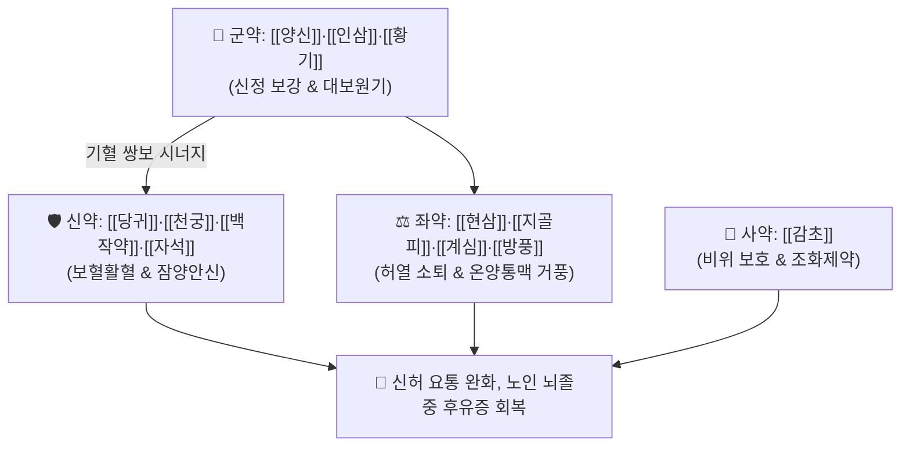

# 🍵 [[신력탕]] (腎瀝湯, Shen-Li-Tang / Jinrikito)

> **핵심 3줄 요약 (Key Summary)**:
> - 🌿 기본 구성: [[양신]]·[[인삼]]·[[황기]] (군), [[당귀]]·[[천궁]]·[[백작약]]·[[자석]] (신), [[현삼]]·[[지골피]]·[[오미자]]·[[계심]]·[[백복령]]·[[방풍]]·[[생강]] (좌), [[감초]] (사) (선천 신정과 후천 기혈을 동시에 대보하고 경락의 잔여 풍사를 몰아내는 보신양혈거풍 대표 처방).
> - 🎯 하초 신기(腎氣) 부족으로 인한 만성 요통, 고령으로 식사량이 적고 기혈이 쇠약해진 노인성 중풍 후유증(반신불수, 마목, 지체 무력).
> - 🔬 진세노사이드·아스트라갈로사이드의 뇌신경 미토콘드리아 ATP 생성 촉진, 패오니플로린의 척추 주위 근육·인대 무균성 염증 억제, 자석의 뇌신경 흥분 안정화.
> - ⚠️ 주의사항: 광물성 자석으로 인한 위장 장애 주의(선전 필수), 비만·고지혈증 실증 환자에게는 투약 신중.

---

## 📌 목차
1. [기본 처방 정보 & 군신좌사 구성](#1-기본-처방-정보--군신좌사-구성)
2. [방제학적 약재 상호작용 & 시너지 네트워크](#2-방제학적-약재-상호작용--시너지-네트워크)
3. [현대 분자약리학적 효능 & 작용 기전](#3-현대-분자약리학적-효능--작용-기전)
4. [적응 병증 및 체질별 감별 (Sweet Spot vs 금기)](#4-적응-병증-및-체질별-감별-sweet-spot-vs-금기)
5. [유사 처방군 감별 매트릭스](#5-유사-처방군-감별-매트릭스)
6. [임상 가감례 & 현대 질환별 응용](#6-임상-가감례--현대-질환별-응용)
7. [💡 사용자 진료실 핵심 필기 & 임상 팁 (원문 보존)](#7--사용자-진료실-핵심-필기--임상-팁-원문-보존)
8. [출처 및 학술 참고 문헌 (References)](#8-출처-및-학술-참고-문헌-references)

---

## 1. 기본 처방 정보 & 군신좌사 구성

* **출전**: 당대 손사막 『[[비급천금요방]]』(備急千金要方) / 『[[동의보감]]』(東醫寶鑑) 잡병편 풍
* **치법**: 보신익기(補腎益氣), 양혈통락(養血通絡), 거풍지통(祛風止痛), 청허열(淸虛熱)

| 구분 | 약재명 | 표준 용량 | 본초 효능 & 방제 내 역할 |
| :--- | :--- | :--- | :--- |
| **군약 (君藥)** | [[양신]] | 1쌍 | **보신익정·골수충실**: 양의 신장으로 선천의 신정을 보하고 척추와 골수 강화 |
| **군약 (君藥)** | [[인삼]] | 6.0g | **대보원기·건비익폐**: 진세노사이드 성분으로 원기를 북돋우고 전신 쇠약 구제 |
| **군약 (君藥)** | [[황기]] | 6.0g | **보기승양·고표지한**: 아스트라갈로사이드 성분으로 모세혈관 순환 촉진 |
| **신약 (臣藥)** | [[당귀]] | 6.0g | **보혈활혈·조경지통**: 데쿠르신 성분으로 조혈 및 말초 미세혈관 개통 |
| **신약 (臣藥)** | [[천궁]] | 4.0g | **활혈행기·거풍지통**: 페룰산 성분으로 뇌혈류를 촉진하고 통증 완화 |
| **신약 (臣藥)** | [[백작약]] | 4.0g | **양혈유간·완급지통**: 패오니플로린 성분으로 근육 경련과 통증 억제 |
| **신약 (臣藥)** | [[자석]] | 12.0g (선전) | **보신익정·잠양안신**: 무거운 광물질로 치솟는 간양을 누르고 신경 안정 |
| **좌약 (佐藥)** | [[현삼]] | 4.0g | **자음강화·청열양혈**: 하파고사이드 성분으로 뼛속 허열(虛熱)을 식힘 |
| **좌약 (佐藥)** | [[지골피]] | 4.0g | **청열양혈·청폐강화**: 베타인 성분으로 골증조열을 제거 |
| **좌약 (佐藥)** | [[오미자]] | 3.0g | **수렴고삽·익기생진**: 신기를 수렴하고 뇌신경 인지기능 보호 |
| **좌약 (佐藥)** | [[계심]] (육계) | 3.0g | **온양통맥·산한지통**: 신남알데하이드 성분으로 하초 냉기를 격파 |
| **좌약 (佐藥)** | [[백복령]] | 4.0g | **건비영심·이수소종**: 비장을 튼튼히 하고 담음 배출 |
| **좌약 (佐藥)** | [[방풍]] | 4.0g | **거풍산사·승습지통**: 경락에 침범한 외풍(外風) 차단 |
| **좌약 (佐藥)** | [[생강]] | 4.0g | **온중지구·해표발한**: 양신의 비린내를 없애고 비위 소화 촉진 |
| **사약 (使藥)** | [[감초]] | 2.0g | **조화제약·보비익기**: 약성을 조화롭게 하고 비위를 보호 |

> **배오 특징**: 양신(羊腎)을 먼저 삶아 낸 즙에 약재를 넣고 달이는 독특한 방식으로, **선천의 신(腎)과 후천의 비위 기혈을 동시에 보강**하면서 허열을 끄고 경락을 소통시키는 최고의 보신거풍 방제입니다.

---

## 2. 방제학적 약재 상호작용 & 시너지 네트워크

* **양신·인삼·황기 + 사물탕의 기혈쌍보 배오**: 바닥난 원기와 혈액을 대보하여 마비된 근맥에 영양을 공급합니다.
* **자석 + 지골피·현삼의 잠양청열 배오**: 치솟는 간양을 진압하고 신음 부족으로 인한 골증허열을 진정시킵니다.

---

## 3. 현대 분자약리학적 효능 & 작용 기전

### 1) 뇌세포 대사 활성화 및 신경 가소성 촉진
* 진세노사이드와 아스트라갈로사이드가 뇌혈관 허혈 후 저산소증 상태에서 미토콘드리아 ATP 생성을 촉진하고 신경 염증 반응을 억제합니다.
### 2) 척추 주변 근육·인대 영양 공급 및 항염증 진통
* 패오니플로린과 페룰산이 척추 기립근 및 요추 후관절의 만성 무균성 염증을 가라앉히고 미세혈류를 개선하여 요통을 완화합니다.
### 3) 면역 강화 및 소모성 쇠약 개선
* 아미노산과 펩타이드가 풍부한 양신 추출물이 고령 환자의 골격근 회복과 면역 단백질 합성을 촉진합니다.

---

## 4. 적응 병증 및 체질별 감별 (Sweet Spot vs 금기)

### [✅ 최적 적응증 (Sweet Spot)]
* **만성 신허 요통**: 허리가 은근하게 쑤시고 아프며 피로하면 다리에 힘이 빠지는 만성 퇴행성 척추 질환.
* **고령자 허손성 중풍 후유증**: 연세가 많고 식사량이 현저히 줄어들었으며, 뇌경색 후 반신불수, 마목감, 기력 저하가 지속되는 환자.
* **노인성 신경쇠약**: 어지럼증, 이명, 심계항진 및 불면을 호소하는 허약자.

### [⚠️ 신중 투여 및 금기 (Caution / Contraindication)]
* **자석 소화기 장애 주의**: 광물성 약재인 자석은 위장 점막을 자극할 수 있으므로 반드시 30분 이상 선전(先煎)하여 복용.
* **비만·고지혈증 실증 환자 투약 배제**: 현대의 혈관 속 찌꺼기가 많고 콜레스테롤 수치가 높은 대사증후군 환자에게는 담습을 조장할 수 있으므로 투약을 피함.

---

## 5. 유사 처방군 감별 매트릭스

| 처방명 | 병기 | 핵심 약재 구성 | 감별 포인트 |
| :--- | :--- | :--- | :--- |
| [[신력탕]] | 신허 + 기혈극허 + 풍 | 양신, 인삼, 황기, 당귀, 자석, 지골피 | **고령 식소 허약자**, 뇌졸중 후유증, 신허 요통 |
| [[독활기생탕]] | 간신양허 + 풍한습비 | 독활, 상기생, 두충, 우슬, 당귀, 인삼 | **하지 관절염**, 무릎·허리 냉통 |
| [[보양환오탕]] | 기허혈어 | 황기(대량), 당귀미, 적작약, 지룡, 도인 | **뇌경색 후유증**, 반신불수 어혈 개통 |
| [[육미지황환]] | 신음허 | 숙지황, 산약, 산수유, 택사, 목단피, 복령 | **음허 내열**, 요슬산연, 도한 |

---

## 6. 임상 가감례 & 현대 질환별 응용

* **뇌졸중 전용 변방 가감법**:
  * 순수하게 뇌졸중 재활만을 집중 치료할 때는 소화 부담이 있는 [[백작약]]과 [[자석]]을 빼고, [[단삼]], [[우슬]], [[행인]], [[맥문동]]을 가미하여 처방을 재구성한다.

---

## 7. 💡 사용자 진료실 핵심 필기 & 임상 팁 (원문 보존)

* **본래는 허리 통증에 주로 사용하다가 중풍 후유증에 활용 (원장님 핵심 임상 기록)**:
  * 본 방은 본래 하초 신허로 인한 만성 요통 환자에게 주로 처방되던 명방이었으나, 임상에서 고령 환자의 기혈이 바닥난 뇌졸중 후유증에 뛰어난 보익 회복 효과가 입증되면서 중풍 재활방으로 확장 활용된다.
* **고령 식소(食少) 중풍 환자 선방 기준 vs 고지혈증 실증 배제**:
  * "연세가 많이 들었는데, 음식 섭취가 적고 바짝 마른 노인성 중풍 환자"에게는 최고의 보기보혈방이다. 그러나 현대의 혈관 속 찌꺼기가 많고 고지혈증, 고콜레스테롤혈증을 앓는 비만형 환자에게는 활용하기 애매하므로 주의한다.
* **자석의 소화기 문제 주의**:
  * 자석이 들어가기에 소화기 문제를 일으킬 수 있으므로 반드시 식후 30분에 따뜻하게 복용하도록 지도한다.

---

## 8. 출처 및 학술 참고 문헌 (References)

1. 비급천금요방(備急千金要方) 권제8 풍독.
2. 동의보감(東醫寶鑑) 잡병편 풍.
