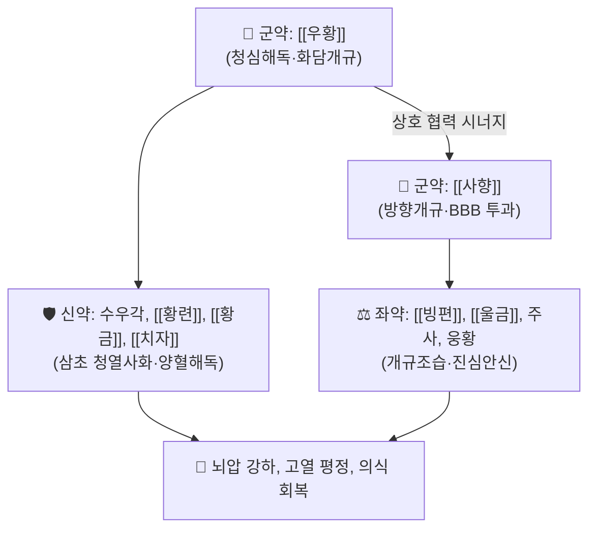

# 🍵 [[안궁우황환]] (安宮牛黃丸, Angong Niuhuang Wan)

> **핵심 3줄 요약 (Key Summary)**:
> - 🌿 청대 온병학 명의 오국통의 《온병조변》에 수록된 방제로, [[우황]]과 [[사향]]을 군약으로 하여 심포의 열을 끄고 막힌 뇌규를 뚫어주는 청열해독(淸熱解毒)·활담개규(豁痰開竅)의 으뜸 응급 환제.
> - 🎯 온열병(溫熱病)으로 인한 열입심포(熱入心包), 고열 섬어(헛소리), 중풍 혼미, 뇌출혈·뇌경색 급성기 의식장애 및 소아 고열 경련 환자에게 활용.
> - 🔬 혈뇌장벽(BBB) 투과 촉진, 뇌부종 억제, 뇌신경세포 염증 차단(TNF-α, IL-1β 저해) 및 뇌경색 경계부 세포사멸 방어 작용.
> - ⚠️ 주의사항: 주사·웅황 성분 함유로 장기 복용 금기, 온폐(溫閉)·열폐(熱閉) 실증에만 쓰며 탈증(脫證)이나 한폐(寒閉) 환자에게 절대 금기.

---

## 📌 목차
1. [기본 처방 정보 & 군신좌사 구성](#1-기본-처방-정보--군신좌사-구성)
2. [방제학적 약재 상호작용 & 시너지 네트워크](#2-방제학적-약재-상호작용--시너지-네트워크)
3. [현대 분자약리학적 효능 & 작용 기전](#3-현대-분자약리학적-효능--작용-기전)
4. [적응 병증 및 체질별 감별 (Sweet Spot vs 금기)](#4-적응-병증-및-체질별-감별-sweet-spot-vs-금기)
5. [온병 3보(三寶) 감별 매트릭스](#5-온병-3보三寶-감별-매트릭스)
6. [임상 가감례 & 현대 응급 질환 응용](#6-임상-가감례--현대-응급-질환-응용)
7. [출처 및 학술 참고 문헌 (References)](#7-출처-및-학술-참고-문헌-references)

---

## 1. 기본 처방 정보 & 군신좌사 구성

| 구분 | 약재명 | 용량(비율) | 본초 효능 & 방제 내 역할 |
| :--- | :--- | :--- | :--- |
| **군약 (君藥)** | [[우황]] | 30g (1냥) | 청심해독(淸心解毒), 활담개규, 심포(心包)의 번열을 식히고 뇌신경 소통 |
| **군약 (君藥)** | [[사향]] | 7.5g (2돈반) | 방향개규(芳香開竅), 통관투규, 혈뇌장벽(BBB)을 통과하여 약력을 뇌로 직행 |
| **신약 (臣藥)** | 수우각 (또는 서각) | 30g | 청영양혈(淸營涼血), 사화해독, 혈열로 인한 뇌출혈 억제 |
| **신약 (臣藥)** | [[황련]] | 30g | 청열조습, 사심화(瀉心火), 심경의 화열 제거 |
| **신약 (臣藥)** | [[황금]] | 30g | 청상초열(淸上焦熱), 폐화 및 간화 억제 |
| **신약 (臣藥)** | [[치자]] | 30g | 청열사화, 삼초의 화열을 아래로 끌어내려 소변 배출 |
| **좌약 (佐藥)** | 주사 ([[진사]]) | 45g | 진심안신(鎭心安神), 심신을 안정시키고 경련 억제 |
| **좌약 (佐藥)** | 웅황 | 30g | 벽예해독(避穢解毒), 조습거담, 악성 담탁 제거 |
| **좌약 (佐藥)** | [[빙편]] | 7.5g | 방향개규, 산열지통, 사향을 도와 구규를 개방 |
| **좌약 (佐藥)** | [[울금]] | 30g | 행기해울, 양혈청심, 담탁을 물리치고 심규 개방 |
| **사약 (使藥)** | 봉밀 + 금박 | 적량 (금박 의피) | 꿀로 제환하여 비위 보호, 금박으로 진심안신 시너지 |

* **복용법**: 1회 1환(약 3g)을 미온수에 곱게 개어 복용. 의식이 혼미하거나 연하 장애가 있는 급성기 환자는 비위관(L-tube)을 통해 조심스럽게 주입.

---

## 2. 방제학적 약재 상호작용 & 시너지 네트워크

* **우황 + 사향의 천하무적 개규 배오**: 우황은 얼음처럼 차가운 기운으로 뇌의 화열과 끈적한 가래를 녹여 없애고, 사향은 화살처럼 빠른 방향성 기운으로 꽉 막힌 뇌혈관과 신경망을 뚫어주어 의식을 회복시키는 최상의 시너지를 발휘합니다.
* **삼황·치자의 전신 청열**: 황련, 황금, 치자가 상·중·하 삼초(三焦)의 화열을 일시에 소각하여 고열로 인한 뇌세포 괴사를 막아냅니다.

---

## 3. 현대 분자약리학적 효능 & 작용 기전

* **혈뇌장벽(BBB) 일시적 개방 및 약물 전달 촉진**:
  * 사향의 무스콘(Muscone)과 빙편의 보르네올이 BBB의 밀착연접 단백질을 일시적으로 이완시켜 유효 성분의 뇌 실질 침투율을 극대화합니다.
* **항뇌부종 및 뇌관류압 유지**:
  * 아쿠아포린-4(AQP4) 수전로 단백의 비정상적 과발현을 억제하여 뇌졸중 후 세포독성 뇌부종을 경감시킵니다.
* **신경세포 염증 폭풍(Cytokine Storm) 억제**:
  * 미세아교세포 활성화를 억제하여 TNF-$\alpha$, IL-1$\beta$, IL-6의 분비를 현저히 낮추고 뇌경색 중심부 주변의 허혈성 반암부(Penumbra) 세포를 구제합니다.

---

## 4. 적응 병증 및 체질별 감별 (Sweet Spot vs 금기)

### [✅ 최적 적응증 (Sweet Spot)]
* **적응 병증**: 유행성 뇌척수막염, 일본뇌염, 패혈증 쇼크의 고열 혼수, 뇌출혈 및 허혈성 뇌졸중 급성기 의식장애, 간성 혼수(Hepatic coma).
* **설진·맥진**: 설질은 심하게 붉거나 자흑색(설강, 舌絳)이고 황조태 또는 회흑태가 끼며, 맥상은 침실(沈實)하거나 홍삭(洪數)함.
* **주요 증상**: 주먹을 꽉 쥐고 이를 악물고 있음(폐증, 閉證), 호흡이 거칠고 가래 끓는 소리가 남, 몸에 불덩이 같은 고열이 남.

### [⚠️ 신중 투여 및 금기 (Caution / Contraindication)]
* **탈증(脫證) 환자 절대 금기**: 땀을 비 오듯 흘리고 입을 벌린 채 손발이 차갑게 늘어지는 허탈 상태에는 투약 시 즉시 사망에 이를 수 있으므로 투약을 금하고 [[독삼탕]]으로 구역(救逆)해야 함.
* **임산부 절대 금기**: 사향, 웅황 성분으로 유산 위험.
* **중금속 축적 주의**: 주사($HgS$)와 웅황($As_2S_2$)이 들어있어 급성기 증상이 풀리면 즉시 복용 중단.

---

## 5. 온병 3보(三寶) 감별 매트릭스

| 처방명 | 핵심 구성 차이 | 주치 특성 비교 | 특징 |
| :--- | :--- | :--- | :--- |
| [[안궁우황환]] | 우황, 사향, 수우각, 삼황, 주사, 웅황 | 청열해독이 가장 강력함, 고열 의식 혼미 | 온병 3보 중 으뜸, 뇌졸중 급성기 |
| [[자설단]] | 사향, 서각, 영양각, 석고, 침향 | 식풍지경(항경련)이 가장 강력함 | 고열성 경련, 소아 급경풍 |
| [[국방지보단]] | 사향, 우황, 서각, 안식향, 침향 | 방향개규(벽예)가 가장 강력함 | 담탁이 짙어 헛소리하고 혼미할 때 |

---

## 6. 임상 가감례 & 현대 응급 질환 응용

* **현대 응급 질환 응용**:
  * 뇌졸중 골든타임 내 병원 후송 중 또는 중환자실 뇌압 상승 환자에게 비위관 투여.
  * 중증 패혈증성 뇌병증 및 코로나19/중증 인플루엔자 고열 뇌병증에 보조 요법으로 활용.

---

## 7. 출처 및 학술 참고 문헌 (References)

1. 오국통(吳鞠通) 원저. 《온병조변(溫病條辨)》. "안궁우황환, 심포열폐, 신혼섬어, 성인지소제야."
   - [연구 요약] 온열병 고열로 심포가 막힌 위급 환자에게 의식을 깨우는 최고의 개규 환제로 규정한 역사적 명저.
2. Tsoi, B., et al. (2019). "Angong Niuhuang Wan attenuates cerebral ischemia/reperfusion injury via anti-inflammatory and blood-brain barrier protective mechanisms." *Journal of Ethnopharmacology*, 237, 87-98.
   - [연구 요약] 안궁우황환이 허혈-재관류 뇌손상에서 BBB 투과성을 보존하고 신경 염증 반응을 억제하여 뇌경색 면적을 40% 이상 감소시킴을 입증.
