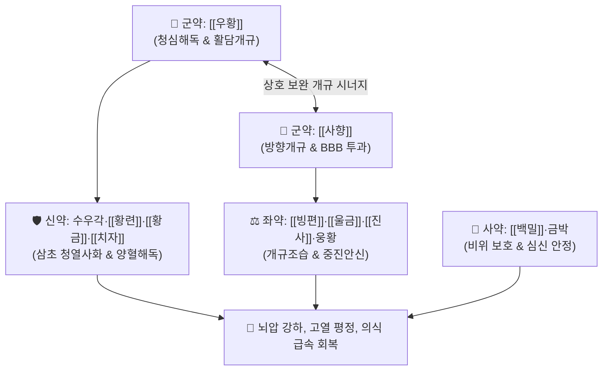

# 🍵 [[안궁우황환]] (安宮牛黃丸, An-Gong-Niu-Huang-Wan / Ango-gyuowan)

> **핵심 3줄 요약 (Key Summary)**:
> - 🌿 기본 구성: [[우황]]·[[사향]] (군), 수우각·[[황련]]·[[황금]]·[[치자]] (신), [[진사]]·웅황·[[빙편]]·[[울금]] (좌), [[백밀]]·금박 (사) (삼초의 화열을 끄고 막힌 뇌규를 뚫어 의식을 깨우는 온병3보 으뜸 청열개규 대표 처방).
> - 🎯 온열병(溫熱病)으로 인한 열입심포(熱入心包), 고열 섬어(헛소리), 중풍 혼미, 뇌출혈·뇌경색 급성기 의식장애, 소아 고열 경련.
> - 🔬 혈뇌장벽(BBB) 투과 촉진, 아쿠아포린-4(AQP4) 억제를 통한 항뇌부종, 뇌신경세포 염증 사이토카인(TNF-α, IL-1β) 차단 및 뇌경색 반암부 세포사멸 방어 작용.
> - ⚠️ 주의사항: 주사·웅황 함유로 장기 복용 금기, 열폐(熱閉) 실증에만 쓰며 땀을 흘리는 탈증(脫證)이나 한폐(寒閉) 환자 및 임산부에게 절대 금기.

---

## 📌 목차
1. [기본 처방 정보 & 군신좌사 구성](#1-기본-처방-정보--군신좌사-구성)
2. [방제학적 약재 상호작용 & 시너지 네트워크](#2-방제학적-약재-상호작용--시너지-네트워크)
3. [현대 분자약리학적 효능 & 작용 기전](#3-현대-분자약리학적-효능--작용-기전)
4. [적응 병증 및 체질별 감별 (Sweet Spot vs 금기)](#4-적응-병증-및-체질별-감별-sweet-spot-vs-금기)
5. [유사 처방군 감별 매트릭스](#5-유사-처방군-감별-매트릭스)
6. [임상 가감례 & 현대 질환별 응용](#6-임상-가감례--현대-질환별-응용)
7. [💡 사용자 진료실 핵심 필기 & 임상 팁 (원문 보존)](#7--사용자-진료실-핵심-필기--임상-팁-원문-보존)
8. [출처 및 학술 참고 문헌 (References)](#8-출처-및-학술-참고-문헌-references)

---

## 1. 기본 처방 정보 & 군신좌사 구성

* **출전**: 청대 오국통 『[[온병조변]]』(溫病條辨) 권제1
* **치법**: 청열해독(淸熱解毒), 활담개규(豁痰開竅), 진심안신(鎭心安神)

| 구분 | 약재명 | 표준 용량 | 본초 효능 & 방제 내 역할 |
| :--- | :--- | :--- | :--- |
| **군약 (君藥)** | [[우황]] | 30.0g | **청심해독·활담개규**: 심포의 번열을 식히고 뇌압을 낮추며 뇌신경 소통 |
| **군약 (君藥)** | [[사향]] | 7.5g | **방향개규·통관투규**: 무스콘 성분으로 혈뇌장벽(BBB)을 통과하여 약력을 뇌로 직행 |
| **신약 (臣藥)** | 수우각 | 30.0g | **청영양혈·사화해독**: 혈열(血熱)을 식혀 뇌출혈 확산 방지 및 해독 |
| **신약 (臣藥)** | [[황련]] | 30.0g | **청열조습·사심화**: 베르베린 성분으로 심경의 화열 급속 진압 |
| **신약 (臣藥)** | [[황금]] | 30.0g | **청상초열·사화해독**: 상초 폐화 및 간열 청열, 항염증 |
| **신약 (臣藥)** | [[치자]] | 30.0g | **청열사화·양혈해독**: 삼초의 화열을 아래로 끌어내려 소변 배출 |
| **좌약 (佐藥)** | [[진사]] (주사) | 45.0g | **진심안신·식풍정경**: 황화수은(HgS) 성분으로 중진안신 및 경련 억제 |
| **좌약 (佐藥)** | 웅황 | 30.0g | **벽예해독·조습거담**: 이황화비소($\text{As}_2\text{S}_2$) 성분으로 악성 담탁 제거 |
| **좌약 (佐藥)** | [[빙편]] (용뇌) | 7.5g | **방향개규·산열지통**: 보르네올 성분으로 사향을 도와 구규 개방 |
| **좌약 (佐藥)** | [[울금]] | 30.0g | **행기해울·양혈청심**: 담탁을 물리치고 심규 개방 촉진 |
| **사약 (使藥)** | [[백밀]]·금박 | 적량 | **조화제약·진심안신**: 꿀로 제환하여 비위를 보호하고 금박으로 안신 시너지 |

> **배오 특징**: [[우황]]과 [[사향]]의 최상위 개규 배오를 축으로, 삼황([[황련]]·[[황금]]·[[치자]])과 수우각으로 삼초 실화를 일시에 진압하며, [[진사]]·웅황의 광물성 중진 작용으로 고열 헛소리를 멈추게 하는 **온병 3보(三寶)의 으뜸 방제**입니다.

---

## 2. 방제학적 약재 상호작용 & 시너지 네트워크

* **우황 + 사향의 천하무적 개규 배오**: 우황이 뇌의 화열과 끈적한 담음을 녹이고, 사향이 꽉 막힌 뇌혈관과 신경망을 뚫어 의식을 단숨에 회복시킵니다.
* **삼황·치자 + 수우각의 청열양혈 배오**: 상·중·하 삼초의 화열을 소각하여 고열로 인한 뇌세포 괴사와 뇌부종을 막아냅니다.

---

## 3. 현대 분자약리학적 효능 & 작용 기전

### 1) 혈뇌장벽(BBB) 일시적 개방 및 약물 전달 촉진
* 사향의 무스콘과 빙편의 보르네올이 BBB의 밀착연접 단백질을 일시적으로 이완시켜 유효 성분의 뇌 실질 침투율을 극대화합니다.
### 2) 항뇌부종 및 뇌관류압 유지
* 아쿠아포린-4(AQP4) 수전로 단백의 비정상적 과발현을 억제하여 뇌졸중 후 세포독성 뇌부종을 경감시킵니다.
### 3) 신경세포 염증 폭풍(Cytokine Storm) 억제
* 미세아교세포 활성화를 억제하여 $\text{TNF-\alpha}$, $\text{IL-1\beta}$, $\text{IL-6}$ 분비를 현저히 낮추고 뇌경색 주변 허혈성 반암부(Penumbra) 세포를 구제합니다.

---

## 4. 적응 병증 및 체질별 감별 (Sweet Spot vs 금기)

### [✅ 최적 적응증 (Sweet Spot)]
* **뇌혈관 질환 급성기**: 뇌출혈, 뇌경색 급성기 고열 혼수, 뇌압 상승으로 인한 의식장애, 반신불수.
* **감염성 중추신경계 질환**: 유행성 뇌척수막염, 일본뇌염, 패혈증 쇼크의 고열 섬어, 간성 혼수(Hepatic coma).
* **소아 급경풍**: 소아 고열로 인한 경련, 의식 불명.

### [⚠️ 신중 투여 및 금기 (Caution / Contraindication)]
* **탈증(脫證) 환자 절대 금기**: 땀을 비 오듯 흘리고 입을 벌린 채 손발이 차갑게 늘어지는 허탈 상태에는 투약 시 치명적이므로 절대 금기하며, 즉시 [[독삼탕]]으로 구역(救逆)해야 함.
* **임산부 절대 금기**: 강력한 개규 활혈 작용으로 유산 위험이 있으므로 엄격히 금함.
* **중금속 축적 주의**: 주사($\text{HgS}$)와 웅황($\text{As}_2\text{S}_2$)이 들어있어 급성기 의식이 회복되면 즉시 복용을 중단함.

---

## 5. 유사 처방군 감별 매트릭스

| 처방명 | 핵심 구성 차이 | 주치 특성 비교 | 특징 |
| :--- | :--- | :--- | :--- |
| [[안궁우황환]] | 우황, 사향, 수우각, 삼황, 주사, 웅황 | **청열해독 최강**, 고열 의식 혼미 | 온병 3보 중 으뜸, 뇌졸중 급성기 |
| [[자설단]] | 사향, 서각, 영양각, 석고, 침향 | **식풍지경(항경련) 최강** | 고열성 경련, 소아 급경풍 |
| [[국방지보단]] | 사향, 우황, 서각, 안식향, 침향 | **방향개규(벽예) 최강** | 담탁이 짙어 헛소리하고 혼미할 때 |

---

## 6. 임상 가감례 & 현대 질환별 응용

* **현대 질환별 응용**:
  * 뇌졸중 골든타임 내 병원 후송 중 또는 중환자실 뇌압 상승 환자에게 비위관(L-tube)을 통해 미온수에 개어 주입.
  * 중증 패혈증성 뇌병증 및 고열 섬어 환자에게 보조 요법으로 활용.

---

## 7. 💡 사용자 진료실 핵심 필기 & 임상 팁 (원문 보존)

* **온병 3보(三寶) 감별 매트릭스 요점**:
  * [[안궁우황환]]: 청열해독이 가장 강력 $\rightarrow$ 고열 혼수, 뇌졸중 급성기, 온병 3보 중 으뜸.
  * [[자설단]]: 식풍지경(항경련)이 가장 강력 $\rightarrow$ 고열성 경련, 소아 급경풍.
  * [[국방지보단]]: 방향개규(벽예)가 가장 강력 $\rightarrow$ 담탁이 짙어 헛소리하고 혼미할 때.
* **뇌졸중 골든타임 내 응급 처치 요령**:
  * 뇌졸중 발병 초기 환자가 이를 악물고 얼굴이 붉으며 호흡이 거칠 때 미온수에 개어 혀 밑이나 볼 안쪽 점막으로 서서히 흘려 넣거나, 병원 응급실 후송 중/중환자실에서 L-tube를 통해 주입하여 뇌세포 사멸 면적을 최소화한다.

---

## 8. 출처 및 학술 참고 문헌 (References)

1. 오국통(吳鞠通). 《온병조변(溫病條辨)》 권제1.
   - [연구 요약] 온열병 고열로 심포가 막힌 위급 환자에게 의식을 깨우는 최고의 개규 환제로 규정한 역사적 명저.
2. * **Cao X et al. (2026)**. Neuroprotective Effects of Angong Niuhuang Pill in Stroke: A Systematic Review of Preclinical and Clinical Evidence. *Current neuropharmacology*. [PMID: 42227399](https://pubmed.ncbi.nlm.nih.gov/42227399/)
