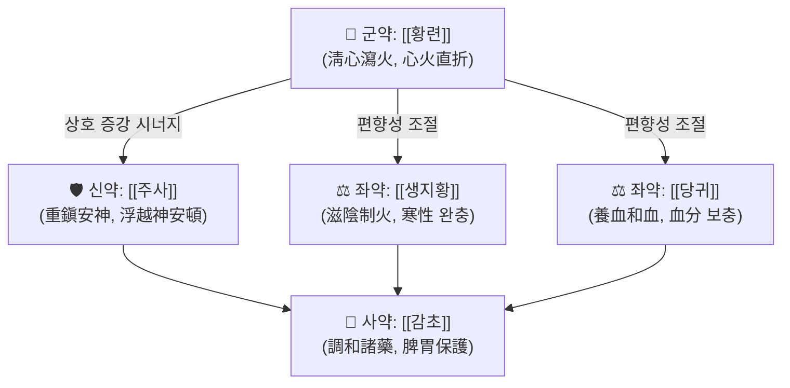

# 🍵 [[안신환]] (安神丸, Anshen Pill / Zhusha Anshen Wan)

> **핵심 3줄 요약 (Key Summary)**:
> - 🌿 모체/기원 처방 + 가감 핵심 약재 배오 구조: 이동원(李東垣) 계열 **[[주사안신환]]**을 원류로 하며, **[[황련]](苦寒 淸心瀉火) + [[주사]](重鎭安神)**의 축에 **[[생지황]]·[[당귀]](滋陰養血)**를 배오하고 **[[감초]]**로 조화시킨 구조 — 즉 **"瀉火 + 養血 + 重鎭"의 3축 배합**.
> - 🎯 임상 최적 적응증: **心火亢盛 + 陰血不足**형의 불면·심계항진·번조·다몽. 스트레스성/사려과다형 불면, 야간 각성, 가슴 두근거림, 입이 마르고 혀끝이 붉은 열성·마른 체형 환자에서 적중.
> - 🔬 핵심 분자약리 기전: 제공 문헌 기준으로 **수면박탈 모델에서의 인지기능 개선(안신정지환, PMID 41544731)**, **미토콘드리아 경로를 통한 심근세포 저산소/재관류 손상 완화(안신보심육미환, PMID 35001248)**, 그리고 **수은계 성분의 신장 수송체 유전자 발현 변화(PMID 26084178)**가 보고됨. 안신환 자체의 단일 분자표적 네트워크는 **근거 미확인**.
> - ⚠️ 주의사항: 本方의 핵심 약재인 **[[주사]](朱砂, HgS)**는 수은 화합물로 **신경독성·신독성** 위험이 있어 장기 복용·고용량 투여를 금한다. 임산부·수유부·소아·신기능 저하자·간기능 장애자에게는 원칙적으로 사용하지 않으며, 진정제·항정신병약·항응고제와의 병용은 반드시 전문가 판단 하에 시행한다. 실무에서는 주사를 [[용골]]·[[자석]]·[[모려]]·[[산조인]] 등으로 대체하는 경우가 많다.

---
## 📌 목차
1. [기본 처방 정보 & 군신좌사 구성](#1-기본-처방-정보--군신좌사-구성)
2. [방제학적 약재 상호작용 & 시너지 네트워크](#2-방제학적-약재-상호작용--시너지-네트워크)
3. [현대 분자약리학적 효능 & 작용 기전](#3-현대-분자약리학적-효능--작용-기전)
4. [적응 병증 및 체질별 감별 (Sweet Spot vs 금기)](#4-적응-병증-및-체질별-감별-sweet-spot-vs-금기)
5. [유사 처방군 감별 매트릭스](#5-유사-처방군-감별-매트릭스)
6. [임상 가감례 & 현대 질환별 응용](#6-임상-가감례--현대-질환별-응용)
7. [💡 사용자 진료실 핵심 필기 & 임상 팁 (원문 보존)](#7--사용자-진료실-핵심-필기--임상-팁-원문-보존)
8. [출처 및 학술 참고 문헌 (References)](#8-출처-및-학술-참고-문헌-references)
---
## 1. 기본 처방 정보 & 군신좌사 구성

* **출전**: **이동원(李東垣) 『內外傷辨惑論』**의 **[[주사안신환]](朱砂安神丸)**을 원류로 보고, 한국에서는 **허준 『[[동의보감]]』 內景篇 神門** 항목에 **安神丸**으로 수록되어 임상에 활용되어 왔다. (※ 안신환은 **동명이방(同名異方)**이 매우 많은 처방명으로, 『소아약증직결』 계열의 소아용 安神丸, 『만병회춘』 계열의 安神丸 등 구성이 다른 판본이 존재한다. **본 노트는 心火亢盛·陰血不足型에 쓰는 朱砂安神丸系 安神丸을 기준**으로 정리하며, 판본 차이는 별도 확인이 필요하다.)
* **치법**: **진심안신(鎭心安神), 청심사화(淸心瀉火), 자음양혈(滋陰養血)** — 즉 "火를 꺼서 神을 안정시키고, 陰血을 채워 火가 다시 치솟지 않게 하는" **청보겸시(淸補兼施)** 구조.

| 구분 | 약재명 | 표준 용량 | 본초 효능 & 방제 내 역할 |
| :--- | :--- | :--- | :--- |
| **군약 (君藥)** | [[황련]] (黃連) | 3~6g | 大苦大寒, 心經 直入하여 **心火를 直折**한다. 心火가 上炎하여 神이 不安해진 病根을 직접 공략하는 주약. 淸心瀉火의 핵심. |
| **신약 (臣藥)** | [[주사]] (朱砂, 辰砂) | 1~3g (엄격 제한, 단기) | 甘微寒·質重, **重鎭安神**·淸心. 浮越한 心神을 무겁게 눌러 驚悸·不眠을 안정시킨다. 군약의 瀉火를 安神 방향으로 결속시키는 신약. **(수은 화합물 — 용량·기간 엄수)** |
| **좌약 (佐藥)** | [[생지황]] (生地黃) | 3~5g | 甘寒, **滋陰淸熱·養血生津**. 苦寒한 황련·주사가 陰血을 상하게 하는 것을 막고, 腎水를 보하여 心火를 제어(滋水制火)한다. |
| **좌약 (佐藥)** | [[당귀]] (當歸) | 3~5g | 甘辛溫, **養血和血**. 心主血·肝藏血의 血分을 보충하여 神이 의지할 物質的 바탕(血)을 제공. 생지황과 배합해 陰血雙補. |
| **사약 (使藥)** | [[감초]] (甘草) | 2~3g | 甘平, **調和諸藥**·和中緩急. 苦寒·重鎭 약성의 편향을 완충하고 脾胃를 보호하여 藥力이 오래 머물게 한다. |

> **배오 특징**: 전체 구조는 **"苦寒으로 火를 꺾고(黃連) → 質重으로 神을 누르고(朱砂) → 甘寒·甘溫으로 陰血을 채우는(生地黃·當歸)"** 의 **3단 승강 구조**다. 즉 上升하는 心火를 下降시키고(降), 不足한 陰血을 補充하며(升), 中央에서 甘草가 脾胃를 지켜 寒涼이 中焦를 상하지 않게 한다. 瀉火만 하면 陰血이 마르고, 養血만 하면 火가 그대로 남는데, 이 方은 **瀉火와 養血을 동시에** 수행하여 "火去而陰不傷, 陰復而火不再" 의 평형을 노린다.

---
## 2. 방제학적 약재 상호작용 & 시너지 네트워크

* **[[황련]] + [[주사]] 배오**: 방제학적으로 **相使(서로 도움)** 관계에 가깝다. 황련이 心火를 淸하면, 주사가 그 重鎭之性으로 이미 가라앉은 神을 붙잡아 驚悸·不眠이 재발하지 않게 한다. 즉 **"원인 제거(瀉火) + 증상 봉합(安神)"** 의 이중 구조. 다만 주사는 金石重鎭藥이므로 반드시 **단기·소량**이 전제된다.
* **[[생지황]] + [[당귀]] 배오**: **滋陰養血** 커플. 생지황이 涼血滋陰하고 당귀가 溫性으로 活血養血하여, 一方의 寒涼 편향을 완충하면서 血을 靜中帶動으로 보충한다. 心火亢盛型 불면에서 흔히 동반되는 **음혈부족(입마름, 피부건조, 야간 도한)** 을 겨냥한다.
* **[[감초]]의 완충 역할**: 苦寒(황련, 생지황) + 金石(주사) 조합은 脾胃가 약한 사람에게 食欲低下·脘腹冷痛·軟便을 유발할 수 있다. 감초는 甘味로 中和하고 脾胃를 보호하여 **"藥力은 유지하되 中焦는 지킨다"** 는 방제 설계의 마지막 안전장치다.
* **전체 네트워크 요약**: 이 처방은 **단일 표적 처방이 아니라 "火·神·血" 3축을 동시에 조절하는 복합 처방**이다. 따라서 임상에서 한 축이라도 결손이 크면(예: 火는 없고 血虛만 심한 경우) 다른 처방([[귀비탕]] 등)으로 갈아타야 한다.

---
## 3. 현대 분자약리학적 효능 & 작용 기전

> ⚠️ 아래 내용 중 **제공된 3편의 논문에서 직접 확인되는 범위**와 **일반 약리학적 배경지식(근거 미확인)** 을 구분하여 표기한다. 안신환(=朱砂安神丸系) 자체를 대상으로 한 단일 분자표적 연구는 본 노트에 제공되지 않았다.

### 1) 수면·인지기능 및 중추신경 조절 — 관련 처방 근거
* **[[안신정지환]](安神定志丸)** 을 대상으로 한 연구(PMID 41544731, Zhang & Xie, 2026, *J Ethnopharmacol*)에서 **구성 약재의 성분 분석과 함께 수면박탈(sleep deprivation) 모델 래트의 인지장애 개선 기전**이 분석되었다. 이는 **"안신(安神) 계열 처방이 수면박탈로 인한 인지기능 저하를 개선할 수 있다"** 는 방향의 근거다.
* 다만 **구체적 표적 단백질, 신호경로(예: BDNF, NF-κB, 시냅스 가소성 관련 인자), 유효 성분의 혈중 농도 등 수치적 결과는 본 노트에 제공된 정보 범위에서 확인되지 않음 → 근거 미확인.** 원문 초록/본문 확인 후 보완 필요.
* 안신환 자체의 **GABA-A 수용체 작용, 세로토닌·멜라토닌 경로 조절** 등은 전통적으로 언급되는 기전이지만, **제공 논문에는 해당 데이터가 없으므로 근거 미확인**으로 표시한다.

### 2) 심근 보호·저산소/재관류 손상 — 관련 처방 근거
* **안신보심육미환(Anshen-Buxin-Liuwei pill, 安神補心六味丸)** — 몽골 전통 의약 처방 — 을 대상으로 한 연구(PMID 35001248, Huang & Tong, 2022, *Mol Biol Rep*)에서 **미토콘드리아 경로(mitochondrion pathway)를 통해 심근세포의 저산소/재관류(hypoxia/reoxygenation) 손상을 완화**하는 것으로 보고되었다.
* 이는 **"안신(安神) 계열 처방이 중추신경 안정 효과를 넘어 심근세포 에너지 대사·세포사(apoptosis) 조절과 연결될 수 있다"** 는 가능성을 시사한다. 심계항진·가슴 두근거림을 주소로 하는 환자에서 안신 계열 처방이 활용되는 것과 방향성이 맞닿는 부분이다.
* **구체적 지표(mtDNA copy number, ROS, ATP 생성량, cytochrome c 방출, caspase 활성 등)의 정량적 결과는 제공 정보 범위에서 확인되지 않음 → 근거 미확인.**

### 3) 수은계 성분의 신장 영향 — 안전성 근거 (중요)
* **주사안신환(朱砂安神丸), 朱砂(HgS), HgCl₂, MeHg** 를 마우스에 투여하여 **신장 수송체(renal transporters) 유전자 발현 변화**를 비교한 연구(PMID 26084178, Sui & Yang, 2015, *Zhongguo Zhong Yao Za Zhi*)가 있다.
* 이 연구의 핵심 함의는 **"주사(朱砂) 및 그 수은 화합물이 신장의 수송체 유전자 발현을 변화시킬 수 있다"** 는 점, 즉 **주사 함유 처방의 신독성 모니터링 필요성**이다. HgS(주사 원료)와 HgCl₂·MeHg(무기/유기 수은)의 영향 강도가 다를 수 있음을 시사하는 설계다.
* **어떤 수송체(OAT, OCT, MATE 계열 등)가 몇 배 변화했는지, 용량-반응 관계의 구체 수치는 제공 정보 범위에서 확인되지 않음 → 근거 미확인.** 다만 **"주사 함유 처방 = 신장 부담 가능성"** 이라는 임상적 경고는 이 제목 수준에서도 충분히 유효하다.

### 4) 항염증·면역 조절 (일반 배경)
* 黃連 계열 성분(berberine 등)의 항염증·NF-κB 억제 효과는 널리 보고된 바 있으나, **본 노트에 제공된 논문에는 안신환/황련의 사이토카인(TNF-α, IL-6, IL-1β) 정량 데이터가 포함되어 있지 않음 → 근거 미확인.** 향후 별도 문헌 추가 필요.

---
## 4. 적응 병증 및 체질별 감별 (Sweet Spot vs 금기)

### [✅ 최적 적응증 (Sweet Spot)]

* **원전 주치 조문(개괄)**: **心神煩亂, 驚悸不安, 失眠多夢, 怔忡, 心火偏亢으로 인한 心煩** — 즉 "마음이 어지럽고 잠이 오지 않으며, 가슴이 뛰고 꿈이 많으며, 속이 달아오르는" 증상군. (※ 판본에 따라 주치 표현이 다르므로 **원문 대조 필요 — 세부 조문 문구는 근거 미확인**.)
* **체질 소견**:
  * **소양인 / 열성 소음인** 계열에서 적중이 높다. **마른 체형, 얼굴이 붉고 화가 잘 오르며, 손발바닥이 따뜻하고(五心煩熱), 피부가 건조한 편**.
  * 반대로 **태음인 비만·습담형(체중 과다, 나른함, 혀에 苔가 두껍고 濕한 경우)** 에는 瀉火·重鎭이 오히려 脾胃를 누르므로 부적합하다.
* **임상 주치 (진료실 최적 적응 양상)**:
  * **스트레스성·사려과다형 불면**: 잠자리에 누우면 생각이 멈추지 않고, 새벽에 자주 깨며, 꿈이 많고 자고 나도 개운하지 않음.
  * **심계항진·가슴 두근거림**: 검사상 특이소견 없는 기능성 두근거림, 긴장 시 악화.
  * **번조·불안·초조**: 사소한 일에 화가 치밀고 입이 마르며, 야간에 증상이 심해지는 패턴.
  * **갱년기 여성의 潮熱·不眠·心悸** 중 **陰血不足 + 心火亢** 상이 뚜렷한 경우.
* **설진/맥진**:
  * **설진**: 舌紅(특히 **설첨 紅**), 苔少 또는 薄黃, 구강건조.
  * **맥진**: **脈細數** 또는 **脈細數而無力**(陰血不足), 또는 **脈弦數**(火鬱) — 火가 뚜렷하면 數, 血이 부족하면 細.
  * **복진**: 心下痞硬하지 않고 오히려 허연한 편(實火만 있고 中虛가 배제된 상태가 적응).

### [⚠️ 신중 투여 및 금기 (Caution / Contraindication)]

* **비위허한(脾胃虛寒) 환자**: 泄瀉·냉복통·식욕부진·손발냉·설담백태백(舌淡白苔白)한 사람에게 苦寒·金石을 투여하면 **소화기 장애, 연변, 복부 냉감, 식욕 저하**가 나타난다. 반드시 금하거나 加 [[백출]]·[[진피]]·[[생강]] 등으로 中焦를 보강해야 한다.
* **혈허 단독형(火 없이 血虛만 있는 경우)**: 心火亢盛 소견이 없고 面色蒼白·心悸·眩暈만 있으면 본방이 아니라 **[[귀비탕]]·[[산조인탕]]** 계열이 정답이다. 본방을 쓰면 瀉火가 오히려 氣血을 소모시킨다.
* **[[주사]] 함유에 따른 절대적·상대적 제한** (가장 중요):
  * **임산부·수유부**: 수은계 성분의 태아/영아 이행 위험 — **금기**.
  * **소아**: 특히 신경계가 발달 중인 소아에게는 원칙적으로 회피.
  * **신기능 저하자(만성신장병, 투석 환자)**: PMID 26084178의 신장 수송체 유전자 발현 변화 결과를 고려할 때 **사용 회피 원칙**. 부득이한 경우 신기능 정기 모니터링.
  * **간기능 장애자, 신경계 질환자(말초신경병증 등)**: 水銀蓄積 위험 — 회피.
  * **장기 복용 금지**: 주사 함유 처방은 **단기(수일~2주 이내, 최소 유효기간)** 사용을 원칙으로 하고, 증상 개선 시 곧 감량·중단하거나 주사-free 처방으로 전환.
* **양약 및 타 약물과의 병용 주의**:
  * **진정제·수면제·항불안제(benzodiazepine 계열), 항정신병약**과 병용 시 **중추 억제의 상가작용** 가능성 — 과도한 진정, 주간 졸림, 낙상 위험. **구체적 상호작용 데이터는 제공 문헌에 없음 → 근거 미확인**, 임상적 주의 필요.
  * **항응고제(와파린 등)** 와 [[당귀]]의 병용 시 출혈 경향 증가 가능성이 일반적으로 논의되나, **본 노트 제공 문헌에서는 확인되지 않음 → 근거 미확인**.
  * **신독성 약물(NSAIDs, 아미노글리코사이드계, 조영제 등)** 과 병용 시 신장 부담 가중 — 회피 권장.

---
## 5. 유사 처방군 감별 매트릭스

| 처방명 | 핵심 구성 차이 | 주치 및 체질 차이 | 맥진/설진 차이 |
| :--- | :--- | :--- | :--- |
| [[안신환]] | [[황련]] + [[주사]] + [[생지황]] + [[당귀]] + [[감초]] (瀉火+養血+重鎭) | **心火亢盛 + 陰血不足**. 불면·심계항진·번조, 열성·마른 체형, 스트레스성 불면 | 舌紅(설첨 홍)·苔薄黃, 脈細數 또는 弦數 |
| [[귀비탕]] | [[인삼]]·[[황기]]·[[백출]]·[[당귀]]·[[원지]]·[[산조인]]·[[용안육]] 등 (補氣血·安神) | **心脾兩虛**. 과로·사려로 氣血이 소모된 虛證, 피로+불면, 창백한 얼굴 | 舌淡·苔薄白, 脈細弱 |
| [[산조인탕]] | [[산조인]]·[[지모]]·[[복령]]·[[천궁]] 등 (養血安神·淸熱除煩) | **肝血不足 + 虛熱**. 잠들기 어렵고 盜汗, 肝血虛로 인한 虛煩 | 舌紅少苔, 脈弦細數 |
| [[천왕보심단]] | [[생지황]]·[[맥문동]]·[[단삼]]·[[산조인]]·[[원지]] 등 (滋陰養血·補心安神) | **陰虛血少 + 心腎不交**. 심한 陰虛(구건·오심번열·건망), 만성 불면 | 舌紅少苔 또는 無苔, 脈細數 |
| [[온담탕]] | [[반하]]·[[진피]]·[[복령]]·[[지실]]·[[죽여]] 등 (理氣化痰·淸心) | **痰熱內擾**. 담음성 불면·심계, 몸이 무겁고 胸悶, 惡心 동반 | 舌紅·苔黃膩, 脈滑數 |
| [[감맥대조탕]] | [[감초]]·[[소맥]]·[[대조]] (甘潤緩急) | **臟躁(히스테리성) 悲哭·불안**, 陰血不足 기반 | 舌淡紅少苔, 脈細數無力 |
| [[안신정지환]] | [[인삼]]·[[복령]]·[[원지]]·[[석창포]]·[[용골]]·[[모려]] 등 (益氣安神·開竅) | **心膽氣虛**. 쉽게 놀라고 겁이 많고, 건망·집중력 저하 | 舌淡·脈細弱 |

> ⚠️ 표 내부에서는 마크다운 열 구분자 파괴를 방지하기 위해 파이프(`|`)가 들어간 링크를 쓰지 않고 순수한 [[처방명]] 단독 형태로만 작성합니다.

> **핵심 감별 포인트 한 줄**: **"火가 있으면 安神丸, 虛만 있으면 歸脾湯, 陰虛가 깊으면 天王補心丹, 痰이 끼면 溫膽湯."**

---
## 6. 임상 가감례 & 현대 질환별 응용

### 수반 증상별 가감법
* **두통/항강 동반 시** $\rightarrow$ + [[천궁]]·[[만형자]]·[[갈근]] (淸肝息風·인경)
* **오심/구역/소화불량 동반 시** $\rightarrow$ + [[반하]]·[[진피]]·[[죽여]] (**[[온담탕]]** 합방 의도 — 痰熱 겸증 처리)
* **담음/기침·胸悶 동반 시** $\rightarrow$ + [[반하]]·[[복령]]·[[지실]] (痰 제거 후 安神)
* **심계항진이 심하고 自汗 동반 시** $\rightarrow$ + [[모려]]·[[용골]]·[[오미자]]·[[맥문동]] (重鎭 + 收斂)
* **陰虛가 뚜렷하고 五心煩熱·口乾이 심할 때** $\rightarrow$ + [[맥문동]]·[[현삼]]·[[천문동]] (**[[천왕보심단]]** 方向)
* **血虛가 뚜렷하고 안색 창백·어지럼 동반 시** $\rightarrow$ + [[아교]]·[[백작약]]·[[숙지황]] (**[[귀비탕]]** 方向으로 전환 검토)
* **脾胃가 약해 泄瀉·食慾不振이 우려될 때** $\rightarrow$ + [[백출]]·[[산약]]·[[진피]] (寒涼 완충, 中焦 보호) — 또는 **[[주사]]를 [[용골]]·[[모려]]·[[자석]]으로 대체**
* **주사 대체(실무 필수 지식)**: 수은계 부담을 피하기 위해 重鎭安神 목적을 **[[용골]]·[[모려]]·[[자석]]·[[대추]]·[[산조인]]·[[원지]]** 조합으로 대체하는 것이 현대 한의 임상의 일반적 흐름이다. (대체 조합의 상대적 효력 비교 연구는 **근거 미확인**.)

### 현대 질환별 임상 매핑
* **신경계/정신계**: **불면장애(만성 불면)**, 불안장애, 공황성 삽화의 기능성 심계, 신경쇠약, 스트레스성 과긴장, 갱년기 불면·번조.
* **순환기계**: **기능성 심계항진**, 검사상 이상 없는 두근거림, 신경성 부정맥 감각(단, 기질적 심질환은 반드시 감별·배제).
  * ※ PMID 35001248의 **심근세포 저산소/재관류 손상 완화** 결과는 안신 계열 처방이 심근 보호 방향으로도 작용할 가능성을 시사하나, **이는 다른 처방(안신보심육미환)의 결과이며 안신환에 그대로 적용할 수 없음 → 근거 미확인.**
* **수면 관련 인지기능**: 수면박탈로 인한 집중력·기억력 저하 동반 시, PMID 41544731(안신정지환)의 방향성을 참고할 수 있으나 **적용 처방이 다르므로 직접 근거 아님.**
* **부인과**: 갱년기 증후군(潮熱·不眠·心悸), 월경 전 불면·초조.
* **기타**: 과로·카페인 과다·야간 교대근무로 인한 心火亢盛型 수면장애.

### 복약 지침 (투여법)
* **용법**: 주로 **丸劑(환제)** 로 조제하여 **1일 2~3회, 식후 또는 취침 전 복용**이 전통적 방식이다. 탕제로 쓸 경우 황련·생지황·당귀·감초를 煎하고, **주사는 탕액에 넣지 않고 硏末하여 沖服(복용 직전 혼합)** 하는 것이 일반적이다. (※ 주사를 煎煮하면 水銀 溶出 양상이 달라질 수 있음 — **구체적 용출 데이터는 근거 미확인**, 원칙적으로 煎煮 회피.)
* **복용 기간**: 주사 함유 시 **최소 기간(수일~2주)** 원칙, 증상 호전 시 감량·중단.
* **관찰 포인트**: ① 수면 개선 정도 및 주간 졸림, ② 소화기 반응(식욕·변 상태), ③ 신기능 관련 증상(부종·소변량 변화), ④ 신경계 증상(손끝 저림 등) — 이상 시 즉시 중단.

---
## 7. 💡 사용자 진료실 핵심 필기 & 임상 팁 (원문 보존)

> [!tip] **진료실 실전 노하우 (User Clinical Insight)**
> *※ 원장님의 기존 메모·필기 원문이 있는 경우 이 블록에 100% 그대로 보존합니다. 아래는 본 노트 정리 과정에서 도출한 임상 참고용 정리이며, 원장님 원문 확인 후 대체·보완이 필요합니다.*
>
> - **체질별 선택 기준 (소음인 vs 태음인 vs 소양인)**
>   - **소양인 / 열성 소음인(마름, 얼굴 홍조, 구건, 五心煩熱)**: 心火亢 + 陰血不足 패턴 → **안신환 계열 적합**. 단, 주사는 되도록 [[용골]]·[[모려]]로 대체.
>   - **태음인(비만, 나른함, 舌苔厚膩, 胸悶)**: 火보다 **痰濕**이 문제 → **[[온담탕]]·[[이진탕]] 계열**이 정답. 안신환은 오히려 脾胃를 누른다.
>   - **소음인(손발 냉, 便溏, 舌淡)**: 火가 없고 中寒 → **[[귀비탕]]·[[이중탕]] 계열** 우선. 안신환은 금기에 가깝다.
> - **환자 티칭 포인트**
>   - "잠은 **억지로 자는 것이 아니라 火를 내려야 자는 것**"이라는 설명이 환자 순응도를 높인다. 카페인·야간 스마트폰·과로가 心火를 올린다는 생활 지도를 함께 한다.
>   - 주사 함유 처방을 쓸 경우 **"수은 성분이 포함되어 있어 장기 복용은 하지 않는다"** 는 점을 반드시 고지하고, 임의 연장 복용을 금하도록 교육.
>   - 취침 1~2시간 전 복용, 복용 후 **주간 졸림이 심하면 감량**하도록 안내.
> - **복약 반응 관찰 포인트**
>   - 3~5일 내 **입면 시간 단축 / 야간 각성 감소** 여부로 반응 평가.
>   - 2주 이상 복용 시 **반드시 재평가** — 증상 소실 시 중단 또는 補益 처방([[귀비탕]]·[[천왕보심단]])으로 전환.
>   - 소화기 불편(식욕 저하, 묽은 변)이 나타나면 **寒涼이 中焦를 상한 신호** → 감량 또는 [[백출]]·[[진피]] 가미.
> - **주의 메모**
>   - 같은 "안신환"이라도 **판본에 따라 구성이 완전히 다르다**(소아용 안신환 등). 처방 입력 시 **출전과 구성을 반드시 명기**할 것.
>   - 진정제·수면제 복용 중인 환자에게 병용 시 **중추 억제 상가** 가능성 → 환자 상태 확인 후 신중 투여.

---
## 8. 출처 및 학술 참고 문헌 (References)

1. **Sui Y, Yang H (2015)**. *Effect of Zhusha Anshen pill, cinnabar, HgS, HgCl₂ and MeHg on gene expression of renal transporters in mice*. **Zhongguo Zhong Yao Za Zhi** (중국중약잡지). PMID: 26084178.
   - **[연구 요약]**: 주사안신환(朱砂安神丸) 및 朱砂·HgS·HgCl₂·MeHg를 마우스에 투여하여 **신장 수송체(renal transporters) 유전자 발현 변화**를 비교·분석한 연구. 핵심 함의는 **수은계 성분이 신장 수송체 발현을 변화시킬 수 있다**는 점으로, 주사 함유 처방의 **신독성 위험 및 모니터링 필요성**을 뒷받침한다. (구체적 수송체 종류·발현 배수 등 정량 수치는 **근거 미확인** — 원문 확인 필요.)
   - **[논문 링크]**: https://pubmed.ncbi.nlm.nih.gov/26084178/
2. **Zhang X, Xie P (2026)**. *Analysis of the composition of Anshen Dingzhi Pill and its mechanism on improving cognitive impairment in sleep deprivation model rats*. **J Ethnopharmacol**. PMID: 41544731.
   - **[연구 요약]**: 안신정지환(安神定志丸)의 **구성 성분 분석**과, **수면박탈 모델 래트의 인지장애 개선 기전**을 다룬 연구. 안신 계열 처방이 **수면박탈로 인한 인지기능 저하를 개선**할 수 있다는 방향의 근거를 제공한다. (구체적 표적·신호경로·유효성분 데이터는 **근거 미확인** — 원문 확인 필요.) ※ 본 처방은 안신환과 **다른 처방**이므로 직접 근거로 인용하지 않고, 안신 계열의 기전적 배경으로만 참조한다.
   - **[논문 링크]**: https://pubmed.ncbi.nlm.nih.gov/41544731/
3. **Huang YJ, Tong HY (2022)**. *Anshen-Buxin-Liuwei pill, a Mongolian medicinal formula could alleviate cardiomyocyte hypoxia/reoxygenation injury via mitochondrion pathway*. **Mol Biol Rep**. PMID: 35001248.
   - **[연구 요약]**: 몽골 전통 의약 처방인 **안신보심육미환(安神補心六味丸)** 이 **미토콘드리아 경로를 매개로 심근세포의 저산소/재관류 손상을 완화**함을 보고한 연구. 안신 계열 처방이 중추신경 안정 작용을 넘어 **심근세포 보호·에너지 대사 조절**과 연결될 가능성을 시사한다. (구체적 미토콘드리아 지표·정량값은 **근거 미확인.**)
   - **[논문 링크]**: https://pubmed.ncbi.nlm.nih.gov/35001248/
4. **이동원(李東垣, 13세기)**. 『**內外傷辨惑論**』.
   - **[고전 원전]**: **[[주사안신환]](朱砂安神丸)** 의 원방 구성(黃連·朱砂·生地黃·當歸·甘草) 및 心火亢盛型 心神不安에 대한 주치·복약 지침의 출처로 통용된다. (판본·문구는 **원문 대조 필요 — 세부 조문 문구 근거 미확인.**)
5. **허준 (1613)**. 『**[[동의보감]]**』 內景篇 神門.
   - **[임상 문헌]**: **安神丸** 이 神門(心神) 병증 항목에 수록되어, 心火로 인한 不眠·驚悸·怔忡에 활용된 한국 임상 전통의 근거. (판본별 구성 차이 존재 — **구성 대조 필요.**)
6. **장중경 (200년경)**. 『**[[상한론]]**』.
   - **[참고 원전]**: 心·神 관련 병증(예: 梔子豉湯類의 虛煩不得眠)의 변증 체계가 후대 安神劑 설계의 이론적 뿌리가 된다. ※ 안신환 자체는 『상한론』 처방이 아니며, **본 처방의 출전으로 기재하지 않는다.** (동명이방 혼동 방지를 위한 구분 기재.)

---

> **📎 노트 관리 메모**
> - 본 노트의 **PubMed 인용은 제공된 3편으로 한정**하였으며, 확인되지 않은 PMID·논문은 기재하지 않았다.
> - 수치·기전 중 제공 문헌 제목 수준에서 확인 불가한 항목은 모두 **"근거 미확인"** 으로 명시하였다. 원문(초록/본문) 확보 시 해당 부분을 갱신할 것.
> - **주사(朱砂) 함유 처방의 안전성**은 본 노트의 최우선 경고 사항이며, 실제 처방 시 반드시 대체 약재 검토 및 환자 고지를 병행한다.
> - 관련 노트: [[주사안신환]] · [[안신정지환]] · [[귀비탕]] · [[천왕보심단]] · [[산조인탕]] · [[온담탕]] · [[감맥대조탕]] · [[불면]] · [[심계항진]] · [[수면장애]] · [[심]] · [[황련]] · [[주사]] · [[생지황]] · [[당귀]] · [[감초]]

<!-- 보관 태그(1회용·링크오류, 필요시 복원): 안신, 진심안신, 심계항진, 청심사화, 주사안신환 -->
