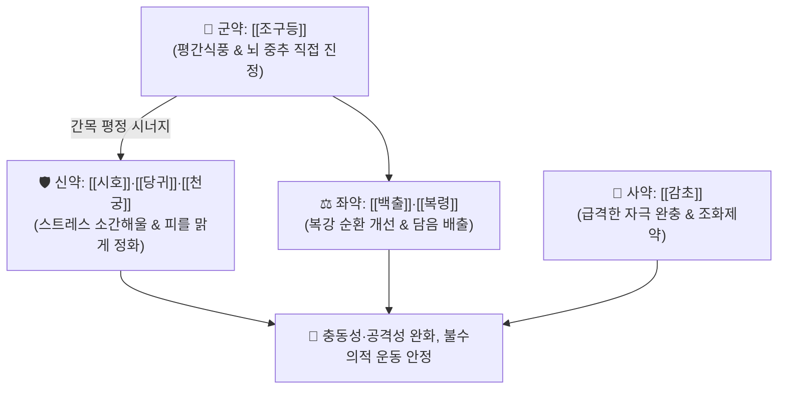

# 🍵 [[억간산]] (抑肝散, Yokukansan / Yigan San)

> **핵심 3줄 요약 (Key Summary)**:
> - 🌿 기본 구성: [[조구등]] (군), [[시호]]·[[당귀]]·[[천궁]] (신), [[백출]]·[[복령]] (좌), [[감초]] (사) (간목의 항진을 진정시키고 비위 복강 순환을 도와 전두엽의 충동 억제력을 회복시키는 평간식풍·영심안신 대표 방제).
> - 🎯 불수의적인 충동적 분노조절장애, [[ADHD]] 과잉행동, 치매 BPSD(공격성, 환각, 초조), 틱장애(Tic disorder), 소아 야경증, 외과 수술 후 섬망.
> - 🔬 글루탐산 트랜스포터(GLT-1) 활성화를 통한 흥분독성 차단, 세로토닌 5-HT1A 수용체 작용 및 변연계 과흥분 억제, 뇌내 글루타치온 농도 회복.
> - ⚠️ 주의사항: 감초 장기 복용 시 가성 알도스테론증(저칼륨혈증, 부종) 모니터링 및 위장 허약자는 반하·진피를 가미([[억간산가반하진피탕]]).

---

## 📌 목차
1. [기본 처방 정보 & 군신좌사 구성](#1-기본-처방-정보--군신좌사-구성)
2. [방제학적 약재 상호작용 & 시너지 네트워크](#2-방제학적-약재-상호작용--시너지-네트워크)
3. [현대 분자약리학적 효능 & 작용 기전](#3-현대-분자약리학적-효능--작용-기전)
4. [적응 병증 및 체질별 감별 (Sweet Spot vs 금기)](#4-적응-병증-및-체질별-감별-sweet-spot-vs-금기)
5. [유사 처방군 감별 매트릭스](#5-유사-처방군-감별-매트릭스)
6. [임상 가감례 & 현대 질환별 응용](#6-임상-가감례--현대-질환별-응용)
7. [💡 사용자 진료실 핵심 필기 & 임상 팁 (원문 보존)](#7--사용자-진료실-핵심-필기--임상-팁-원문-보존)
8. [출처 및 학술 참고 문헌 (References)](#8-출처-및-학술-참고-문헌-references)

---

## 1. 기본 처방 정보 & 군신좌사 구성

* **출전**: 명대 설기 『[[보영촬요]]』(保嬰撮要) 권제1
* **치법**: 평간식풍(平肝熄風), 영심안신(寧心安神), 보혈청열(補血淸熱), 건비화담(健脾化痰)

| 구분 | 약재명 | 표준 용량 | 본초 효능 & 방제 내 역할 |
| :--- | :--- | :--- | :--- |
| **군약 (君藥)** | [[조구등]] | 4.0g | **평간식풍·진경청열**: 린코필린 성분으로 뇌에 직접 작용하여 진정 및 공격성 완화 |
| **신약 (臣藥)** | [[시호]] | 3.0g | **소간해울·청열퇴열**: 사이코사포닌 성분으로 순간적인 스트레스 자극 완화 |
| **신약 (臣藥)** | [[당귀]] | 4.0g | **보혈활혈·유간지통**: 데쿠르신 성분으로 피를 맑게 하고 간혈 부족 해소 |
| **신약 (臣藥)** | [[천궁]] | 4.0g | **활혈행기·거풍지통**: 페룰산 성분으로 뇌혈류를 촉진하고 혈액 정화 |
| **좌약 (佐藥)** | [[백출]] | 4.0g | **건비익기·조습이수**: 비위를 도와 복강 순환 장애 및 수독 개선 |
| **좌약 (佐藥)** | [[복령]] | 4.0g | **건비영심·이수소종**: 파키만 성분으로 담음을 배출하고 신경 안정 |
| **사약 (使藥)** | [[감초]] | 1.5g | **완급지통·조화제약**: 급박한 신경 흥분을 완충하고 제약 조화 |

> **배오 특징**: [[조구등]]이 뇌에 직접 작용하여 치솟는 간목(肝木)의 화열을 끄고, [[시호]]·[[당귀]]·[[천궁]]이 피를 맑게 하며, [[백출]]·[[복령]]이 복강 순환을 소통시켜 **장-뇌 축(Gut-Brain Axis)을 통한 전두엽 억제 제어력 회복**을 이끌어냅니다.

---

## 2. 방제학적 약재 상호작용 & 시너지 네트워크

* **조구등 + 시호의 평간소간 배오**: 조구등이 뇌의 흥분을 직접 누르고 시호가 순간적으로 치솟는 분노와 스트레스 반응을 풀어냅니다.
* **당귀·천궁 + 백출·복령의 기혈수 조화**: 피를 맑게 하고 복강 내 림프·혈류 순환을 촉진하여 신체 항상성을 안정화합니다.

---

## 3. 현대 분자약리학적 효능 & 작용 기전

### 1) 글루탐산 트랜스포터(GLT-1) 활성화 및 신경 흥분독성 차단
* 성상교세포의 GLT-1 발현을 촉진하여 시냅스 틈새의 과도한 글루탐산을 신속히 회수함으로써 뇌신경세포의 과흥분과 사멸을 차단합니다.
### 2) 세로토닌 신경계 조절 ($5-\text{HT}_{1\text{A}}$ 활성화 및 $5-\text{HT}_{2\text{A}}$ 억제)
* $5-\text{HT}_{1\text{A}}$ 수용체 부분 효능 작용으로 항불안·진정을 유도하고, $5-\text{HT}_{2\text{A}}$ 수용체를 하향 조절하여 환각과 공격성을 억제합니다.
### 3) 뇌내 항산화 시스템 정상화
* 알츠하이머 및 조현병 모델에서 저하된 뇌내 글루타치온(GSH) 농도를 유의하게 회복시킵니다.

![[억간산-20240516150416831.png|500]]
> [그림 설명: 억간산의 글루탐산 트랜스포터 조절 및 세로토닌 신경계 매개 뇌신경 안정화 작용 기전]

---

## 4. 적응 병증 및 체질별 감별 (Sweet Spot vs 금기)

### [✅ 최적 적응증 (Sweet Spot)]
* **충동 조절 장애**: 분노조절장애, 간헐적 폭발장애, 성인 및 소아 [[ADHD]](주의력결핍 과잉행동장애).
* **불수의적 운동 질환**: 틱장애(보상성 불수의적 운동과잉, 뚜렛증후군), 발작성 진전, 경련.
* **치매 BPSD 및 섬망**: 알츠하이머 치매 환자의 공격성·환각·초조, 외과 수술 후 섬망, 마약성 진통제로 인한 이상 흥분.
* **소아 신경증**: 야경증, 악몽, 이갈이.

### [⚠️ 신중 투여 및 금기 (Caution / Contraindication)]
* **가성 알도스테론증 주의**: 감초의 장기 복용 시 저칼륨혈증, 부종, 혈압 상승 모니터링.
* **위장 허약자**: 식욕 부진이나 오심이 있는 환자는 반하·진피를 가미한 [[억간산가반하진피탕]]으로 처방.

---

## 5. 유사 처방군 감별 매트릭스

| 처방명 | 병기 | 핵심 약재 구성 | 감별 포인트 |
| :--- | :--- | :--- | :--- |
| [[억간산]] | 간양상항 + 전두엽 억제 저하 | 조구등, 시호, 당귀, 천궁, 백출, 복령 | **충동적 분노·공격성**, 틱장애, 치매 BPSD |
| [[가미소요산]] | 간울혈허 + 허열 | 시호, 당귀, 백작약, 백출, 치자, 목단피 | **상열감·짜증**, 갱년기 신경증, 흉협고만 |
| [[천마구등음]] | 간양화풍 + 고혈압 | 천마, 구등, 석결명, 치자, 황금, 우슬 | **고혈압 두통·현훈**, 중풍 전조증 |
| [[온담탕]] | 담열요심 | 반하, 죽여, 지실, 진피, 복령 | **불안·불면·가슴 두근거림**, 담음 신경증 |

---

## 6. 임상 가감례 & 현대 질환별 응용

* **위장 허약자 가감**:
  * 소화력이 약한 환자는 [[반하]] 5g, [[진피]] 3g을 가미하여 [[억간산가반하진피탕]]으로 활용.
* **열감 및 불면 극심자**:
  * 가슴이 답답하고 열감이 심할 때는 [[황련]] 2~3g 또는 [[산조인]] 6g을 가미.

---

## 7. 💡 사용자 진료실 핵심 필기 & 임상 팁 (원문 보존)

### 🧠 뇌의 연결 지도 및 신경생물학적 메커니즘 고찰

![[Pasted image 20240228142551.png|500]]
> [그림 설명: 뇌의 감각 입력, 대뇌피질-변연계 연산, 운동 출력의 신경망 통합 지도]

![[Pasted image 20240228142619.png|500]]
> [그림 설명: 전두엽 억제 회로와 변연계 감정 반응 속도 차이에 따른 공격성 발현 기전]

1. **뇌의 신경 정보 처리 3단계**:
   - **입력 정보 (과거 + 현재)**: 감각계(시각, 청각, 후각, 미각, 고유감각, 압각, 촉각, 온랭각, 통각), 변연계(내장감각, 과거의 기억과 경험), 시상하부(혈압, 혈당, 체온 항상성).
   - **연산 정보 (미래지향 통합 분석)**: 전두엽(통합, 생각, 분석, 판단, 예측), 변연계(저장, 감정).
   - **출력 정보 (움직임 대응)**: 운동계(움직임), 변연계(감정표현), 시상하부(자율신경 조절).
2. **불수의적 충동성과 공격성의 본질**:
   - 우리의 정상적인 움직임과 감정 조절은 **'억제 경로를 억제하여 개방하는 기전(억제를 억제 $\rightarrow$ 개방)'**이다.
   - 인간 뇌에서 가장 강력한 억제 중추는 **전두엽(Frontal lobe)**이다.
   - 그러나 **변연계(Limbic system)는 전두엽보다 처리 속도가 훨씬 빠르다** (PTSD, 반사적 공포/분노가 발생하는 이유).
   - 공격성은 전두엽의 이성적 필터링을 거치지 않고, 과거의 기억과 현재 감각의 항상성 불균형만을 토대로 **변연계의 반사적 연산 정보로 튀어나가는 충동적인 감정, 표정, 불수의적 행동**이다.
3. **임상 한약 치료 매핑**:
   - **내장 정보·항상성 정보 조절**: 귀비탕, 가미소요산, 온담탕 등으로 칠정(七情)과 신체 증상(불면, 두통, 현훈, 이명 등)을 근본적으로 정돈.
   - **뇌 중추 직접 진정**: [[조구등]]이 뇌에 직접 작용하여 변연계의 과흥분을 차단하고 전두엽의 억제 제어력을 회복시킴.

---

## 8. 출처 및 학술 참고 문헌 (References)

1. 설기(薛己). 《보영촬요(保嬰撮要)》 권제1.
2. * **Matsumoto T et al. (2018)**. Basic Study of Drug-Drug Interaction between Memantine and the Traditional Japanese Kampo Medicine Yokukansan. *Molecules (Basel, Switzerland)*, 24: . [PMID: 30597998](https://pubmed.ncbi.nlm.nih.gov/30597998/)
3. * **Yuan M et al. (2026)**. The efficacy and safety of Yokukansan for concomitant behavioral and psychological symptoms of Alzheimer's disease: a randomized, double-blinded clinical trial. *Journal of ethnopharmacology*, 366: 121644. [PMID: 41956228](https://pubmed.ncbi.nlm.nih.gov/41956228/)
