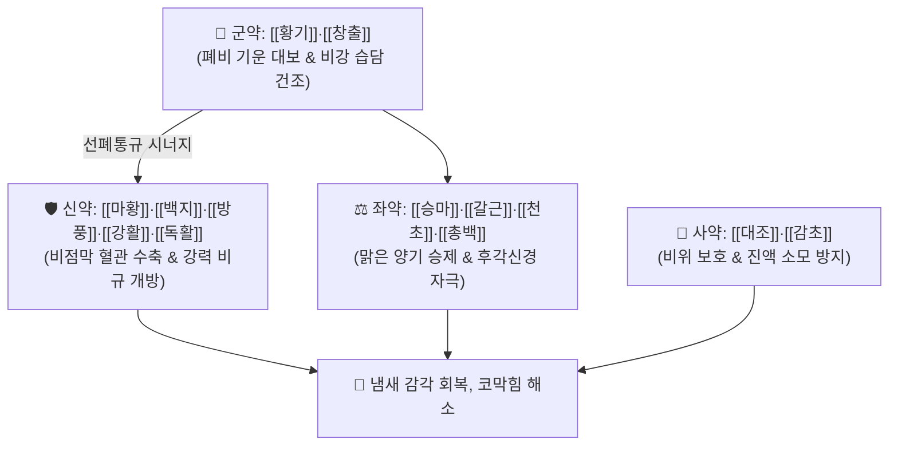

# 🍵 [[여택통기탕]] (麗澤通氣湯, Li-Ze-Tong-Qi-Tang / Takutakutsukito)

> **핵심 3줄 요약 (Key Summary)**:
> - 🌿 기본 구성: [[황기]]·[[창출]] (군), [[마황]]·[[백지]]·[[방풍]]·[[강활]]·[[독활]] (신), [[승마]]·[[갈근]]·[[천초]]·[[총백]]·[[생강]] (좌), [[대조]]·[[감초]] (사) (폐비 기운을 대보하고 맑은 양기를 머리와 코로 끌어올려 막힌 후각과 비규를 뚫어주는 보기승양·선폐통규 대표 방제).
> - 🎯 폐기허한(肺氣虛寒)으로 인해 냄새를 전혀 맡지 못하는 후각 상실(부문향취 不聞香臭), 만성 비염, 알레르기 비염, 비후성 비염, 콧속이 꽉 막힌 비색(鼻塞).
> - 🔬 마황 에페드린·백지 정유의 비점막 모세혈관 수축 및 기도 저항 감소, 황기 다당류·천초 산쇼올의 후각 신경세포(Olfactory neuron) 재생 촉진 및 NGF 분비 유도.
> - ⚠️ 주의사항: 마황 함유로 인한 불면·심계 주의 및 코점막이 바짝 마른 폐음허(건조성 비염) 환자에게는 투약 신중.

---

## 📌 목차
1. [기본 처방 정보 & 군신좌사 구성](#1-기본-처방-정보--군신좌사-구성)
2. [방제학적 약재 상호작용 & 시너지 네트워크](#2-방제학적-약재-상호작용--시너지-네트워크)
3. [현대 분자약리학적 효능 & 작용 기전](#3-현대-분자약리학적-효능--작용-기전)
4. [적응 병증 및 체질별 감별 (Sweet Spot vs 금기)](#4-적응-병증-및-체질별-감별-sweet-spot-vs-금기)
5. [유사 처방군 감별 매트릭스](#5-유사-처방군-감별-매트릭스)
6. [임상 가감례 & 현대 질환별 응용](#6-임상-가감례--현대-질환별-응용)
7. [💡 사용자 진료실 핵심 필기 & 임상 팁 (원문 보존)](#7--사용자-진료실-핵심-필기--임상-팁-원문-보존)
8. [출처 및 학술 참고 문헌 (References)](#8-출처-및-학술-참고-문헌-references)

---

## 1. 기본 처방 정보 & 군신좌사 구성

* **출전**: 원대 이동원 『[[난실비장]]』(蘭室秘藏) / 『[[동의보감]]』(東醫寶鑑) 외형편 비(鼻)
* **치법**: 보기승양(補氣升陽), 선폐통규(宣肺通竅), 산한화습(散寒化濕)

| 구분 | 약재명 | 표준 용량 | 본초 효능 & 방제 내 역할 |
| :--- | :--- | :--- | :--- |
| **군약 (君藥)** | [[황기]] | 6.0g | **보기승양·익위고표**: 폐기를 대보하여 비점막의 국소 면역력 강화 |
| **군약 (君藥)** | [[창출]] | 4.0g | **조습건비·거풍산한**: 비강 점막에 고인 습담과 수독 부종을 건조시킴 |
| **신약 (臣藥)** | [[마황]] | 3.0g | **선폐평천·발한해표**: 비점막 혈관을 수축시켜 비강 기도를 즉각 개통 |
| **신약 (臣藥)** | [[백지]] | 4.0g | **거풍산한·통규지통**: 양명경 인경 및 비강 통증 해소, 후각신경 자극 |
| **신약 (臣藥)** | [[방풍]] | 4.0g | **거풍해표·승습지통**: 체표 풍한사를 날리고 비점막 알레르기 과민반응 억제 |
| **신약 (臣藥)** | [[강활]] | 3.0g | **산한거습·지통**: 상초 풍습사를 몰아내고 전두부 두중감 완화 |
| **신약 (臣藥)** | [[독활]] | 3.0g | **거풍제습·통비지통**: 경락 내 깊은 풍한사를 몰아내고 혈류 촉진 |
| **좌약 (佐藥)** | [[승마]] | 3.0g | **승양산화·양명인경**: 맑은 양기를 두면부와 코로 끌어올림 |
| **좌약 (佐藥)** | [[갈근]] | 4.0g | **해기퇴열·생진서근**: 푸에라린 성분으로 비점막 미세순환 촉진 및 진액 공급 |
| **좌약 (佐藥)** | [[천초]] (화초) | 2.0g | **온중산한·제습지통**: 산쇼올 성분으로 비강 깊은 냉기를 격파하고 신경 자극 |
| **좌약 (佐藥)** | [[총백]] | 2줄기 | **통양발한·산한통규**: 알리신 성분으로 막힌 코를 순식간에 뚫어줌 |
| **좌약 (佐藥)** | [[생강]] | 4.0g | **온중지구·해표발한**: 중초 비위를 덥히고 발산 보조 |
| **사약 (使藥)** | [[대조]] | 2매 | **보비익기·양혈안신**: 비위를 보하고 발산약의 진액 소모 완충 |
| **사약 (使藥)** | [[감초]] | 2.0g (구) | **조화제약·완급지통**: 제약을 조화롭게 중화하고 항알레르기 보조 |

> **배오 특징**: 비위와 폐의 양기를 북돋우는 [[황기]]·[[창출]]을 기본 뼈대로 삼고, 5종의 거풍발산약([[마황]]·[[백지]]·[[방풍]]·[[강활]]·[[독활]])과 [[승마]]·[[갈근]]의 승양 작용, [[천초]]·[[총백]]의 온통 작용을 결합하여 **마비된 후각 신경을 일깨우는 선폐통규(宣肺通竅)**의 최고 명방입니다.

---

## 2. 방제학적 약재 상호작용 & 시너지 네트워크

* **황기·창출 + 마황·백지의 보기통규 배오**: 허약한 폐기를 보강하면서 비점막 부종을 가라앉혀 비강 통로를 넓힙니다.
* **승마·갈근 + 천초·총백의 승양온통 배오**: 맑은 양기와 따뜻한 매운맛으로 냉각된 후각 상피세포를 자극하여 냄새 감각을 회복시킵니다.

---

## 3. 현대 분자약리학적 효능 & 작용 기전

### 1) 비점막 모세혈관 수축 및 비강 기도 저항 감소
* 마황의 에페드린과 백지의 정유 성분이 비갑개 혈관의 $\alpha_1$ 아드레날린 수용체를 자극하여 점막 부종을 가라앉히고 기도 저항을 현저히 낮춥니다.
### 2) 후각 수용체 뉴런 및 후신경(Olfactory nerve) 재생 촉진
* 황기 다당류와 천초 추출물이 후각 상피의 줄기세포 분화를 유도하고 후구(Olfactory bulb)의 신경영양인자(NGF, BDNF) 분비를 촉진합니다.
### 3) 항알레르기 및 Th2 사이토카인 억제
* 방풍과 창출이 비만세포의 히스타민 분비를 차단하고 $\text{IL-4}$, $\text{IL-5}$ 발현을 억제하여 맑은 콧물과 재채기를 완화합니다.

---

## 4. 적응 병증 및 체질별 감별 (Sweet Spot vs 금기)

### [✅ 최적 적응증 (Sweet Spot)]
* **후각 상실 (부문향취, Anosmia)**: 감기, 독감, 코로나19 후유증 또는 만성 비염으로 냄새와 맛을 전혀 느끼지 못하는 상태.
* **만성 비염 및 비후성 비염**: 항상 코가 막혀 입으로 숨을 쉬고 머리가 무거운 증상.
* **알레르기성 비염**: 찬바람을 맞으면 맑은 콧물이 흐르고 재채기와 코막힘이 반복되는 한랭성 비염.

### [⚠️ 신중 투여 및 금기 (Caution / Contraindication)]
* **마황 교감신경 흥분 주의**: 고혈압, 심계항진, 불면증 환자는 용량 조절 및 저녁 복용 회피.
* **건조성 비염(폐음허) 환자 주의**: 콧속이 바짝 마르고 피딱지가 생기는 환자에게는 발산약이 건조를 심화시킬 수 있으므로 맥문동·사삼을 가미하거나 투약을 피함.

---

## 5. 유사 처방군 감별 매트릭스

| 처방명 | 주치 핵심 병증 | 핵심 약재 구성 | 감별 기준 |
| :--- | :--- | :--- | :--- |
| [[여택통기탕]] | **후각 상실 (부문향취)** | 황기, 창출, 마황, 백지, 승마, 천초, 총백 | 기허성 코막힘, 냄새 못 맡음 |
| [[신이청폐탕]] | **비열(鼻熱) 축농증** | 신이, 황금, 치자, 지모, 백합, 맥문동 | 누런 콧물, 열감, 코점막 충혈 |
| [[소청룡탕]] | **풍한 표증 수음** | 마황, 계지, 세신, 반하, 건강, 오미자 | 물 같은 콧물 쏟아짐, 천명 기침 |
| [[보중익기탕]] | **중기하함** | 황기, 인삼, 백출, 당귀, 진피, 승마, 시호 | 전신 피로, 위하수, 내장하수 |

---

## 6. 임상 가감례 & 현대 질환별 응용

* **신이(辛夷)·세신(細辛) 가미법**:
  * 코막힘이 극심하고 비점막 부종이 심할 때는 [[신이]] 4g, [[세신]] 2g을 가미하여 선폐통규력을 극대화.
* **만성 축농증(부비동염) 가감**:
  * 누런 콧물이 동반될 때는 [[황금]] 4g, [[어성초]] 6g을 가미.

---

## 7. 💡 사용자 진료실 핵심 필기 & 임상 팁 (원문 보존)

* **후각 상실(냄새 못 맡음) 환자 전용 특효 처방 (원장님 핵심 임상 기준)**:
  * 감기나 코로나 후유증으로 "음식 냄새를 전혀 못 맡겠어요", "가스 냄새도 안 나요"라고 호소하는 환자에게 여택통기탕을 2~4주간 꾸준히 투약하면 후각 회복률이 매우 높다.
* **신이(辛夷)·세신(細辛) 가미 요령**:
  * 코막힘이 극심하고 비강 내 점막 부종이 심할 때는 [[신이]] 4g, [[세신]] 2g을 가미하여 선폐통규력을 극대화한다.
* **탕약 증기 흡입 요령 (티칭 팁)**:
  * 탕약을 달일 때 나오는 따뜻한 한약 증기를 코로 깊이 들이마시게(훈증 요법) 하면 정유 성분이 비강 점막에 직접 접촉하여 코가 뚫리는 효과가 배가된다.

---

## 8. 출처 및 학술 참고 문헌 (References)

1. 이동원(李東垣). 《난실비장(蘭室秘藏)》 권상 비문.
2. 동의보감(東醫寶鑑) 외형편 비(鼻).
