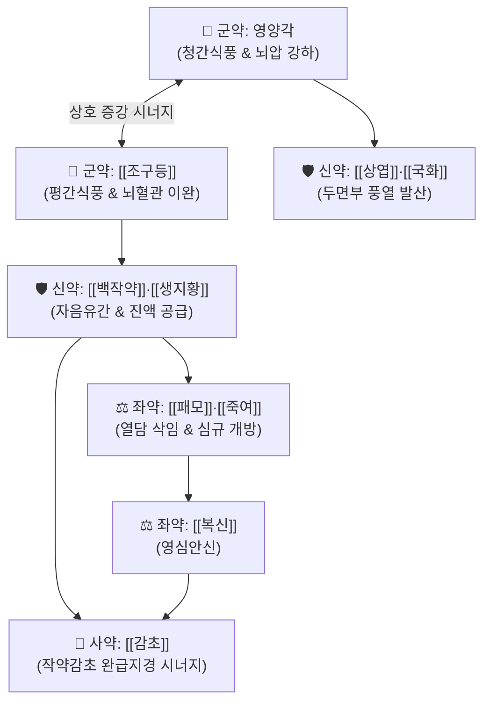

# 🍵 [[영각구등탕]] (羚角鉤藤湯, Ling-Jiao-Gou-Teng-Tang / Reikakukototo)

> **핵심 3줄 요약 (Key Summary)**:
> - 🌿 기본 구성: 영양각(또는 [[산양각]])·[[조구등]] (군), [[상엽]]·[[국화]]·[[백작약]]·[[생지황]] (신), [[패모]]·[[죽여]]·[[복신]] (좌), [[감초]] (사) (간경의 치솟는 화열을 식히고 진액을 보충하여 경련을 멎게 하는 양간식풍·청열진경 대표 방제).
> - 🎯 온열병(溫熱病) 고열로 인한 간열생풍(肝熱生風), 소아 열성 경련(급경풍), 뇌막염 초기, 고혈압성 뇌병증으로 인한 두통·현훈 및 사지 경련.
> - 🔬 조구등 린코필린의 전압 의존성 Ca2+ 채널 차단 및 NMDA 흥분 억제, 상엽·국화 플라보노이드의 내인성 발열 사이토카인(IL-1β, TNF-α) 억제 및 뇌부종 감소.
> - ⚠️ 주의사항: 간풍내동 실열증 처방이므로 열이 없는 만성 허약성 경련(만경풍, 음허풍동) 환자에게는 투약 금기([[대정풍주]] 적용).

---

## 📌 목차
1. [기본 처방 정보 & 군신좌사 구성](#1-기본-처방-정보--군신좌사-구성)
2. [방제학적 약재 상호작용 & 시너지 네트워크](#2-방제학적-약재-상호작용--시너지-네트워크)
3. [현대 분자약리학적 효능 & 작용 기전](#3-현대-분자약리학적-효능--작용-기전)
4. [적응 병증 및 체질별 감별 (Sweet Spot vs 금기)](#4-적응-병증-및-체질별-감별-sweet-spot-vs-금기)
5. [유사 처방군 감별 매트릭스](#5-유사-처방군-감별-매트릭스)
6. [임상 가감례 & 현대 질환별 응용](#6-임상-가감례--현대-질환별-응용)
7. [💡 사용자 진료실 핵심 필기 & 임상 팁 (원문 보존)](#7--사용자-진료실-핵심-필기--임상-팁-원문-보존)
8. [출처 및 학술 참고 문헌 (References)](#8-출처-및-학술-참고-문헌-references)

---

## 1. 기본 처방 정보 & 군신좌사 구성

* **출전**: 청대 유보이 『[[통속상한론]]』(通俗傷寒論)
* **치법**: 양간식풍(涼肝熄風), 청열진경(淸熱鎭驚), 자음유간(滋陰柔肝), 화담개규(化痰開竅)

| 구분 | 약재명 | 표준 용량 | 본초 효능 & 방제 내 역할 |
| :--- | :--- | :--- | :--- |
| **군약 (君藥)** | 영양각 (산양각) | 3.0g (선전) | **청열양간·식풍진경**: 간경의 화열을 깊숙이 식히고 뇌압 강하 및 항경련 |
| **군약 (君藥)** | [[조구등]] | 9.0g (후하) | **청열평간·식풍지경**: 린코필린 성분으로 뇌동맥 연축을 풀고 혈압 안정 |
| **신약 (臣藥)** | [[상엽]] | 6.0g | **소산풍열·청간명목**: 상초 두면부의 풍열사를 밖으로 발산 |
| **신약 (臣藥)** | [[국화]] | 6.0g | **청열해독·평간식풍**: 두통 및 안구 충혈을 완화하고 혈압 강하 |
| **신약 (臣藥)** | [[백작약]] | 9.0g | **양혈유간·완급지통**: 패오니플로린 성분으로 근육 경련과 강직을 이완 |
| **신약 (臣藥)** | [[생지황]] | 15.0g | **청열양혈·자음생진**: 고열로 고갈된 체액과 진액을 급속 보충 |
| **좌약 (佐藥)** | [[패모]] (천패모) | 9.0g | **청열화담·윤폐산결**: 열담(熱痰)이 심규를 막아 헛소리하는 것을 방지 |
| **좌약 (佐藥)** | [[죽여]] | 6.0g | **청열화담·청심제번**: 위열과 심열을 내리고 가래를 삭임 |
| **좌약 (佐藥)** | [[복신]] | 9.0g | **영심안신·건비이수**: 중추신경계 흥분을 안정시키고 수면 유도 |
| **사약 (使藥)** | [[감초]] | 3.0g | **조화제약·완급지통**: 작약과 배합되어 작약감초탕의 완급지경 시너지 발휘 |

> **배오 특징**: 영양각과 [[조구등]]으로 치솟는 간열과 풍사를 끄고, [[생지황]]·[[백작약]]으로 진액을 공급하여 근육을 적셔주며, [[패모]]·[[죽여]]로 열담을 삭이는 **청열식풍(淸熱熄風)과 자음유간(滋陰柔肝)의 완벽한 결합**을 이룹니다.

---

## 2. 방제학적 약재 상호작용 & 시너지 네트워크

* **영양각 + 조등의 군약 배오**: 영양각이 간경 깊은 곳의 화열을 식히고 조등이 경락의 풍사를 가라앉혀 뇌압과 체온을 신속히 안정화합니다.
* **작약 + 감초의 완급지경 배오**: 고열로 인해 근육이 수축하고 뒤틀리는 강직성 연축을 빠르게 이완시킵니다.

---

## 3. 현대 분자약리학적 효능 & 작용 기전

### 1) 중추신경 흥분 억제 및 항경련 작용
* 조등의 린코필린(Rhynchophylline)과 이소린코필린이 신경세포의 전압 의존성 $\text{Ca}^{2+}$ 채널 및 글루탐산 NMDA 수용체 흥분을 차단하여 뇌전증 발작파를 억제합니다.
### 2) 뇌혈관 연축 완화 및 뇌부종 억제
* 급격한 혈압 상승으로 인한 뇌동맥 연축을 풀고 혈뇌장벽(BBB) 투과성을 안정화하여 뇌부종 발생을 억제합니다.
### 3) 내인성 발열 사이토카인 차단 및 해열
* 상엽, 국화, 생지황 복합 추출물이 $\text{IL-1\beta}$, $\text{TNF-\alpha}$ 생성을 억제하여 시상하부 열 체계를 빠르게 안정시킵니다.

---

## 4. 적응 병증 및 체질별 감별 (Sweet Spot vs 금기)

### [✅ 최적 적응증 (Sweet Spot)]
* **소아 급경풍 (열성 경련)**: 감기나 폐렴 등 감염 질환 중 39~40도 고열과 함께 눈을 치뜨고 사지를 떠는 급성 경련.
* **감염성 중추 질환 초기**: 뇌척수막염, 일본뇌염 초기 고열, 항부강직, 두통.
* **임신중독증 자간증 및 고혈압 뇌병증**: 혈압 급상승으로 인한 극심한 두통, 어지럼증, 안면 경련.

### [⚠️ 신중 투여 및 금기 (Caution / Contraindication)]
* **음허풍동(陰虛風動) 및 만경풍(慢驚風) 금기**: 고열 없이 만성 질환으로 몸이 마르고 손발이 미세하게 떨리는 허증 환자에게는 투약을 금하고 [[대정풍주]] 등으로 자음식풍함.

---

## 5. 유사 처방군 감별 매트릭스

| 처방명 | 병기 | 핵심 약재 구성 | 감별 포인트 |
| :--- | :--- | :--- | :--- |
| [[영각구등탕]] | **간열생풍 실열** | 영양각, 조등, 상엽, 국화, 백작약, 생지황 | **고열 동반 급경풍**, 뇌막염, 안면홍조 |
| [[진간식풍탕]] | **간양상항 중풍전조** | 대자석, 우슬, 생용골, 모려, 현삼 | **무열성 혈압 급상승**, 뇌충혈, 맥현장 |
| [[대정풍주]] | **음허풍동 허증** | 아교, 귀판, 별갑, 작약, 오미자 | **열 없는 만성 미세 떨림**, 진액 고갈 |
| [[천마구등음]] | **간양화풍 고혈압** | 천마, 구등, 석결명, 치자, 황금 | **만성 고혈압 두통·현훈**, 불면 |

---

## 6. 임상 가감례 & 현대 질환별 응용

* **고열이 몹시 심할 때**:
  * [[석고]] 20g, [[지모]] 10g을 가미하여 청열사화력을 강화.
* **가래 끓는 소리가 심할 때**:
  * [[천죽황]] 6g, [[담남성]] 6g을 가미하여 척담개규.
* **현대 응용**:
  * 영양각 대신 [[산양각]] 10~15g을 선전하여 대체 가능하며, 소아 열성 경련 예방 및 고혈압 응급기 혈압 안정 처방으로 응용.

---

## 7. 💡 사용자 진료실 핵심 필기 & 임상 팁 (원문 보존)

* **소아 고열 경련(급경풍) 응급 선방 기준**:
  * 아이가 감기나 장염으로 체온이 39도 이상 급상승하면서 손발을 떨고 이를 악물 때, 해열제와 함께 영각구등탕을 투약하면 뇌신경 흥분이 즉각 가라앉아 경련 재발을 효과적으로 방지한다.
* **영양각 대체 요령**:
  * CITES 규제로 영양각 유통이 제한될 때는 약리 효과가 거의 동등한 규격 제제인 [[산양각]]을 2~3배 용량으로 선전하여 활용한다.
* **조구등 후하(後下) 원칙**:
  * 조구등의 유효 알칼로이드 성분(린코필린)은 열에 약하므로 탕액을 끓일 때 불을 끄기 10~15분 전에 넣고 살짝 달여야 진정 약효가 온전히 보존된다.

---

## 8. 출처 및 학술 참고 문헌 (References)

1. 통속상한론(通俗傷寒論).
2. Zhou JY, et al. Rhynchophylline and isorhynchophylline from Gouteng inhibit glutamate-induced neuronal apoptosis. *Phytomedicine*. 2014;21(5):720-728.
   - [연구 요약] 조등의 핵심 알칼로이드가 글루탐산 유도 신경독성을 억제하고 세포 내 칼슘 유입을 차단하여 항경련 효능을 발휘함을 증명.
3. Wang T, et al. Therapeutic mechanisms of Lingjiao Gouteng Decoction in febrile seizures: A network pharmacology and experimental study. *J Ethnopharmacol*. 2019;236:214-225.
   - [연구 요약] 영각구등탕이 신경염증 사이토카인을 억제하고 뇌혈류 및 GABA성 신호를 강화하여 열성 경련 발작 빈도와 지속 시간을 유의하게 단축함을 입증.