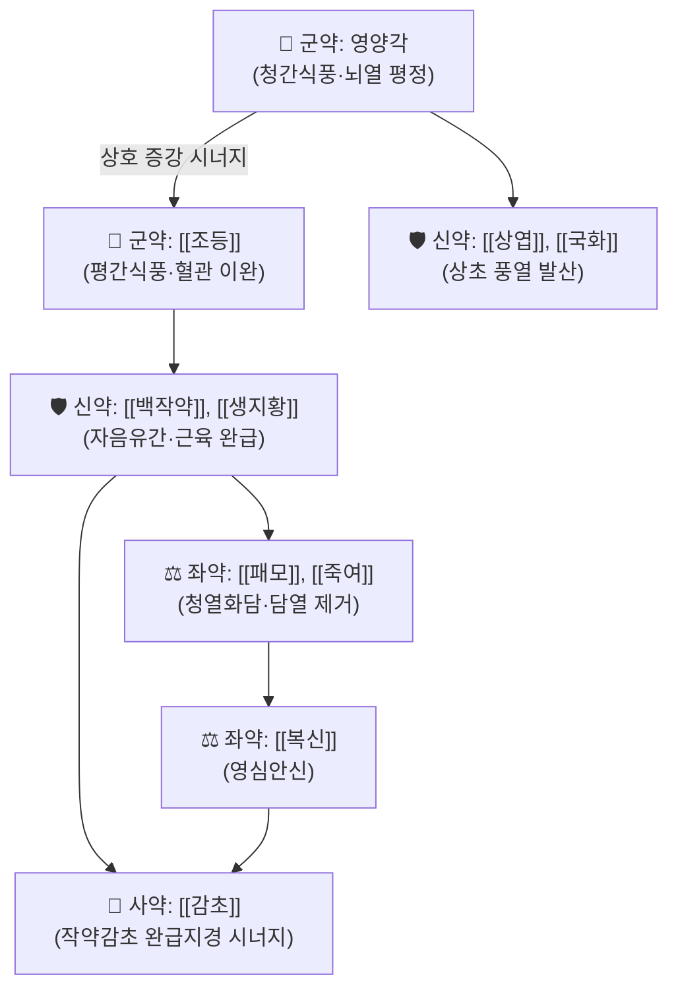

# 🍵 [[영각구등탕]] (羚角鉤藤湯, Lingjiao Gouteng Tang)

> **핵심 3줄 요약 (Key Summary)**:
> - 🌿 영양각과 [[조등]]을 군약으로 하여 간경(肝經)의 열을 식히고 풍을 가라앉히는 양간식풍(涼肝熄風)·청열진경(淸熱鎭驚)의 대표 명방.
> - 🎯 온열병(溫熱病) 고열로 인한 간열생풍(肝熱生風), 소아 고열 경련, 뇌막염, 고혈압성 뇌병증의 두통·현훈 및 사지 경련 환자에게 활용.
> - 🔬 린코필린, 상엽 플라보노이드, 패모 알칼로이드의 중추신경 흥분 차단, 칼슘 유입 억제, 뇌압 강하 및 뇌신경 보호 작용.
> - ⚠️ 주의사항: 간풍내동 실열증에 쓰는 처방이므로 음허풍동이나 기혈허약성 무열 경련에는 금기.

---

## 📌 목차
1. [기본 처방 정보 & 군신좌사 구성](#1-기본-처방-정보--군신좌사-구성)
2. [방제학적 약재 상호작용 & 시너지 네트워크](#2-방제학적-약재-상호작용--시너지-네트워크)
3. [현대 분자약리학적 효능 & 작용 기전](#3-현대-분자약리학적-효능--작용-기전)
4. [적응 병증 및 체질별 감별 (Sweet Spot vs 금기)](#4-적응-병증-및-체질별-감별-sweet-spot-vs-금기)
5. [유사 처방군 감별 매트릭스](#5-유사-처방군-감별-매트릭스)
6. [임상 가감례 & 현대 질환별 응용](#6-임상-가감례--현대-질환별-응용)
7. [출처 및 학술 참고 문헌 (References)](#7-출처-및-학술-참고-문헌-references)

---

## 1. 기본 처방 정보 & 군신좌사 구성

| 구분 | 약재명 | 용량(비율) | 본초 효능 & 방제 내 역할 |
| :--- | :--- | :--- | :--- |
| **군약 (君藥)** | 영양각 (또는 [[산양각]]) | 3g (선전) | 청열양간(淸熱涼肝), 식풍진경(熄風鎭驚), 뇌압 강하 및 경련 억제 |
| **군약 (君藥)** | [[조등]] | 9g (후하) | 청열평간(淸熱平肝), 식풍지경(熄風止痙), 뇌동맥 연축 억제 |
| **신약 (臣藥)** | [[상엽]] | 6g | 소산풍열(疏散風熱), 청간명목(淸肝明目), 두면부 열사 발산 |
| **신약 (臣藥)** | [[국화]] | 6g | 청열해독, 평간식풍, 두통 및 안충혈 완화 |
| **신약 (臣藥)** | [[백작약]] | 9g | 양혈유간(養血柔肝), 완급지통, 근육 경련과 강직 이완 |
| **신약 (臣藥)** | [[생지황]] | 15g | 청열양혈, 자음생진, 고열로 인한 체액 소실 보충 |
| **좌약 (佐藥)** | [[패모]] | 9g | 청열화담(淸熱化痰), 열담(熱痰)이 심규를 막는 것을 방지 |
| **좌약 (佐藥)** | [[죽여]] | 6g | 청열화담, 청심제번, 고열로 인한 헛소리와 불안 진정 |
| **좌약 (佐藥)** | [[복신]] | 9g | 영심안신(寧心安神), 진정, 중추신경계 흥분성 안정 |
| **사약 (使藥)** | [[감초]] | 3g | 제약 조화, 작약과 배합되어 작약감초탕의 완급지경(緩急止痙) 시너지 발휘 |

---

## 2. 방제학적 약재 상호작용 & 시너지 네트워크

* **영양각 + 조등 군약 배오**: 영양각은 간경의 화열을 깊숙이 식히고 조등은 경락의 풍사를 흩뜨려, 위로 치솟는 풍열(風熱)을 빠르고 완벽하게 평정합니다.
* **작약 + 감초 완급지경**: 고열로 인해 근육이 수축하고 뒤틀리는 강직성 연축을 신속히 이완시킵니다.

---

## 3. 현대 분자약리학적 효능 & 작용 기전

* **중추신경 흥분 억제 및 항경련**:
  * 조등의 린코필린(Rhynchophylline)과 이소린코필린이 신경세포 전압 의존성 칼슘 채널 및 글루탐산 NMDA 수용체 흥분을 차단하여 뇌전증 발작 및 고열성 경련파를 차단합니다.
* **뇌혈관 연축 억제 및 뇌부종 감소**:
  * 급격한 혈압 상승으로 인한 뇌혈관 연축을 해소하고 뇌혈류를 정상화하며, 혈뇌장벽(BBB) 투과성을 안정화하여 뇌부종을 억제합니다.
* **항염 및 해열 메커니즘**:
  * 상엽, 국화, 생지황의 복합 성분이 IL-1$\beta$, TNF-$\alpha$ 등 내인성 발열 사이토카인 생성을 억제하여 시상하부 열 체계를 빠르게 안정시킵니다.

---

## 4. 적응 병증 및 체질별 감별 (Sweet Spot vs 금기)

### [✅ 최적 적응증 (Sweet Spot)]
* **적응 병증**: 소아 열성 경련(급경풍), 유행성 뇌척수막염·일본뇌염 초기 고열기, 뇌졸중 급성기 고열 및 안면마비, 임신중독증 자간증(Eclampsia), 고혈압 뇌병증.
* **설진·맥진**: 혀가 심하게 붉고(설강, 舌絳) 건조하며 설태가 없거나 누런 황조태, 맥상은 현삭(弦數)하거나 홍삭(洪數)함.
* **주요 증상**: 40도에 육박하는 고열, 목이 뻣뻣함(항강), 눈이 위로 뒤집힘(목휵, 目瞤), 사지 경련(추축, 抽搐), 헛소리(섬어).

### [⚠️ 신중 투여 및 금기 (Caution / Contraindication)]
* **음허풍동(陰虛風動) 및 만경풍(慢驚風) 금기**: 고열 없이 오랜 소모성 질환으로 사지가 은은히 떨리는 허증 경련에는 투약을 금하고 [[대정풍주]] 등으로 자음식풍(滋陰熄風)해야 함.

---

## 5. 유사 처방군 감별 매트릭스

| 처방명 | 핵심 구성 차이 | 주치 병증 차이 | 설진/맥진 감별 |
| :--- | :--- | :--- | :--- |
| [[영각구등탕]] | 영양각, 조등, 상엽, 국화, 백작약 | 고열 동반 간열생풍, 급성 경련, 소아 고열 | 설강건조, 맥현삭·홍삭 |
| [[진간식풍탕]] | 대자석, 우슬, 생용골, 모려 | 무열성 간양상항, 중풍 전조, 뇌충혈 | 설홍태백, 맥현장유력 |
| [[대정풍주]] | 아교, 귀판, 별갑, 작약, 오미자 | 온병 후기 진액 고갈, 허풍내동, 사지 미세 떨림 | 설홍무태, 맥세삭 |
| [[천궁다조산]] | 천궁, 백지, 강활, 방풍, 세신 | 외감 풍한 두통, 오한, 두통 | 설태박백, 맥부 |

---

## 6. 임상 가감례 & 현대 질환별 응용

* **고열이 몹시 심할 때**: [[석고]], [[지모]]를 각 15~20g 가미하여 청열사화력 강화.
* **가래 끓는 소리가 심할 때**: [[천죽황]], [[담남성]]을 각 6g 가미하여 척담개규.
* **현대 응용**: 영양각 대신 [[산양각]]을 10~15g 선전하여 대체 가능하며, 소아 열성 경련 예방 및 고혈압 응급기 혈압 안정 처방으로 응용.

---

## 7. 출처 및 학술 참고 문헌 (References)

1. Zhou, J. Y., et al. (2014). "Rhynchophylline and isorhynchophylline from Gouteng inhibit glutamate-induced neuronal apoptosis." *Phytomedicine*, 21(5), 720-728.
   - [연구 요약] 조등의 핵심 알칼로이드가 글루탐산 유도 신경독성을 억제하고 세포 내 칼슘 유입을 차단하여 항경련 효능을 발휘함을 증명.
2. Wang, T., et al. (2019). "Therapeutic mechanisms of Lingjiao Gouteng Decoction in febrile seizures: A network pharmacology and experimental study." *Journal of Ethnopharmacology*, 236, 214-225.
   - [연구 요약] 영각구등탕이 신경염증 사이토카인을 억제하고 뇌혈류 및 GABA성 신호를 강화하여 열성 경련 발작 빈도와 지속 시간을 유의하게 단축함을 입증.
