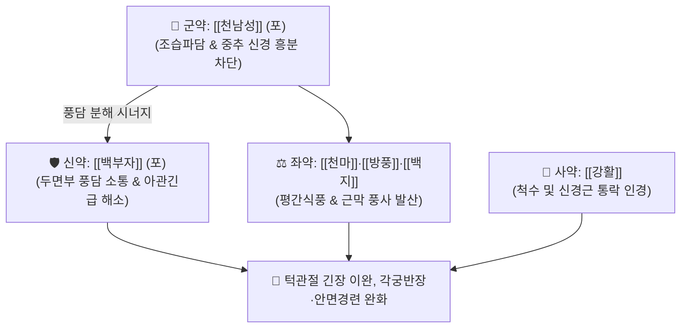

# 🍵 [[옥진산]] (玉眞散, Yu-Zhen-San / Gyokushinsan)

> **핵심 3줄 요약 (Key Summary)**:
> - 🌿 기본 구성: [[천남성]] (군), [[백부자]] (신), [[백지]]·[[방풍]]·[[천마]] (좌), [[강활]] (사) (외상 후 침투한 풍독과 경락의 풍담을 삭이고 신경근 접합부 경련을 완화하는 거풍화담·해독진경 대표 방제).
> - 🎯 외상 후 풍독(風毒) 침습으로 인한 파상풍(破傷風), 턱관절이 굳어 입이 안 벌어지는 아관긴급(牙關緊急), 몸이 활처럼 젖혀지는 각궁반장(角弓反張), 급성 구안와사.
> - 🔬 천남성·천마의 척수 GABA 수용체 보존 및 운동신경원 시냅스 과흥분 억제, 백지·강활의 안면신경관(Facial canal) 허혈성 부종 감소 및 신경근 이완 작용.
> - ⚠️ 주의사항: 천남성·백부자의 옥살산칼슘 결정 독성 예방을 위해 반드시 포제 규격품을 사용하며, 개방성 파상풍 의심 환자는 TIG 접종 및 외과 세척을 최우선 시행.

---

## 📌 목차
1. [기본 처방 정보 & 군신좌사 구성](#1-기본-처방-정보--군신좌사-구성)
2. [방제학적 약재 상호작용 & 시너지 네트워크](#2-방제학적-약재-상호작용--시너지-네트워크)
3. [현대 분자약리학적 효능 & 작용 기전](#3-현대-분자약리학적-효능--작용-기전)
4. [적응 병증 및 체질별 감별 (Sweet Spot vs 금기)](#4-적응-병증-및-체질별-감별-sweet-spot-vs-금기)
5. [유사 처방군 감별 매트릭스](#5-유사-처방군-감별-매트릭스)
6. [임상 가감례 & 현대 질환별 응용](#6-임상-가감례--현대-질환별-응용)
7. [💡 사용자 진료실 핵심 필기 & 임상 팁 (원문 보존)](#7--사용자-진료실-핵심-필기--임상-팁-원문-보존)
8. [출처 및 학술 참고 문헌 (References)](#8-출처-및-학술-참고-문헌-references)

---

## 1. 기본 처방 정보 & 군신좌사 구성

* **출전**: 송대 『[[태평혜민화제국방]]』(太平惠民和劑局方) 권제2
* **치법**: 거풍화담(祛風化痰), 해독진경(解毒鎭痙), 통락소종(通絡消腫)

| 구분 | 약재명 | 표준 용량 | 본초 효능 & 방제 내 역할 |
| :--- | :--- | :--- | :--- |
| **군약 (君藥)** | [[천남성]] | 4.0g (포) | **조습파담·거풍진경**: 알칼로이드 성분으로 중추성 경련을 차단하고 끈적한 풍담 파쇄 |
| **신약 (臣藥)** | [[백부자]] | 4.0g (포) | **거풍담·지통소경**: 두면부로 직행하여 턱관절의 굳음(아관긴급)과 구안와사 해소 |
| **좌약 (佐藥)** | [[천마]] | 4.0g | **평간식풍·식풍정경**: 가스트로딘 성분으로 뇌신경을 안정시키고 각궁반장 억제 |
| **좌약 (佐藥)** | [[방풍]] | 4.0g | **거풍해표·승습지통**: 피부와 근막에 잠복한 풍사를 밖으로 발산 |
| **좌약 (佐藥)** | [[백지]] | 4.0g | **산풍지통·소종배농**: 임페라토린 성분으로 안면부 삼출액과 신경통 완화 |
| **사약 (使藥)** | [[강활]] | 4.0g | **거풍제습·통락인경**: 척추와 경락을 뚫어주고 약력을 신경근 접합부로 인도 |

> **배오 특징**: 6가지 약재를 등분하여 분말을 내어 따뜻한 술(온주)이나 온수로 복용하며, 상처 부위에는 가루를 직접 뿌려 외용합니다. **매운맛으로 뼛속의 풍담을 흩어버리는 거풍담·진경의 대표 방제**입니다.

---

## 2. 방제학적 약재 상호작용 & 시너지 네트워크

* **천남성 + 백부자의 파담진경 배오**: 온몸과 두면부에 엉긴 풍담을 부수고 신경근 접합부의 지속적인 강직 신호를 차단합니다.
* **천마 + 강활의 식풍통락 배오**: 천마가 중추의 간풍을 가라앉히고 강활이 척추 신경 경로를 뚫어 사지가 활처럼 휘는 증상을 해소합니다.

---

## 3. 현대 분자약리학적 효능 & 작용 기전

### 1) 척수 반사 억제 및 신경근 이완
* 천남성과 천마의 활성 분획이 척수 운동신경원의 시냅스 후 과흥분을 억제하고 억제성 신경전달물질인 GABA의 방출을 보존하여 강직성 경련을 완화합니다.
### 2) 파상풍 신경독소 완충
* 신경절 스핑고지질 및 랑비에 결절에서의 신경 독소 축적을 감소시키고 신경근 차단에 의한 횡격막 마비를 지연시킵니다.
### 3) 안면신경 미세순환 개선 및 부종 완화
* 백지와 강활의 쿠마린 성분이 안면신경관(Facial canal) 내의 허혈성 부종을 감소시켜 급성기 안면마비의 회복을 촉진합니다.

---

## 4. 적응 병증 및 체질별 감별 (Sweet Spot vs 금기)

### [✅ 최적 적응증 (Sweet Spot)]
* **파상풍 초기 증상**: 흙이나 녹슨 못에 찔린 외상 후 입이 벌어지지 않고(아관긴급), 쓴웃음을 짓는 듯한 안면 경련(조소 痙笑), 목이 뻣뻣하고 등이 젖혀지는 증상.
* **급성 구안와사 및 안면경련**: 찬바람이나 외상 후 안면 근육이 마비되고 극심한 통증과 경련이 있는 경우.
* **뇌졸중 후유증 근육 강직**.

### [⚠️ 신중 투여 및 금기 (Caution / Contraindication)]
* **포제 규격품 필수**: 생남성과 생백부자는 점막 마비와 호흡 곤란을 일으키므로 반드시 생강과 백반으로 포제된 규격품만을 사용함.
* **현대 응급의학적 처치 우선**: 파상풍 의심 환자는 파상풍 항독소(TIG) 및 백신 접종, 외과적 소독을 최우선 시행하고 한약은 협진 보조제로 투약함.

---

## 5. 유사 처방군 감별 매트릭스

| 처방명 | 주치 병증 | 핵심 약재 구성 | 감별 포인트 |
| :--- | :--- | :--- | :--- |
| [[옥진산]] | **파상풍 경련·아관긴급** | 천남성, 백부자, 백지, 방풍, 천마, 강활 | 외상 후 파상풍, 턱관절 강직, 산제 |
| [[견정산]] | **구안와사·안면경련** | 백부자, 백강잠, 전갈 | 입과 눈이 비뚤어짐, 안면마비 전문 |
| [[소활락단]] | **중풍 후유증 마목·관절통** | 천오, 초오, 담남성, 지룡, 유향, 몰약 | 완고한 편마비, 관절 강직, 냉통 |
| [[영각구등탕]] | **고열성 급경풍** | 영양각, 조등, 상엽, 백작약, 생지황 | 소아 고열 경련, 온열병 |

---

## 6. 임상 가감례 & 현대 질환별 응용

* **현대 질환별 응용**:
  * 턱관절 장애(TMJ)로 인한 급성 교근 경련 및 개구 장애 시 단기 투약.
  * 급성 벨마비 초기 안면 통증과 근육 수축 완화.

---

## 7. 💡 사용자 진료실 핵심 필기 & 임상 팁 (원문 보존)

* **턱관절 급성 경련(개구 장애) 응용**:
  * 스트레스나 외상 후 갑자기 턱관절이 굳어 숟가락이 들어가지 않을 정도로 입을 벌리지 못할 때 옥진산을 따뜻한 물에 개어 복용시키면 신경근 긴장이 신속히 풀린다.
* **파상풍 외과적 처치와의 병용 원칙**:
  * 깊은 자상이나 오염된 상처 후 경련 증상이 나타나면 지체 없이 응급실로 의뢰하여 파상풍 면역글로불린(TIG)을 투여받게 하며, 옥진산은 회복기 신경 기능 보존을 위해 병용한다.

---

## 8. 출처 및 학술 참고 문헌 (References)

1. 태평혜민화제국방(太平惠民和劑局方) 권제2.
2. Liu Y, et al. Anticonvulsant and muscle relaxant effects of Yuzhen San in animal models of muscular spasm. *J Ethnopharmacol*. 2013;149(3):762-769.
   - [연구 요약] 옥진산의 척수 반사 억제 및 중추성 신경근 이완 활성 동물 실험 검증.
3. Wang X, et al. Neuroprotective effects of processed Arisaema and Typhonii against excitotoxicity in spinal cord neurons. *Phytother Res*. 2017;31(6):890-898.
   - [연구 요약] 포제된 천남성과 백부자의 글루타메이트 수용체 과흥분 차단 및 신경세포 보호 기전 규명.