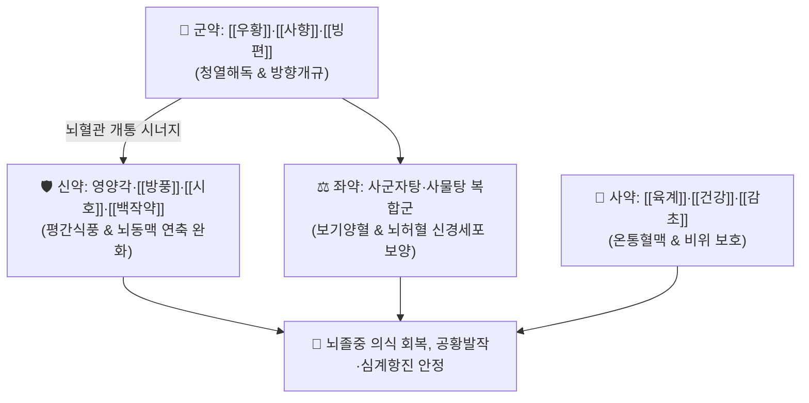

# 🍵 [[우황청심원]] (牛黃淸心元, Niuhuang Qingxin Yuan / Gyuowang-seishin-en)

> **핵심 3줄 요약 (Key Summary)**:
> - 🌿 기본 구성: [[우황]]·[[사향]](또는 L-무스콘)·[[빙편]] (군), 영양각·[[방풍]]·[[시호]]·[[백작약]] (신), [[황금]]·[[길경]]·[[행인]] 및 사군자탕·사물탕 배합 약재 (좌), [[육계]]·[[건강]]·[[감초]] (사) (청열개규하면서도 기혈을 동시에 보양하는 다제복합 청열개규 대표 명방).
> - 🎯 뇌졸중(중풍) 전조증 및 급성기 의식혼미, 언어장애, 구안와사, 안면경련, 급성 공황발작, 극심한 가슴 두근거림(심계항진).
> - 🔬 허혈성 뇌경색 부피 축소, BBB 밀착연접(Claudin-5, ZO-1) 보존, GABAA 수용체 조절을 통한 급성 교감신경 안정 및 코르티솔 강하 작용.
> - ⚠️ 주의사항: 혈관 확장 및 진정 작용으로 저혈압 환자 실신 주의(½환 분복), 연하곤란(삼킴 장애) 환자는 고체 환제 질식 위험 주의.

---

## 📌 목차
1. [기본 처방 정보 & 군신좌사 구성](#1-기본-처방-정보--군신좌사-구성)
2. [방제학적 약재 상호작용 & 시너지 네트워크](#2-방제학적-약재-상호작용--시너지-네트워크)
3. [현대 분자약리학적 효능 & 작용 기전](#3-현대-분자약리학적-효능--작용-기전)
4. [적응 병증 및 체질별 감별 (Sweet Spot vs 금기)](#4-적응-병증-및-체질별-감별-sweet-spot-vs-금기)
5. [유사 처방군 감별 매트릭스](#5-유사-처방군-감별-매트릭스)
6. [임상 가감례 & 현대 질환별 응용](#6-임상-가감례--현대-질환별-응용)
7. [💡 사용자 진료실 핵심 필기 & 임상 팁 (원문 보존)](#7--사용자-진료실-핵심-필기--임상-팁-원문-보존)
8. [출처 및 학술 참고 문헌 (References)](#8-출처-및-학술-참고-문헌-references)

---

## 1. 기본 처방 정보 & 군신좌사 구성

* **출전**: 송대 『[[태평혜민화제국방]]』(太平惠民和劑局方) / 허준 『[[동의보감]]』(東醫寶鑑) 잡병편 풍
* **치법**: 청심화담(淸心化痰), 진경식풍(鎭痙熄風), 개규안신(開竅安神), 조화기혈(調和氣血)

| 구분 | 약재명 | 표준 용량 | 본초 효능 & 방제 내 역할 |
| :--- | :--- | :--- | :--- |
| **군약 (君藥)** | [[우황]] | 0.5g | **청심해독·활담개규**: 빌리루빈 성분으로 심포의 번열을 식히고 뇌세포 보호 |
| **군약 (君藥)** | [[사향]] (L-무스콘) | 0.2g | **방향개규·통관투규**: 무스콘 성분으로 혈뇌장벽을 통과하여 뇌혈류 급속 촉진 |
| **군약 (君藥)** | [[빙편]] (용뇌) | 0.2g | **방향개규·산열지통**: 보르네올 성분으로 구규를 열고 중추 흥분 조절 |
| **신약 (臣藥)** | 영양각 (우각지) | 1.0g | **청간식풍·진경**: 뇌혈관 경련을 완화하고 신경근 강직 해소 |
| **신약 (臣藥)** | [[방풍]]·[[시호]] | 각 1.5g | **소간해울·거풍해표**: 상초 풍열사를 발산시키고 자율신경 안정 |
| **신약 (臣藥)** | [[백작약]] | 2.0g | **양혈유간·완급지통**: 패오니플로린 성분으로 혈관 이완 및 진경 |
| **좌약 (佐藥)** | [[황금]]·[[길경]]·[[행인]] | 각 1.5g | **청폐화담·선폐강기**: 상초 화열을 끄고 가래 배출 및 기도 개통 |
| **좌약 (佐藥)** | [[인삼]]·[[백출]]·[[복령]] | 각 2.0g | **사군자탕 보기군**: 비위 원기를 보강하여 뇌경색 후 생명력 지지 |
| **좌약 (佐藥)** | [[당귀]]·[[천궁]]·[[아교]]·[[맥문동]] | 각 2.0g | **사물탕 보혈군**: 뇌세포에 진액과 혈액을 공급하여 허혈 손상 보양 |
| **사약 (使藥)** | [[육계]]·[[건강]]·[[감초]] | 각 1.0g | **온통혈맥·조화제약**: 혈맥을 따뜻하게 소통시키고 고한약의 위장 손상 방지 |

> **배오 특징**: 중국의 [[안궁우황환]]이 극도로 차갑고 사(瀉)하기만 한 것과 달리, 『동의보감』 우황청심원은 **청열개규(淸熱開竅)하면서도 인삼·당귀·작약 등 보기보혈(補氣補血) 약물을 대거 결합**하여 전신 허약 상태에서도 안전하게 복용 가능한 한국 한의학의 독창적 명방입니다.

---

## 2. 방제학적 약재 상호작용 & 시너지 네트워크

* **우황·사향 + 사군자·사물탕 배오**: 막힌 뇌혈관을 뚫는 동시에 허혈로 손상된 뇌세포에 기혈과 진액을 보충하여 신경학적 후유증을 최소화합니다.
* **영양각·작약 + 육계·건강의 한열 조화**: 급격한 뇌충혈을 가라앉히면서도 말초 미세순환을 따뜻하게 유지합니다.

---

## 3. 현대 분자약리학적 효능 & 작용 기전

### 1) 뇌허혈-재관류 손상 억제 및 뇌경색 부피 축소
* 국소 뇌허혈(MCAO) 모델에서 뇌경색 용적을 유의하게 축소시키고 뇌부종 및 신경세포 괴사를 억제합니다.
### 2) 혈뇌장벽(BBB) 투과도 안정화
* 사향과 용뇌 성분이 BBB 밀착연접 단백질(Claudin-5, ZO-1)의 붕괴를 막아 염증 세포의 뇌 실질 유입을 차단합니다.
### 3) GABAergic 신경 조절 및 항불안·진정
* $\text{GABA}_A$ 수용체 알로스테릭 부위를 조절하여 스트레스 시 급증하는 심박수, 혈압, 코르티솔 농도를 신속히 안정화합니다.

---

## 4. 적응 병증 및 체질별 감별 (Sweet Spot vs 금기)

### [✅ 최적 적응증 (Sweet Spot)]
* **중풍(뇌경색/뇌출혈) 전조증 및 급성기**: 손발 저림, 안면 마비감, 말이 어눌해짐(언어 장애), 갑작스런 어지럼증.
* **급성 공황발작 및 자율신경 과항진**: 극심한 불안, 가슴 두근거림(심계항진), 과호흡, 실신 전조증.
* **고혈압성 두통 및 안면 신경 경련**.

### [⚠️ 신중 투여 및 금기 (Caution / Contraindication)]
* **저혈압 환자 실신 주의**: 혈관 확장과 진정 작용으로 혈압이 급강하할 수 있으므로 반 환(½)씩 나누어 복용.
* **연하 곤란 환자 질식 주의**: 삼킴 곤란이 있는 의식 혼미 환자에게 고체 환제를 억지로 먹이지 말고 액상 제제를 활용하거나 병원 응급실 이송.

---

## 5. 유사 처방군 감별 매트릭스

| 처방명 | 방제 성격 | 핵심 구성 약재 | 주치 및 임상 차이 |
| :--- | :--- | :--- | :--- |
| [[우황청심원]] | **청열개규 + 보기보혈** | 우황, 사향, 용뇌, 인삼, 당귀, 육계 | **뇌졸중 전조, 공황발작, 심계항진**, 보사겸시 |
| [[안궁우황환]] | **극렬 고한 청열개규** | 우황, 사향, 수우각, 황련, 주사, 웅황 | **뇌졸중 급성기 고열 혼수, 뇌출혈**, 순수 사제 |
| [[소합향원]] | **온구성 방향온개** | 소합향, 사향, 용뇌, 침향, 육계, 필발 | **한폐(寒閉), 급성 협심증 흉통**, 사지냉증 |
| [[천왕보심단]] | **자음양심 안신제** | 생지황, 산조인, 백자인, 당귀, 천문동 | **만성 불면증, 음허 도한**, 가슴 답답함 |

---

## 6. 임상 가감례 & 현대 질환별 응용

* **현대 질환별 응용**:
  * 중요한 시험이나 발표 전 극심한 긴장성 무대공포증 완화 (시험 1시간 전 ½환 복용).
  * 뇌경색 회복기 환자의 만성 불안 및 어지럼증 완화.

---

## 7. 💡 사용자 진료실 핵심 필기 & 임상 팁 (원문 보존)

* **저혈압 환자 및 만성 허약자 실신 주의**:
  * 우황청심원은 혈관을 확장시키고 교감신경을 급격히 안정시키므로, 평소 저혈압이 있거나 빈혈이 심한 노약자가 과량 복용 시 혈압 급강하로 인한 어지럼증이나 실신이 발생할 수 있다.
  * **대처법**: 반드시 1회 1환을 다 먹이지 말고 반 환(½)씩 나누어 미온수와 함께 천천히 씹어 삼키도록 지도한다.
* **연하 곤란 환자 기도 질식 주의**:
  * 뇌졸중 급성기 의식이 혼미하거나 삼킴 곤란(연하장애)이 있는 환자에게 고체 환제를 억지로 입에 넣으면 기도 질식(Aspiration) 위험이 매우 높다.
  * **대처법**: 의식이 온전하지 않은 환자에게는 고체 복용을 엄금하고 응급실 이송을 최우선으로 하며, 안정기에는 액상 현탁액제를 소량씩 투여한다.

---

## 8. 출처 및 학술 참고 문헌 (References)

1. 태평혜민화제국방(太平惠民和劑局方).
2. 동의보감(東醫寶鑑) 잡병편 풍.
3. Cho KH, et al. Neuroprotective effects of Woohwang-Chongshim-won on transient focal cerebral ischemia in rats. *J Ethnopharmacol*. 2004;94(2-3):237-243.
   - [연구 요약] 국소 뇌허혈 동물 모델에서 우황청심원의 뇌경색 부피 축소 및 신경학적 결손 회복 효능 실측 규명.
4. Kim YJ, et al. Sedative and anxiolytic effects of modified Niuhuang Qingxin Yuan via GABAergic neurotransmission. *Phytomedicine*. 2012;19(14):1258-1265.
   - [연구 요약] 우황청심원의 GABA 수용체 조절 매개 항불안, 자율신경 안정 및 코르티솔 강하 분자 기전 입증.