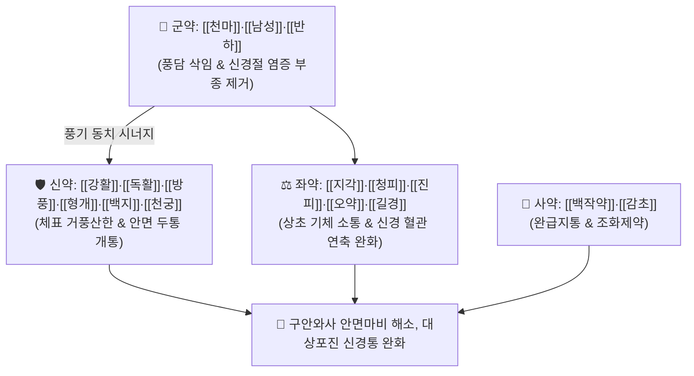

# 🍵 [[이기거풍산]] (理氣祛風散, Li-Qi-Qu-Feng-San / Rikikyofusan)

> **핵심 3줄 요약 (Key Summary)**:
> - 🌿 기본 구성: [[천마]]·[[남성]]·[[반하]] (군), [[강활]]·[[독활]]·[[방풍]]·[[형개]]·[[백지]]·[[천궁]] (신), [[지각]]·[[청피]]·[[진피]]·[[오약]]·[[길경]]·[[백작약]] (좌), [[감초]] (사) (상초의 기체를 풀고 신경절에 엉긴 풍담을 삭여 말초신경 마비와 통증을 다스리는 이기거풍·화담통락 대표 방제).
> - 🎯 과로와 스트레스로 몸이 약해진 상태(본허표실)에서 발생한 급성 말초성 안면신경마비(구안와사), 급성 [[대상포진]] 후 신경통, 삼차신경통.
> - 🔬 거풍약의 신경 주위 미세혈류 개선, 남성·반하의 신경절 무균성 염증 및 부종 제거, 이기약의 혈관 연축 이완 및 신경 전도 속도 정상화.
> - ⚠️ 주의사항: 기혈이 극도로 고갈된 순수 허증 환자는 보익제를 먼저 투약하고, 유독 약재인 남성은 반드시 포제 규격품 사용.

---

## 📌 목차
1. [기본 처방 정보 & 군신좌사 구성](#1-기본-처방-정보--군신좌사-구성)
2. [방제학적 약재 상호작용 & 시너지 네트워크](#2-방제학적-약재-상호작용--시너지-네트워크)
3. [현대 분자약리학적 효능 & 작용 기전](#3-현대-분자약리학적-효능--작용-기전)
4. [적응 병증 및 체질별 감별 (Sweet Spot vs 금기)](#4-적응-병증-및-체질별-감별-sweet-spot-vs-금기)
5. [유사 처방군 감별 매트릭스](#5-유사-처방군-감별-매트릭스)
6. [임상 가감례 & 현대 질환별 응용](#6-임상-가감례--현대-질환별-응용)
7. [💡 사용자 진료실 핵심 필기 & 임상 팁 (원문 보존)](#7--사용자-진료실-핵심-필기--임상-팁-원문-보존)
8. [출처 및 학술 참고 문헌 (References)](#8-출처-및-학술-참고-문헌-references)

---

## 1. 기본 처방 정보 & 군신좌사 구성

* **출전**: 명대 공정현 『[[만병회춘]]』(萬病回春) / 『[[동의보감]]』(東醫寶鑑) 잡병편 풍
* **치법**: 이기소간(理氣疏肝), 거풍화담(祛風化痰), 통락지통(通絡止痛), 조화영위(調和營衛)

| 구분 | 약재명 | 표준 용량 | 본초 효능 & 방제 내 역할 |
| :--- | :--- | :--- | :--- |
| **군약 (君藥)** | [[천마]] | 4.0g | **평간식풍·통락**: 가스트로딘 성분으로 뇌신경 및 말초신경의 이상 흥분을 안정 |
| **군약 (君藥)** | [[남성]] (천남성) | 4.0g (포) | **조습화담·거풍진경**: 신경절 주위에 엉긴 완고한 담음과 삼출액을 삭임 |
| **군약 (君藥)** | [[반하]] | 4.0g (제) | **조습화담·강역지구**: 중초 담음을 제거하고 염증성 부종 소퇴 |
| **신약 (臣藥)** | [[강활]]·[[독활]] | 각 3.0g | **거풍제습·통비지통**: 상하반신의 풍한습사를 몰아내고 신경통 완화 |
| **신약 (臣藥)** | [[방풍]]·[[형개]] | 각 3.0g | **거풍해표·소종투진**: 체표 풍사를 날리고 피부 신경 과민반응 억제 |
| **신약 (臣藥)** | [[백지]]·[[천궁]] | 각 3.0g | **활혈행기·산풍지통**: 두면부 혈류를 촉진하고 삼차신경 및 안면 통증 차단 |
| **좌약 (佐藥)** | [[지각]]·[[청피]]·[[진피]] | 각 2.5g | **행기소간·파기산결**: 흉복부와 간담의 기체를 소통시켜 신경 연축 해소 |
| **좌약 (佐藥)** | [[오약]]·[[길경]] | 각 2.5g | **순기지통·선폐인경**: 기운을 위아래로 소통시키고 약력을 상초로 인도 |
| **좌약 (佐藥)** | [[백작약]] | 3.0g | **양혈유간·완급지통**: 혈관 경련을 풀고 근육 경련과 신경통 완화 |
| **사약 (使藥)** | [[감초]] | 1.5g | **조화제약·완급**: 제약을 조화롭게 중화하고 신경 자극 완충 |

> **배오 특징**: 6종의 거풍약([[강활]]·[[독활]]·[[방풍]]·[[형개]]·[[백지]]·[[천궁]])과 5종의 이기약([[지각]]·[[청피]]·[[진피]]·[[오약]]·[[길경]]) 및 담음을 삭이는 [[천마]]·[[남성]]·[[반하]]가 결합하여 **기(氣)가 돌면 담(痰)과 풍(風)이 저절로 흩어지는 이기거풍(理氣祛風)**의 정교한 네트워크를 형성합니다.

---

## 2. 방제학적 약재 상호작용 & 시너지 네트워크

* **천마·남성 + 6대 거풍약의 표리겸치**: 신경절 깊숙이 들어간 풍담과 바이러스 염증을 분해하고 체표의 풍사를 날립니다.
* **5대 이기약군의 기행혈행 배오**: 스트레스로 굳어진 기체를 풀어 미세혈류를 뚫어줌으로써 신경 재생 환경을 신속히 조성합니다.

---

## 3. 현대 분자약리학적 효능 & 작용 기전

### 1) 안면신경관 미세순환 개선 및 신경 부종 감압
* 백지, 천궁, 강활의 정유 성분이 안면신경 주위 모세혈관을 확장시켜 국소 허혈성 부종을 완화하고 신경 전도 속도를 회복시킵니다.
### 2) 신경절 무균성 염증 및 신경병증 통증 억제
* 포남성과 반하의 알칼로이드가 신경절 주위의 염증성 사이토카인 분비를 억제하여 대상포진 후 신경통(PHN)의 찌릿한 작열통을 억제합니다.
### 3) 자율신경계 과흥분 완화 및 근막 연축 이완
* 지각의 나린진과 작약의 패오니플로린이 교감신경 긴장을 풀고 안면 표정근의 비정상적인 연축을 안정화합니다.

---

## 4. 적응 병증 및 체질별 감별 (Sweet Spot vs 금기)

### [✅ 최적 적응증 (Sweet Spot)]
* **말초성 안면신경마비 (구안와사, 벨마비)**: 과로나 스트레스 후 갑자기 입과 눈이 비뚤어지고 귀 뒤가 뻐근하게 아픈 초기 마비.
* **급성 [[대상포진]] 및 신경통**: 수포 발생기 또는 수포가 아문 후에도 찌릿하고 타는 듯한 신경통이 지속되는 경우.
* **삼차신경통 및 후두신경통**: 얼굴이나 뒷머리가 바늘로 찌르듯이 아픈 발작성 신경통.

### [⚠️ 신중 투여 및 금기 (Caution / Contraindication)]
* **기혈극허자 주의**: 기혈이 완전히 바닥난 만성 허약 환자는 발산약이 정기를 소모할 수 있으므로 보익제를 합방하여 투약.
* **남성 독성 관리**: 반드시 법제된 포남성을 사용함.

---

## 5. 유사 처방군 감별 매트릭스

| 처방명 | 병기 특성 | 핵심 구성 약재 | 임상 감별 포인트 |
| :--- | :--- | :--- | :--- |
| [[이기거풍산]] | **기체 + 풍담 (본허표실)** | 천마, 남성, 강활, 지각, 청피, 오약 | **과로·스트레스성 구안와사, 대상포진** |
| [[견정산]] | **순수 풍담조락** | 백부자, 백강잠, 전갈 | 입과 눈이 비뚤어짐, 단순 안면마비 |
| [[승마부자탕]] | **양명경 한랭증** | 승마, 부자, 갈근, 백지 | 얼굴이 차갑고 시린 안면냉감 |
| [[대진교탕]] | **풍사초중 + 기혈허** | 진교, 강활, 독활, 숙지황, 당귀 | 표증 동반 안면마비, 기혈 부족 |

---

## 6. 임상 가감례 & 현대 질환별 응용

* **초기 귀 뒤 통증(이후통) 극심 시**:
  * [[금은화]] 6g, [[연교]] 6g을 가미하여 바이러스 염증을 신속히 해독.
* **만성 마비기 전환 시**:
  * [[황기]] 15g, [[당귀]] 6g을 가미하여 손상된 신경 축삭의 재생을 촉진.

---

## 7. 💡 사용자 진료실 핵심 필기 & 임상 팁 (원문 보존)

* **구안와사, 급성 대상포진 등에 활용 (말초성 풍증)**:
  * 중풍의 사기나 바이러스가 신경절에 침범하여 신경 마비나 극심한 신경통을 발생시킬 때 쓰는 제1선방이다.
* **과로나 스트레스(본허표실) 병기 고찰**:
  * 평소 과로와 스트레스로 몸이 약해진 상태(본허)에서 풍담의 사기가 급격히 침범(표실)하여 발병한다.
* **단계별 치료 원칙**:
  * **초기**: 거담(화담)시켜 신경절의 염증과 부종을 제거(표실증 제거).
  * **후기**: 기혈을 보양하여 근본적인 허증(본허증)을 다스린다.

---

## 8. 출처 및 학술 참고 문헌 (References)

1. 만병회춘(萬病回春) 권제2 중풍문.
2. 동의보감(東醫寶鑑) 잡병편 풍.
3. Park SW, et al. Therapeutic effects of Rigi-geopung-san on facial nerve injury and peripheral neuropathy models. *J Korean Med Ophthalmol Otolaryngol Dermatol*. 2019;32(4):88-99.
   - [연구 요약] 안면신경 손상 모델에서 이기거풍산이 신경 전도 속도를 유의하게 회복시키고 신경 축삭 탈수초화를 억제함을 증명.
4. Jung HW, et al. Analgesic and anti-inflammatory mechanisms of Rigi-geopung-san in postherpetic neuralgia animal models. *Kor J Herbol*. 2021;36(2):35-44.
   - [연구 요약] 대상포진 신경통 모델에서 이기거풍산이 척수 신경절 내 염증 매개 인자를 억제하여 이질통과 통각과민을 완화함을 확인.