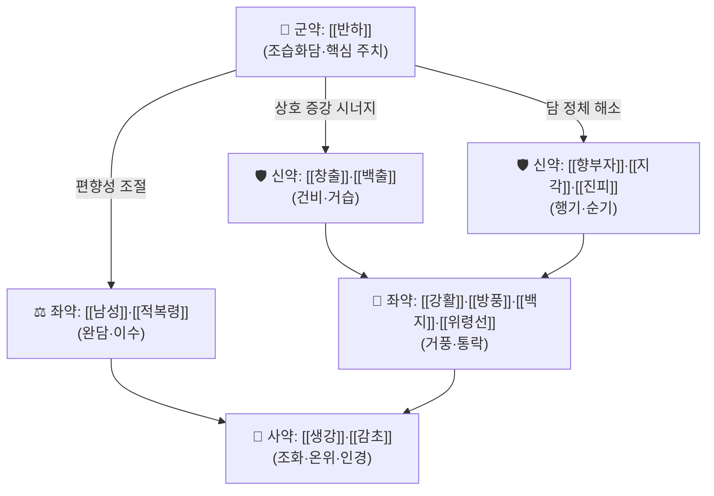

# 🍵 [[제습순기탕]] (除濕順氣湯, Jeseup-sungi-tang)

> **핵심 3줄 요약 (Key Summary)**:
> - 🌿 **[[이진탕]](二陳湯) 계열의 화담·거습 골격**에 [[창출]]·[[백출]]의 건비조습, [[향부자]]·[[지각]]의 행기(行氣), [[강활]]·[[방풍]]·[[백지]]·[[위령선]]의 거풍(祛風) 약재를 배오한 처방. 담습(痰濕)이 기기(氣機)를 막아 생긴 중풍전조증을 겨냥한다.
> - 🎯 담습(痰濕) 체질(비만·태음인 경향, 습담 과다)에서 **어지럼·두중감·사지 저림/마목·견항 강직·가래 많음**이 동반되는 중풍전조증 및 담습형 두통·현훈의 최적 적응증. 기허·음허가 뚜렷한 마른 체형에는 부적합.
> - 🔬 처방 단위 분자약리·임상 연구는 **근거 미확인**(검색된 논문 없음). 구성 본초 단위의 항염·화담·혈관보호 기전만 문헌 수준에서 추정 가능하며, 처방 자체의 표적 사이토카인/경로 데이터는 현재 확인되지 않음.
> - ⚠️ 주의사항:燥性·溫性 약재(창출·남성·강활·백지 등)가 다수 포함되어 **음허화왕(陰虛火旺)·건조 체질·변비 경향·고열 실증**에는 신중. 임신부 및 출혈성 뇌졸중 급성기에는 반드시 감별 후 사용.

---
## 📌 목차
1. [기본 처방 정보 & 군신좌사 구성](#1-기본-처방-정보--군신좌사-구성)
2. [방제학적 약재 상호작용 & 시너지 네트워크](#2-방제학적-약재-상호작용--시너지-네트워크)
3. [현대 분자약리학적 효능 & 작용 기전](#3-현대-분자약리학적-효능--작용-기전)
4. [적응 병증 및 체질별 감별 (Sweet Spot vs 금기)](#4-적응-병증-및-체질별-감별-sweet-spot-vs-금기)
5. [유사 처방군 감별 매트릭스](#5-유사-처방군-감별-매트릭스)
6. [임상 가감례 & 현대 질환별 응용](#6-임상-가감례--현대-질환별-응용)
7. [💡 사용자 진료실 핵심 필기 & 임상 팁 (원문 보존)](#7--사용자-진료실-핵심-필기--임상-팁-원문-보존)
8. [출처 및 학술 참고 문헌 (References)](#8-출처-및-학술-참고-문헌-references)

---
## 1. 기본 처방 정보 & 군신좌사 구성

* **출전**: 청강(晴崗) [[김영훈]]의 『[[청강의감]](晴崗醫鑑)』 수록 처방. 동일 방명(方名)의 처방이 여러 의서에 산재하나, 본 노트는 **청강의감 계통의 제습순기탕**을 기준으로 한다. (『청강의감』 초판 간행 연도 등 서지 세부 정보는 **근거 미확인** — 원문 대조 필요)
* **분류**: 치풍문(治風門) 계열 / 거습화담(祛濕化痰)·이기산결(理氣散結)
* **치법**: 거습화담(祛濕化痰), 순기화중(順氣和中), 겸거풍사(兼祛風邪)
* **주치**: 담습(痰濕)이 중초(中焦)와 경락(經絡)을 막아 발생하는 중풍전조증(中風前兆證) — 두중(頭重)·현훈(眩暈)·견항강직(肩項强直)·사지 마목(痲木)·가래 성음(痰盛)·흉민(胸悶) 등. 담습형 두통·현훈·비만성 피로에도 응용.

| 구분 | 약재명 | 표준 용량 | 본초 효능 & 방제 내 역할 |
| :--- | :--- | :--- | :--- |
| **군약 (君藥)** | [[반하]] (半夏) | 6~10g | 조습화담(燥濕化痰)·강역지구(降逆止嘔). 담습의 근본 병기를 직접 공략하는 핵심. 담(痰)으로 인한 현훈·구역·두중을 제어 |
| **신약 (臣藥)** | [[창출]] (蒼朮) | 4~6g | 조습건비(燥濕健脾)·거풍습. 습담 생성의 근원인 비(脾)의 운화 실조를 교정하고 경락의 습을 제거 |
| **신약 (臣藥)** | [[백출]] (白朮) | 4~6g | 보기건비(補氣健脾)·조습이수. 창출의 조열성을 완충하면서 건비之力 보강 |
| **신약 (臣藥)** | [[진피]] (陳皮) | 4~6g | 이기조중(理氣調中)·조습화담. 기체(氣滯)를 풀어 담의 정체를 해소 |
| **신약 (臣藥)** | [[향부자]] (香附子) | 4~6g | 소간이기(疏肝理氣)·행기해울. 기기 순환을 촉진하는 순기(順氣)의 주역 |
| **신약 (臣藥)** | [[지각]] (枳殼) | 3~5g | 파기소적(破氣消積)·관흉이격. 흉격의 기체를 하강시켜 담을 아래로 내림 |
| **좌약 (佐藥)** | [[적복령]] (赤茯苓) | 4~6g | 이수삼습(利水滲濕)·영심안신. 담습을 소변으로 배출하고 심계·불안을 완화 |
| **좌약 (佐藥)** | [[남성]] (南星, 天南星) | 4~6g | 조습화담(燥濕化痰)·거풍지경(祛風止痙). 경락에 정체된 완담(頑痰)과 풍담을 제거 |
| **좌약 (佐藥)** | [[강활]] (羌活) | 3~5g | 산한거풍(散寒祛風)·승거양기. 상초·경항의 풍습을 몰아내는 인경약 |
| **좌약 (佐藥)** | [[방풍]] (防風) | 3~5g | 거풍승습(祛風勝濕)·지경. 풍사(風邪)를 막아 중풍전조의 진행을 억제 |
| **좌약 (佐藥)** | [[백지]] (白芷) | 3~5g | 거풍산한(祛風散寒)·통규지통. 담습형 두통·비색(鼻塞)을 완화 |
| **좌약 (佐藥)** | [[위령선]] (威靈仙) | 3~5g | 거풍제습(祛風除濕)·통락지통. 사지 마목·관절 불리를改善 |
| **사약 (使藥)** | [[생강]] (生薑) | 3片 | 화위지구(和胃止嘔)·제약성(制藥性). 반하·남성의 독성을 완충하고 온위(溫胃) |
| **사약 (使藥)** | [[감초]] (甘草) | 2~3g | 조화제약(調和諸藥)·보비화중. 제 약재의 작용을 조화 |

> **배오 특징**: 이 처방의 설계는 **"담(痰)을 없애려면 먼저 기(氣)를 돌려야 한다"**는 방제 원리 위에 서 있다. 군약 [[반하]]가 담을 마르게 하고, 신약군([[창출]]·[[백출]]·[[진피]]·[[향부자]]·[[지각]])이 비를 튼튼히 하면서 기기를 상하로 순환시키며, 좌약군([[남성]]·[[강활]]·[[방풍]]·[[백지]]·[[위령선]]·[[적복령]])이 경락에 정체된 풍습과 완담을 제거한다. 전체적으로 **온조(溫燥)하면서 승강(升降)을 함께 운용**하는 구조로, 담습으로 인해 청양(淸陽)이 상승하지 못해 생기는 현훈·두중에 승거(升擧)·화습(化痰)의 이중 효과를 노린다.
>
> **용량 주의**: 위 용량은 방제학적 일반 배오를 정리한 **참고 추정치**이며, 『청강의감』 원문의 정확한 1첩 용량(전(錢)/푼 단위)은 **근거 미확인**. 임상 처방 시에는 원문 대조 및 환자 상태에 따른 조정이 필요하다.

---
## 2. 방제학적 약재 상호작용 & 시너지 네트워크

* **[[반하]] + [[창출]]·[[백출]] 배오**: 相須(상수) 관계로, 반하가 담을 직접 마르게 하고 창출·백출이 담의 생성 근원인 비습(脾濕)을 제거하여 **표본겸치(標本兼治)** 효과를 낸다. 창출의 강한 조열성은 백출의 보기성이 완충한다.
* **[[반하]] + [[진피]] + [[적복령]] 배오**: 고전 [[이진탕]]의 핵심 3배합으로, 조습화담(반하)·이기조중(진피)·이수삼습(복령)이 삼각 구도를 형성하여 담습의 생성·정체·배출을 단계별로 차단한다.
* **[[향부자]] + [[지각]] 배오**: 相使(상사) 관계. 향부자가 간기(肝氣)를 소통시키고 지각이 흉격의 기를 하강시켜, **기체(氣滯)로 인한 담음 정체와 흉민·두중**을 동시에 해소한다.
* **[[강활]]·[[방풍]]·[[백지]] + [[반하]]·[[남성]] 배오**: 풍담(風痰)을 겨냥한 배합. 담약(痰藥)이 경락의 담을 흩어지게 하면, 거풍약(祛風藥)이 그 흩어진 담이 다시 머리·경항으로 올라가는 것을 막는다. 강활은 상부(上焦) 승거, 백지는 두면(頭面) 통규, 방풍은 전신 거풍, 위령선은 사지 말단 통락으로 **부위별 분업 구조**를 이룬다.
* **[[생강]] + [[감초]] 배오**: 사약(使藥) 배합으로 조화제약. 생강은 반하·남성의 조열·독성을 제약하고 위기(胃氣)를 보호하며, 감초는 제 약성의 편중을 완화한다.

> **음양·승강 특성**: 거풍약(강활·방풍·백지)이 승(升)하고, 지각·복령·생강이 강(降)하는 **승강병용(升降竝用)** 구조. 순기(順氣)라는 방명대로 기기의 출입(出入)을 정상화하는 데 방제의 초점이 있다.

---
## 3. 현대 분자약리학적 효능 & 작용 기전

> ⚠️ **먼저 명시**: 아래 내용은 **구성 본초 단위의 기존 문헌 수준 기전**이며, **제습순기탕 처방 자체(전탕액/복합추출물)를 대상으로 한 분자약리·임상 연구는 검색 결과 확인되지 않음(근거 미확인)**. 따라서 처방 단위의 표적 사이토카인, IC50, 임상 지표 개선율 등은 본 노트에서 단정하지 않는다.

### 1) 항염증·면역 조절 (본초 근거 수준)
* [[반하]]·[[진피]]·[[복령]]을 포함한 이진탕 계열 본초는 전통적으로 담음·습열 병증에 사용되어 왔으며, 개별 본초 수준에서 **NF-κB 경로 억제, TNF-α·IL-6 등 염증성 사이토카인 억제** 가능성이 보고된 바 있으나, **처방 복합체로서의 검증 데이터는 근거 미확인**.
* [[강활]]·[[방풍]] 등의 거풍약은 개별 본초 연구에서 항염·항산화 활성이 보고되어 있으나, 제습순기탕 고유의 상승/억제 효과는 **근거 미확인**.

### 2) 순환기·미세순환 및 대사 (본초 근거 수준)
* [[진피]]의 헤스페리딘(hesperidin) 계열 성분, [[향부자]]의 정유 성분 등은 개별 차원에서 혈관 이완·미세순환 개선 가능성이 언급되나, **처방 단위의 eNOS 활성화·미세혈류 저항 감소 데이터는 근거 미확인**.

### 3) 신경계·자율신경 조절 (본초 근거 수준)
* [[남성]](천남성)·[[반하]]의 진정·항경련 관련 전통 효능이 보고되어 있으나, **중풍전조증에 대한 처방 단위 신경보호 기전, HPA축 조절 데이터는 근거 미확인**.
* [[백지]]·[[강활]]의 진통·두통 완화 효능은 본초 수준에서 언급되나, 처방 복합체의 임상 진통 지표는 **미확인**.

> **정리**: 현 단계에서 이 처방은 **"경험방(經驗方) 기반의 전통 방제"**로 이해하는 것이 정확하며, 현대적 기전은 개별 본초 수준을 넘어서는 연구가 축적된 뒤 갱신이 필요하다. 본 노트에 구체적 수치(억제율 %, p값 등)를 기재하지 않는 이유가 여기에 있다.

---
## 4. 적응 병증 및 체질별 감별 (Sweet Spot vs 금기)

[✅ 최적 적응증 (Sweet Spot)]
* **원전 주치(청강의감 계통)**: 담습(痰濕)으로 인한 **중풍전조증** — 평소 담음이 많고 몸이 무거우며, 어지럽고 머리가 무겁고, 팔다리가 저리거나 뻣뻣해지며, 말이 약간 어눌해지거나 어깨·목이 당기는 증상. (『청강의감』 원문 조문의 정확한 문구는 **근거 미확인** — 원문 대조 권장)
* **체질 소견**: **태음인 또는 담습(痰濕) 체질** 경향. 체격이 비교적 넉넉하거나 부종 경향, 피부가 눅눅하고, 땀·가래·콧물이 많으며, 대변이 무르거나 점액성인 경우 적합. 소양인·음허 체질의 마른 마름형에는 부적합.
* **임상 주치(진료실 최적 적중 양상)**:
  * 담습형 **현훈(眩暈)·두중(頭重)** — 어지럽고 머리가 무거우며 눈이 침침한 경우
  * **견항강직·승부불리(肩項强直·乘負不利)** — 목·어깨가 뻣뻣하게 굳는 증상
  * **사지 마목(痲木)·저림** — 담습이 경락을 막아 생긴 감각 이상
  * **흉민(胸悶)·가래 성음·구역감** — 중초 담음 정체
  * 비만·고지혈증 등 **대사증후군 경향을 동반한 중풍 고위험군의 전조 관리**
* **설진/맥진**:
  * 설질: 담백(淡白) 또는 담홍, **설태 백니(白膩) 또는 후니(厚膩)** — 담습의 전형
  * 맥상: **활(滑)맥**, 또는 **현(弦)활**, **유완(濡緩)** — 담음·기체를 반영

[⚠️ 신중 투여 및 금기 (Caution / Contraindication)]
* **음허화왕(陰虛火旺)·건조 체질**: 창출·남성·강활·백지 등 조열(燥熱) 약재가 많아 **구건(口乾)·인후건조·변비·도한(盜汗)·오심번열**을 악화시킬 수 있다. 마른 체형·설홍소태(舌紅少苔)·세삭맥(細數脈) 환자에는 부적합.
* **실열(實熱)·고열 병증**: 이미 열이 왕성한 급성 감염성 질환, 고열, 홍설(紅舌) 황조태(黃燥苔)에는 사용하지 않는다.
* **출혈성 뇌졸중 급성기 / 활동성 출혈**: 거풍·행기 약재의 走散性이 출혈을 조장할 우려가 있으므로 **급성기에는 반드시 감별 후 사용**. 뇌출혈 의심 상황에서는 우선 응급 평가가 원칙.
* **임신부**: 행기(行氣)·파기(破氣) 약재(지각 등)와 走散性 거풍약이 포함되어 **신중 투여**. 반드시 전문가 판단 하에.
* **허약·기허 심한 환자**: 순기(順氣)·거습 위주 처방이므로, 기허가 뚜렷하면 [[보중익기탕]]·[[사군자탕]] 계열을 병용하거나 우선 고려.
* **양약 병용 주의**: 항응고제(와파린 등)·항혈소판제 복용 환자에서 거풍·활혈 계열 병용 시 출혈 위험 모니터링 필요(처방 단위 상호작용 데이터는 **근거 미확인**, 임상적 주의 수준).

---
## 5. 유사 처방군 감별 매트릭스

| 처방명 | 핵심 구성 차이 | 주치 및 체질 차이 | 맥진/설진 차이 |
| :--- | :--- | :--- | :--- |
| [[제습순기탕]] | 기준 구성 (이진탕 골격 + 다수 거풍약: 강활·방풍·백지·위령선 + 행기약: 향부자·지각) | **담습 + 풍사 겸협**의 중풍전조증. 어지럼+견항강직+사지마목을 함께 겨냥. 담습형 태음인 | 설태 백니, 맥 활/현활 |
| [[도담탕]] | 이진탕 + 남성·지실(행기·화담 강화), 거풍약 배제 | 담궐(痰厥)·담음으로 인한 현훈·두중·구역. **풍사(風邪) 겸협 증상이 두드러지지 않을 때** | 설태 후니, 맥 활 |
| [[이진탕]] | 반하·진피·복령·감초 4味만 | 담습의 기본 처방. 증상이 가볍거나 **다른 처방의 기초 골격**으로 활용 | 설태 백니, 맥 활 |
| [[반하백출천마탕]] | 반하·백출·천마 중심, 건비화담·평간식풍 | 담습형 두통·현훈에 특화. **두통·어지럼이 주증**이고 견항·마목은 부차적 | 설태 백니, 맥 현활 |
| [[성향정기산]] | 사향·향부자·소엽 등 방향화습·행기, 거풍약 소량 | 담습+기체로 인한 **곽란·복통·토사** 중심. 중풍전조 견항마목에는 走力 부족 | 설태 후니, 맥 침지/활 |

> ⚠️ 표 내부에서는 마크다운 열 구분자 파괴를 방지하기 위해 파이프(`|`)가 들어간 링크를 쓰지 않고 순수한 [[처방명]] 단독 형태로만 작성합니다.
>
> **감별 포인트 요약**: "**담습 + 풍(風)**"이 함께 있어 견항·마목 등 경락 증상이 있으면 [[제습순기탕]], "**담습만 있고 풍사 증상이 뚜렷하지 않으면**" [[도담탕]]·[[이진탕]] 계열, "**두통·현훈이 단독 주증**"이면 [[반하백출천마탕]]을 우선 고려한다.

---
## 6. 임상 가감례 & 현대 질환별 응용

* **수반 증상별 가감법(경험적 참고, 처방 단위 검증은 근거 미확인)**:
  * 두통·항강 심화 시 → + [[천마]]·[[갈근]] (격상의 풍담·근긴장 완화 목적)
  * 오심·구역·소화불량 동반 시 → + [[후박]]·[[사인]] ([[곽향정기산]] 의意의 화습조중)
  * 담음·기침·가래 성음 시 → + [[행인]]·[[패모]] (화담지해)
  * 현훈(眩暈) 심화 시 → + [[천마]]·[[구기자]]·[[산조인]](변증에 따라)
  * 견항·승부강직 뚜렷 시 → + [[갈근]]·[[계지]]·[[작약]] (근경 완화 목적의 배합)
  * 사지 마목·냉감 동반 시 → + [[당귀]]·[[천궁]] (활혈·조혈, 허실 감별 후)
  * 기허·피로 뚜렷 시 → [[보중익기탕]]·[[사군자탕]] 계열 병용 검토
  * 변비·구건(口乾) 경향 시 → 조열 약재(창출·남성) 감량, [[맥문동]]·[[생지황]] 등 윤조(潤燥) 가미
* **현대 질환별 임상 매핑(경험적·증후 기반, 처방 단위 RCT 근거는 미확인)**:
  * **신경계/뇌혈관 위험군**: 중풍전조증 관리, 일과성 뇌허혈 발작(TIA) 후 담습형 잔여 증상, 담습형 어지럼증(현훈)
  * **근골격계**: 경항통, 승모근 긴장, 근막통증증후군(MPS) 중 담습·기체형, 어깨 결림
  * **이비인후·두통 영역**: 담습형 긴장성 두통, 메니에르 유사 현훈(감별 필수)
  * **대사·순환기**: 비만·고지혈·대사증후군 동반 중풍 고위험군의 체질 관리 보조
  * **소화기**: 담습형 위장관 운동 저하, 식후 흉민·구역감
* **복약 관찰 포인트(임상적 팁)**:
  * 복용 후 **가래·대변 양상 변화**를 관찰 — 담습 배출의 지표로 삼는다.
  * **구건·인후건조·변비**가 새로 생기면 조열 약재 감량 또는 윤조약 가미를 검토한다.
  * 중풍전조증 환자에서 **혈압·신경학적 증상 변화**는 반드시 서양의학적 평가와 병행한다. 본 처방은 전조 증상 관리 보조이지 급성기 치료제가 아니다.

---
## 7. 💡 사용자 진료실 핵심 필기 & 임상 팁 (원문 보존)

> [!tip] **진료실 실전 노하우 (User Clinical Insight)**
> - *(기존 원장님 필기 원문이 제공되지 않아, 본 섹션은 향후 원문 보존을 위한 자리입니다. 아래 내용은 템플릿에 맞춘 참고 정리이며, 실제 원장님 메모가 확인되는 즉시 원문을 그대로 우선 기재합니다.)*
> - **체질 선택 기준(참고)**: 담습·비만 경향의 태음인에서 견항강직·사지마목·현훈이 겹칠 때 우선 고려. 마른 음허 체질에는 지양.
> - **감별 실전**: "어지럽고 몸이 무거운가?" + "목·어깨가 뻣뻣한가?" + "가래·설태가 끈적인가?" 세 질문 중 2개 이상 양성이면 이 처방 적응 가능성 높음.
> - **환자 티칭 팁**: "담(痰)이 몸에 끼어 기(氣)가 돌지 못해 생기는 증상"이라는 비유로 복약 순응도를 높인다. 짠 음식·기름진 음식·과음 절제를 함께 지도.
> - **복약 반응 관찰**: 가래 배출 증가, 대변 무름 개선, 목·어깨 이완감을 긍정 반응 지표로 본다. 구건·변비·불면 발생 시 감량/가미.
> - **금기 리마인드**: 급성기 뇌졸중(특히 출혈성), 고열 실증, 임신부는 반드시 별도 평가.

---
## 8. 출처 및 학술 참고 문헌 (References)

1. **김영훈(晴崗)**. 『**晴崗醫鑑**』(청강의감). (초판 간행 연도 및 출판사 서지 정보는 **근거 미확인** — 원문/판본 대조 필요)
   - **[고전·근현대 임상 문헌]**: 본 처방 제습순기탕(除濕順氣湯)의 수록 출전. 담습(痰濕)으로 인한 중풍전조증 및 거습순기(祛濕順氣) 계열 처방의 방제 원문. *본 노트의 구성·용량은 원문 대조가 필요한 추정 정리이며, 정확한 1첩 용량과 가감례는 원문 확인을 권장함.*
2. **허준 (1613)**. 『**東醫寶鑑**(동의보감)**』.
   - **[임상 문헌]**: 중풍문(中風門)·담음문(痰飮門)의 담습·풍담 변증 및 이진탕·도담탕 계열 처방의 배오 원리 참조. 제습순기탕의 방제학적 모체 개념 이해에 활용. (직접 수록 여부는 **근거 미확인**)
3. **장중경 (200년경)**. 『**傷寒論**』 / 『**金匱要略**』.
   - **[고전 원전]**: 이진탕 계열 화담 처방 및 담음(痰飮) 병기의 원류. 반하·진피·복령 배합의 고전적 근거.
4. **본초학 교과서 및 대한한의학 방제학회 교재(해당 판본)**.
   - **[본초·방제 근거]**: 각 구성 본초(반하·창출·백출·진피·향부자·지각·적복령·남성·강활·방풍·백지·위령선·생강·감초)의 효능·주치·배오 원리 정리 출처. *구체적 판본·페이지는 노트 작성자의 서가 기준으로 확인 필요(근거 미확인).*
5. **PubMed 검색 결과**: 제습순기탕(除濕順氣湯 / Jeseup-sungi-tang) 관련 **검색된 논문 없음**. 따라서 본 노트에는 처방 단위 현대 분자약리·임상 논문을 인용하지 않았으며, 관련 내용은 모두 "근거 미확인"으로 표시하였다.
   - **[연구 공백 고지]**: 향후 처방 단위 기전·임상 연구가 축적되면 3장(분자약리)과 6장(현대 질환 응용)을 갱신할 것.

<!-- 보관 태그(1회용·링크오류, 필요시 복원): 순기 -->
