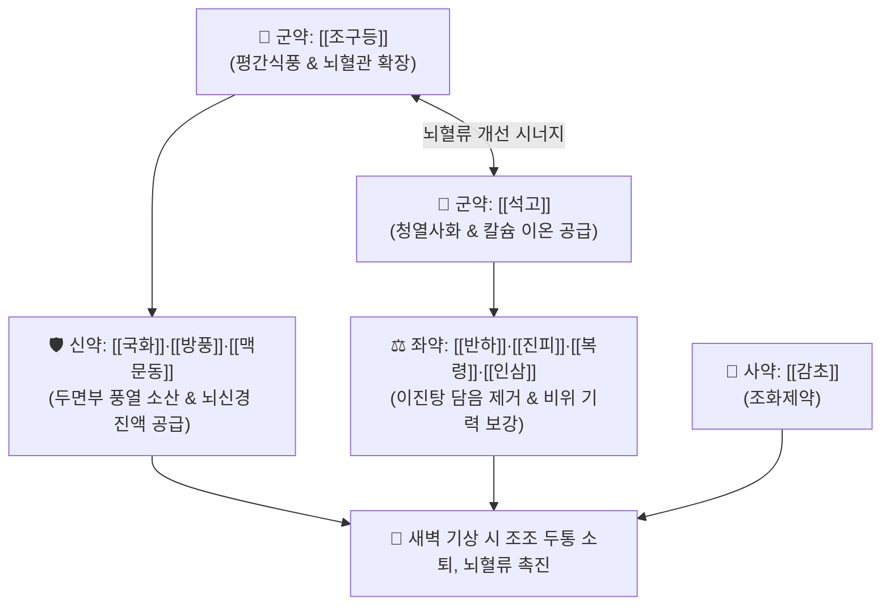

# 🍵 [[조등산]] (釣藤散, Diao-Teng-San / Chotosan)

> **핵심 3줄 요약 (Key Summary)**:
> - 🌿 기본 구성: [[조구등]]·[[석고]] (군), [[국화]]·[[방풍]]·[[맥문동]] (신), [[반하]]·[[진피]]·[[복령]]·[[인삼]]·[[생강]] (좌), [[감초]] (사) (간열을 식히고 중초 담음을 삭이며 뇌혈관 탄력을 회복시키는 평간청열·화담건비 대표 명방).
> - 🎯 고령자의 만성 긴장성 두통, 이른 새벽 기상 직후 심해지다가 오전에 호전되는 조조 두통, 고혈압·동맥경화성 두중감, 이명, 어지럼, 안구 충혈.
> - 🔬 조구등 린코필린의 α-아드레날린 수용체 및 Ca2+ 채널 차단을 통한 혈압 강하, eNOS 활성화 및 적혈구 변형능 향상을 통한 뇌 미세혈류 촉진.
> - ⚠️ 주의사항: 조조 두통 환자는 기상 직후 복용을 원칙으로 하며, 심한 허한증(극도의 위장 냉증) 환자는 신중 투약.

---

## 📌 목차
1. [기본 처방 정보 & 군신좌사 구성](#1-기본-처방-정보--군신좌사-구성)
2. [방제학적 약재 상호작용 & 시너지 네트워크](#2-방제학적-약재-상호작용--시너지-네트워크)
3. [현대 분자약리학적 효능 & 작용 기전](#3-현대-분자약리학적-효능--작용-기전)
4. [적응 병증 및 체질별 감별 (Sweet Spot vs 금기)](#4-적응-병증-및-체질별-감별-sweet-spot-vs-금기)
5. [유사 처방군 감별 매트릭스](#5-유사-처방군-감별-매트릭스)
6. [임상 가감례 & 현대 질환별 응용](#6-임상-가감례--현대-질환별-응용)
7. [💡 사용자 진료실 핵심 필기 & 임상 팁 (원문 보존)](#7--사용자-진료실-핵심-필기--임상-팁-원문-보존)
8. [출처 및 학술 참고 문헌 (References)](#8-출처-및-학술-참고-문헌-references)

---

## 1. 기본 처방 정보 & 군신좌사 구성

* **출전**: 송대 허숙미 『[[보제본사방]]』(普濟本事方) / 『[[동의보감]]』(東醫寶鑑) 잡병편 두통
* **치법**: 평간식풍(平肝熄風), 청열안신(淸熱安神), 화담이기(化痰理氣), 건비익기(健脾益氣)

| 구분 | 약재명 | 표준 용량 | 본초 효능 & 방제 내 역할 |
| :--- | :--- | :--- | :--- |
| **군약 (君藥)** | [[조구등]] | 4.0g (후하) | **평간식풍·청열진경**: 린코필린 성분으로 뇌혈관 경련을 풀고 혈압 강하 및 정신 안정 |
| **군약 (君藥)** | [[석고]] | 6.0g | **청열사화·칼슘공급**: 황산칼슘 성분으로 뇌혈관 과투과성을 안정화하고 뇌압 완화 |
| **신약 (臣藥)** | [[국화]] | 3.0g | **청간명목·평간식풍**: 두통, 안구 충혈, 어지럼증을 완화 |
| **신약 (臣藥)** | [[방풍]] | 3.0g | **거풍해표·승습지통**: 상초 두면부의 풍사를 발산시키고 두중감 해소 |
| **신약 (臣藥)** | [[맥문동]] | 4.0g | **청심윤폐·양음생진**: 석고와 조구등의 조성을 완충하고 뇌세포 진액 공급 |
| **좌약 (佐藥)** | [[반하]]·[[진피]]·[[복령]] | 각 3.0g | **이진탕 화담군**: 중초 담음(痰飮)을 제거하여 머리가 맑아지게 함 |
| **좌약 (佐藥)** | [[인삼]] | 3.0g | **대보원기·건비**: 고령자의 쇠약해진 비위 기운을 보강 |
| **좌약 (佐藥)** | [[생강]] | 3.0g | **온중산한·화위**: 비위를 따뜻하게 하고 약 흡수 보조 |
| **사약 (使藥)** | [[감초]] | 1.5g | **조화제약·완급지통**: 제약을 조화롭게 중화 |

> **배오 특징**: 뇌혈관을 안정시키는 [[조구등]]·[[석고]]에 상초 풍열을 끄는 [[국화]]·[[방풍]], 담음을 치는 [[이진탕]]([[반하]]·[[진피]]·[[복령]]), 원기를 보하는 [[인삼]]이 결합하여 **고령자의 허실착잡성(虛實錯雜) 만성 두통**을 완벽하게 다스립니다.

---

## 2. 방제학적 약재 상호작용 & 시너지 네트워크

* **조구등 + 석고의 군약 배오**: 조구등이 혈관 경련을 풀고 석고가 뇌의 화열을 가라앉혀 새벽에 혈압 상승과 함께 발생하는 박동성 두통을 즉각 진정시킵니다.
* **이진탕 + 인삼의 건비화담 배오**: 비위를 보강하면서 뇌수를 흐리는 탁한 담음을 제거하여 맑은 기운이 머리로 올라가게 돕습니다.

---

## 3. 현대 분자약리학적 효능 & 작용 기전

### 1) 혈압 강하 및 뇌동맥 연축 억제
* 조구등의 린코필린이 $\alpha_1$ 아드레날린 수용체를 차단하고 전압 의존성 $\text{Ca}^{2+}$ 채널을 억제하여 뇌혈관의 과도한 수축을 방지합니다.
### 2) 뇌혈류량 증가 및 혈관 내피세포 eNOS 활성화
* 내피세포 산화질소 합성효소(eNOS)를 활성화하여 일산화질소(NO) 생성을 촉진하고 적혈구 변형능을 향상시켜 미세혈류를 개선합니다.
### 3) 만성 허혈성 뇌손상 보호 및 인지기능 개선
* 신경세포의 산화 스트레스를 경감시키고 혈관성 치매 모델에서 콜린성 신경망을 보존합니다.

---

## 4. 적응 병증 및 체질별 감별 (Sweet Spot vs 금기)

### [✅ 최적 적응증 (Sweet Spot)]
* **조조 두통 (새벽 기상 시 두통)**: 이른 새벽 잠에서 깰 때 머리가 깨질 듯이 아프고 무겁다가 기상 후 활동하면서 오전 중에 차차 덜해지는 두통.
* **고령자 만성 긴장성 두통 및 혈관성 두통**: 뒷목부터 어깨까지 뻣뻣하게 굳고, 어지럼증, 이명, 눈 충혈, 상기감이 동반되는 경우.
* **노인성 신경증**: 불면, 우울 경향, 초조감.

### [⚠️ 신중 투여 및 금기 (Caution / Contraindication)]
* **복용 타이밍 준수**: 새벽 두통 환자는 반드시 기상 직후 따뜻한 물과 함께 복용하도록 지도.
* **극심한 비위허한 환자**: 석고의 찬 성질로 인해 속쓰림이 발생할 수 있으므로 식후 복용 지도.

---

## 5. 유사 처방군 감별 매트릭스

| 처방명 | 두통 발현 양상 | 핵심 약재 | 감별 포인트 |
| :--- | :--- | :--- | :--- |
| [[조등산]] | **이른 새벽 기상 시 두통**, 오전 호전 | 조구등, 석고, 국화, 반하, 인삼 | **고령자, 혈압상승, 이명, 목어깨 결림** |
| [[천궁다조산]] | **외감 풍한 두통**, 바람 쐬면 악화 | 천궁, 백지, 강활, 방풍, 세신 | **초기 감모 두통, 오한, 맑은 콧물** |
| [[반하백출천마탕]] | **식후 어지럼 동반 두통**, 비허담음 | 반하, 백출, 천마, 복령, 황기 | **소화불량, 메스꺼움, 차멀미, 두중** |
| [[오수유탕]] | **구토 동반 극심한 편두통**, 궐음한 | 오수유, 인삼, 생강, 대조 | **손발 냉증, 맑은 물 토함, 극심한 냉통** |

---

## 6. 임상 가감례 & 현대 질환별 응용

* **불면과 초조가 심할 때**:
  * [[산조인]] 8g, [[백자인]] 6g을 가미하여 안신 작용 강화.
* **경항부 결림이 극심할 때**:
  * [[갈근]] 8g을 가미하여 뒷목 근막 이완 촉진.

---

## 7. 💡 사용자 진료실 핵심 필기 & 임상 팁 (원문 보존)

* **고령자의 조조 두통 전용 특효 처방 (원장님 핵심 임상 기준)**:
  * "새벽에 눈을 뜰 때 머리가 띵하고 무겁게 아프며, 시간이 지나면서 오전 중에 저절로 나아진다"고 호소하는 고령 환자에게 단연 제1선방이다.
* **기상 직후 복용 티칭 팁**:
  * 이른 새벽 기상 시의 두통 환자에게는 머리맡에 약을 두고 **기상 직후 즉시 복용**하도록 티칭하면 오전 중 두통이 획기적으로 사라진다.
* **동반 증상 체크포인트**:
  * 만성 두통, 이명, 두중감, 목덜미부터 어깨까지의 결림, 어지럼증, 상기감, 혈압 상승, 불면, 우울 경향, 안구 결막 충혈을 한 번에 정돈한다.

---

## 8. 출처 및 학술 참고 문헌 (References)

1. 보제본사방(普濟本事方) 권제1 두통.
2. 동의보감(東醫寶鑑) 잡병편 두통.
3. * **Tanei T et al. (2025)**. Efficacy of the herbal medicine Chotosan following treatment with Western medications for migraine accompanied by tension-type headache. *Frontiers in neurology*, 16: 1697333. [PMID: 41446879](https://pubmed.ncbi.nlm.nih.gov/41446879/)
4. * **Yokoyama K et al. (2004)**. Effects of Choto-san and hooks and stems of Uncaria sinensis on antioxidant enzyme activities in the gerbil brain after transient forebrain ischemia. *Journal of ethnopharmacology*, 95: 335-43. [PMID: 15507357](https://pubmed.ncbi.nlm.nih.gov/15507357/)
