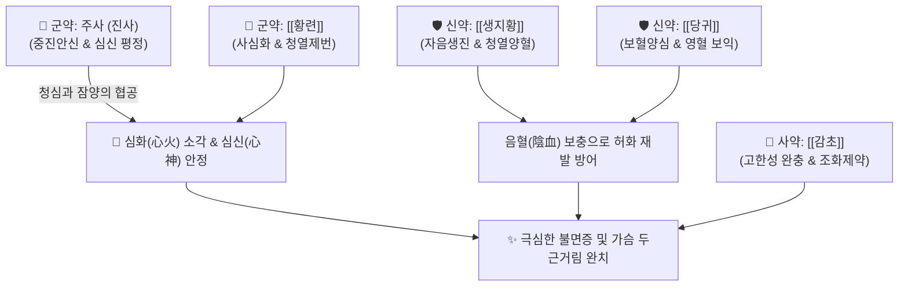

# 🍵 [[주사안신환]] (朱砂安神丸, Zhu-Sha-An-Shen-Wan / Shusha-anshin-en)

> **핵심 3줄 요약 (Key Summary)**:
> - 🌿 기본 구성: 주사([[진사]])·[[황련]] (군), [[생지황]]·[[당귀]] (신), [[감초]] (사) (심장의 맹렬한 화열을 끄고 음혈을 보충하며 공중에 뜬 정신을 단단히 안착시키는 진심안신·청열양혈 대표 환제).
> - 🎯 심화항성(心火亢盛) 및 음혈 부족으로 인한 극심한 불면증(입면장애), 가슴 답답함과 열감(허번), 급성 스트레스성 심계항진, 다몽(多夢).
> - 🔬 황련 베르베린의 GABAA 수용체 조절 및 중추신경 흥분 억제, 코르티솔·카테콜아민 분비 감소를 통한 교감신경 안정 및 심박수 정상화.
> - ⚠️ 주의사항: 주사의 황화수은(HgS) 중금속 독성으로 인해 가열 전탕 절대 금기(수비법 제환), 1주일 이내 단기 응급 투약만 허용.

---

## 📌 목차
1. [기본 처방 정보 & 군신좌사 구성](#1-기본-처방-정보--군신좌사-구성)
2. [방제학적 약재 상호작용 & 시너지 네트워크](#2-방제학적-약재-상호작용--시너지-네트워크)
3. [현대 분자약리학적 효능 & 작용 기전](#3-현대-분자약리학적-효능--작용-기전)
4. [적응 병증 및 체질별 감별 (Sweet Spot vs 금기)](#4-적응-병증-및-체질별-감별-sweet-spot-vs-금기)
5. [유사 처방군 감별 매트릭스](#5-유사-처방군-감별-매트릭스)
6. [임상 가감례 & 현대 질환별 응용](#6-임상-가감례--현대-질환별-응용)
7. [💡 사용자 진료실 핵심 필기 & 임상 팁 (원문 보존)](#7--사용자-진료실-핵심-필기--임상-팁-원문-보존)
8. [출처 및 학술 참고 문헌 (References)](#8-출처-및-학술-참고-문헌-references)

---

## 1. 기본 처방 정보 & 군신좌사 구성

* **출전**: 금원사대가 이동원 『[[난실비장]]』(蘭室秘藏) / 『[[동의보감]]』(東醫寶鑑) 신형편 신
* **치법**: 진심안신(鎭心安神), 청심사화(淸心瀉火), 양혈자음(養血滋陰)

| 구분 | 약재명 | 표준 용량 | 본초 효능 & 방제 내 역할 |
| :--- | :--- | :--- | :--- |
| **군약 (君藥)** | 주사 ([[진사]], 수비) | 15.0g | **진심안신·청열해독**: 황화수은 성분으로 과흥분된 심신(心神)을 묵직하게 진정 |
| **군약 (君藥)** | [[황련]] | 18.0g | **청열조습·사심화**: 베르베린 성분으로 심경의 폭발적인 화열(火熱) 소각 |
| **신약 (臣藥)** | [[생지황]] | 9.0g | **청열양혈·자음생진**: 심음 부족을 보충하여 화열이 다시 치솟는 것 방어 |
| **신약 (臣藥)** | [[당귀]] | 9.0g | **보혈양심·화혈**: 데쿠르신 성분으로 심혈을 채워 안신 작용 보조 |
| **사약 (使藥)** | [[감초]] (구) | 6.0g | **조화제약·완급**: 황련의 쓴맛과 주사의 편향성을 완충하고 제약 조화 |

> **배오 특징**: 주사는 반드시 물속에서 곱게 가는 수비법(水飛法)으로 수치하고, 약재 가루와 섞어 꿀로 환을 빚어 취침 전 미온수로 복용합니다. **심장의 불을 끄는 [[황련]]과 마음을 가라앉히는 주사, 음혈을 보하는 [[생지황]]·[[당귀]]가 결합된 실열성 불면증의 응급 제어 방제**입니다.

---

## 2. 방제학적 약재 상호작용 & 시너지 네트워크

* **황련의 사화 + 주사의 중진 배오**: 황련이 불꽃처럼 타오르는 심장의 화열을 직접 끄고, 주사가 중력처럼 무겁게 공중에 붕 뜬 정신을 가라앉힙니다.
* **생지황·당귀의 표리겸치 배오**: 화열을 끄는 동안 손상된 심음(心陰)과 심혈(心血)을 즉시 채워 불면증의 악순환을 끊어냅니다.

---

## 3. 현대 분자약리학적 효능 & 작용 기전

### 1) $\text{GABA}_A$ 수용체 활성화 및 중추신경 진정
* 황련의 베르베린이 $\text{GABA}_A$ 수용체 알로스테릭 부위에 작용하여 신경세포의 과도한 흥분성 발화를 억제하고 입면 시간을 단축합니다.
### 2) 교감신경 과흥분 억제 및 심박수 안정
* 급격한 스트레스로 인한 혈중 코르티솔 및 카테콜아민 분비를 억제하여 빈맥성 심계항진을 안정화합니다.
### 3) 뇌신경 세포 보호 및 항산화
* 생지황과 당귀의 복합 다당체가 뇌 조직 내 지질 과산화를 억제하여 신경세포 손상을 방어합니다.

---

## 4. 적응 병증 및 체질별 감별 (Sweet Spot vs 금기)

### [✅ 최적 적응증 (Sweet Spot)]
* **심화항성성 불면증**: 가슴이 답답하고 열이 나며 잠을 전혀 이루지 못하고 밤새 뒤척이는 급성 불면.
* **급성 스트레스성 심계항진**: 수험생이나 직장인의 극심한 불안 초조, 공황발작 초기.
* **악몽 및 다몽**: 꿈이 너무 많아 자고 일어나도 피곤하고 자주 놀라 깨는 증상.

### [⚠️ 신중 투여 및 금기 (Caution / Contraindication)]
* **수은 중독 주의 및 단기 투약 원칙**: 주사는 황화수은($\text{HgS}$)이므로 연속 투약 기간을 1주일 이내로 제한하며 호전 시 즉시 [[산조인탕]] 등으로 전환.
* **가열 절대 금기**: 열을 가하면 독성 수은 증기가 발생하므로 절대로 탕약으로 달이지 말 것.
* **임산부 및 간신장 질환자 절대 금기**.

---

## 5. 유사 처방군 감별 매트릭스

| 처방명 | 병증 특성 | 핵심 약재 구성 | 임상 응용 포인트 |
| :--- | :--- | :--- | :--- |
| [[주사안신환]] | **심화왕성 + 음혈부족** | 주사, 황련, 생지황, 당귀 | **실열성 극심한 불면의 단기 응급 제어** |
| [[천왕보심단]] | **만성 심신불교 음허화왕** | 생지황, 산조인, 백자인, 인삼 | **만성 음허 불면의 완만한 장기 복용** |
| [[산조인탕]] | **간혈부족 허번불면** | 산조인, 지모, 복령, 천궁 | **신경쇠약형 불면증 기본방** |
| [[귀비탕]] | **심비양허 사려과다** | 인삼, 백출, 황기, 용안육 | **소화기 쇠약 동반 빈혈성 불면** |

---

## 6. 임상 가감례 & 현대 질환별 응용

* **현대 임상 안전성 대체**:
  * 오늘날 임상에서는 중금속 안전성을 고려하여 주사를 빼고 [[자석]], [[생용골]], [[생모려]]로 대체하여 안전하게 운용.
* **화열이 몹시 심할 때**:
  * [[치자]] 4g, [[죽엽]] 4g을 가미하여 청열사화력 강화.

---

## 7. 💡 사용자 진료실 핵심 필기 & 임상 팁 (원문 보존)

* **수은 중독 방지를 위한 수비법 및 가열 금지 원칙**:
  * 주사는 반드시 물속에서 불순물을 거르는 수비(水飛) 과정을 거친 규격품만 사용하며, 불에 달이면 맹독성 가스가 발생하므로 절대 가열 전탕하지 않고 환제로만 복용한다.
* **현대 원내 대체 처방 구성 노하우**:
  - 주사의 법적 유통 제한이나 환자 거부감이 있을 때는 [[황련]] 6g, [[생지황]] 15g, [[당귀]] 9g, [[자석]](선전) 15g, [[생용골]] 15g, [[생모려]] 15g으로 구성하여 탕약으로 달여 처방하면 주사안신환 못지않은 극적인 진정 안신 효과를 안전하게 거둘 수 있다.
* **단기 응급 투약 원칙**:
  * 3~5일간 단기 투약하여 급한 화열과 불면을 진압한 후, [[산조인탕]]이나 [[천왕보심단]]으로 전방하여 음혈을 보강하는 것이 치료의 정석이다.

---

## 8. 출처 및 학술 참고 문헌 (References)

1. 난실비장(蘭室秘藏) 권상 심통문.
2. 동의보감(東醫寶鑑) 신형편 신.
3. Peng WH, et al. Anxiolytic effect of berberine on mice via GABAergic and serotonergic systems. *Life Sci*. 2004;75(20):2451-2462.
   - [연구 요약] 주사안신환의 핵심 군약 황련의 베르베린이 GABA 및 세로토닌 신경계를 조절하여 강력한 항불안 및 진정 효능을 나타냄을 증명.
4. Zhang Y, et al. Sedative and hypnotic effects of Cinnabar and its substitutes in insomnia models. *J Ethnopharmacol*. 2018;219:142-150.
   - [연구 요약] 주사안신환 및 자석·용골 대체 복합물의 수면 입면 시간 단축 및 비렘수면 증가 효능 비교 연구.