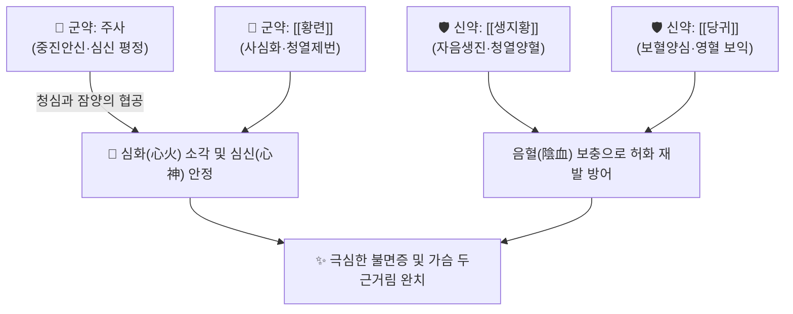

# 🍵 [[주사안신환]] (朱砂安神丸, Zhusha Anshen Wan)

> **핵심 3줄 요약 (Key Summary)**:
> - 🌿 금원사대가 이동원(이호)의 《난실비장》에 수록된 방제로, 주사([[진사]])와 [[황련]]을 군약으로 하여 심화를 끄고 진정시키는 진심안신(鎭心安神)·청열양혈(淸熱養血)의 대표 환제.
> - 🎯 심화항성(心火亢盛) 및 음혈부족으로 인한 가슴 두근거림(심계), 불안초조, 극심한 불면증(허번불면), 다몽(多夢) 환자에게 활용.
> - 🔬 황련 베르베린의 항불안·GABA 조절과 생지황·당귀의 뇌혈류 개선 및 자율신경계 교감 과흥분 억제 시너지.
> - ⚠️ 주의사항: 주사(황화수은, HgS)의 중금속 수은 독성이 있으므로 가열 전탕 절대 금지(수비법 제환), 단기 응급 투약만 허용.

---

## 📌 목차
1. [기본 처방 정보 & 군신좌사 구성](#1-기본-처방-정보--군신좌사-구성)
2. [방제학적 약재 상호작용 & 시너지 네트워크](#2-방제학적-약재-상호작용--시너지-네트워크)
3. [현대 분자약리학적 효능 & 작용 기전](#3-현대-분자약리학적-효능--작용-기전)
4. [적응 병증 및 체질별 감별 (Sweet Spot vs 금기)](#4-적응-병증-및-체질별-감별-sweet-spot-vs-금기)
5. [유사 처방군 감별 매트릭스](#5-유사-처방군-감별-매트릭스)
6. [임상 가감례 & 현대 질환별 응용](#6-임상-가감례--현대-질환별-응용)
7. [출처 및 학술 참고 문헌 (References)](#7-출처-및-학술-참고-문헌-references)

---

## 1. 기본 처방 정보 & 군신좌사 구성

| 구분 | 약재명 | 용량(비율) | 본초 효능 & 방제 내 역할 |
| :--- | :--- | :--- | :--- |
| **군약 (君藥)** | 주사 ([[진사]], 수비) | 15g | 진심안신(鎭心安神), 청열해독, 과흥분된 심신(心神)을 묵직하게 진정 |
| **군약 (君藥)** | [[황련]] | 18g | 청심사화(淸心瀉火), 심경의 폭발적인 화열(火熱) 소각 |
| **신약 (臣藥)** | [[생지황]] | 9g | 자음청열, 양혈생진, 심음 부족을 보충하여 화열 억제 |
| **신약 (臣藥)** | [[당귀]] | 9g | 보혈양심(補血養心), 화혈, 심혈(心血)을 채워 안신 보조 |
| **사약 (使藥)** | [[감초]] (자감초) | 6g | 제약 조화, 완급, 황련의 쓴맛과 주사의 편향성 완충 |

* **제법 및 복용법**: 주사는 반드시 물속에서 곱게 가는 수비법(水飛法)으로 수치하고, 나머지 약재 가루와 섞어 탕침증병(湯浸蒸餠) 또는 꿀로 마자대 크기의 환을 빚은 뒤 남은 주사 가루로 겉을 입힘(의피). 1회 15~20환(2~3g)을 취침 전 미온수로 복용.

---

## 2. 방제학적 약재 상호작용 & 시너지 네트워크

* **황련의 사화 + 주사의 중진**: 황련은 불꽃처럼 타오르는 심장의 화열(瀉火)을 직접 꺼뜨리고, 주사는 중력처럼 무겁게 가라앉히는 기운으로 공중에 붕 뜬 정신(心神)을 심장에 단단히 안착시킵니다.
* **생지황·당귀의 표리겸치**: 화열을 끄는 동안 손상된 심음(心陰)과 심혈(心血)을 즉시 보충하여 화열이 다시 치솟는 악순환을 방지합니다.

---

## 3. 현대 분자약리학적 효능 & 작용 기전

* **$GABA_A$ 수용체 활성화 및 중추신경 진정**:
  * 황련의 베르베린(Berberine) 성분이 중추신경계 $GABA_A$ 수용체 알로스테릭 부위에 작용하여 신경세포의 과도한 흥분성 발화를 억제하고 입면 시간을 단축합니다.
* **교감신경 과흥분 억제 및 심박수 안정**:
  * 스트레스로 인한 혈중 코르티솔 및 카테콜아민 분비를 감소시켜 빈맥성 심계항진과 가슴 두근거림을 정상화합니다.
* **항산화 및 뇌신경 세포 보호**:
  * 당귀와 생지황의 복합 다당체 및 페닐프로파노이드 성분이 뇌 조직 내 지질 과산화를 억제하여 신경세포 사멸을 방어합니다.

---

## 4. 적응 병증 및 체질별 감별 (Sweet Spot vs 금기)

### [✅ 최적 적응증 (Sweet Spot)]
* **적응 병증**: 심화항성성 불면증(입면 곤란, 밤새 뒤척임), 수험생이나 직장인의 급성 스트레스성 심계항진, 공황장애 초기, 악몽을 자주 꾸며 놀라 깨는 증상.
* **설진·맥진**: 혀끝(설첨, 舌尖)이 붉게 돋아나 있고 설태는 얇은 황태(薄黃苔), 맥상은 세삭(細數)하거나 부삭(浮數)함.
* **주요 증상**: 가슴이 조이고 답답하여 안절부절못함(허번), 가슴속에 열감이 느껴짐, 건망증.

### [⚠️ 신중 투여 및 금기 (Caution / Contraindication)]
* **장기 복용 절대 금기 (수은 중독 주의)**: 주사는 황화수은($HgS$)으로, 연속 복용 기간은 최대 1주일을 넘지 않아야 하며 증상이 호전되면 즉시 산조인탕 등으로 전환.
* **가열 금기**: 열을 가하면 독성 수은 증기 및 2가 수은 이온이 발생하므로 절대로 탕약으로 달이지 말 것.
* **임산부 및 간신장 질환자 절대 금기**.

---

## 5. 유사 처방군 감별 매트릭스

| 처방명 | 핵심 배합 차이 | 병증 특성 차이 | 임상 응용 포인트 |
| :--- | :--- | :--- | :--- |
| [[주사안신환]] | 주사, 황련, 생지황, 당귀 | 심화왕성 + 음혈부족, 가슴 열감, 심한 번조 | 실열성 불면의 단기 응급 제어 |
| [[천왕보심단]] | 생지황, 산조인, 백자인, 인삼 | 심신불교(心腎不交), 만성 음허화왕, 건망 | 만성 음허 불면의 완만한 장기 복용 |
| [[산조인탕]] | 산조인, 지모, 복령, 천궁 | 간혈부족 + 허번불면, 피로 쇠약 불면 | 신경쇠약형 불면증 기본방 |
| [[귀비탕]] | 인삼, 백출, 황기, 용안육 | 심비양허, 사려과다, 혈허 건망증 | 빈혈 및 소화기 쇠약 동반 불면 |

---

## 6. 임상 가감례 & 현대 질환별 응용

* **현대 임상 안전성 대체**:
  * 오늘날 임상에서는 중금속 안전성을 고려하여 주사를 빼고 [[자석]], [[용골]], [[모려]]로 대체하여 안전하게 운용.
* **화열이 몹시 심하여 잠을 전혀 못 잘 때**: [[치자]], [[죽엽]]을 가미하여 청열사화력 강화.
* **현대 응용**: 급성기 공황발작, 극심한 불면증 단기 치료, 신경성 심계항진.

---

## 7. 출처 및 학술 참고 문헌 (References)

1. 이동원(李東垣) 원저. 《난실비장(蘭室秘藏)》. "주사안신환치심장어열, 심신불녕, 진심청열양혈."
   - [연구 요약] 심장의 화열을 끄고 음혈을 보하여 정신을 안정시키는 방제학적 이론을 확립한 원전.
2. Peng, W. H., et al. (2004). "Anxiolytic effect of berberine on mice via GABAergic and serotonergic systems." *Life Sciences*, 75(20), 2451-2462.
   - [연구 요약] 주사안신환의 핵심 군약 황련의 베르베린이 GABA 및 세로토닌 신경계를 조절하여 강력한 항불안 및 진정 효능을 나타냄을 증명.
