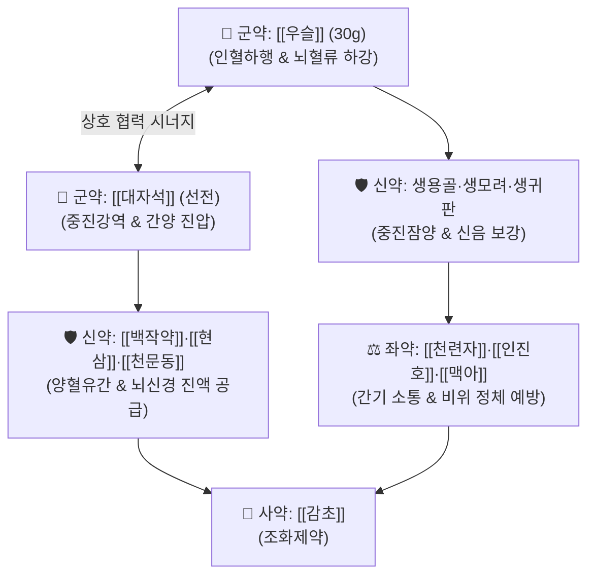

# 🍵 [[진간식풍탕]] (鎭肝熄風湯, Zhen-Gan-Xi-Feng-Tang / Chinkansokufuto)

> **핵심 3줄 요약 (Key Summary)**:
> - 🌿 기본 구성: [[우슬]]·[[대자석]] (군), [[용골]]·[[모려]]·[[귀판]]·[[백작약]]·[[현삼]]·[[천문동]] (신), [[천련자]]·[[인진호]]·[[맥아]] (좌), [[감초]] (사) (치솟는 간양과 기혈을 하초로 강하게 끌어내리고 신음을 보충하는 진간잠양·인혈하행 대표 처방).
> - 🎯 간신음허(肝腎陰虛)로 인해 간양이 폭발하여 뇌로 혈액이 쏠리는 중풍 전조증, 뇌졸중 급성기, 고혈압성 뇌병증 및 뇌충혈성 두통·현훈.
> - 🔬 혈관 내피 eNOS 활성화 및 ET-1 억제를 통한 뇌동맥 연축 차단, NMDA 수용체 흥분독성 억제, HPA 축 교감 과흥분 진정 및 혈압 강하 작용.
> - ⚠️ 주의사항: 뇌출혈 급성기 혈관 파열 진행 환자는 지혈 우선, 기혈극허성 저혈압 환자에게는 투약 금기.

---

## 📌 목차
1. [기본 처방 정보 & 군신좌사 구성](#1-기본-처방-정보--군신좌사-구성)
2. [방제학적 약재 상호작용 & 시너지 네트워크](#2-방제학적-약재-상호작용--시너지-네트워크)
3. [현대 분자약리학적 효능 & 작용 기전](#3-현대-분자약리학적-효능--작용-기전)
4. [적응 병증 및 체질별 감별 (Sweet Spot vs 금기)](#4-적응-병증-및-체질별-감별-sweet-spot-vs-금기)
5. [유사 처방군 감별 매트릭스](#5-유사-처방군-감별-매트릭스)
6. [임상 가감례 & 현대 질환별 응용](#6-임상-가감례--현대-질환별-응용)
7. [💡 사용자 진료실 핵심 필기 & 임상 팁 (원문 보존)](#7--사용자-진료실-핵심-필기--임상-팁-원문-보존)
8. [출처 및 학술 참고 문헌 (References)](#8-출처-및-학술-참고-문헌-references)

---

## 1. 기본 처방 정보 & 군신좌사 구성

* **출전**: 근대 장석순 『[[의학충중참서록]]』(醫學衷中參西錄) 권제1
* **치법**: 진간잠양(鎭肝潛陽), 식풍통락(熄風通絡), 자음유간(滋陰柔肝), 인혈하행(引血下行)

| 구분 | 약재명 | 표준 용량 | 본초 효능 & 방제 내 역할 |
| :--- | :--- | :--- | :--- |
| **군약 (君藥)** | [[우슬]] (회우슬) | 30.0g | **인혈하행·보간신**: 뇌로 치솟은 혈액을 하체로 강력히 유도하여 뇌압 강하 |
| **군약 (君藥)** | [[대자석]] | 30.0g (선전) | **중진강역·평간잠양**: 무거운 광물성 기운으로 치솟는 간기와 위기를 진정 |
| **신약 (臣藥)** | [[용골]] (생용골) | 15.0g (선전) | **진경안신·평간잠양**: 흩어지는 심신(心神)을 가라앉히고 혈압 안정 |
| **신약 (臣藥)** | [[모려]] (생모려) | 15.0g (선전) | **평간잠양·연견산결**: 음허화왕을 누르고 자율신경 과흥분 억제 |
| **신약 (臣藥)** | [[귀판]] (생귀판) | 15.0g (선전) | **자음잠양·보신익정**: 신음을 크게 보하여 간양 폭발의 근본 원인 치료 |
| **신약 (臣藥)** | [[백작약]] | 15.0g | **양혈유간·완급지경**: 패오니플로린 성분으로 혈관 평활근 긴장 완화 |
| **신약 (臣藥)** | [[현삼]]·[[천문동]] | 각 15.0g | **자음강화·청열생진**: 마른 진액을 채우고 신수(腎水)를 올려 허화 소각 |
| **좌약 (佐藥)** | [[천련자]] | 6.0g | **소간이기·청간열**: 간기를 부드럽게 소통시켜 중진약의 울체를 방지 |
| **좌약 (佐藥)** | [[인진호]] | 6.0g | **청열이습·소간퇴열**: 간담의 습열을 밖으로 배출 |
| **좌약 (佐藥)** | [[맥아]] (생맥아) | 6.0g | **건비소식·소간화위**: 무거운 광물질약으로 인한 비위 정체 소화장애 방어 |
| **사약 (使藥)** | [[감초]] | 4.0g | **조화제약·완급**: 작약과 배합되어 작약감초 완급지통 형성 |

> **배오 특징**: [[우슬]]을 30g 대량 사용하여 상체와 뇌로 솟구치는 피를 하초로 끌어내리고, [[대자석]]·[[용골]]·[[모려]]·[[귀판]]의 중진잠양약으로 치솟는 기운을 누르며, [[천련자]]·[[인진호]]·[[맥아]]로 간기가 억눌려 답답해지는 것을 막아주는 **인혈하행(引血下行)과 간기 소통의 절묘한 배합**을 이룹니다.

---

## 2. 방제학적 약재 상호작용 & 시너지 네트워크

* **우슬 + 대자석의 인혈하행 배오**: 우슬이 뇌혈류 과부하를 물리적으로 아래로 유도하고 대자석이 역상하는 기운을 묵직하게 가라앉힙니다.
* **중진잠양약 + 천련자·인진호·생맥아의 소설 배오**: 무거운 약재로 간기를 무조건 억누를 때 발생하는 반발성 화열을 소간이기 약재들이 부드럽게 완충합니다.

---

## 3. 현대 분자약리학적 효능 & 작용 기전

### 1) 혈압 강하 및 뇌혈관 긴장도 정상화
* 혈관 내피세포의 eNOS 활성화를 자극하고 엔도세린-1(ET-1) 분비를 억제하여 뇌동맥의 비정상적 수축을 차단하고 전신 말초 혈관 저항을 감소시킵니다.
### 2) 뇌신경 세포 흥분독성(Excitotoxicity) 차단
* 글루탐산에 의한 NMDA 수용체 과흥분과 세포 내 칼슘 과부하를 막아 허혈성 뇌졸중 시 뇌신경 세포 괴사를 방지합니다.
### 3) HPA 축 과흥분 및 교감신경 긴장 완화
* 카테콜아민의 급격한 혈중 방출을 억제하여 고혈압 응급 환자의 심박출량 안정과 안면홍조를 진정시킵니다.

---

## 4. 적응 병증 및 체질별 감별 (Sweet Spot vs 금기)

### [✅ 최적 적응증 (Sweet Spot)]
* **중풍 전조증 (뇌졸중 전조)**: 손발 저림, 일시적 안면 마비감, 머리가 터질 듯이 아프고 어지러운 증상.
* **뇌경색 급성기 및 고혈압성 뇌병증**: 혈압이 급상승하며 얼굴이 붉어지고 이명과 현훈이 심한 상태.
* **갱년기 간양상항성 고혈압 및 메니에르병**.

### [⚠️ 신중 투여 및 금기 (Caution / Contraindication)]
* **뇌출혈 활동성 출혈기 신중**: 출혈이 진행 중인 환자는 신경외과적 지혈 및 감압이 우선임.
* **기혈양허 저혈압 환자 금기**: 기운이 없고 맥이 미약한 환자에게 투약 시 뇌관류압 저하 위험.

---

## 5. 유사 처방군 감별 매트릭스

| 처방명 | 병기 특성 | 핵심 약재 구성 | 감별 기준 |
| :--- | :--- | :--- | :--- |
| [[진간식풍탕]] | **간신음허 + 간양상항** | 우슬, 대자석, 생용골, 모려, 현삼 | **뇌충혈, 혈압 급상승, 맥현장유력** |
| [[천마구등음]] | **간양상항 + 간화상염** | 천마, 구등, 석결명, 치자, 황금 | **만성 고혈압 두통, 안구 충혈, 맥현삭** |
| [[영각구등탕]] | **온열병 간열생풍** | 영양각, 조등, 상엽, 백작약, 생지황 | **고열 동반 급경풍, 뇌막염** |
| [[반하백출천마탕]] | **비허습담 담탁상몽** | 반하, 백출, 천마, 복령, 황기 | **소화불량, 메스꺼움, 차멀미, 맥현활** |

---

## 6. 임상 가감례 & 현대 질환별 응용

* **가슴이 답답하고 화열이 성할 때**:
  * [[석고]] 15g, [[치자]] 9g을 가미하여 청열사화.
* **가래 끓는 소리가 심할 때**:
  * [[담남성]] 6g, [[죽여]] 6g을 가미하여 척담식풍.
* **기력이 떨어지는 고령자**:
  * 우슬 용량을 15g으로 줄이고 [[황기]] 15g, [[당귀]] 6g을 배합하여 보기활혈.

---

## 7. 💡 사용자 진료실 핵심 필기 & 임상 팁 (원문 보존)

* **우슬 30g 대량 투여의 인혈하행 묘미**:
  * 장석순 선생의 독창적 임상 노하우로, 피가 뇌로 치솟아 혈관이 터지기 직전인 뇌충혈 상태에서 우슬을 30g 이상 대량 투약하면 기혈이 하초로 쏠리며 뇌압이 급속히 떨어진다.
* **중진잠양약의 위장 장애 방지**:
  * 대자석, 용골, 모려 등 무거운 광물질 약재들은 반드시 30분 이상 먼저 달이고(선전), 소화를 돕는 생맥아와 인진을 배합하여 위장 정체 부작용을 사전에 차단한다.
* **중풍 전조증 예방 투약**:
  * 고혈압 환자가 "손가락 1~3지가 저리다", "눈앞이 아찔하고 머리가 터질 것 같다"고 할 때 진간식풍탕을 3~5첩 선투약하면 뇌경색 발병을 효과적으로 방어할 수 있다.

---

## 8. 출처 및 학술 참고 문헌 (References)

1. 장석순(張錫純). 《의학충중참서록(醫學衷中參西錄)》 권제1.
2. * **Wang Y et al. (2025)**. Bioactive Constituents and Antihypertensive Mechanisms of Zhengan Xifeng Decoction: Insights from Plasma UPLC-MS, Network Pharmacology and Molecular Dynamics Simulations. *Pharmaceuticals (Basel, Switzerland)*, 18: . [PMID: 41155608](https://pubmed.ncbi.nlm.nih.gov/41155608/)
