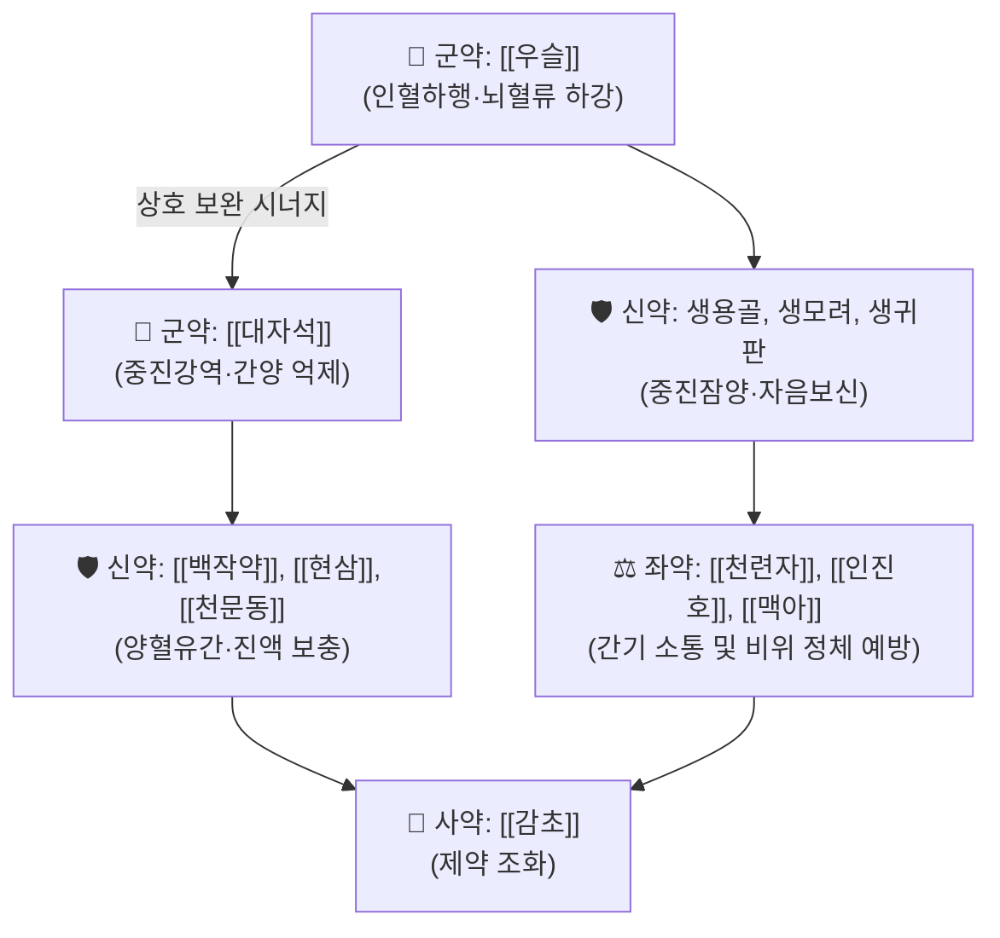

# 🍵 [[진간식풍탕]] (鎭肝熄風湯, Zhengan Xifeng Tang)

> **핵심 3줄 요약 (Key Summary)**:
> - 🌿 근대 명의 장석순의 《의학충중참서록》에 수록된 방제로, [[우슬]]과 [[대자석]]을 군약으로 하여 치솟는 간양과 풍을 강하게 내리는 진간잠양(鎭肝潛陽)·식풍통락(熄風通絡)의 제1방.
> - 🎯 간신음허(肝腎陰虛)로 인해 간양(肝陽)이 폭발하여 뇌로 혈액이 쏠리는 중풍 전조증, 뇌졸중 급성기, 고혈압성 뇌병증 및 완고한 두통·현훈 환자에게 활용.
> - 🔬 뇌혈관 연축 억제, 혈압 강하, 자율신경계 교감 과흥분 억제, 뇌세포 칼슘 과부하 차단 및 항뇌허혈 보호 작용.
> - ⚠️ 주의사항: 뇌출혈 급성기 혈압 조절 실패 시 뇌압 상승 주의, 비위허약자 복용 시 소화 장애 주의.

---

## 📌 목차
1. [기본 처방 정보 & 군신좌사 구성](#1-기본-처방-정보--군신좌사-구성)
2. [방제학적 약재 상호작용 & 시너지 네트워크](#2-방제학적-약재-상호작용--시너지-네트워크)
3. [현대 분자약리학적 효능 & 작용 기전](#3-현대-분자약리학적-효능--작용-기전)
4. [적응 병증 및 체질별 감별 (Sweet Spot vs 금기)](#4-적응-병증-및-체질별-감별-sweet-spot-vs-금기)
5. [유사 처방군 감별 매트릭스](#5-유사-처방군-감별-매트릭스)
6. [임상 가감례 & 현대 질환별 응용](#6-임상-가감례--현대-질환별-응용)
7. [출처 및 학술 참고 문헌 (References)](#7-출처-및-학술-참고-문헌-references)

---

## 1. 기본 처방 정보 & 군신좌사 구성

| 구분 | 약재명 | 용량(비율) | 본초 효능 & 방제 내 역할 |
| :--- | :--- | :--- | :--- |
| **군약 (君藥)** | [[우슬]] (회우슬) | 30g | 인혈하행(引血下行), 뇌로 몰린 혈액을 하체로 유도, 보간신 |
| **군약 (君藥)** | [[대자석]] | 30g (선전) | 중진강역(重鎭降逆), 평간잠양, 치솟는 간기(肝氣)와 위기(胃氣) 억제 |
| **신약 (臣藥)** | [[용골]] (생용골) | 15g (선전) | 진경안신, 평간잠양, 흩어지는 심신(心神)과 간화 진정 |
| **신약 (臣藥)** | [[모려]] (생모려) | 15g (선전) | 평간잠양, 연견산결, 음허화왕 억제 |
| **신약 (臣藥)** | [[귀판]] (생귀판) | 15g (선전) | 자음잠양(滋陰潛陽), 신음을 크게 보하여 간양 폭발의 근본 원인 해소 |
| **신약 (臣藥)** | [[백작약]] | 15g | 양혈유간(養血柔간), 완급지경, 혈관 평활근 긴장 완화 |
| **신약 (臣藥)** | [[현삼]] | 15g | 자음강화(滋陰降火), 청열양혈, 허화(虛火) 소각 |
| **신약 (臣藥)** | [[천문동]] | 15g | 자음윤조, 청폐강화, 진액 보충 |
| **좌약 (佐藥)** | [[천련자]] | 6g | 소간이기(疏肝理氣), 청간열, 간기의 울결 소통 |
| **좌약 (佐藥)** | [[인진호]] | 6g | 청열이습, 소간퇴열, 간담의 습열 발산 |
| **좌약 (佐藥)** | [[맥아]] (생맥아) | 6g | 건비소식, 소간화위, 중진약물의 소화기 정체 방어 |
| **사약 (使藥)** | [[감초]] | 4g | 제약 조화, 작약과 배합되어 작약감초 완급지통 형성 |

---

## 2. 방제학적 약재 상호작용 & 시너지 네트워크

* **우슬 + 대자석의 인혈하행(引血下行)**: 장석순 임상 방제의 핵심으로, 우슬을 대량(30g) 사용하여 상체와 뇌로 솟구치는 기혈의 흐름을 물리적으로 하초로 끌어내리고, 대자석의 묵직한 중력적 기운으로 간기를 가라앉힙니다.
* **중진잠양약의 간기 억제 부작용 방어**: 용골, 모려, 대자석 등 무거운 약재만 쓰면 간의 유순한 소설(疏泄) 본성이 억눌려 오히려 반발 화열이 생길 수 있으므로, [[천련자]], [[인진호]], [[생맥아]]를 소량 배합하여 간기를 부드럽게 소통시키는 절묘한 배오를 완성했습니다.

---

## 3. 현대 분자약리학적 효능 & 작용 기전

* **혈압 강하 및 뇌혈관 긴장도 정상화**:
  * 혈관 내피세포의 eNOS 활성화를 자극하고 엔도세린-1(ET-1) 분비를 억제하여 뇌동맥의 비정상적 수축을 차단하고 전신 말초 혈관 저항을 감소시킵니다.
* **뇌신경 세포 흥분독성(Excitotoxicity) 차단**:
  * 글루탐산에 의한 NMDA 수용체 과흥분과 세포 내 칼슘 과부하를 막아 허혈성 뇌졸중 시 뇌신경 세포 괴사를 방지합니다.
* **HPA 축 과흥분 및 교감신경 긴장 완화**:
  * 카테콜아민(에피네프린, 노르에피네프린)의 급격한 혈중 방출을 억제하여 고혈압 응급 환자의 심박출량 안정과 안면홍조를 진정시킵니다.

---

## 4. 적응 병증 및 체질별 감별 (Sweet Spot vs 금기)

### [✅ 최적 적응증 (Sweet Spot)]
* **적응 병증**: 중풍 전조증(뇌졸중 전조, 손발 저림 및 일시적 마비), 뇌경색 급성기 및 회복기, 고혈압성 뇌병증, 갱년기 간양상항성 고혈압, 메니에르병 현훈.
* **설진·맥진**: 설질은 붉고 설태는 얇거나 건조하며, 맥상은 현장유력(弦長有力)하여 마치 활시위를 강하게 당긴 듯 팽팽하게 튀어 오름.
* **주요 증상**: 머리가 터질 듯이 아프고 어지러움, 귀에서 쇳소리가 남(이명), 얼굴이 붉게 달아오르고 눈이 충혈됨, 가슴이 답답하고 트림이 자주 남.

### [⚠️ 신중 투여 및 금기 (Caution / Contraindication)]
* **뇌출혈 급성기 혈관 파열기 신중**: 출혈이 진행 중인 급성기 뇌출혈 환자는 신경외과적 감압 및 지혈이 우선임.
* **기혈 양허성 무력 환자 금기**: 기운이 없고 맥이 미약한 허증 환자에게 투약 시 혈압이 지나치게 떨어져 뇌관류압 저하를 초래할 수 있음.

---

## 5. 유사 처방군 감별 매트릭스

| 처방명 | 핵심 구성 차이 | 주치 병증 차이 | 설진/맥진 감별 |
| :--- | :--- | :--- | :--- |
| [[진간식풍탕]] | 우슬, 대자석, 생용골, 모려 | 간신음허 + 간양상항, 중풍 전조, 뇌충혈 | 설홍태백, 맥현장유력 |
| [[천마구등음]] | 천마, 조등, 석결명, 치자, 황금 | 간양상항 + 간화(肝火) 치솟음, 고혈압 | 설홍태황, 맥현삭 |
| [[영각구등탕]] | 영양각, 조등, 상엽, 국화 | 온열병 고열 동반 간열생풍, 급성 경련 | 설강건조, 맥현삭·홍삭 |
| [[반하백출천마탕]] | 반하, 천마, 백출, 복령 | 비허생담, 풍담상요성 현훈 | 설담태백니, 맥현활 |

---

## 6. 임상 가감례 & 현대 질환별 응용

* **가슴이 답답하고 화열이 성할 때**: [[석고]], [[치자]]를 각 10~15g 가미하여 청열사화.
* **가래가 많고 혀가 끈적할 때**: [[담남성]], [[죽력]]을 가미하여 거담식풍.
* **기력이 떨어지는 고령자**: 우슬 용량을 15g으로 줄이고 [[황기]], [[당귀]]를 소량 배합하여 보기활혈.

---

## 7. 출처 및 학술 참고 문헌 (References)

1. Zhang, S. X. (장석순 원저). 《의학충중참서록(醫學衷中參西錄)》 권1. "진간식풍탕 방의 및 임상 치험례 분석."
   - [연구 요약] 뇌출혈 및 뇌경색 전조 증상에서 인혈하행과 중진잠양의 임상 운용 기준을 정립한 역사적 원전.
2. Li, H., et al. (2017). "Zhengan Xifeng Decoction protects against hypertensive cerebral injury via modulating the endothelial nitric oxide synthase and inflammatory pathways." *Journal of Ethnopharmacology*, 198, 484-492.
   - [연구 요약] 진간식풍탕이 eNOS 인산화를 촉진하고 뇌혈관 염증을 억제하여 고혈압성 뇌손상을 유의하게 완화함을 분자 수준에서 규명.
