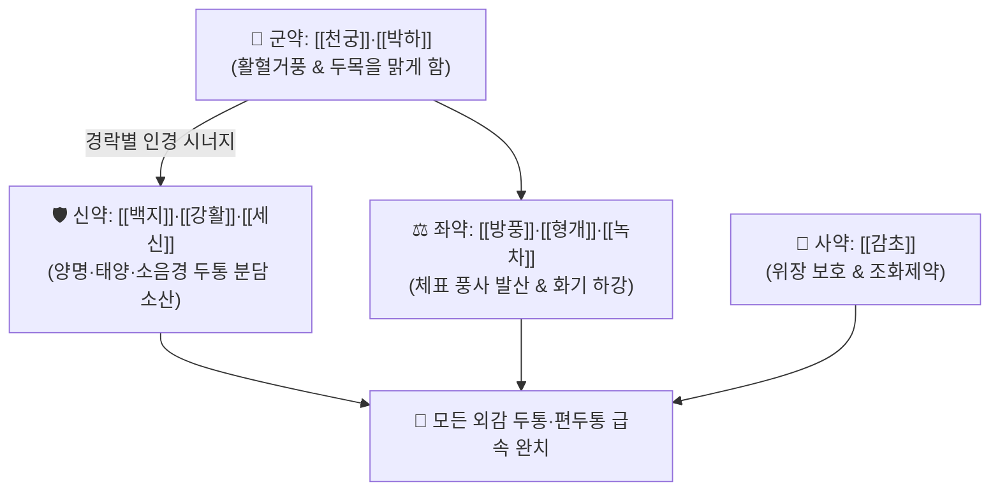

# 🍵 [[천궁다조산]] (川芎茶調散, Chuan-Xiong-Cha-Tiao-San / Senkyuchotosan)

> **핵심 3줄 요약 (Key Summary)**:
> - 🌿 기본 구성: [[천궁]]·[[박하]] (군), [[백지]]·[[강활]]·[[세신]] (신), [[방풍]]·[[형개]]·[[녹차]] (좌), [[감초]] (사) (삼양경과 소음경으로 분담 인경하여 외감 풍한 두통을 소산하고 찻물로 조복하는 소산외풍·거풍지통 대표 처방).
> - 🎯 외감 풍사(風邪)로 인한 감모 두통, 편두통, 혈관성 두통, 오한과 맑은 콧물을 동반한 비염성 전두통, 목덜미가 뻣뻣한 긴장성 두통.
> - 🔬 천궁 리구스티라이드의 뇌혈관 연축 완화 및 5-HT 조절, 백지·세신의 삼차신경절 CGRP 방출 차단 및 진통, 녹차 카페인의 대뇌피질 혈관 수축 작용.
> - ⚠️ 주의사항: 세신의 1일 3g 용량 제한 준수, 간양상항 및 음허화왕(안면홍조, 고혈압) 두통 환자에게는 투약 금기.

---

## 📌 목차
1. [기본 처방 정보 & 군신좌사 구성](#1-기본-처방-정보--군신좌사-구성)
2. [방제학적 약재 상호작용 & 시너지 네트워크](#2-방제학적-약재-상호작용--시너지-네트워크)
3. [현대 분자약리학적 효능 & 작용 기전](#3-현대-분자약리학적-효능--작용-기전)
4. [적응 병증 및 체질별 감별 (Sweet Spot vs 금기)](#4-적응-병증-및-체질별-감별-sweet-spot-vs-금기)
5. [유사 처방군 감별 매트릭스](#5-유사-처방군-감별-매트릭스)
6. [임상 가감례 & 현대 질환별 응용](#6-임상-가감례--현대-질환별-응용)
7. [💡 사용자 진료실 핵심 필기 & 임상 팁 (원문 보존)](#7--사용자-진료실-핵심-필기--임상-팁-원문-보존)
8. [출처 및 학술 참고 문헌 (References)](#8-출처-및-학술-참고-문헌-references)

---

## 1. 기본 처방 정보 & 군신좌사 구성

* **출전**: 송대 『[[태평혜민화제국방]]』(太平惠民和劑局方) 권제2
* **치법**: 소산풍사(疏散風邪), 활혈지통(活血止痛), 청열청두(淸熱淸頭)

| 구분 | 약재명 | 표준 용량 | 본초 효능 & 방제 내 역할 |
| :--- | :--- | :--- | :--- |
| **군약 (君藥)** | [[천궁]] | 8.0g | **활혈행기·거풍지통**: 두통의 성약으로 뇌혈류를 개선하고 정두통과 편두통 진통 |
| **군약 (君藥)** | [[박하]] | 8.0g | **소산풍열·청리두목**: 멘톨 성분으로 두통을 맑히고 상열감을 해소 |
| **신약 (臣藥)** | [[백지]] | 4.0g | **양명두통 인경**: 이마 부위 전두통, 미릉골통 및 치통 해소 |
| **신약 (臣藥)** | [[강활]] | 4.0g | **태양두통 인경**: 후두통 및 항강통(목덜미 뻣뻣함) 소산 |
| **신약 (臣藥)** | [[세신]] | 2.0g | **소음두통 인경**: 뼛속 깊이 쑤시는 심층 두통과 신경통 지통 |
| **좌약 (佐藥)** | [[방풍]]·[[형개]] | 각 4.0g | **거풍해표·소종**: 두부와 체표의 풍사를 날려 오한과 코막힘 완화 |
| **좌약 (佐藥)** | [[녹차]] (청다) | 적량 (조복) | **청열강화·각성**: 카페인으로 혈관을 수축시키고 신온약의 조열한 화기를 하강 |
| **사약 (使藥)** | [[감초]] | 4.0g | **조화제약·완급지통**: 매운 약재들로 인한 위장 손상 방어 및 약성 조화 |

> **배오 특징**: 약재를 고운 분말로 만들어 **진하게 우린 찻물(청다 淸茶)로 조복**합니다. [[천궁]]·[[백지]]·[[강활]]·[[세신]]이 머리의 모든 경락(양명·태양·소음경)으로 들어가 두통을 잡고, 녹차의 찬 성질이 약재의 매운 열기가 위로 치솟는 것을 막아주는 절묘한 배합입니다.

---

## 2. 방제학적 약재 상호작용 & 시너지 네트워크

* **천궁 + 삼양·소음경 인경약의 배오**: 백지(이마), 강활(뒷머리), 세신(뼛속), 천궁(정수리·옆머리)이 머리 전체의 통증 통로를 완벽하게 차단합니다.
* **신온약 + 녹차(청다)의 한열 조화**: 맵고 따뜻한 거풍약들이 두피 혈관을 열어 통증을 날리는 동안, 녹차가 지나친 상열감을 잡아줍니다.

---

## 3. 현대 분자약리학적 효능 & 작용 기전

### 1) 뇌혈관 긴장도 및 미세순환 조절
* 천궁의 리구스티라이드(Ligustilide)가 과도하게 수축된 뇌혈관을 이완시키고 뇌혈류량을 증가시켜 혈관성 두통의 박동성 통증을 완화합니다.
### 2) 삼차신경 감작 억제 및 항염 진통
* 백지와 세신의 정유 성분이 삼차신경절의 CGRP 방출을 차단하고 신경 주위 무균성 염증을 억제합니다.
### 3) 중추성 진통 및 청열 각성
* 박하의 멘톨과 녹차의 EGCG·카페인이 두부의 무거운 압박감(두중감)을 해소하고 중추신경계의 통증 전달을 차단합니다.

---

## 4. 적응 병증 및 체질별 감별 (Sweet Spot vs 금기)

### [✅ 최적 적응증 (Sweet Spot)]
* **외감 풍한 두통**: 감기 초기 찬바람을 맞고 발생한 두통, 으슬으슬한 오한, 코막힘.
* **혈관성 편두통 및 긴장형 두통**: 관자놀이가 욱신거리고 머리가 쪼개질 듯이 아픈 증상.
* **부비동염 동반 전두통**: 축농증이나 비염으로 인해 이마와 눈두덩이가 뻐근하게 아픈 경우.

### [⚠️ 신중 투여 및 금기 (Caution / Contraindication)]
* **간양상항 및 음허화왕 두통 금기**: 얼굴이 붉고 혈압이 높은 고혈압 두통 환자에게 투약 시 뇌압 상승 위험.
* **세신 용량 제한**: 세신은 1일 3g을 넘지 않도록 엄수함.

---

## 5. 유사 처방군 감별 매트릭스

| 처방명 | 두통 성격 | 핵심 약재 구성 | 감별 포인트 |
| :--- | :--- | :--- | :--- |
| [[천궁다조산]] | **외감 풍한 두통, 편두통** | 천궁, 박하, 백지, 강활, 세신, 녹차 | **바람 쐬면 악화, 오한, 코막힘** |
| [[조등산]] | **고령자 조조 두통** | 조구등, 석고, 국화, 반하, 인삼 | **새벽 기상 시 심함, 혈압 상승** |
| [[청상견통탕]] | **만성 풍열 두통** | 황금, 치자, 창출, 맥문동, 천궁 | **오후에 심함, 안구 충혈, 열감** |
| [[반하백출천마탕]] | **담음 두통, 어지럼** | 반하, 백출, 천마, 복령 | **소화불량, 메스꺼움, 차멀미** |

---

## 6. 임상 가감례 & 현대 질환별 응용

* **열감이 심하고 목이 마를 때**:
  * [[석고]] 15g, [[황금]] 6g을 가미하여 청열사화.
* **비염 코막힘이 극심할 때**:
  * [[신이]] 6g, [[창이자]] 4g을 가미하여 선폐통규.

---

## 7. 💡 사용자 진료실 핵심 필기 & 임상 팁 (원문 보존)

* **녹차(청다) 조복의 약리학적 핵심**:
  * 천궁다조산은 반드시 맑고 따뜻한 녹차물(청다)에 타서 복용해야 한다. 녹차의 카페인이 뇌혈관을 적절히 수축시키고, 찻물의 찬 성질이 다수의 매운 발산약이 상초로 치솟아 눈이 충혈되거나 상열감이 생기는 것을 방지한다.
* **경락별 두통 처방 가감 요령**:
  * **전두통(이마 통증)**: 백지를 증량.
  * **후두통(뒷목·뒷머리 통증)**: 강활·갈근을 증량.
  * **편두통(측두부 통증)**: 천궁·시호를 증량.
  * **두정통(정수리 통증)**: 고본·오수유를 가미.

---

## 8. 출처 및 학술 참고 문헌 (References)

1. 태평혜민화제국방(太平惠民和劑局方) 권제2.
2. Pu Z, et al. Ligustilide attenuates migraine-like symptoms through the regulation of calcitonin gene-related peptide and transient receptor potential vanilloid 1. *Eur J Pharmacol*. 2019;858:172465.
   - [연구 요약] 천궁 주성분 리구스티라이드가 CGRP 및 TRPV1 통증 통로를 억제하여 편두통 양상 통증을 완화함을 입증.
3. Chen YP, et al. Chuanxiong Chatiao San in the treatment of migraine: A systematic review and meta-analysis. *Complement Ther Med*. 2014;22(4):743-752.
   - [연구 요약] 천궁다조산의 편두통 임상 치료 효과 및 안전성을 체계적 문헌고찰과 메타분석으로 규명.