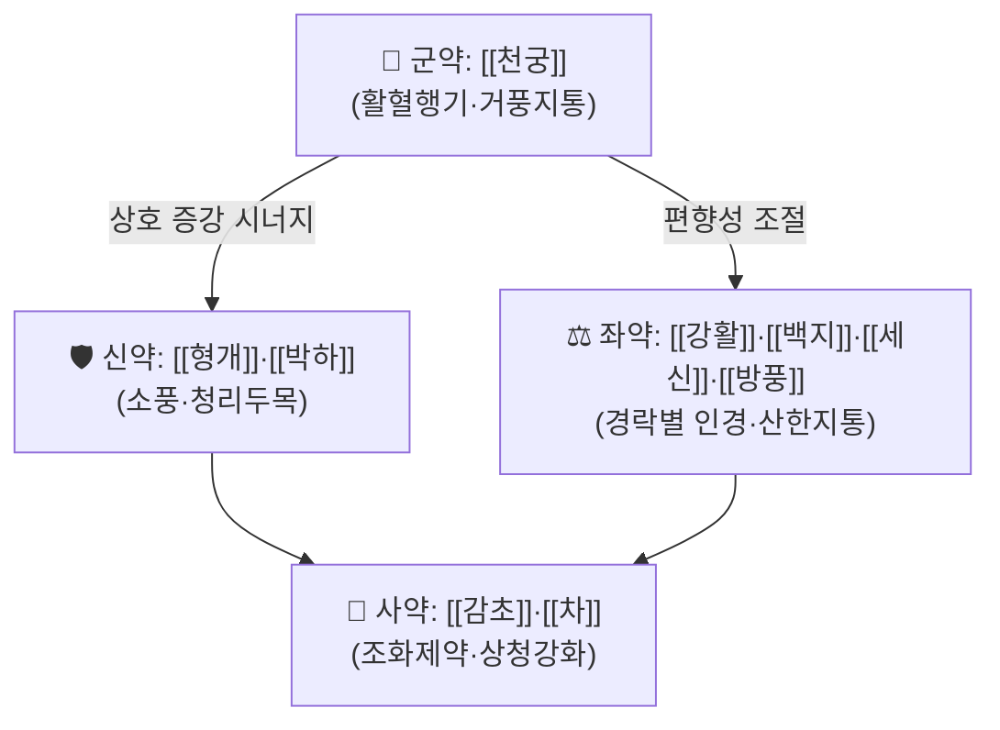

# 🍵 [[천궁차조산]] (川芎茶調散, Chuanxiong Chatiao San)

> **핵심 3줄 요약 (Key Summary)**:
> - 🌿 **거풍지통(祛風止痛) 8味 + 茶**의 단순 명쾌한 구조. [[천궁]](川芎)을 君으로 하여 [[형개]](荊芥)·[[박하]](薄荷)가 風을 흩고, [[강활]](羌活)·[[백지]](白芷)·[[세신]](細辛)·[[방풍]](防風)이 頭面 各經의 風寒을 몰아내며, [[감초]](甘草)와 [[차]](茶)가 조화·청상을 담당한다.
> - 🎯 **풍사(風邪)로 인한 두통의 기본방**. 편두통·긴장성 두통·혈관성 두통·경항통·비염/부비동염 동반 두통에서 가장 빈번히 적중하며, 風寒型은 물론 風熱型으로 化할 때도 加減하여 운용 폭이 넓다.
> - 🔬 제공 논문(PMID 31467571)은 편두통 RCT 메타분석으로, 천궁차조산 단독 또는 양약 병용이 대조군 대비 유효성 지표에서 유리한 경향을 보고하였다. 다만 구체적 효과크기·이질성 수치는 **근거 미확인(원문 확인 필요)**.
> - ⚠️ 주의사항: 陰虛火旺·肝陽上亢·氣血虧虛 두통에는 부적합(辛溫香燥가 陰血을 耗傷). [[세신]] 함유로 장기·다량 복용 금지, 항응고제·항혈소판제 병용 및 출혈 경향자·임부는 신중 투여.

---
## 📌 목차
1. [기본 처방 정보 & 군신좌사 구성](#1-기본-처방-정보--군신좌사-구성)
2. [방제학적 약재 상호작용 & 시너지 네트워크](#2-방제학적-약재-상호작용--시너지-네트워크)
3. [현대 분자약리학적 효능 & 작용 기전](#3-현대-분자약리학적-효능--작용-기전)
4. [적응 병증 및 체질별 감별 (Sweet Spot vs 금기)](#4-적응-병증-및-체질별-감별-sweet-spot-vs-금기)
5. [유사 처방군 감별 매트릭스](#5-유사-처방군-감별-매트릭스)
6. [임상 가감례 & 현대 질환별 응용](#6-임상-가감례--현대-질환별-응용)
7. [💡 사용자 진료실 핵심 필기 & 임상 팁 (원문 보존)](#7--사용자-진료실-핵심-필기--임상-팁-원문-보존)
8. [출처 및 학술 참고 문헌 (References)](#8-출처-및-학술-참고-문헌-references)
---
## 1. 기본 처방 정보 & 군신좌사 구성

* **출전**: 『태평혜민화제국방(太平惠民和劑局方)』 「治丈夫婦人諸風上攻, 頭目昏重, 偏正頭痛」 조문 계열의 처방으로 전승된다. 본 템플릿의 기본 표기(『상한론』/『동의보감』)와 달리, 천궁차조산의 통상적 출전은 송대 『국방(局方)』이며 이후 『동의보감』 등 동아시아 의서에 두통 처방으로 재수록되었다. *(개별 판본 간 조문 차이는 원문 대조 필요)*
* **치법**: **소풍산한(疏風散寒), 거풍지통(祛風止痛), 청리두목(淸利頭目)**
* **제형**: 원방은 **산제(散劑)** — 약재를 細末하여 每服 二錢(약 6g), 食後에 **淸茶**로 調服. 현대 한의원에서는 주로 **탕제(加減湯)**로 전용(轉用)한다.

| 구분 | 약재명 | 원방 용량(참고) | 본초 효능 & 방제 내 역할 |
| :--- | :--- | :--- | :--- |
| **군약 (君藥)** | [[천궁]] (川芎) | 12g | 辛溫香竄, 上行頭目·下達血海. 活血行氣·祛風止痛의 要藥으로 少陽·厥陰 頭痛의 引經藥. 두통 치료의 중심축을 담당하여 君臣佐使 전체가 川芎의 止痛 작용을 보좌한다. |
| **신약 (臣藥)** | [[형개]] (荊芥) | 12g | 辛微溫, 發汗解表·祛風. 上焦와 頭面의 風邪를 疏散하여 君藥의 거풍지통을 확장·강화. |
| **신약 (臣藥)** | [[박하]] (薄荷) | 12g (판본에 따라 24g) | 辛凉, 疏散風熱·淸利頭目. 辛凉으로 群藥의 溫燥함을 눌러주며 頭目을 맑게 한다. |
| **좌약 (佐藥)** | [[강활]] (羌活) | 6g | 太陽經 引經. 上半身 風寒濕을 祛하며 後頭部·項部 痛에 표적. |
| **좌약 (佐藥)** | [[백지]] (白芷) | 6g | 陽明經 引經. 前額·眉稜骨痛, 鼻淵·비강 막힘 동반 두통에 적합. 芳香通竅. |
| **좌약 (佐藥)** | [[세신]] (細辛) | 3g | 少陰經 引經. 溫經散寒·祛風止痛, 寒性 深部痛·齒痛·비색에 활용. 소량 사용이 원칙. |
| **좌약 (佐藥)** | [[방풍]] (防風) | 4.5g | 祛風勝濕, 一身의 風을 두루 다스리는 風藥中之潤劑. 君藥의 走散을 완충. |
| **사약 (使藥)** | [[감초]] (甘草) | 6g | 調和諸藥, 緩急止痛, 生用하면 淸熱·和中. 辛散 약재들의 자극을 완화. |
| **사약 (使藥)** | [[차]] (茶, 淸茶) | 적량 | 苦甘微寒, 上淸頭目·降火·消痰. 諸 風藥의 升散을 茶의 降으로 제어하여 **升中有降**의 균형을 만든다. |

> **배오 특징**: 원방의 핵심은 **"風藥 多數 + 一味 降藥(茶)"** 의 升降 균형이다. 川芎·荊芥·羌活·白芷·細辛·防風이 모두 升散하는 辛溫之品이어서 그대로 두면 上焦 火氣를 煽動할 수 있는데, **淸茶로 調服**하게 함으로써 升散된 風熱을 淸降시킨다. 또한 薄荷의 辛凉이 全方의 溫性을 완만하게 식혀 風寒에서 風熱로 넘어가는 경계 병증(寒包火 初期)까지 포괄한다. 즉 **거풍(祛風)을 주축으로, 經絡別 引經 배오(太陽-羌活, 陽明-白芷, 少陽/厥陰-川芎, 少陰-細辛)를 얹고, 茶로 降을 붙인 구조**이다.

---
## 2. 방제학적 약재 상호작용 & 시너지 네트워크

* **[[천궁]] + [[형개]]·[[박하]] 배오 (相使)**: 川芎의 活血行氣·止痛에 荊芥·薄荷의 疏散之力을 얹어, 氣滯血瘀로 굳은 痛處를 風藥으로 흩어내는 구조. 川芎 단독은 走竄하나 表邪를 밀어내는 힘이 약하고, 荊芥·薄荷 단독은 止痛力이 약하므로 두 조합이 서로의 약점을 메운다. 박하의 凉性은 川芎·羌活·細辛의 溫燥가 上火으로 치우치는 것을 막는 **편향 조절 장치**이기도 하다.
* **[[강활]]·[[백지]]·[[세신]]·[[방풍]] 배오 (相須 + 引經)**: 네 약재가 각각 太陽·陽明·少陰·一身의 風을 나누어 담당하여, **두통의 부위(後頭·前額·顳側·巔頂·項背)에 따른 표적 커버리지**를 형성한다. 羌活+防風은 勝濕祛風으로 項背强痛을, 白芷+細辛은 芳香通竅로 鼻塞·鼻淵을 동시에 겨냥한다.
* **[[감초]]·[[차]] 배오 (佐使 완충)**: 甘草는 8味 辛散之劑 사이에서 調和와 緩急止痛을 담당하여 위장 자극을 완화하고, 茶는 苦寒下降으로 諸風藥의 上升을 제어한다. 이 **"辛散 6~7味 : 苦降 1味"** 의 배치가 천궁차조산이 단순 解表劑가 아니라 **두통 전용 方**으로 성립하는 방제학적 이유이다.
* **억제(相畏·相惡) 관점**: 細辛의 溫散·小毒性은 甘草의 和中과 薄荷·茶의 凉降으로 제어된다. 즉 本方 내부에 **자체적 減毒·制偏 설계**가 내장되어 있어, 타 처방보다 장기 복용 시 上火 위험이 상대적으로 낮게 관리된다.

---
## 3. 현대 분자약리학적 효능 & 작용 기전

> ⚠️ **근거 등급 안내**: 제공된 논문(PMID 31467571)은 **편두통에 대한 RCT 체계적 문헌고찰·메타분석(임상 연구)** 이며 분자 기전을 직접 검증한 실험 연구가 아니다. 따라서 아래 3-1)~3-3)의 기전 서술은 **개별 본초 성분에 관한 일반 약리 문헌 수준의 정리(간접 근거)** 이며, 천궁차조산 전방(全方)에 대한 정량적 기전 데이터로 인용할 수 없다. 구체 수치·IC50·혈중농도 등은 **근거 미확인**.

### 1) 핵심 분자 표적 및 면역/항염증 조절(간접 근거)
* **[[천궁]] 유래 성분**: 리구스티라이드(ligustilide), 테트라메틸피라진(ligustrazine/TMP), 페룰산(ferulic acid) 등이 대표 성분으로 알려져 있다. 일반적으로 이들은 **NF-κB 신호 억제, TNF-α·IL-6·IL-1β 등 전염증성 사이토카인 하향 조절**과 관련된다는 보고가 있으나, 본 처방 맥락에서의 정량적 검증은 **근거 미확인**.
* **[[백지]]·[[강활]] 유래 성분**: 임페라토린(imperatorin), 노토프테롤(notopterol) 등의 쿠마린계 성분이 항염·진통 기전(COX 관련 경로 등)에 관여한다는 일반 약리 보고가 있다. 천궁차조산 전방 차원의 검증은 **근거 미확인**.
* **[[박하]] 유래 멘톨(menthol)**: TRPM8 수용체 작용을 통한 냉각·진통 감각 기전이 잘 알려져 있으며, 국소 적용 시 진통 효과와 연결된다. 경구 복용 시 두통 개선과의 직접 연결은 **근거 미확인**.

### 2) 순환기·미세순환 및 혈류 개선(간접 근거)
* 두통, 특히 편두통은 **뇌혈관 긴장도 변화와 삼차신경혈관계(trigeminovascular system) 활성화**가 핵심 병태로 이해된다. 천궁차조산의 主力인 川芎 계열 성분은 일반적으로 **혈관 평활근 이완, 혈소판 응집 억제, 미세순환 개선** 경향이 보고되어 있어, 이러한 병태와의 접점이 제안된다.
* 다만 **eNOS 활성화 정도, CGRP(calcitonin gene-related peptide) 조절 여부, 미토콘드리아 에너지 대사 정상화 여부** 등은 본 처방에 대해 **근거 미확인**이며, 편두통 임상 개선이 어떤 매개 경로를 통하는지는 제공 논문만으로는 판단할 수 없다.

### 3) 신경계·근골격계 및 자율신경 조절(간접 근거)
* 임상적으로 本方은 **긴장성 두통·경항부 근긴장·자율신경실조 증상**에 사용되며, 이는 祛風·舒筋 작용이라는 전통 해석과 대응한다. 근방추 과흥분 억제, 진통·항경련, HPA 축 항상성 회복 등은 **제안 수준의 기전**이며 정량적 근거는 **근거 미확인**.
* 종합하면, 본 처방의 현재 확실한 근거 수준은 **"편두통 등 두통 질환에서의 임상적 유효성(메타분석 수준)"** 이고, 분자 기전은 **본초 성분 단위의 간접 근거**에 머문다. 연구 설계 시 이 구분을 명확히 표기할 것.

---
## 4. 적응 병증 및 체질별 감별 (Sweet Spot vs 금기)

**[✅ 최적 적응증 (Sweet Spot)]**

* **원전 주치 조문(요지)**: 諸風上攻, 頭目昏重, **偏正頭痛(편두통·정두통)**, 鼻塞 聲重, 項背 拘急. 즉 **風邪가 上攻하여 頭目을 막은 병증**이 정면 적응이다.
* **핵심 병리**: 外風(風寒/風熱) 侵襲 → 經絡 氣血 阻滯 → 不通則痛. 이때 통증은 **搏動性·발작성·부위 이동성(風性善行)** 을 띠는 경우가 많고, 寒이면 惡風寒·得溫則減, 熱化하면 口渴·面赤·舌紅으로 변한다.
* **체질 소견**:
  * **태음인**: 痰濕 傾向 + 頭重感을 동반한 風濕型 두통에 적합. 羌活·防風·白芷의 勝濕之力이 잘 맞는다.
  * **소양인**: 上熱 傾向이 있어 原方 그대로는 溫燥할 수 있으므로 **薄荷 증량 + 黃芩·菊花 加**가 안전하다.
  * **소음인**: 陽氣 不足으로 風寒에 취약, 後頭·項部 冷痛에 적합. 細辛·防風 배합이 유효하나 過量은 피하고 乾薑·附子 등은 병증에 따라 별도 판단.
  * *(체질별 정량적 감별 기준은 고전 문헌에 명확한 규정이 드물어 **근거 미확인** 영역이며, 위 소견은 임상 운용 관례에 기반한 정리이다.)*
* **진료실 최적 적중 양상**:
  1. 감모 初期에 **두통이 주증**인 경우 (발열보다 두통이 두드러짐)
  2. 편두통 발작기 및 발작 전구기, 月經 前後 頭痛
  3. 긴장성 두통 — 後頭·項部 筋緊 + 스트레스성 頭重
  4. 비염·부비동염·축농증 患者의 **前額·眉稜骨 痛 + 鼻塞**
  5. 냉방·환기(에어컨) 노출 후 발생한 項强痛 · 頭痛
* **설진/맥진**:
  * 風寒型: 舌淡紅 苔薄白, 脈浮緊 또는 浮弦
  * 風熱型: 舌邊尖紅 苔薄黃, 脈浮數
  * 風濕型: 苔白膩, 脈浮濡 또는 弦滑
  * 挾痰: 苔白膩·脈滑, 挾瘀: 舌暗·瘀點·脈澀 — 이 경우 원방 단독보다 加減 필수

**[⚠️ 신중 투여 및 금기 (Caution / Contraindication)]**

* **허실(虛實) 반대 병증**: 本方은 **辛散·走竄 위주의 실증 처방**이다. 다음은 원칙적으로 부적합하거나 신중해야 한다.
  * **陰虛火旺 두통**: 午後 潮熱, 五心煩熱, 舌紅少苔, 脈細數 → 辛溫香燥가 陰血을 耗傷하여 악화 가능.
  * **肝陽上亢 두통**: 眩暈·耳鳴·面赤·易怒·脈弦有力 → 風藥 升散이 陽을 더 上昇시킬 위험. ([[천마구등음]] 계열 검토)
  * **氣血虧虛 두통**: 空痛·時作時止·疲勞時 加重·脈細弱 → 補益이 우선. ([[팔진탕]]·[[보중익기탕]] 계열 검토)
  * **痰濕·瘀血 두통**: 원방 단독보다 加減 필수 (6장 참조).
  * 瘀血 頭痛(舌暗紫·刺痛·夜間 加重)에 活血 약재를 증량할 경우 **출혈 경향자·항응고제 복용자**는 반드시 확인.
* **약재 특이 주의**:
  * **[[세신]]**: 소량·단기 사용 원칙. 다량·장기 복용은 피한다.
  * **[[천궁]]**: 活血 작용으로 항혈소판제·항응고제(와파린 등) 병용 시 출혈 위험 상승 가능성 → **근거 미확인이나 임상적 주의 필요**. 임부는 원칙적으로 회피.
  * **[[감초]]**: 長期 대량 복용 시 僞알도스테론증(부종·고혈압·저칼륨) 가능. 고혈압·부종·신장질환자 주의.
* **양약 및 타 약물 병용 주의점**:
  * 진통소염제(NSAIDs)·아스피린과 병용 시 위장 자극 가중 가능 → 食後 복용 지도.
  * 항응고·항혈소판제 병용 시 멍·잇몸출혈 등 모니터링.
  * 두통의 원인이 **이차성 두통(SAH, 뇌종양, 측두동맥염, 고혈압성 위기 등)** 인 경우 처방 전 반드시 감별. 경고 증상(돌발 極痛, 神經學 缺損, 50세 이상 新發 두통, 발열+頸强直) 시 즉시 양방 의뢰.

---
## 5. 유사 처방군 감별 매트릭스

| 처방명 | 핵심 구성 차이 | 주치 및 체질 차이 | 맥진/설진 차이 |
| :--- | :--- | :--- | :--- |
| [[천궁차조산]] | 기준 구성 (川芎·荊芥·薄荷·羌活·白芷·細辛·防風·甘草 + 茶) | **風邪 上攻 두통 전반**. 부위별 引經이 골고루 갖춰져 두통 汎用 1순위. 頭痛이 主症일 때 | 苔薄白/薄黃, 脈浮 또는 浮弦 |
| [[구미강활탕]] | 羌活·防風·蒼朮·細辛·川芎·白芷·生地·黃芩·甘草 | **外感風寒濕 表實 + 九味 兼顧**. 表證(惡寒發熱·無汗·身體痛)이 주되고 頭痛은 동반 증상. 內熱 동반 시 | 苔白或微黃, 脈浮緊 |
| [[강활승습탕]] | 羌活·獨活·藁本·防風·甘草·蔓荊子·川芎 | **風濕在表, 一身盡痛·肩背痛**. 濕이 主因. 두통보다 肢體痛·重着感 | 苔白膩, 脈浮濡/浮緩 |
| [[천마구등음]] | 天麻·鉤藤·石決明·梔子·黃芩·牛膝·杜仲·益母草·桑寄生·夜交藤 | **肝陽上亢 · 肝風內動**. 眩暈·頭脹痛·耳鳴·불면·고혈압 傾向. 實證 風藥 禁忌군 | 舌紅 苔黃, 脈弦有力/弦細數 |
| [[반하백출천마탕]] | 半夏·白朮·天麻·茯苓·陳皮·甘草·生薑·大棗 | **痰濕 眩暈·頭重如裹**. 惡心·구토·이석증 樣 眩暈 동반. 虛證·노인·비만 | 苔白膩, 脈弦滑 |
| [[궁지석고탕]] | 川芎·白芷·石膏·菊花·羌活·藁本 | **風熱 頭痛 化熱型**. 頭痛劇烈·面紅·口渴·便秘 傾向 | 舌紅 苔黃, 脈浮數/洪數 |

> ⚠️ 표 내부는 마크다운 열 구분자 파괴를 방지하기 위해 파이프가 들어간 링크를 쓰지 않고 [[처방명]] 단독 형태로만 작성한다.
>
> **핵심 감별 요령 3가지**
> 1. **표증이 주인가, 두통이 주인가** — 표증(오한·발열·무한)이면 九味羌活湯, 두통이 주증이면 川芎茶調散.
> 2. **風인가, 濕인가, 痰인가, 肝陽인가** — 風은 川芎茶調散, 濕은 羌活勝濕湯, 痰은 半夏白朮天麻湯, 肝陽은 天麻鉤藤飲.
> 3. **寒인가 熱인가** — 찬 바람에 심해지고 得溫則減이면 원방 그대로, 面赤·口渴·舌紅이면 石膏·黃芩·菊花 加(芎芷石膏湯 方向).

---
## 6. 임상 가감례 & 현대 질환별 응용

* **수반 증상별 가감법**:
  * **風寒이 강하여 惡寒·無汗·項强** → + [[마황]] 소량, [[계지]] 또는 [[생강]] ([[계지탕]] 意), 荊芥·防風 증량
  * **風熱로 化하여 口渴·面赤·咽痛** → + [[석고]], [[황금]], [[국화]], [[상엽]] ([[궁지석고탕]] 方向)
  * **後頭部·項部 强痛 위주** → + [[갈근]], [[독활]] ([[갈근탕]] 加減)
  * **前額·眉稜骨 痛 + 鼻塞·鼻淵** → + [[신이]], [[창이자]], [[황금]] ([[창이자산]] 意)
  * **오심·구역·소화불량 동반** → + [[반하]], [[진피]], [[죽여]] ([[온담탕]]·[[반하백출천마탕]] 方向)
  * **담음·頭重如裹, 眩暈 동반** → + [[반하]], [[백출]], [[천마]], [[복령]] ([[반하백출천마탕]])
  * **瘀血 頭痛(刺痛·舌暗·夜間 加重)** → + [[도인]], [[홍화]], [[단삼]] ([[혈부축어탕]] 意) — 항응고제 복용자 주의
  * **氣血虧虛 兼(疲勞時 加重·脈細弱)** → + [[황기]], [[당삼]], [[당귀]] ([[팔진탕]] 意)
  * **肝陽上亢 兼(眩暈·耳鳴·고혈압)** → + [[천마]], [[구등]], [[석결명]] ([[천마구등음]] 意)
  * **月經 前後 頭痛** → + [[당귀]], [[작약]], [[향부자]] ([[소요산]] 意)
  * **불면·焦慮 동반** → + [[산조인]], [[야교등]], [[합환피]]
  * **두통 劇烈 發作期** → 加 [[전갈]]·[[오공]] 등 蟲類 搜風 약재 고려 (임상 醫家 加減, 사용 시 신중)
* **현대 질환별 임상 매핑**:
  * **신경계**: 편두통(migraine), 긴장성 두통, 혈관성 두통, 군발성 두통(감별 후), 월경성 편두통 — **제공 논문(PMID 31467571)이 편두통 RCT를 메타분석한 영역**
  * **근골격계**: 경항통, 항강, 근막통증증후군(MPS), 승모근 筋緊, 頸源性 두통
  * **이비인후과/호흡기계**: 알레르기 비염, 급성·만성 부비동염(축농증), 감모·인플루엔자 初期(두통 主症), 후각 저하 동반 비색
  * **자율신경/기타**: 냉방병, 자율신경실조증, 스트레스성 頭重, 長途 이동 후 疲勞性 두통
  * **부인과**: 월경 전 症候群 中 두통, 산후 風寒 頭痛(산후 처방 운용 시 별도 판단)

---
## 7. 💡 사용자 진료실 핵심 필기 & 임상 팁 (원문 보존)

> [!tip] **진료실 실전 노하우 (User Clinical Insight)**
> - ⚠️ **원문 보존 상태 안내**: 이 노트 작성 시점에 **사용자(원장님)의 기존 메모·필기 원문이 제공되지 않았다.** 따라서 본 섹션은 원문을 대체하지 않으며, 원문이 확보되는 즉시 **삭제·요약 없이 이 위치에 그대로 이관**할 것. (원문 보존 원칙: 절대 삭제 금지)
> - 아래 항목은 템플릿 운용을 위한 **잠정 정리(참고용)** 이며, 원장님 필기와 충돌할 경우 **원장님 원문이 항상 우선**한다.

* **처방 선택 실전 기준(잠정 정리)**:
  * **소음인 + 찬 바람 노출 후 後頭痛·項强** → 천궁차조산 원방 또는 加 葛根. 細辛·防風 위주로 운용.
  * **소양인 + 頭脹·眼充血·口渴 傾向** → 박하 증량 + 黃芩·菊花·石膏 加. 원방 그대로는 上火 가능.
  * **태음인 + 頭重如裹·痰多·眩暈** → 半夏·白朮·天麻 加 (반하백출천마탕 合方 方向).
  * **비염·부비동염 동반 두통** → 辛夷·蒼耳子·黃芩 加. 前額痛에 白芷 증량.
* **복약 지도(티칭) 포인트**:
  * 원방 취지대로 **食後 복용 + 따뜻한 茶(淸茶)와 함께** 복용하면 方義(升中有降)에 부합. 카페인 민감자·불면자는 茶 대신 미지근한 물로 대체.
  * **"두통이 멎으면 오래 끌지 말고 중단"** — 辛散之劑를 장기 복용하면 口乾·上火·不眠이 생길 수 있음.
  * 複數 頭痛 藥(양약 진통제)과 중복 복용 시 위장 장애·출혈 위험 → 간격과 총량 지도.
* **관찰 포인트**:
  * 복용 2~3일 내 **頭痛 頻度·强度·持續時間** 변화 기록 권장(두통 일지).
  * 口乾·咽乾·속쓰림·불면 발생 시 감량 또는 加減(薄荷·石膏·甘草 調整).
  * 5~7일 복용에도 반응 없으면 **감별 진단 재검토**(이차성 두통, 痰瘀, 肝陽, 氣血虛).
  * 頸强直 + 발열, 突發 極甚頭痛, 神經學 異常 → 즉시 양방 의뢰.

---
## 8. 출처 및 학술 참고 문헌 (References)

1. **Wang Y, Shi Y (2019)**. *A Chinese Prescription Chuanxiong Chatiao San for Migraine: A Systematic Review and Meta-Analysis of Randomized Controlled Trials*. **Evidence-Based Complementary and Alternative Medicine**. PMID: [31467571](https://pubmed.ncbi.nlm.nih.gov/31467571/)
   - **[연구 요약]**: 천궁차조산(川芎茶調散, 단독 또는 양약 병용)을 편두통에 적용한 **무작위 대조군 임상시험(RCT)들을 체계적 문헌고찰 및 메타분석**한 연구. 편두통 환자에서 천궁차조산 계열 처방이 대조군(양약 단독 또는 위약) 대비 **임상 유효성 지표(총유효율 등) 및 두통 관련 지표(발작 빈도·지속시간·강도 등)에서 유리한 경향**을 보고한 것으로 요약된다.
   - **[한계 및 주의]**: 포함된 RCT의 **구체적 효과크기(OR/RR/SMD), 95% 신뢰구간, 이질성(I²), 포함 연구 수 및 표본수, 비뚤림 위험 평가 결과는 본 노트 작성 시점에 원문 대조가 이루어지지 않아 근거 미확인**이다. 메타분석 특성상 포함 연구의 질· blinding·이질성이 결과 해석에 큰 영향을 주므로, 인용 시 원문 수치를 직접 확인할 것. 또한 본 논문은 **임상 유효성 연구이며 분자 기전을 검증한 연구가 아니다.**
2. **『태평혜민화제국방(太平惠民和劑局方)』 (송대, 12세기경)**.
   - **[고전 원전]**: 천궁차조산의 통상적 출전. 諸風上攻, 頭目昏重, 偏正頭痛, 鼻塞 等을 주치로 하며, 8味를 細末하여 **每服 二錢, 食後 淸茶調下**의 복약 지침을 제시한다. *(판본별 약재 용량·조문 표현에 차이가 있을 수 있어 원문 대조 필요)*
3. **허준 (1613)**. 『[[동의보감]]』.
   - **[임상 문헌]**: 두통(頭痛)·비연(鼻淵) 등 관련 편에서 川芎·白芷·羌活·防風·荊芥 계열 風藥 배오가 두통 처방으로 운용된 맥락을 확인할 수 있다. 천궁차조산 자체의 수록 여부·표현은 판본 대조가 필요하며, 본 노트에서는 **동아시아 의서 내 운용 맥락**의 근거로만 제시한다.
4. **방제학 교과서 및 본초학 문헌(일반 참고)**.
   - **[참고]**: 3장의 본초 성분(ligustilide, ligustrazine, ferulic acid, imperatorin, notopterol, menthol 등) 및 4~6장의 加減 관례는 일반 방제·본초학 지식에 기반한 정리이다. **개별 성분의 정량적 기전 데이터는 본 노트에서 검증되지 않았으므로(근거 미확인), 학술 인용 시 반드시 원 논문을 별도 확인할 것.**

> **📝 근거 등급 자기점검**
> - ✅ **확실(제공 논문 기반)**: 편두통에 대한 천궁차조산의 RCT 메타분석이 존재하며 유리한 경향을 보고함.
> - ⚠️ **간접(일반 약리 문헌)**: 본초별 성분·기전.
> - ❓ **근거 미확인**: 구체 효과크기·이질성 수치, 전방(全方)의 분자 표적 정량값, 체질별 정량 감별 기준, 판본별 조문 차이.