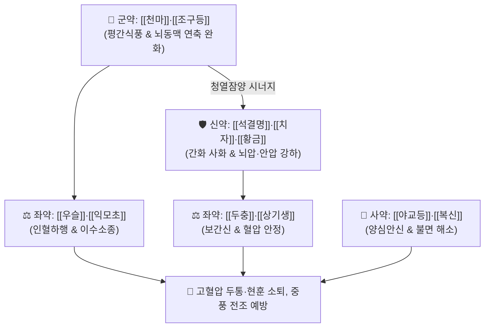

# 🍵 [[천마구등음]] (天麻鉤藤飮, Tian-Ma-Gou-Teng-Yin / Temmakototo)

> **핵심 3줄 요약 (Key Summary)**:
> - 🌿 기본 구성: [[천마]]·[[조구등]] (군), [[석결명]]·[[치자]]·[[황금]] (신), [[우슬]]·[[익모초]]·[[두충]]·[[상기생]] (좌), [[야교등]]·[[복신]] (사) (간양을 잠재우고 화열을 식히며 간신을 보강하는 평간식풍·청열활혈 대표 방제).
> - 🎯 간양상항(肝陽上亢) 및 간화상염으로 인한 본태성 고혈압, 심한 박동성 편두통, 어지럼증(현훈), 이명, 안면홍조, 불면, 중풍 전조증.
> - 🔬 조구등 린코필린의 L-type Ca2+ 채널 차단 및 혈압 강하, 천마 가스트로딘의 GABA-A 수용체 조절, 황금 바이칼린의 혈관 내피 NF-κB 염증 억제 작용.
> - ⚠️ 주의사항: 조구등은 오래 달이면 유효 알칼로이드가 파괴되므로 10~15분 전 후하(後下) 준수, 비위허약자는 식후 복용.

---

## 📌 목차
1. [기본 처방 정보 & 군신좌사 구성](#1-기본-처방-정보--군신좌사-구성)
2. [방제학적 약재 상호작용 & 시너지 네트워크](#2-방제학적-약재-상호작용--시너지-네트워크)
3. [현대 분자약리학적 효능 & 작용 기전](#3-현대-분자약리학적-효능--작용-기전)
4. [적응 병증 및 체질별 감별 (Sweet Spot vs 금기)](#4-적응-병증-및-체질별-감별-sweet-spot-vs-금기)
5. [유사 처방군 감별 매트릭스](#5-유사-처방군-감별-매트릭스)
6. [임상 가감례 & 현대 질환별 응용](#6-임상-가감례--현대-질환별-응용)
7. [💡 사용자 진료실 핵심 필기 & 임상 팁 (원문 보존)](#7--사용자-진료실-핵심-필기--임상-팁-원문-보존)
8. [출처 및 학술 참고 문헌 (References)](#8-출처-및-학술-참고-문헌-references)

---

## 1. 기본 처방 정보 & 군신좌사 구성

* **출전**: 호정광 『[[잡병증치신의]]』(雜病證治新義)
* **치법**: 평간식풍(平肝熄風), 청열활혈(淸熱活血), 보기익신(補氣益腎), 안신정지(安神定志)

| 구분 | 약재명 | 표준 용량 | 본초 효능 & 방제 내 역할 |
| :--- | :--- | :--- | :--- |
| **군약 (君藥)** | [[천마]] | 9.0g | **평간식풍·지현훈**: 가스트로딘 성분으로 중추 진정 및 뇌혈관 확장 |
| **군약 (君藥)** | [[조구등]] | 12.0g (후하) | **평간식풍·청열진경**: 린코필린 성분으로 혈관 이완 및 혈압 강하 |
| **신약 (臣藥)** | [[석결명]] | 18.0g (선전) | **평간잠양·청열명목**: 탄산칼슘 성분으로 뇌압과 안압을 낮추고 충혈 해소 |
| **신약 (臣藥)** | [[치자]]·[[황금]] | 각 9.0g | **청열사화·사간화**: 바이칼린 및 게니포사이드 성분으로 간경 화열 소각 |
| **좌약 (佐藥)** | [[우슬]] | 12.0g | **활혈거어·인혈하행**: 치솟은 기혈을 하체로 끌어내려 혈압 안정 |
| **좌약 (佐藥)** | [[익모초]] | 9.0g | **활혈조경·이수소종**: 레오누린 성분으로 미세혈류를 개선하고 뇌부종 경감 |
| **좌약 (佐藥)** | [[두충]]·[[상기생]] | 각 9.0g | **보간신·강근골**: 간신을 보하여 간양이 위로 치솟는 근본 원인 치료 |
| **사약 (使藥)** | [[야교등]]·[[복신]] | 각 9.0g | **양심안신·수면유도**: 시상하부 과흥분을 진정시켜 불면과 불안 해소 |

> **배오 특징**: 치솟는 간화와 풍을 끄는 [[천마]]·[[조구등]]·[[석결명]]에, 기혈을 아래로 끌어내리는 [[우슬]], 근본적인 신음을 보하는 [[두충]]·[[상기생]], 잠을 잘 자게 돕는 [[야교등]]·[[복신]]이 결합하여 **표(간양 화열)와 본(간신 부족)을 동시에 치료**합니다.

---

## 2. 방제학적 약재 상호작용 & 시너지 네트워크

* **천마·조구등 + 치자·황금의 청열평간 배오**: 간화가 위로 치솟아 머리가 깨질 듯 아프고 눈이 충혈되는 증상을 즉각 진정시킵니다.
* **우슬 + 두충·상기생의 인혈하행 배오**: 뇌로 쏠린 혈압을 아래로 내리고 약해진 신정을 보충하여 혈압을 장기적으로 안정화합니다.

---

## 3. 현대 분자약리학적 효능 & 작용 기전

### 1) 칼슘 채널 차단 및 혈관 평활근 이완
* 조구등의 린코필린이 전압 의존성 $\text{Ca}^{2+}$ 채널을 차단하고 혈관 내피세포의 NO 방출을 유도하여 혈압을 강하시킵니다.
### 2) 중추 신경계 진정 및 GABA 수용체 조절
* 천마의 가스트로딘이 $\text{GABA}_A$ 수용체 결합을 촉진하고 글루탐산 흥분독성을 차단하여 어지럼증과 뇌신경 과흥분을 진정시킵니다.
### 3) 혈관 내피세포 보호 및 뇌혈관 저항 감소
* 황금의 바이칼린과 치자의 게니포사이드가 $\text{NF-\kappa B}$ 염증 신호를 차단하여 고혈압성 혈관벽 비후와 동맥경화를 예방합니다.

---

## 4. 적응 병증 및 체질별 감별 (Sweet Spot vs 금기)

### [✅ 최적 적응증 (Sweet Spot)]
* **본태성 고혈압 및 동맥경화증**: 혈압이 높고 뒷목이 뻣뻣하며 머리가 욱신거리는 증상.
* **간양상항성 두통 및 현훈(어지럼증)**: 눈이 충혈되고 귀에서 소리가 나며(이명), 화를 잘 내고 상열감이 있는 경우.
* **고혈압 동반 불면증 및 중풍 전조증**.

### [⚠️ 신중 투여 및 금기 (Caution / Contraindication)]
* **비위허한자 설사 주의**: 치자, 황금의 찬 성질로 속쓰림이나 묽은 변이 발생할 수 있으므로 식후 30분에 복용 지도.
* **저혈압 환자 주의**: 양방 혈압약 복용 환자는 저혈압 유발 여부를 관찰.

---

## 5. 유사 처방군 감별 매트릭스

| 처방명 | 병기 | 핵심 약재 구성 | 감별 포인트 |
| :--- | :--- | :--- | :--- |
| [[천마구등음]] | **간양상항 + 간화상염** | 천마, 조구등, 석결명, 치자, 황금 | **본태성 고혈압, 안구 충혈, 불면** |
| [[진간식풍탕]] | **간신음허 + 중증 간양상항** | 우슬, 대자석, 생용골, 모려, 현삼 | **뇌충혈, 중풍 전조, 뇌출혈 위험** |
| [[반하백출천마탕]] | **비허담음 담탁상몽** | 반하, 백출, 천마, 복령, 황기 | **소화불량, 메스꺼움, 차멀미** |
| [[조등산]] | **고령자 조조 두통** | 조구등, 석고, 국화, 반하, 인삼 | **새벽 기상 시 심한 만성 긴장성 두통** |

---

## 6. 임상 가감례 & 현대 질환별 응용

* **출혈 경향 및 뇌혈관 긴장 극심 시**:
  * [[단삼]] 9g, [[적작약]] 6g을 가미하여 활혈산어.
* **소화기 허약자 가감**:
  * [[백출]] 4g, [[사인]] 3g을 가미하고 치자를 볶아서(초치자) 사용.

---

## 7. 💡 사용자 진료실 핵심 필기 & 임상 팁 (원문 보존)

* **조구등 탕전 후하(後下) 원칙 준수**:
  * 조구등의 혈압 강하 지표 성분인 알칼로이드(린코필린)는 열에 약하므로 반드시 탕전 완료 10~15분 전에 넣고 살짝 끓여야 약효가 최대로 보존된다.
* **양방 항고혈압제 복용자와의 병용 요령**:
  * 양방 혈압약(CCB, ARB 등)을 복용 중인 환자가 천마구등음을 병용할 경우 상열감과 두통이 신속히 호전되나, 혈압이 과도하게 떨어질 수 있으므로 가정 혈압을 측정하며 양약 감량을 점진적으로 유도한다.
* **경추 후두하근군 연축 완화**:
  * 두경부 모세혈관망의 저항을 낮추고 후두하근군 긴장을 이완시켜 추골동맥 순환을 개선하므로 경추성 어지럼증에도 탁월한 효과를 발휘한다.

---

## 8. 출처 및 학술 참고 문헌 (References)

1. 호정광(胡廷光). 《잡병증치신의(雜病證治新義)》.
2. * **Lin YS et al. (2026)**. [Mechanism of Tianma Gouteng Yin in treating early-stage Parkinson's disease based on 16S rRNA sequencing and metabolomics]. *Zhongguo Zhong yao za zhi = Zhongguo zhongyao zazhi = China journal of Chinese materia medica*, 51: 3522-3531. [PMID: 42543311](https://pubmed.ncbi.nlm.nih.gov/42543311/)
