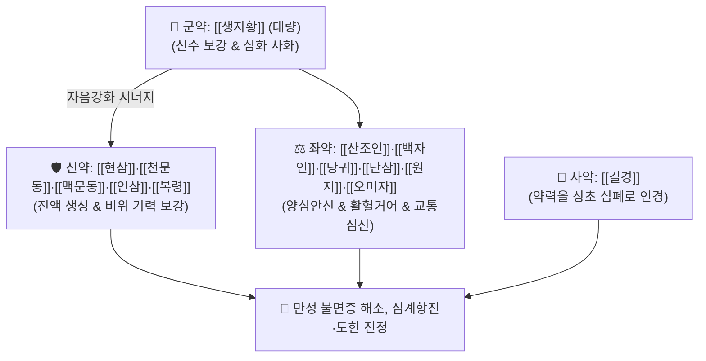

# 🍵 [[천황보심단]] (天王補心丹, Tian-Wang-Bu-Xin-Dan / Ten-o-hoshindan)

> **핵심 3줄 요약 (Key Summary)**:
> - 🌿 기본 구성: [[생지황]] (군, 대량), [[현삼]]·[[천문동]]·[[맥문동]]·[[인삼]]·[[복령]] (신), [[당귀]]·[[단삼]]·[[백자인]]·[[산조인]]·[[원지]]·[[오미자]] (좌), [[길경]] (사) (신수를 채워 심화를 끄고 심혈을 보충하여 정신을 안정시키는 자음청열·양심안신 대표 방제).
> - 🎯 심신불교(心腎不交) 및 음허화왕(陰虛火旺)으로 인한 만성 불면증, 가슴 두근거림(심계), 건망증, 도한(식은땀), 손발바닥 열감, 구내염(구설생창).
> - 🔬 GABA-A 수용체 알로스테릭 활성화로 서파수면(NREM) 연장, HPA 축 과활성 억제를 통한 코르티솔·ACTH 강하, BDNF/TrkB 발현을 통한 뇌신경 보호.
> - ⚠️ 주의사항: 대량의 생지황·보음약으로 인해 비위허약자 소화불량·설사 주의(식후 복용 지도), 원방의 주사(황화수은)는 현대 규격에서 전면 배제.

---

## 📌 목차
1. [기본 처방 정보 & 군신좌사 구성](#1-기본-처방-정보--군신좌사-구성)
2. [방제학적 약재 상호작용 & 시너지 네트워크](#2-방제학적-약재-상호작용--시너지-네트워크)
3. [현대 분자약리학적 효능 & 작용 기전](#3-현대-분자약리학적-효능--작용-기전)
4. [적응 병증 및 체질별 감별 (Sweet Spot vs 금기)](#4-적응-병증-및-체질별-감별-sweet-spot-vs-금기)
5. [유사 처방군 감별 매트릭스](#5-유사-처방군-감별-매트릭스)
6. [임상 가감례 & 현대 질환별 응용](#6-임상-가감례--현대-질환별-응용)
7. [💡 사용자 진료실 핵심 필기 & 임상 팁 (원문 보존)](#7--사용자-진료실-핵심-필기--임상-팁-원문-보존)
8. [출처 및 학술 참고 문헌 (References)](#8-출처-및-학술-참고-문헌-references)

---

## 1. 기본 처방 정보 & 군신좌사 구성

* **출전**: 명대 위역림 『[[세의득효방]]』(世醫得效方) / 『[[동의보감]]』(東醫寶鑑) 신형편 신
* **치법**: 자음청열(滋陰淸熱), 양혈안신(養血安神), 익기생진(益氣生津), 교통심신(交通心腎)
* **표기 안내**: 문헌에 따라 『[[천왕보심단]]』(天王補心丹) 또는 '천황보심단'으로 통용되는 동일 처방입니다.

| 구분 | 약재명 | 표준 용량 | 본초 효능 & 방제 내 역할 |
| :--- | :--- | :--- | :--- |
| **군약 (君藥)** | [[생지황]] | 120.0g | **자음강화·양혈생진**: 처방의 40%를 차지하며 신수를 대보하여 심화를 진압 |
| **신약 (臣藥)** | [[현삼]] | 15.0g | **자음강화·청열해독**: 생지황을 도와 심경의 허화(虛火)를 끄고 인후 보호 |
| **신약 (臣藥)** | [[천문동]]·[[맥문동]] | 각 15.0g | **청심윤폐·양음생진**: 심폐의 진액을 채우고 중추 신경 안정 |
| **신약 (臣藥)** | [[인삼]]·[[복령]] | 각 15.0g | **대보원기·건비영심**: 기(氣)를 보하여 혈액 생성을 돕고 비위를 안정화 |
| **좌약 (佐藥)** | [[당귀]]·[[단삼]] | 30g / 15g | **보혈활혈·청심량혈**: 심혈(心血)을 자양하고 음허로 인한 미세 어혈 해소 |
| **좌약 (佐藥)** | [[산조인]] (초) | 30.0g | **양심안신·수렴지한**: GABAergic 활성화로 서파수면을 연장하고 도한 억제 |
| **좌약 (佐藥)** | [[백자인]] | 30.0g | **양심안신·윤장통변**: 교감신경 긴장을 완화하고 건조성 변비 해소 |
| **좌약 (佐藥)** | [[원지]] (거심) | 15.0g | **거담개규·교통심신**: 심장과 신장의 기운을 통하게 하여 건망과 불안 완화 |
| **좌약 (佐藥)** | [[오미자]] | 30.0g | **수렴고삽·익기생진**: 진액과 심기가 밖으로 새어 나가지 않도록 단속 |
| **사약 (使藥)** | [[길경]] | 15.0g | **자인상행·인경**: 약력을 상초 흉격과 심폐로 이끌어 올림 |

> **배오 특징**: [[생지황]]을 압도적인 대량 군약으로 삼아 신수(腎水)를 채우고, 3대 맥문동류([[현삼]]·[[천문동]]·[[맥문동]])와 안신약([[산조인]]·[[백자인]]·[[원지]])을 완벽히 결합하여 **수화부제(水火不濟)로 인한 만성 음허 불면**을 다스리는 최고의 자음안신 방제입니다.

---

## 2. 방제학적 약재 상호작용 & 시너지 네트워크

* **생지황 + 현삼·이동(천문동·맥문동)의 자음강화 배오**: 바닥난 체액과 음혈을 채워 심장으로 솟구치는 허열을 근본적으로 꺼뜨립니다.
* **산조인·백자인 + 원지·오미자의 양심수렴 배오**: 흩어지고 들뜬 심신을 모아 단단히 안착시키고 수면의 질을 정상화합니다.

---

## 3. 현대 분자약리학적 효능 & 작용 기전

### 1) $\text{GABA}_A$ 수용체 활성화 및 수면 구조 개선
* 산조인의 스피노신 및 쥬쥬보사이드가 대뇌 피질의 $\text{GABA}_A$ 수용체 부위에 작용하여 렘(REM) 수면 분절을 억제하고 서파수면(NREM Stage 3/4) 시간을 유의하게 연장합니다.
### 2) HPA 축 과활성 억제 및 스트레스 호르몬 강하
* 만성 스트레스 상태에서 치솟는 부신피질자극호르몬(ACTH) 및 코르티솔 분비를 낮추어 자율신경계 과흥분을 안정화합니다.
### 3) 뇌신경 세포 보호 및 시냅스 가소성 회복
* 단삼의 탄신논 IIA와 인삼 사포닌이 대뇌 피질과 해마에서 BDNF/TrkB 신호전달을 촉진하여 기억력 감퇴(건망증)와 신경세포 손상을 방어합니다.

---

## 4. 적응 병증 및 체질별 감별 (Sweet Spot vs 금기)

### [✅ 최적 적응증 (Sweet Spot)]
* **만성 음허성 불면증**: 쉽게 잠들지 못하고(입면장애), 자더라도 꿈이 많으며(다몽), 새벽에 자주 깨어 피로가 누적된 상태.
* **심신불교형 신경증**: 가슴 두근거림(심계), 불안, 초조, 건망증, 손발바닥 열감(오심번열).
* **만성 점막 건조 및 구내염**: 입과 목이 바짝 마르고 혀끝이 붉으며 입안이 자주 허는 아프타성 구내염, 도한(식은땀).

### [⚠️ 신중 투여 및 금기 (Caution / Contraindication)]
* **비위허약자 소화기 주의**: 생지황 등 보음약이 대량 함유되어 자니(滋膩)하므로 평소 소화불량이나 묽은 변을 자주 보는 환자는 식후 30분에 복용하도록 지도.
* **무주사 규격품 사용**: 과거 원방에 있던 주사는 중금속 독성으로 인해 현대 처방에서 100% 배제되었는지 확인.

---

## 5. 유사 처방군 감별 매트릭스

| 처방명 | 병기 | 핵심 약재 구성 | 적합한 환자 양상 |
| :--- | :--- | :--- | :--- |
| [[천왕보심단]] | **심신불교 음허화왕** | 생지황, 현삼, 천문동, 산조인, 백자인 | **열감, 구내염, 도한 동반 마른 체형 불면** |
| [[귀비탕]] | **심비양허 기혈부족** | 인삼, 황기, 백출, 당귀, 용안육 | **소화불량, 빈혈, 만성피로 동반 쇠약 불면** |
| [[산조인탕]] | **간혈부족 허번불면** | 산조인, 지모, 복령, 천궁 | **신경쇠약, 눈 피로, 가슴 답답함 불면** |
| [[주사안신환]] | **심화왕성 실열** | 주사, 황련, 생지황, 당귀 | **극심한 번조, 가슴 열감 실열 불면 (단기)** |

---

## 6. 임상 가감례 & 현대 질환별 응용

* **소화기 허약자 가감**:
  * 비위가 약한 환자는 [[사인]] 3g, [[백출]] 4g을 가미하거나 [[향사육군자탕]]을 합방하여 투약.
* **현대 응용**:
  * 만성 수험생 불면 및 집중력 저하, 갱년기 여성의 상열감 동반 수면장애에 환제 또는 단미 엑스제로 1~2개월간 지속 투약.

---

## 7. 💡 사용자 진료실 핵심 필기 & 임상 팁 (원문 보존)

* **사용자 원문 필기**:
  * [[길경]], [[맥문동]], [[천문동]], [[오미자]] 등
* **천왕보심단 실전 선택 3대 징후**:
  1. 혀끝이 붉고 갈라져 있으며(설첨홍, 균열설) 입안이 자주 헌다.
  2. 밤에 잘 때 식은땀(도한)이 나고 손발바닥이 화끈거린다.
  3. 가슴이 두근거리며 꿈이 너무 많아 자고 일어나도 개운치 않다.
* **복용 타이밍 요령**:
  * 비위가 건강한 환자는 취침 1시간 전 공복에 따뜻한 물로 복용시키고, 위장이 약해 더부룩함을 호소하는 환자는 저녁 식후 30분에 복용하도록 지도한다.

---

## 8. 출처 및 학술 참고 문헌 (References)

1. 세의득효방(世醫得效方).
2. 동의보감(東醫寶鑑) 신형편 신.
3. Wang LE, et al. Tianwang Boxin Dan improves sleep quality and modulates GABAergic and serotonergic systems in insomnia models. *J Ethnopharmacol*. 2018;215:135-144.
   - [연구 요약] 천왕보심단의 수면 유도 효과와 뇌내 GABA_A 수용체 활성화 및 5-HT1A 발현 조절 기전 규명.
4. Chen Y, et al. Sedative and anxiolytic effects of modified Tianwang Boxin Granules: Clinical efficacy and HPA axis regulation. *Phytomedicine*. 2021;85:153540.
   - [연구 요약] 불면증 및 불안 장애 환자 대상 무작위 대조 임상시험에서 코르티솔 및 ACTH 강하와 자율신경 안정 효과 증명.